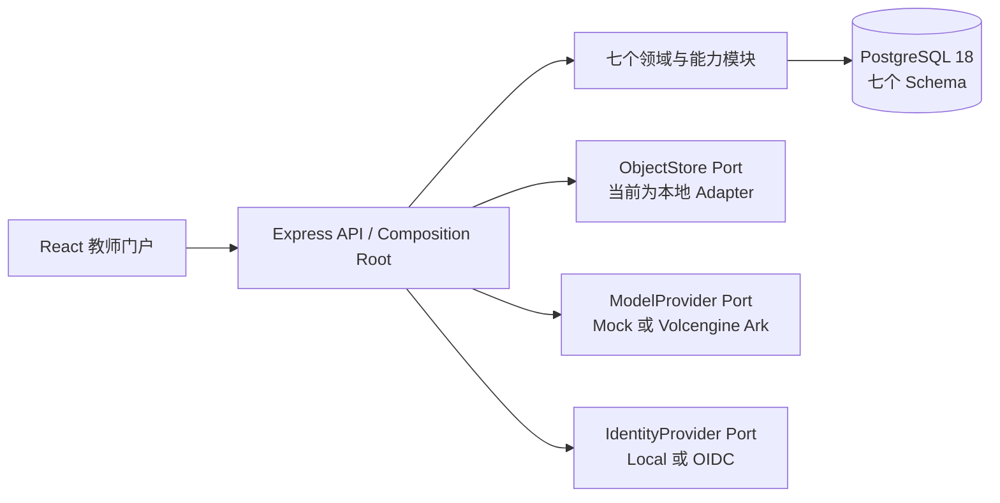

# Edu-Agent

Edu-Agent 是一个面向学校的教育 Agent 平台。当前仓库已经形成**可运行、可持久化、可继续部署的普通教师工作台基线**：核心教师流程使用类型化 API、PostgreSQL 和可追溯状态运行；云端基础设施、正式学校试点和学生/家长产品仍属于后续阶段。

- 最新产品 Verified Gate：**Gate 2.10A — 身份、学校组织与权限基线**
- 固定产品 Tag：`gate-2-10a-verified`
- 当前形态：Node.js / TypeScript pnpm workspace 模块化单体
- 数据环境：产品代码不内置展示数据；本机首次体验可显式载入独立的匿名示例数据
- 下一产品阶段：Gate 2.10B 云部署与小范围试点准备；本仓库整理不构成新 Gate

详细 Commit、PR、Tag 和 43 个历史 Migration 的时间线见 [版本历史](docs/version-history.md)；Phase 7A 另增 1 个前向 Personalization Migration，当前合计 44 个。

## 项目定位

Edu-Agent 的目标不是让模型代替教师作决定，而是把 Agent 放进有身份、权限、上下文、Evidence、审批和审计边界的教师工作流。浏览器只通过服务端 API 访问正式状态；模型输出先成为 Proposal 或 Draft，只有教师的显式操作才能形成 TeachingPlan、批改决定、课堂事实、Reflection 或后续行动。

当前产品聚焦普通教师的完整工作体验，同时提供最小学校管理员能力。`packages/sample-data` 只负责可选的匿名初始内容；加载后的一切新增、修改、审批、上传和恢复均通过正式 Repository/API 持久化，不是前端预制页面。

## 当前可以完成什么

状态口径：

- `REAL`：正式类型化 API、所属模块状态和 PostgreSQL 真值已经存在；
- `PARTIAL`：核心链路真实，但仍有明确的配置或产品范围限制；
- `DISABLED`：界面明确关闭，当前没有伪造可用结果；
- `NOT STARTED`：尚未进入产品实现。

| 能力 | 状态 | 当前实现 | 主要限制 |
|---|---|---|---|
| 登录与学校工作空间 | REAL（本机）/ PARTIAL（生产） | 手机号密码/验证码、Local/OIDC Provider Port、HttpOnly Session、登录/刷新/登出、多学校选择 | 本机账号映射林老师；正式 IdP 和云环境尚未配置 |
| 教师权限与学校隔离 | REAL | Membership、Role、CourseRun access、服务端 ActingContext、跨校不泄漏 | 角色范围仍是试点最小集合 |
| 课程与课时 | REAL（最小切片） | CourseRun → Unit → Lesson、目标、准备度、重点难点、成果预览和实施汇总 | 无课程 CRUD、排课和完整资源树 |
| 备课任务与授权上下文 | REAL | lesson preparation Task、TaskWorkingSet、重新授权、sealed ContextManifest | 当前内置一组匿名样例课程 |
| 豆包真实模型生成 | PARTIAL | Volcengine Ark Chat Completions、预算、排队、取消、重试、恢复和验证 | 需本机服务端 Key；当前只有一个真实 Provider |
| Agent Proposal 与 TeachingPlan 审批 | REAL | Proposal 处置、`draft → in_review → approved`、Revision 历史、显式完成 | Agent 不能自动批准或发布 |
| 文件、版本与 DOCX | REAL | FileAsset/FileVersion、绑定、软删除/恢复、approved TeachingPlan DOCX | 当前使用本地 ObjectStore，无协作和云同步 |
| 作业、提交与批改 | REAL（教师端） | Assignment 生命周期、immutable Attempt、批改草稿、确认/重开、统计 | 当前可载入匿名样例提交，无学生端自行提交 |
| Evidence | REAL | Observation/Claim 与来源、置信度、unknowns、批改和教学上下文可追溯 | 不形成永久 learner 能力标签 |
| 调整下一课 | REAL | 从作业/Evidence 生成显式的下一课调整建议和任务关系 | 仍由教师决定是否采用 |
| Todo 与 Calendar | REAL | 个人 Todo、手工日历、来源业务投影、稍后提醒、工作台 | 无外部日历和复杂重复规则 |
| 课堂实施与观察 | REAL | LessonDelivery、ClassroomObservation、修订/取代历史 | 无实时课堂、音视频或自动观察 |
| 课后反思 | REAL | Agent Reflection draft、教师确认的 Reflection、显式 follow-up | 反思不能倒推伪造课堂事实 |
| 学校管理员 | REAL（最小） | 成员查看/创建/激活/停用、普通教师角色与 CourseRun access | 无邮件邀请、MFA、SCIM 或完整后台 |
| 教师偏好与个性化 | REAL（最小） | 查看 MemoryCandidate，确认、修改、拒绝或撤销 TeacherPreference；跨重启恢复；已确认偏好受控进入备课 Context | 无学生长期画像、向量数据库或自动人格分析 |
| 考试 | DISABLED | 一级入口明确标记暂未开放 | 无正式考试、提交、批改和持久化 |
| 教学助手 | REAL（任务入口） | 一级页读取服务器中的备课任务；Task/Reflection 入口使用重新授权和封存上下文 | 无无上下文聊天、多 Agent 或自动化平台 |
| 学生端、家长端 | NOT STARTED | 无 | 不是当前 MVP 范围 |
| 多模态、OCR | NOT STARTED | 文件元数据/下载已存在 | 文件理解尚未产品化 |

逐页面、逐闭环和真值来源见 [当前能力](docs/capabilities.md)。

## 核心产品原则

1. **教师最终控制。** Agent 不能替教师批准 TeachingPlan、确认批改、声明课堂实施或创建正式后续行动。
2. **Agent 默认只生成 Proposal/Draft。** 生成成功不等于正式状态已经改变。
3. **建议不等于实施。** 接受建议、计划到期和课堂真实发生是不同事实。
4. **Evidence 必须可追溯。** 来源、观察、主张、置信度、未知项和教师处置不能被压成无来源标签。
5. **正式状态由所属模块拥有。** 跨模块协作通过 Port/Application Service；禁止跨 Schema 直接写。
6. **上下文不等于永久授权。** 每次运行重新解析身份、目的、范围和字段；已读取内容不能扩大后续权限。
7. **失败必须安全且可恢复。** 模型或外部 Provider 失败不能静默回退并伪装成功，也不能损坏已经提交的业务事实。
8. **样例数据与产品状态分离。** 匿名样例只在 `packages/sample-data`；测试专用数据只在 `packages/test-fixtures`，正式部署不执行样例 Seed。

## 系统架构

Edu-Agent 是一个部署单元内的七模块模块化单体。每个模块拥有一个 PostgreSQL Schema；模块目录和 Schema 名称不同，但一一对应状态所有权。

| 模块 | Schema | 主要所有权 |
|---|---|---|
| `identity-governance-audit` | `governance` | User、Organization、Membership、Role、Session、授权、Audit、安全与治理请求 |
| `work-assistant-durable-execution` | `work` | Task/TaskRun、备课任务、Todo、Calendar、工作投影、Outbox effect |
| `agent-runtime-context` | `runtime` | AgentRun、授权上下文计划、ContextManifest、运行解释边界 |
| `capability-integration` | `capability` | ModelProvider/Execution、Prompt/预算、ObjectStore Port、外部能力调用 |
| `artifact-collaboration` | `artifact` | Proposal、TeachingPlan/Revision、Reflection/Revision、文件与版本 |
| `education-domain` | `education` | Course/Lesson/Objective、Assignment/Submission/Grade/Evidence、课堂实施与观察 |
| `personalization-memory-analytics` | `personalization` | MemoryCandidate、教师确认 Preference 与 Evaluation 基础；尚未接成产品持久化能力，不维护 learner profile |



浏览器不直接连接数据库、模型、ObjectStore 或身份供应商。更完整的数据流、状态所有权和安全边界见 [当前架构](docs/architecture.md)。

## 仓库目录

| 路径 | 放置内容 |
|---|---|
| `apps/api` | Express API、Composition Root、Worker、七模块和 Migration registry |
| `apps/web` | React/Vite 教师门户、路由、Page、API client 和样式 |
| `packages/contracts` | Web/API 共享路由、DTO 与 Zod Schema |
| `packages/sample-data` | 可选的匿名示例数据 package；不得包含测试行为或生产数据 |
| `packages/test-fixtures` | 仅供自动化测试的构造器和 Fixture |
| `infra/local` | 本机 PostgreSQL 与本地运行约定 |
| `infra` | 数据库 Schema 所有权等基础设施设计说明 |
| `scripts` | 应用启动、测试、PostgreSQL、安全和质量验证编排 |
| `tests` | unit、architecture、HTTP E2E、PGlite、PostgreSQL、Playwright、live tests 和专用测试配置 |
| `docs` | 当前权威文档、ADR、运维、项目研究与历史记录 |

仓库根目录只保留正式入口、源码和工具默认配置。本机长期状态包括 `.env.local`、`infra/local/postgres/.env.local`、`.local-data/`、本地 ObjectStore 和 `node_modules/`，均被 Git 忽略但仍被开发流程使用，不应当作垃圾删除。

Playwright 报告、结果、Trace、Video 和验收截图不再写入仓库根目录。在 Windows 上，如果 `C:\Code\test` 存在，默认输出到 `C:\Code\test\edu-agent\playwright`；其他环境使用系统临时目录，也可通过 `EDU_AGENT_TEST_OUTPUT_ROOT` 显式覆盖。整理前的根目录测试产物属于可再生运行输出，当前仓库与本机均不承诺保留其外部归档。

目录决策和延期项见 [目标仓库结构](docs/project/target-repository-structure.md)。

## 核心业务闭环

```mermaid
flowchart TB
    subgraph PREP["备课闭环"]
      P1["课程 / 课时"] --> P2["备课 Task + WorkingSet"] --> P3["重新授权的上下文"] --> P4["模型 Proposal"] --> P5["教师处置"] --> P6["TeachingPlan 审批"]
    end
    subgraph LEARN["作业—Evidence—调整教学"]
      L1["Assignment"] --> L2["SubmissionAttempt"] --> L3["教师批改确认"] --> L4["Evidence"] --> L5["调整下一课"]
    end
    subgraph REFLECT["计划—实施—反思"]
      R1["Approved TeachingPlan"] --> R2["LessonDelivery"] --> R3["ClassroomObservation"] --> R4["Reflection Draft"] --> R5["教师确认 + Follow-up"]
    end
    subgraph WORK["工作台闭环"]
      W1["源业务事实"] --> W2["Action Item / Calendar 投影"] --> W3["进入源业务处理"] --> W1
    end
```



四个闭环共享身份、授权、Audit 和 Outbox，但正式状态仍由各自模块拥有。概览/日历只能投影和导航，不能代替源业务完成。

## 技术栈

| 层 | 当前技术 |
|---|---|
| Workspace | Node.js 24（本轮验证 24.14.0）、Corepack、pnpm 11.9.0、TypeScript 7 |
| Web | React 19、Vite 8、Ant Design 6、原生 history router |
| API | Express 5、Zod 4、OpenAI-compatible client、openid-client |
| 数据 | PostgreSQL 18、Drizzle ORM、43 个历史 Migration + 1 个 Phase 7A 前向 Migration |
| 文件 | LocalObjectStore、`docx`、JSZip |
| 测试 | Vitest 4、PGlite、Supertest、Node test runner、Playwright 1.62 |
| 本地环境 | Docker Desktop / Docker Compose |

## 快速启动

前置条件：Node.js 24 与 Corepack、Docker Desktop；主机端口 `55432`、`3001` 和 `5173` 可用。本轮实际验证环境为 Node `24.14.0`、pnpm `11.9.0`、Docker `29.6.2`、Compose `5.3.1`。

```powershell
cd D:\03_Edu-Agent
corepack pnpm install --frozen-lockfile
corepack pnpm app:doctor
corepack pnpm app:prepare
corepack pnpm app:dev
```

浏览器打开 <http://localhost:5173/>。上面的命令不会自动写入示例数据；已有数据库会直接恢复原工作空间。首次体验若没有学校和课程，可单独执行 `corepack pnpm sample:seed`，随后再次运行 `app:dev`。页面中的新增、修改、审批、上传和恢复都走正式 API 与 PostgreSQL，不是前端预制效果。

只有明确需要匿名示例数据时才使用 `corepack pnpm sample:dev`。正式部署不得执行 `sample:seed`；身份、数据库和对象存储应由经评审的真实部署资产与部署平台配置。当前差距见 [Gate 2.10B 部署准备](docs/operations/deployment-readiness-gaps.md)。

停止前台进程后，如需关闭数据库容器但保留 Volume：

```powershell
corepack pnpm app:down
```

`app:reset` 和 `db:clean` 是显式破坏性入口，不属于普通启动或测试流程。不要删除 `.env.local`、开发 Volume 或 `.local-data/object-store`。

默认模型是确定性离线 Provider。要调用豆包/火山方舟，只在被忽略的根 `.env.local` 设置 `MODEL_PROVIDER_MODE=ark`、`ARK_API_KEY` 和模型配置；Key 不得进入命令参数、日志、截图、文档或 Git。完整说明见 [本机运行指南](docs/operations/local-environment.md)。

## 推荐验收顺序

1. 登录并选择学校工作空间，刷新确认 Session 恢复；
2. 查看概览与工作台，确认来源事项能回到源业务；
3. 进入课程和课时，创建备课任务；
4. 检查 TaskWorkingSet/授权上下文，用 Mock 或豆包生成 Proposal；
5. 处置 Proposal，确认 TeachingPlan 的 in-review、approved 和历史 Revision；
6. 上传文件、创建版本、绑定课时/任务/计划并导出 DOCX；
7. 创建/发布作业、导入匿名示例提交、批改并确认学习证据；
8. 从学习证据显式“调整下一课”；
9. 创建 Todo/Calendar，验证源业务投影只读和稍后提醒；
10. 确认课堂实施、课堂观察、Reflection Draft、正式 Reflection 与 follow-up 分离；
11. 以 school admin 验证最小成员权限，并验证跨学校隔离；
12. 重启 API/Web/PostgreSQL，确认正式状态和本地文件恢复。

## 测试与验证

| 命令 | 证明范围 |
|---|---|
| `corepack pnpm test` | 默认 Vitest：unit、contract、architecture、HTTP walking skeleton、PGlite Migration 等非真实 PostgreSQL/live 测试 |
| `corepack pnpm test:unit` | 纯 unit 与 Gate 2 contract 测试 |
| `corepack pnpm test:architecture` | 七模块、Schema ownership、Ingress 和关键产品不变量 |
| `corepack pnpm test:static` | Gate 1A 静态断言和文件级安全约束 |
| `corepack pnpm test:e2e` | 无浏览器 HTTP walking skeleton |
| `corepack pnpm test:node-smoke` | Node 原生测试路径和 Gate 1A Test Container |
| `corepack pnpm test:migrations` | PGlite 上的 Migration 注册与前向执行 |
| `corepack pnpm test:postgres` | 隔离的真实 PostgreSQL 集成套件 |
| `corepack pnpm test:playwright` | 默认 Mock Provider 的隔离浏览器业务回归 |
| `corepack pnpm test:ark-fake` | Fake Ark Server 的隔离浏览器模型回归 |
| `corepack pnpm model:probe:live` | 显式配置后探测真实 Ark 能力；不属于默认测试 |
| `corepack pnpm test:secrets` | 跟踪文件 Secret 扫描 |
| `corepack pnpm build` | 所有 workspace production build |
| `corepack pnpm analyze:bundle` | Web 初始图和最大 chunk 体积 |
| `corepack pnpm verify:version-history` | Commit、PR/Tag、历史文档和 Gate 证据 |
| `corepack pnpm verify:markdown-links` | 所有跟踪/待提交 Markdown 本地链接 |
| `corepack pnpm verify:repo-sync` | 必需文件、忽略项、禁止跟踪目录、upstream 和 HEAD 同步 |

测试隔离语义和推荐组合见 [验证指南](docs/validation.md)。

## 文档阅读顺序

1. [文档入口](docs/README.md)：按角色选择阅读路径；
2. [当前能力](docs/capabilities.md)：REAL / PARTIAL / MOCK 和限制；
3. [当前架构](docs/architecture.md)：七模块、数据流和安全边界；
4. [开发指南](docs/development.md)：目录、命令和修改路径；
5. [验证指南](docs/validation.md)：测试证明范围；
6. [版本历史](docs/version-history.md)：0 → Gate 2.10A；
7. [Roadmap](docs/roadmap.md)：只描述未来工作；
8. [本地运维](docs/operations.md)和 [Gate 2.10B 部署差距](docs/operations/deployment-readiness-gaps.md)。

## 当前限制

- 尚未云部署，也未达到真实学校生产试点条件；
- provider-neutral OIDC 代码已存在，但正式 OIDC、域名、HTTPS 和 Secret Manager 未配置；
- 学生端和家长端未实现，当前提交来自可选的匿名样例数据；
- 完整考试、题库、排课和学校后台未实现；
- 多模态和 OCR 尚未产品化，文件内容不会自动进入模型；
- 真实模型当前只支持一个 Volcengine Ark/豆包 Provider；
- 文件保存在本地 ObjectStore，无云存储、分享和协作；
- personalization 已有候选/教师确认领域基础，但本轮未新增表或产品入口；不维护永久 learner 能力画像；
- 没有生产监控、备份恢复、远程 E2E、容量基线和发布/回滚 Runbook。

## 下一步计划

1. 人工审查并合并本次仓库清理与文档重组 Draft PR；不创建新的 Verified Gate Tag；
2. 以整洁仓库为基线单独设计 Gate 2.10B，完成云部署、正式身份、托管数据库/ObjectStore、安全、可观测性、备份恢复和试点运维；
3. Gate 2.10B 验证后，再按产品优先级评估学生端、完整考试、多模态/OCR、第二模型 Provider 或更长期个性化能力。

未来计划以 [后续路线](docs/roadmap.md) 为唯一入口；本 README 不记录逐 Gate 实施日志。
