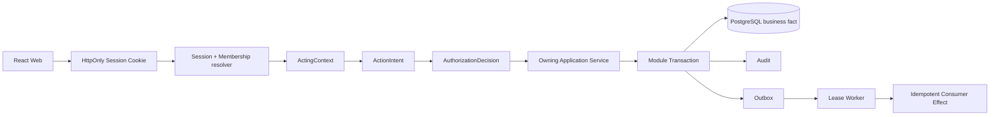
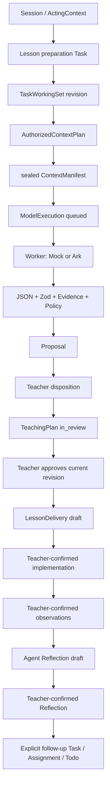

# Edu-Agent 当前技术架构

> 状态：CURRENT
> 最新产品基线：`gate-2-10a-verified`（`bbba3428602bb148a3d73a201ad97fcb29181c1b`）

本文描述当前可运行代码。早期 v0.3.x 文档仍是重要设计来源，但当其与代码不同，以这里列出的实现和自动化约束为准。

## 1. 运行形态

Edu-Agent 是 Node.js / TypeScript 的 pnpm workspace 模块化单体：

- `apps/web`：React 19 + Vite 8 + Ant Design 6 的教师门户；
- `apps/api`：Express 5 API、七个领域/能力模块、Composition Root 和本地 Worker；
- `packages/contracts`：路由构造器、DTO 和 Zod Schema；
- `packages/sample-data`：可选匿名样例和 Gate 2 测试共用的稳定 refs/seed；
- `packages/test-fixtures`：只供 Gate 1A/1B 等自动化测试的构造器，产品应用不依赖；
- PostgreSQL 18：七个 Schema、43 个只向前 Migration；
- 本地运行 Adapter：Docker PostgreSQL、LocalObjectStore、LocalIdentityProvider、MockModelProvider；
- 可选生产集成 Adapter：OIDC Identity Provider、Volcengine Ark Chat Completions。

浏览器不直接连接数据库、模型、ObjectStore 或身份供应商。所有产品写入均经 API 的服务端认证、授权和 owning module Application Service。

## 2. 七模块与七个 PostgreSQL Schema

| 模块目录 | Schema | 当前状态所有权与职责 |
|---|---|---|
| `identity-governance-audit` | `governance` | User、ExternalIdentity、Organization、Membership、Role/Course access、Session、OIDC state、AuthorizationDecision、Audit、安全事件、数据治理请求 |
| `work-assistant-durable-execution` | `work` | Task/TaskRun、lesson preparation、TaskWorkingSet、Todo、Calendar、work projection、提醒偏好、Outbox/消费效果、follow-up 工作关系 |
| `agent-runtime-context` | `runtime` | AgentRun、Resolved Contract、AuthorizedContextPlan、ContextManifest、运行解释边界 |
| `capability-integration` | `capability` | ModelProvider、ModelExecution、PromptBundle、Budget/Data Manifest、Provider capability、ObjectStore Port 和外部能力执行 |
| `artifact-collaboration` | `artifact` | Proposal/Disposition、TeachingPlan/Revision、LessonReflection/Revision、FileAsset/FileVersion/Binding、正式教学成果 |
| `education-domain` | `education` | CourseRun/Unit/Lesson/Objective、Enrollment、Assignment/Submission/Grade/Evidence、LessonDelivery、ClassroomObservation |
| `personalization-memory-analytics` | `personalization` | 当前仅保留 Schema/Port 骨架；没有长期 learner profile 或自动能力结论产品化 |

模块边界并不意味着七个独立进程。当前是一个部署单元中的模块化单体；Schema ownership、Repository Port、架构测试和数据库角色约束写入边界。

## 3. Composition Roots

### Product Composition Root

`apps/api/src/composition/product-container.ts` 负责：

1. 建立受限 PostgreSQL app/worker connection pools；
2. 装配各模块 PostgreSQL Repository 和 Application Service；
3. 从服务端配置选择 `MockModelProvider` 或 `VolcengineArkProvider`；
4. 装配 `LocalObjectStore`；
5. 从 local/demo/test 或 OIDC 配置选择身份 Adapter；
6. 装配 Session/ActingContext resolver、Outbox/Model invocation Worker 和 API。

教师产品路由只使用该 Composition Root，不读取 Gate 1A 内存 Repository，也没有数据库失败后的 Mock fallback。

### Test Composition Root

`apps/api/src/composition/test-container.ts` 保留 Gate 1A 内存 walking skeleton，用于隔离的架构/单元测试和显式内部测试路由。它不属于教师产品读取路径。PostgreSQL、HTTP 和 Playwright 测试则装配 Product Composition Root，并使用独立临时数据库/对象存储。

## 4. Ports 与 Adapters

### Repository

模块定义 Repository / transaction 接口，PostgreSQL Adapter 在 owning module 内实现。Application Service 依赖接口，不由 React 或 Provider 直接操作表。跨模块流程由应用编排、Outbox 和幂等 Consumer Effect 协调；不能用跨 Schema 随意写表代替状态所有者命令。

### ObjectStore

Capability 模块定义 `ObjectStore` Port；`LocalObjectStore` 使用服务端生成的 object key 和可配置、Git-ignored 目录。它提供流式 put/get、exists、metadata、delete 和 SHA-256，校验路径、大小、MIME/扩展名与 OOXML 容器。Artifact 模块保存 FileAsset/FileVersion 真值；对象成功而数据库失败时执行补偿，孤儿清理由有界任务处理。

本机编排将 ObjectStore 明确指向仓库根 `.local-data/object-store`。E2E 使用 `.local-data/e2e/<run-id>/uploads` 下的独立目录，并只清理本次运行的精确路径，不会删除长期本机文件。

### ModelProvider

领域层只看稳定的 `ModelProvider` Port 与安全 `ModelResult`：

- `MockModelProvider`：默认本地、普通测试、CI、离线环境；
- `VolcengineArkProvider`：服务端使用 OpenAI-compatible Node SDK 调用 Ark Chat Completions；模型 ID 来自配置；
- 浏览器 bundle、Contracts 和业务领域均不 import OpenAI SDK，也不接触 `ARK_API_KEY`。

ModelExecution 在数据库事务外由租约 Worker 执行，经过预算、ModelDataManifest、有限重试、输出解析、Zod/Evidence/Policy 校验和最多一次受控修复。成功只创建一个 Proposal，不声称 exactly-once。

### IdentityProvider

Governance 定义 provider-neutral 身份边界：

- `LocalIdentityProvider`：本机与测试环境的手机号密码、一次性验证码和稳定外部身份映射；production 禁止启用；
- `OidcIdentityProvider`：基于 `openid-client` 的 Authorization Code + PKCE + state；
- 外部 Provider 只证明 stable subject，学校、Membership、Role、workspace 和 CourseRun access 由 Edu-Agent 拥有。

认证后使用随机不透明 HttpOnly Session Cookie；数据库只存 token hash。每个产品请求重新解析 active Session、Organization、Membership、Role 和 Course access，构造 ActingContext。浏览器提交的 tenant/actor/role 不受信任。

## 5. HTTP、Contracts 与 Web

`packages/contracts/src/api-routes.ts` 是产品路由构造器的集中入口；各 Gate contract 文件提供 Zod request/response schema。`apps/web/src/api.ts` 是当前单一教师门户 API client。React 页面不应散落手写 URL，也不持有可独立修改的业务真值。

Web 目前使用 `App.tsx` 的 lazy page imports 和自定义 `route.ts` history parser，而非 React Router。URL 保存必要的页面上下文（如 Lesson、Task、File、Proposal、日期/视图），正式状态仍由 API 重读。

## 6. 正式请求与授权路径

未登录默认 `401`。越权资源使用结构化 `403/404`，避免泄漏其他学校对象是否存在。Demo bypass 默认关闭，只能在 local/demo 显式打开，并写 `DemoIdentityInjection` Audit；production 启动时 fail closed。

## 7. 教师请求到教学改进的数据流

关键语义：模型网络调用不持有业务事务；Proposal 不是实施事实；approved plan 不是已授课；只有教师确认的 Delivery/Observation 是课堂事实；Reflection 不覆盖 TeachingPlan；后续行动必须显式创建。

## 8. 作业到学习 Evidence 的数据流

```mermaid
flowchart LR
    ASSIGN["Assignment version"] --> ATTEMPT["SubmissionAttempt"]
    ATTEMPT --> RESPONSE["ItemResponse"]
    RESPONSE --> GRADE["TeacherGradeDecision"]
    GRADE --> EVIDENCE["EvidenceObservation"]
    EVIDENCE --> ANALYTICS["Recomputed item/objective/class views"]
    ANALYTICS --> SELECT["Teacher selects evidence"]
    SELECT --> NEXT["Next-lesson TaskWorkingSet"]
    NEXT --> AGENT["Authorized Agent run"]
```

SubmissionAttempt 和已发布 Assignment 内容不原地覆盖；批改修订以替代关系保留历史；“未交”是缺少 attempt 而不是 0 分；班级指标是可重算读取结果，不成为不可追溯的长期 learner 结论。

## 9. Worker、Outbox 与恢复

应用级 Worker 使用数据库租约、重试和 Consumer Effect 幂等：

- Model invocation：queued/running/validating/terminal，崩溃或租约过期可恢复；
- Work projection：将备课、作业、批改、计划、模型失败、文件、实施和反思事实重建为教师工作项；
- 同数据库必须同步提交的正式状态仍由 owning Application Service 更新，不为了“使用事件”强行异步化；
- Worker 停止不回滚已提交的业务事实，恢复后继续追赶；系统明确采用 at-least-once 处理，不宣称 exactly-once。

## 10. Audit、数据最小化与安全日志

Audit 记录 actor/organization、intent、decision、资源 refs、版本、状态和幂等信息。模型日志只保留 provider/model、hash、Usage、延迟、finish reason、安全错误类别和脱敏 request ID；不记录 Secret、Authorization header、完整 Prompt、完整响应或隐藏推理。身份系统不保存 OIDC access/refresh/id token。

## 11. 当前部署边界

当前架构在本机完整运行，但生产适配尚未完成：数据库和对象存储仍为本地方案，OIDC 只有 provider-neutral Adapter，缺少域名/HTTPS、Secret 管理、托管服务、备份、监控告警、限流/CSP、远程 E2E 和试点运维流程。详见 [部署就绪差距](operations/deployment-readiness-gaps.md)。
