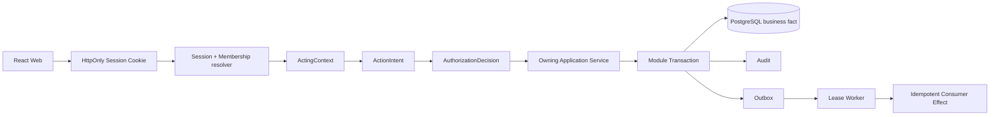
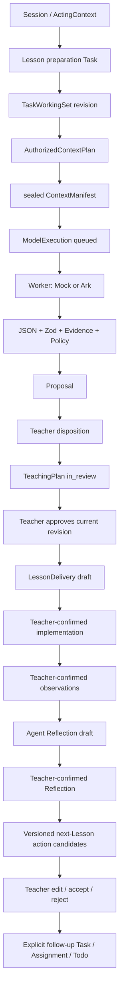
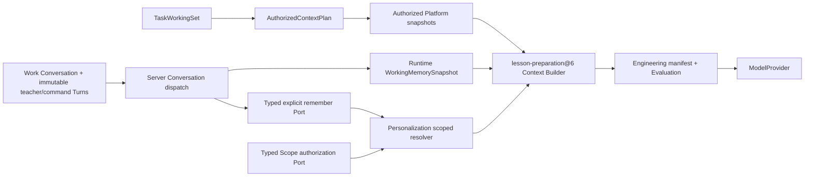
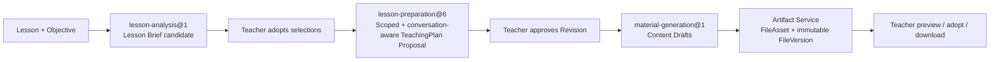

# Edu-Agent 当前技术架构

> 状态：CURRENT
> 最新产品基线：`gate-2-10a-verified`（`bbba3428602bb148a3d73a201ad97fcb29181c1b`）

本文描述当前可运行代码。早期 v0.3.x 文档仍是重要设计来源，但当其与代码不同，以这里列出的实现和自动化约束为准。

教师短期会话记忆的所有权、Provider continuation、重建和保留决策见 [Conversation 与 Working Memory ADR](decisions/conversation-working-memory-ownership-and-retention.md)；本次参考清单、Preference 应用记录和失败语义见 [教师记忆应用观测 ADR](decisions/memory-application-observability.md)；Scope/epoch 见 [Scoped Preference ADR](decisions/scoped-teacher-preferences-and-memory-epoch.md)；对话中的受控显式记住、command Turn 与恢复语义见 [Explicit Remember ADR](decisions/explicit-teacher-remember-commands.md)，显式撤销、选择确认和历史保留见 [Explicit Forget ADR](decisions/explicit-teacher-forget-commands.md)。

## 1. 运行形态

Edu-Agent 是 Node.js / TypeScript 的 pnpm workspace 模块化单体：

- `apps/web`：React 19 + Vite 8 + Ant Design 6 的教师门户；
- `apps/api`：Express 5 API、七个领域/能力模块、Composition Root 和本地 Worker；
- `packages/contracts`：路由构造器、DTO 和 Zod Schema；
- `packages/sample-data`：显式 Seed 和测试共用的稳定匿名 refs/data；产品 API/Web 不依赖该 package；
- `packages/test-fixtures`：只供 Gate 1A/1B 等自动化测试的构造器，产品应用不依赖；
- PostgreSQL 18：七个 Schema、51 个只向前 Migration；
- 本地运行 Adapter：Docker PostgreSQL、LocalObjectStore、LocalIdentityProvider、MockModelProvider；
- 可选生产集成 Adapter：OIDC Identity Provider、Volcengine Ark Chat Completions。

浏览器不直接连接数据库、模型、ObjectStore 或身份供应商。所有产品写入均经 API 的服务端认证、授权和 owning module Application Service。

## 2. 七模块与七个 PostgreSQL Schema

| 模块目录 | Schema | 当前状态所有权与职责 |
|---|---|---|
| `identity-governance-audit` | `governance` | User、ExternalIdentity、Organization、Membership、Role/Course access、Session、OIDC state、AuthorizationDecision、Audit、安全事件、数据治理请求 |
| `work-assistant-durable-execution` | `work` | Task/TaskRun、lesson preparation、TaskWorkingSet、Conversation/不可变普通与 command Turn、安全命令回执 refs、Todo、Calendar、work projection、提醒偏好、版本化下一课行动候选、Outbox/消费效果、follow-up 工作关系 |
| `agent-runtime-context` | `runtime` | AgentRun、Resolved Contract、AuthorizedContextPlan、ContextManifest、可重建 WorkingMemorySnapshot、运行解释边界 |
| `capability-integration` | `capability` | ModelProvider、ModelExecution、PromptBundle、Budget/Data Manifest、Provider capability、ObjectStore Port 和外部能力执行 |
| `artifact-collaboration` | `artifact` | Proposal/Disposition、TeachingPlan/Revision、LessonReflection/Revision、FileAsset/FileVersion/Binding、正式教学成果 |
| `education-domain` | `education` | CourseRun/Unit/Lesson/Objective、Enrollment、Assignment/Submission/Grade/Evidence、LessonDelivery、ClassroomObservation |
| `personalization-memory-analytics` | `personalization` | MemoryCandidate、TeacherPreference 确认/修改/拒绝/撤销、Scope/valid time、teacherMemoryEpoch、不可变 revision，以及 durable Preference 的 append-only application/outcome 观测；不维护 learner profile |

模块边界并不意味着七个独立进程。当前是一个部署单元中的模块化单体；Schema ownership、Repository Port、架构测试和数据库角色约束写入边界。

## 3. Composition Roots

### Product Composition Root

`apps/api/src/composition/product-container.ts` 负责：

1. 建立受限 PostgreSQL app/worker connection pools；
2. 装配各模块 PostgreSQL Repository 和 Application Service；
3. 从服务端配置选择 `MockModelProvider` 或 `VolcengineArkProvider`；
4. 装配 `LocalObjectStore`；
5. 从 local/demo/test 或 OIDC 配置选择身份 Adapter；
6. 装配 Session/ActingContext resolver、Outbox/Model invocation Worker 和 API。

教师产品路由只使用该 Composition Root，不读取 Gate 1A 内存 Repository，也没有数据库失败后的 Mock fallback。

### Test Composition Root

`apps/api/src/composition/test-container.ts` 保留 Gate 1A 内存 walking skeleton，用于隔离的架构/单元测试和显式内部测试路由。它不属于教师产品读取路径。PostgreSQL、HTTP 和 Playwright 测试则装配 Product Composition Root，并使用独立临时数据库/对象存储。

## 4. Ports 与 Adapters

### Repository

模块定义 Repository / transaction 接口，PostgreSQL Adapter 在 owning module 内实现。Application Service 依赖接口，不由 React 或 Provider 直接操作表。跨模块流程由应用编排、Outbox 和幂等 Consumer Effect 协调；不能用跨 Schema 随意写表代替状态所有者命令。

### ObjectStore

Capability 模块定义 `ObjectStore` Port；`LocalObjectStore` 使用服务端生成的 object key 和可配置、Git-ignored 目录。它提供流式 put/get、exists、metadata、delete 和 SHA-256，校验路径、大小、MIME/扩展名与 OOXML 容器。Artifact 模块保存 FileAsset/FileVersion 真值；对象成功而数据库失败时执行补偿，孤儿清理由有界任务处理。

本机编排将 ObjectStore 明确指向仓库根 `.local-data/object-store`。E2E 使用 `.local-data/e2e/<run-id>/uploads` 下的独立目录，并只清理本次运行的精确路径，不会删除长期本机文件。

### ModelProvider

领域层只看稳定的 `ModelProvider` Port 与安全 `ModelResult`：

- `MockModelProvider`：默认本地、普通测试、CI、离线环境；
- `VolcengineArkProvider`：服务端使用 OpenAI-compatible Node SDK 调用 Ark Chat Completions；模型 ID 来自配置；
- 浏览器 bundle、Contracts 和业务领域均不 import OpenAI SDK，也不接触 `ARK_API_KEY`。

ModelExecution 在数据库事务外由租约 Worker 执行，经过预算、ModelDataManifest、有限重试、输出解析、Zod/Evidence/Policy 校验和最多一次受控修复。成功只创建一个 Proposal，不声称 exactly-once。

### IdentityProvider

Governance 定义 provider-neutral 身份边界：

- `LocalIdentityProvider`：本机与测试环境的手机号密码、一次性验证码和稳定外部身份映射；production 禁止启用；
- `OidcIdentityProvider`：基于 `openid-client` 的 Authorization Code + PKCE + state；
- 外部 Provider 只证明 stable subject，学校、Membership、Role、workspace 和 CourseRun access 由 Edu-Agent 拥有。

认证后使用随机不透明 HttpOnly Session Cookie；数据库只存 token hash。每个产品请求重新解析 active Session、Organization、Membership、Role 和 Course access，构造 ActingContext。浏览器提交的 tenant/actor/role 不受信任。

## 5. HTTP、Contracts 与 Web

`packages/contracts/src/api-routes.ts` 是产品路由构造器的集中入口；各 Gate contract 文件提供 Zod request/response schema。`apps/web/src/api.ts` 是当前单一教师门户 API client。React 页面不应散落手写 URL，也不持有可独立修改的业务真值。

Web 目前使用 `App.tsx` 的 lazy page imports 和自定义 `route.ts` history parser，而非 React Router。URL 保存必要的页面上下文（如 Lesson、Task、File、Proposal、日期/视图），正式状态仍由 API 重读。

## 6. 正式请求与授权路径

未登录默认 `401`。越权资源使用结构化 `403/404`，避免泄漏其他学校对象是否存在。Demo bypass 默认关闭，只能在 local/demo 显式打开，并写 `DemoIdentityInjection` Audit；production 启动时 fail closed。

## 7. 教师请求到教学改进的数据流

关键语义：模型网络调用不持有业务事务；Proposal 不是实施事实；approved plan 不是已授课；只有教师确认的 Delivery/Observation 是课堂事实；Reflection 不覆盖 TeachingPlan；确认 Reflection 不自动生成或执行行动；只有教师接受版本化候选后才通过 owning Application Service 创建正式 follow-up。

## 8. 作业到学习 Evidence 的数据流

```mermaid
flowchart LR
    ASSIGN["Assignment version"] --> ATTEMPT["SubmissionAttempt"]
    ATTEMPT --> RESPONSE["ItemResponse"]
    RESPONSE --> GRADE["TeacherGradeDecision"]
    GRADE --> EVIDENCE["EvidenceObservation"]
    EVIDENCE --> ANALYTICS["Recomputed item/objective/class views"]
    ANALYTICS --> SELECT["Teacher selects evidence"]
    SELECT --> NEXT["Next-lesson TaskWorkingSet"]
    NEXT --> AGENT["Authorized Agent run"]
```

SubmissionAttempt 和已发布 Assignment 内容不原地覆盖；批改修订以替代关系保留历史；“未交”是缺少 attempt 而不是 0 分；班级指标是可重算读取结果，不成为不可追溯的长期 learner 结论。

## 9. Skill-aware Context Engineering 与 Memory 边界

开启 scoped Preference feature flag 时，新的 Conversation 模式 lesson preparation 运行绑定 `lesson-preparation@6`；关闭时回到 global-only `@5`。一次性兼容调用继续使用 `@3` 或 `@4`，所有 `@1–@5` 历史版本及 Pack V1 均按原版本解释和恢复。Worker 仍通过 owning Platform Facade/Repository 重建已授权资源，在 ModelProvider 调用前使用纯 Context Builder，并分别通过 owner-scoped Conversation/Working Memory Port 与 Personalization Context Port 读取短期任务状态和已确认长期偏好：

Builder 比较 teacher selection、AuthorizedContextPlan、sealed ContextManifest 和实际 snapshot refs，执行确定性排序/压缩，并记录 resource version/hash/provenance、排除原因、missing information 和分段 token 估算。授权、关键资源、Evidence 命中或预算检查失败时不调用模型；纯预算失败保持现有 `budget_exceeded` API 语义。安全 manifest/evaluation 摘要写入 AgentRun output，不保存完整 Prompt 或 Evidence。

Conversation 是 Work-owned 平台真值，Turn 只保存教师文本或教师可见的安全结果摘要/有界结果 refs，禁止原地修改，也不保存供应商原始响应。普通 `teacher_text` 才进入 `working-memory-builder@1` 的 active goal 与近期请求；`teacher + command` 和 `assistant_surface + command` 只推进 Conversation/展示安全回执，不进入 Prompt，也不创建虚构教学目标。WorkingMemorySnapshot 是 Runtime-owned 派生状态：保留当前目标、最多六条近期教师要求、可解析指代、临时约束和最近结果引用；旧快照转为 superseded，封存执行在保留窗口内按 ref/hash 精确恢复，hash、owner、来源或期限不匹配即 fail closed。所有读取同时约束 tenant、teacher、conversation 和 Task；新会话不会继承旧会话工作记忆。当前请求优先级最高，临时约束不得自动晋升为长期 Preference。

Conversation retention 由服务端配置，Turn 继承线程期限，WorkingMemorySnapshot 不得晚于来源 Turn 到期。显式 close 后禁止新 Turn 并 invalidates active snapshot；到期线程不再返回 Turn 内容，也不再进入模型 Context。当前 30 天只是待产品确认的运行默认值；学校级期限、物理清理/去标识和治理 SLA 尚未成为已实现产品政策。

历史 SkillVersion 保留在 Registry；新版本不覆盖已发布版本。

Personalization Schema 通过第 44 个前向 Migration 持久化 `MemoryCandidate`、`TeacherPreference` 及各自不可变 revision；第 45 个扩展日历事件类别；第 46 个在 Work Schema 中持久化 `NextLessonActionCandidate`；第 47、48 个分别新增 Work Conversation/Turn 与 Runtime WorkingMemorySnapshot；第 49 个新增 durable Preference 的 append-only application/outcome；第 50 个只向前扩展 TeacherPreference/Revision 的 canonical key、Scope、valid time、consent/policy，并新增 owner-scoped `teacher_memory_state`；第 51 个 Work-owned 前向 Migration 以正式 CHECK 支持 teacher/assistant command Turn，并增加最多各 10 个 Candidate/Preference 恢复 ref。既有 50 个 Migration 不修改，0012 不回写。

Scope 由 Personalization 拥有，但不是授权。写入 CourseRun/Lesson/Task Scope 时，Personalization 只能调用 typed `TeacherPreferenceScopeAuthorizationPort`，由 Composition Adapter 通过 owning Work/Education facade 校验 Session 已解析的 CourseRun access、Lesson 归属和 Task owner；不建立跨 Schema FK，也不让 Personalization 直接查询其他 Schema。解析时先按 owner、active、valid time、Scope、Skill 做硬过滤，再按 canonical key 选择 `task > lesson > course_run > subject_grade > subject > global`，同 Scope 下 `Skill-specific > unrestricted`，最后才使用 explicitness、version、updatedAt、preferenceRef 确定性打破平局。设置页创建 `teacher_declared + teacher_settings_confirmed`；PR-2B 的服务器 Catalog 还可创建 `teacher_declared + teacher_explicit_command`，但只支持 Lesson Preparation 的 global/当前 CourseRun，不进行开放式同义词或 LLM 冲突判断。

新的 Web 发送路径调用 server-owned `dispatch-turn`。纯 `explicit-memory-command-interpreter@1` 处理 remember；独立的 `explicit-forget-command-interpreter@1` 处理受控 Forget，二者都复用 `teacher-preference-catalog@1` 且不调用模型。低风险 remember 可写 Candidate/Preference；完全重复不增 epoch，同 key/Scope 不同值只创建 draft Candidate。Forget 的唯一 active match 可在一个 Personalization 事务中 revoke；未声明 Scope 且有多个匹配时，immutable receipt refs 封存选项，老师必须显式选择，确认后追加 follow-up receipt。Work 不直接写 Personalization，Personalization 也不写 Work/Runtime；命令、Personalization 和回执采用 at-least-once + stable idempotency 恢复。

`teacherMemoryEpoch` 在确认、值更新、Scope/valid time 更新和撤销的同一事务中递增，普通读取不递增。它进入 Pack V2 hash，为未来 cache/continuation 失效提供平台版本；已封存 Run 保留运行时 epoch，不因后续修改而改写。旧 Skill 故意只通过兼容 Port 读取当前有效的 global、无 Skill 限制 Preference，防止 scoped row 无差别进入 Material Generation、Reflection 等尚未迁移的 Skill。

Runtime/Context orchestration 继续拥有 pack 真值。历史 `MemoryContextPackManifest@1` 不改写；`@2` 在相同最小 refs/version/hash 清单上增加 query Scope hash、unversioned Skill ID、retrieval policy、teacherMemoryEpoch、Scope fingerprint/specificity/Skill match 和 selected/overridden/excluded 计数。`createdAt` 不参与 content hash；相同 owner、Conversation/Turn/Snapshot、Skill、query、epoch、Preference revision 和决策顺序得到相同 pack/hash。Provider retry 从 AgentRun output 读取已封存 manifest，只按 immutable revision 重建当时 injected values，不重新解析当前 Preference。

Composition 在 Provider 调用前通过 typed `MemoryApplicationRecorder` 把 durable Preference decision best-effort 写入 Personalization；V2 的 `scope_hash` 使用真实 query Scope hash，并记录 selected/injected/overridden/excluded。失败仅把 Runtime 观测状态标为 `degraded`，不改变 ModelExecution 或 Proposal。正式处置后，既有 `SuggestionDisposed` Outbox 以最小 payload、at-least-once 追加 outcome。RunExplanation 在 owner 授权下从 Work/Runtime 动态解析当前要求和同任务摘要，并从 Preference immutable revision 解析当时值；历史 V1 标记“旧版全局偏好上下文”，历史 V2 能显示当时作用范围和后来撤销状态，新 Run 不再选取已撤销项。Manifest/application 不保存 Turn 原文副本、Preference value 副本、完整 Prompt/Provider 响应、隐藏推理或 Evidence 正文。

`MEMORY_SCOPED_PREFERENCES_ENABLED`、`MEMORY_EXPLICIT_REMEMBER_ENABLED` 和 `MEMORY_EXPLICIT_FORGET_ENABLED` 均在 local/test 默认开启、production 未显式配置时关闭。Explicit Remember 依赖 scoped flag，不能降级为 unrestricted Preference；Explicit Forget 独立于两者，使暂停新增记忆时仍可撤销既有 Preference。关闭不逆向 Migration、不删除 scoped row、历史 receipt 或 Run；Forget flag 关闭只停止新的对话式撤销，设置页 revoke 继续有效。普通 Conversation、WorkingMemory 和 M0-lite application/outcome 不受影响。

## 10. Teaching Workspace 读取层与材料闭环

Lesson Workspace 不创建第二套 Lesson 状态。`LessonJourneyProjection`、`LessonBriefSnapshot` 与 `MaterialBundleProjection` 都是可重建解释层：它们从 owning Facade/API 读取版本化事实，计算当前阶段、下一步、缺口与链接，不写独立表。

`material-generation@1` 只读取 current approved TeachingPlan Revision、Lesson Brief、已授权 Evidence 与 confirmed Preference，并输出五类 Markdown 内容草稿：教案、PPT 大纲、课堂练习、板书设计和分层支持。Skill 与 Runtime 不写 Artifact；只有 Artifact Application Service 能创建 FileAsset/FileVersion 和 binding。局部重生成只为目标 item 创建新 FileVersion，不覆盖其余材料，也不复制旧版 adopted 状态。没有 current approved Revision 时 Projection 返回 `blocked_no_approved_plan`，服务端拒绝生成，不伪造 baseline。

## 11. Worker、Outbox 与恢复

应用级 Worker 使用数据库租约、重试和 Consumer Effect 幂等：

- Model invocation：queued/running/validating/terminal，崩溃或租约过期可恢复；
- Work projection：将备课、作业、批改、计划、模型失败、文件、实施和反思事实重建为教师工作项；
- 同数据库必须同步提交的正式状态仍由 owning Application Service 更新，不为了“使用事件”强行异步化；
- Worker 停止不回滚已提交的业务事实，恢复后继续追赶；系统明确采用 at-least-once 处理，不宣称 exactly-once。

## 12. Audit、数据最小化与安全日志

Audit 记录 actor/organization、intent、decision、资源 refs、版本、状态和幂等信息。模型日志只保留 provider/model、hash、Usage、延迟、finish reason、安全错误类别和脱敏 request ID；不记录 Secret、Authorization header、完整 Prompt、完整响应或隐藏推理。身份系统不保存 OIDC access/refresh/id token。

## 13. 当前部署边界

当前架构在本机完整运行，但生产适配尚未完成：数据库和对象存储仍为本地方案，OIDC 只有 provider-neutral Adapter，缺少域名/HTTPS、Secret 管理、托管服务、备份、监控告警、限流/CSP、远程 E2E 和试点运维流程。详见 [部署就绪差距](../operations/deployment-readiness-gaps.md)。
