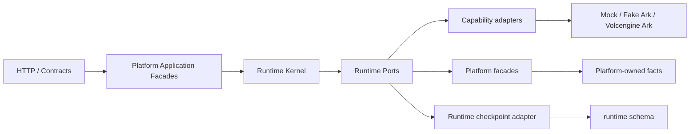
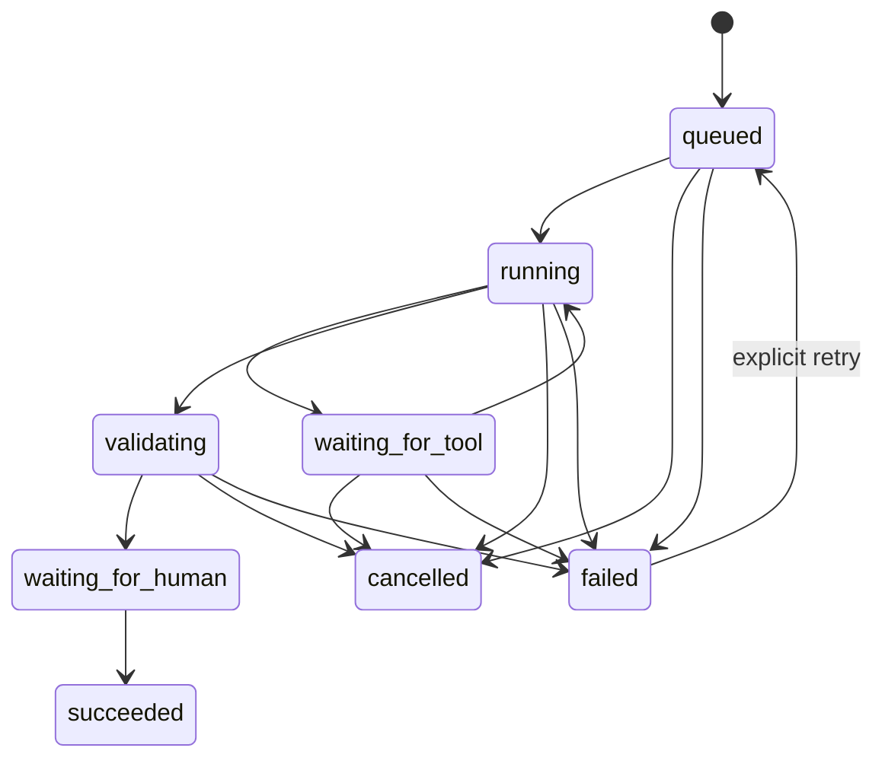

# Agent Runtime Kernel 设计

> Phase 4 范围：只把现有 Lesson Preparation 执行映射到最小 Kernel。
> 不新增数据库表、不改变 HTTP Contract、不建立 Memory 或完整 Skill Registry。

## 1. 设计目标

Runtime Kernel 负责“如何安全地执行一次 Agent 任务”，但不拥有任务所涉及的
教育事实。它必须回答：

- 运行的是哪个 Agent/Skill 版本；
- 当前执行到哪一步；
- 实际使用了哪些授权 Context；
- 每一步的输入 hash、输出 ref、attempt 和耗时；
- 进程失败后从哪个 checkpoint 恢复；
- 何时必须等待教师；
- 最终只生成了哪个 Proposal/Draft。

Kernel 不回答 TeachingPlan 是否应批准、成绩是否应确认或课堂是否真实发生。

## 2. 分层与依赖方向



允许的 Runtime 依赖：

- contracts 中的稳定 metadata/ref 类型；
- Runtime 自己的 domain/application；
- 通过 Port 返回的 ref、hash 和安全错误摘要。

禁止的 Runtime 依赖：

- Education、Artifact、Work Repository；
- PostgreSQL Adapter、`pg` 或 SQL；
- Provider SDK；
- Platform Entity 的可变实例。

## 3. AgentDefinition

`AgentDefinition` 是可执行定义的不可变描述，不是数据库里的可编辑聊天配置。

```ts
interface AgentDefinition {
  agentDefinitionId: string;
  version: string;
  purpose: string;
  allowedSkillVersions: readonly string[];
  toolPolicy: {
    allowedTools: readonly string[];
    mode: "disabled" | "explicit";
  };
  approvalPolicy: {
    proposalOnly: true;
    humanApprovalRequired: true;
  };
}
```

Phase 4 内置且只启用：

- Agent Definition：`lesson-preparation-agent@1`；
- Skill Version：现有 `lesson-preparation@1`；
- Tool policy：disabled；
- Approval policy：只允许 Proposal，必须教师审批。

PromptBundle 仍在 Capability application，未来由 SkillVersion 引用。Phase 4
不创建 Skill Registry。

## 4. AgentRun

AgentRun 表达一次用户任务执行，字段包括：

- `agentRunRef`；
- `tenantRef`、`actorRef`；
- `purpose`；
- Agent Definition ID/version；
- Skill version；
- current step；
- context plan/manifest refs；
- model execution/proposal refs；
- created/updated time；
- checkpoint version/hash；
- recovery count。

Kernel 状态机：



Lesson Preparation 在 Proposal 创建后进入 `waiting_for_human`。为了不改变
已有 API/UI，`runtime.agent_run.status` 继续使用兼容映射：

| Kernel 状态 | 兼容数据库状态 |
|---|---|
| queued | queued |
| running / waiting_for_tool | running |
| validating | validating |
| waiting_for_human / succeeded | completed |
| failed | failed |
| cancelled | cancelled |

完整 Kernel 状态是 `runtime.agent_run.output.runtimeCheckpoint` 中的权威执行
状态；兼容状态只服务现有读取 Contract。未来 API version 可直接暴露 Kernel
状态，本阶段不改变 Contract。

## 5. RunStep

每个 Step 是不可变值对象。状态转换产生新 Step 和新 Checkpoint，不原地修改
旧对象；append-only checkpoint 事件保留历史。

字段：

- `stepRef`、`sequence`、`kind`；
- `status`；
- `inputHash`；
- `outputRef`；
- `attempt`；
- `startedAt`、`completedAt`；
- `safeErrorCategory`。

Step kind：

- `retrieve`；
- `plan`；
- `invoke_model`；
- `invoke_tool`；
- `validate`；
- `create_proposal`。

Lesson Preparation 的固定最小步骤：

```text
retrieve
→ plan
→ invoke_model
→ validate
→ create_proposal
→ waiting_for_human
```

`retrieve` 输出 ContextManifest ref，`plan` 输出 PromptBundle ref，模型只保存
ModelExecution ref，校验只保存 output hash，Proposal 只保存 revision ref。
完整 prompt、response 和 Evidence 内容不进入 checkpoint。

## 6. ContextPlan 与 ContextManifest

Phase 4 不复制现有表，而是在 checkpoint 中保存严格引用：

```text
TaskWorkingSet
→ authorization
→ runtime.authorized_context_plan
→ retrieval / field mask / token budget
→ runtime.context_manifest
→ ModelRequest
```

ContextPlan 说明“允许用什么”；ContextManifest 说明“实际用了什么”。Checkpoint
保存二者 ref、version/hash；资源明细仍由现有正式记录持有。

Context token budget 在 Phase 4 作为设计字段保留；Lesson Preparation 继续使用
现有 Model budget 和 PromptBundle 上限，不引入新的裁剪算法。

## 7. Checkpoint

Checkpoint 是可校验的运行快照：

- schema version；
- checkpoint ref/version；
- AgentRun identity；
- Agent/Skill version；
- Kernel status/current step；
- immutable Step 列表；
- ContextPlan/ContextManifest refs；
- ModelExecution/Proposal refs；
- recovery count；
- created/updated time；
- SHA-256 content hash。

持久化策略（不新增 Migration）：

1. 最新快照写入 `runtime.agent_run.output.runtimeCheckpoint`；
2. 每次转换同时写 `runtime.outbox_record` 的
   `AgentRunCheckpointed` 安全事件；
3. 事件只含 checkpoint ref/version/hash、status/current step 和引用，不含
   prompt/response/Evidence；
4. Runtime checkpoint adapter 使用 `SELECT ... FOR UPDATE` 防止并发覆盖；
5. 读取时验证 schema version 和 hash，损坏时 fail closed。

## 8. Recovery

### 模型调用失败

- Provider 内部有界 retry 仍由 ModelExecution 实现；
- 每次 attempt 更新 `invoke_model` Step 的 attempt；
- terminal failure 将当前 Step 标为 failed；
- 教师执行现有 retry 命令后，Kernel 从 failed checkpoint 显式重新排队；
- 新 ModelExecution ref 写入新 checkpoint，不覆盖历史事件。

### API/Worker 进程重启

- Outbox 租约过期后重新领取；
- Worker 读取 ModelExecution 和 checkpoint；
- `running` Step 恢复为 queued 并增加 recovery count，然后重试；
- `validating` 从持久化 validated output 继续 finalize；
- `waiting_for_human` 不自动执行，只等待教师命令。

### Tool 失败

Kernel 提供 `waiting_for_tool`、tool succeeded/failed/retry 转换和 ToolExecutor
Port；Lesson Preparation 的 tool policy 为 disabled，因此 Phase 4 不运行真实工具。

### 人工等待

Proposal 创建后状态为 `waiting_for_human`。教师接受/拒绝/延后属于 Platform
命令。Platform 可在未来通过 Runtime Port 写入 `succeeded` 结束执行，但 Runtime
不能替教师调用批准命令。

## 9. Runtime Ports

Phase 4 定义以下边界：

| Port | 职责 | Phase 4 接入 |
|---|---|---|
| `ContextProvider` | 取得已授权 ContextPlan/Manifest 引用 | 复用现有 Lesson Preparation 上下文路径 |
| `ModelExecutor` | 通过 Capability 执行模型 | 复用 ModelInvocationApplicationFacade/ModelProvider 路径 |
| `ProposalCreator` | 请求 Platform 创建待审 Proposal | 复用 Artifact Application 路径 |
| `ToolExecutor` | 执行 policy 允许的工具 | 只定义边界，不启用工具 |
| `RuntimeCheckpointStore` | 原子读取/保存 checkpoint | PostgreSQL adapter，现有表 |

Port 返回 ref 和安全摘要，不返回可变 Platform Entity 或 Repository。

## 10. Lesson Preparation 接入策略

在不重写既有编排服务的前提下分五个接点：

1. 创建 AgentRun 时写入初始 checkpoint；
2. `beginAttempt` 写 `model_started`；
3. Provider 输出通过结构校验后写 `validation_started`；
4. Proposal revision 创建后写 `proposal_created`；
5. failure/cancel/retry 写相应 checkpoint。

原有 TaskRun、ModelExecution、Proposal 和 TeachingPlan 状态保持不变。Kernel
只替代散落的 AgentRun output/status 拼装，不替代 Platform 状态机。

## 11. 安全与审计

- checkpoint 不保存 API Key、Authorization header、完整 prompt/response；
- input 只保存 hash，output 只保存正式 ref/hash；
- tenant/actor 从已验证 ActingContext 传入，不接受 Runtime fallback；
- 每次 checkpoint 事件带 FormalWriteMetadata；
- 同一 AgentRun checkpoint version 通过行锁串行递增；
- hash 或 transition 不合法时 fail closed；
- Runtime architecture test 禁止 Platform Repository/Postgres/Provider SDK import。

## 12. Phase 4 完成边界

完成后具备：显式 Agent/Skill version、Run/Step、Context 引用、Checkpoint、
恢复状态机、人工等待和 Lesson Preparation 真实接入。

仍不具备：完整 Skill Registry、Memory、向量检索、通用 Planner、真实 Tool
Registry、跨业务 Skill 编排或新的 UI。这些必须建立在本 Kernel 上逐阶段实现。
