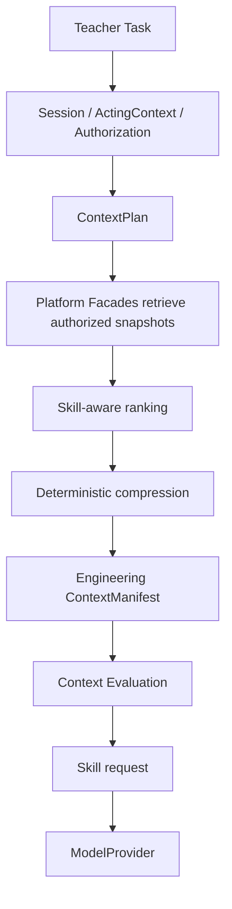
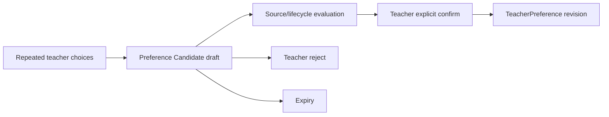

# Context Engineering 与 Memory Candidate 设计

> 状态：Phase 6 implementation design  
> 适用范围：`lesson-preparation@1`；不改变现有 API Contract、Migration 或 UI。

## 1. 设计目标

Context Engineering 的目标不是让模型“看到更多”，而是让每次运行只看到经授权、与 Skill 相关、可解释且在预算内的最小上下文。Memory 的目标不是复制 Platform 数据，而是保存可撤销的偏好/经验候选和检索引用。



## 2. ContextPlan

Phase 6 的内部 ContextPlan 是现有 `AuthorizedContextPlan` 的执行视图，不新增公共 Contract：

| 字段 | 含义 |
|---|---|
| `purpose` | 必须与 Skill manifest purpose 一致 |
| `actorRef` | 从 ModelExecution/服务端 Session 继承 |
| `tenantRef` | 从 ActingContext/Task 所属 tenant 解析，不接收浏览器 fallback |
| `resourceTypes` | Skill policy 需要的资源类别 |
| `fieldMask` | 已授权字段组，必须是 Skill allowlist 子集 |
| `authorizationDecisionRef` | 本次授权证据 |
| `authorizedResourceRefs` | 可读取的 Platform refs |
| `authorizedEvidenceRefs` | 教师明确选择且获授权的 Evidence refs |
| `tokenBudget` | Runtime 最大输入预算；Builder 使用保守 planning budget |
| `timeRange` | 可选检索时间范围；当前 Lesson Preparation 为 `null` |
| `workingSetVersion` | 防止授权后 TaskWorkingSet 被静默替换 |

Builder 没有 Repository 依赖。Composition Service 通过 owning Facade/Repository 取得 snapshots 后传入 Builder；Builder 只接受含 authorization proof 的 plan。

## 3. Retrieval、Ranking 与 Compression

### 3.1 Retrieval 边界

- CourseRun、Unit、Lesson、Objective、approved TeachingPlan 永远来自 Platform；
- Evidence 必须同时出现在 teacher selection、AuthorizedContextPlan 和 sealed ContextManifest 中；
- Skill 不得发起 Repository 查询；
- confirmed Teacher Preference 未来也只能以显式授权的 snapshot 进入，不自动扩大范围。

### 3.2 排序

资源按确定性优先级处理：

1. 请求、Lesson、LearningObjectives 和 approved plan（required）；
2. 教师明确选择的 Evidence，保持 selection order；
3. Unit/Course 描述与 Evidence gaps；
4. 可选个性化摘要（本阶段尚未接入模型）。

相同优先级使用 resource ref 排序，保证同一输入产生同一 manifest hash。

### 3.3 压缩

首版只使用可解释的确定性压缩：

- Unicode trim 与连续空白折叠；
- 字符上限按 section 配置，绝不截断 ref；
- 数组稳定去重；
- Evidence summary 单项限额；
- required section 超出预算时 fail closed，不静默丢失关键事实；
- optional section 可排除，并记录 `reason=token_budget`；
- 不使用另一次模型调用做压缩。

估算器版本为 `unicode-char-estimator@1`：ASCII 约四字符一个 token，非 ASCII 约两个字符一个 token，并加入 JSON 结构开销。它只用于规划；真实 Usage 由 Provider 记录。

## 4. Engineering ContextManifest

现有公共 `ContextManifest` 保持不变。Builder 生成内部、可 hash 的 `LessonPreparationEngineeringManifest`：

- `schemaVersion` 和 `builderVersion`；
- `contextManifestRef`、`authorizationDecisionRef`、`workingSetVersion`；
- `purpose`、actor/tenant hash（AgentRun 内部只保存 refs，不进入 Prompt）；
- included resources：ref、type、version、content hash、provenance、estimated tokens、compression；
- excluded resources：ref、type、reason；
- missing information；
- field mask；
- planning token budget、estimated input tokens 和每 section tokens；
- selection/authorization/actual Evidence refs 的一致性；
- manifest content hash。

安全摘要随 Runtime AgentRun output/checkpoint 生命周期保存，用于重启后解释；不保存完整 Prompt、完整 Evidence 或模型响应。

## 5. Context Evaluation

Context Evaluation 在调用 ModelProvider 前执行，包含：

| 维度 | 阻断条件 | 记录项 |
|---|---|---|
| Authorization | 无 decision ref、tenant/actor 缺失、Evidence ref 不一致 | unauthorized refs |
| Completeness | Lesson、Objective、approved plan 等 required snapshot 缺失 | missing resource kinds |
| Minimization | 使用未允许 field group、重复资源、optional 资源无价值 | excluded/duplicate refs |
| Budget | estimated input 超过 planning budget | section tokens、overage |
| Value | 没有命中教师选择的 Evidence 或关键目标 | hit count/value ratio |

Evaluation 输出 `passed`、issues、metrics 和 hash。失败时不调用 Provider，不尝试通过 Mock 或更宽上下文绕过。

## 6. Memory 分类与所有者

| 类型 | 所有者 | 生命周期 | Phase 6 状态 |
|---|---|---|---|
| Working Memory | Runtime | 单次 AgentRun | 已由 checkpoint/output 承载执行摘要 |
| Task Memory | Work | Task/TaskRun 生命周期 | 已由 TaskWorkingSet、history 和来源 refs 承载 |
| Preference Candidate | Personalization | draft → confirmed/rejected/expired | 本阶段实现领域模型和应用服务 |
| Episodic Candidate | Personalization | draft → confirmed/rejected/expired | 本阶段实现候选模型，不自动转长期事实 |
| Teacher Preference | Personalization | confirmed revision，可撤销/被新 revision 取代 | 本阶段实现领域对象与确认边界 |

Platform facts 只用 refs + version/hash 作为 Candidate source；候选 content 只能是偏好/经验摘要，不能复制 TeachingPlan、Evidence 或成绩。

## 7. MemoryCandidate

```text
MemoryCandidate
  candidateRef
  owner: tenantRef + teacherRef
  type: preference | episodic
  content: normalized summary
  source: refs + versions + hashes + provenance
  confidence
  createdAt / expiresAt
  status: draft | confirmed | rejected | expired
  version / contentHash
```

不支持 learner owner，也不支持 `course`、`lesson`、`evidence` 或 `teaching_plan` 作为 candidate type。Source 只证明来源，不取得来源对象所有权。

## 8. Teacher Preference 确认闭环



规则：

- Agent 只能提出 Candidate；
- 只有 candidate owner 可确认或拒绝；
- 确认需要 expected version，重复确认幂等，不同 payload fail closed；
- 已确认/拒绝/过期 Candidate 不可原地编辑；
- Preference 保存 source candidate ref 和 content hash，可撤销并保留历史；
- 本阶段不把 Preference 自动注入 Context，也不建立学生画像。

## 9. Memory Evaluation

Memory Evaluation 检查：

- source refs 非空、版本/hash/provenance 完整；
- owner 为 teacher，而不是 learner；
- confidence 在 `[0,1]`；
- expiry 合法且读取时重新评估；
- preference 必须来自 confirmed `preference` candidate；
- rejection/revocation/history 可追溯；
- content 不含受禁止的 formal-fact 类型声明。

## 10. 存储与演进

本轮不新增 Migration，所以：

- Context engineering manifest 使用现有 Runtime AgentRun JSON output 保存安全摘要；
- MemoryCandidate/TeacherPreference 通过 Port 定义，内存 Adapter 只用于模型、应用服务和测试；
- Product Composition Root 不把内存 Adapter 宣称为持久化能力；
- 未来若要跨重启启用教师偏好，必须追加 `personalization` 前向 Migration、PostgreSQL Adapter、权限/Audit 和显式产品交互，再接入 Context Builder。

这个裁决避免把 Memory 变成第二事实库，也避免在禁止 Migration 的阶段伪造持久化完成。
