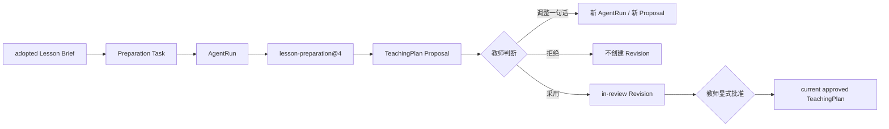

# Lesson Brief → Lesson Preparation 闭环设计

## 设计目标

在不复制任何业务状态的前提下，把 Lesson Brief、现有备课 Task、版本化 Skill、Proposal 审阅和 TeachingPlan 审批组合成同一个 Lesson Journey：



“同一个页面”指 Teaching Workspace 可以完成生成、比较、调整、采用和批准的主动作；底层仍只调用现有正式 API 和 Application Service，不建立页面私有真值。

## 1. 状态与所有权

| 信息 | 唯一真值 | Workspace 的职责 |
|---|---|---|
| Lesson Brief 候选及教师采用 | Runtime AgentRun output + Work TaskWorkingSet ref | 展示和触发命令 |
| 备课进度 | Work lesson_preparation Task | 读取 Journey Projection |
| Agent/模型执行 | Runtime / Capability | 展示排队、运行、失败和恢复入口 |
| 多方案 Proposal | Artifact Proposal Revision | 比较、选择、处置 |
| in-review / approved plan | Artifact TeachingPlan Revision | 展示并调用显式批准命令 |
| Lesson Journey | 可重建读取投影 | 解释下一步，不写状态 |

前端不推断正式状态。页面在每个命令后重新读取 Task、Journey、Proposal 和 TeachingPlan State。

## 2. `lesson-preparation@4`

### 2.1 版本策略

- 新版本：`lesson-preparation@4`，状态 `published`；
- 输入版本：`lesson-preparation-input@3`；
- PromptBundle：新版本，不覆盖 `@1~3`；
- Registry 默认版本改为 `@4`；
- ModelExecution 继续保存 `skillRef` / `skillContentHash`；
- 恢复旧执行时仍按 `inputSummary.skillRef` 加载历史版本。

### 2.2 新增输入

内部 Skill 输入新增 `confirmedLessonBrief`：

```ts
interface ConfirmedLessonBriefContext {
  briefRef: string;
  agentRunRef: string;
  lessonRef: string;
  contentHash: string;
  contextManifestRef: string;
  contextManifestHash: string;
  generatedBySkillRef: "lesson-analysis@1";
  selectedCandidateIds: string[];
  teachingFocus: BriefCandidate[];
  difficultyFocus: BriefCandidate[];
  attentionPoints: BriefCandidate[];
  classEvidenceSummary: BriefEvidenceSummary[];
  knownGaps: string[];
  sourceVersionVector: Record<string, string>;
}
```

只传入教师采用的候选；未选候选、未确认候选和 deferred Brief 不进入模型。

### 2.3 服务端解析规则

`ConfirmedLessonBriefProvider` 是 Model Invocation composition 使用的读取 Port。PostgreSQL Adapter 从已有 `runtime.agent_run.output.lessonBrief` 读取，不新增表。

解析必须同时满足：

1. `TaskWorkingSet.sourceResourceRefs` 恰有 `lesson-brief-run:<agentRunRef>`；
2. AgentRun 属于当前 tenant 和 actor；
3. Brief 的 Lesson 与 Task Lesson 相同；
4. Brief 状态是 `adopted` 且 disposition 由当前教师产生；
5. selected candidate ids 都存在于该 immutable Snapshot；
6. ref 同时存在于 AuthorizedContextPlan 和 sealed ContextManifest；
7. content hash 与 Snapshot 内容一致。

任何一项失败都 fail closed；`@4` 不降级为忽略 Brief。

### 2.4 Context Engineering

Context Builder v3 在 `@3` 的 confirmed Preference 能力上追加 Brief：

- `lesson_brief` 作为 required resource kind；
- Manifest 记录 Brief ref、AgentRun、SkillVersion、content hash、Manifest hash、selected ids 和 token usage；
- selected candidates 与 `knownGaps` 进行确定性裁剪；
- class Evidence 摘要仍必须对应已授权 Evidence refs；
- Brief 不提升权限，不扩大 TaskWorkingSet；
- Brief 与 Preference 只影响方案组织，不改写 Platform 事实。

## 3. Journey 状态规则

| 条件 | Stage / Status | Next Best Action |
|---|---|---|
| 无 Brief | `understand.ready` | 生成教学洞察 |
| Brief 待判断 | `understand.waiting_for_teacher` | 判断教学洞察 |
| Brief adopted，Task planned/in_progress，无执行/Proposal | `plan.ready` | 生成教学方案 |
| Agent/Model queued/running/validating | `plan.waiting_for_agent` | 查看生成进度 |
| 执行失败 | `plan.needs_attention` | 查看原因并重试 |
| pending Proposal | `plan.waiting_for_teacher` | 比较并判断方案 |
| in-review Revision | `plan.waiting_for_teacher` | 批准教学计划 |
| approved plan，无材料 | `materials.ready` | 准备教学材料 |

无 adopted Brief 时，Teaching Workspace 不提供新的“生成教学方案”入口。旧页面和历史 Task 的兼容入口保留，因此不破坏旧 Run 恢复与既有验收路径。

## 4. Proposal Compare

Workspace 使用现有 `ProposalReviewDetail`，不创建新 DTO 或 Proposal 状态。

每个方案卡展示：

- 标题与简短定位；
- 目标：`proposedPlanChanges.objective`；
- 流程：opening / explanation / guided practice / independent practice / closure；
- 活动：studentActivity / teachingMoves；
- 练习：independentPractice / followUpEvidence；
- 风险：unsuitableConditions / knownGaps / uncertaintyNote；
- 来源 Evidence；
- 与 approved baseline 的 diff 摘要。

教师只能选择一个方案进行正式处置。多方案是同一个 Proposal Revision 的不可变内容，不复制到前端长期状态。

## 5. 教师动作

### 5.1 生成教学方案

1. 读取最新 Task detail 与 Workspace goal；
2. planned Task 先通过正式命令进入 `in_progress`；
3. 使用 TaskWorkingSet 当前 version、Objective 和 Evidence 创建 Model Invocation；
4. 页面显示真实 ModelExecution 状态并轮询；
5. 成功后按 `proposalRevisionRef` 读取 Proposal Detail。

默认请求文案由 adopted Brief 的关注点生成，教师无需填写长表单。

### 5.2 一句话调整

教师输入一句话，例如“这个班基础较弱，减少讨论，多做分步练习”。

1. 当前 Proposal 以 `deferred` disposition 留存，note 记录调整意图；
2. Task 回到 `in_progress`；
3. 重新读取 Task/WorkingSet version；
4. 以该句话创建新的 AgentRun / Proposal；
5. 如果新 Run 创建失败，页面明确显示错误；旧 Proposal 和 Task 状态仍可恢复，不显示假成功。

这样保留完整版本历史，同时不允许两个 pending Proposal 竞争同一个 Task。

### 5.3 采用、拒绝与批准

- 拒绝：`rejected`，不创建 TeachingPlan Revision；
- 采用：`accepted`，只创建 `in_review` Revision；
- 采用并调整：继续使用 `accepted_with_changes`，只创建 `in_review` Revision；
- 批准：调用现有 `approveTeachingPlan`，只有这一步产生新的 current approved Revision；
- 任何动作都不表示课堂已经实施，也不自动完成备课 Task。

## 6. API 复用

本阶段优先复用现有 Contracts 和路由：

- Lesson Brief GET / generate / decide；
- Lesson Preparation Task create / detail / start；
- Model Invocation create / detail / retry / cancel；
- Pending Proposal / Proposal Detail；
- Suggestion Disposition；
- TeachingPlan State / approve。

无需新增数据库表，也无需返回大型 Lesson Dashboard 响应。若页面需要组合展示，仍按小型读取请求并行加载。

## 7. 兼容性与失败恢复

- 历史 `@1~3` ModelExecution 根据保存的 Skill ref 恢复；
- `@4` 必须有 adopted Brief，缺失即结构化冲突，不静默退回 `@3`；
- API 重启后由既有 Outbox/ModelExecution 恢复；
- 重复生成依赖现有 idempotency key 和进行中执行约束；
- disposition 与 approve 继续使用 expected version；
- 页面刷新后重新从 PostgreSQL 读取，不依赖组件数组恢复业务状态。

## 8. 测试重点

1. Registry 同时保留 `@1~4`，默认 `@4`；
2. 历史 `@3` Run 可按原 PromptBundle/SkillVersion 重建；
3. `@4` 输入包含且只包含 adopted Brief 的 selected candidates；
4. Brief ref/hash/SkillVersion 进入 ContextManifest；
5. 跨 tenant、跨 actor、跨 Lesson 或 deferred Brief 被拒绝；
6. 无 Brief 的 Journey 不显示生成方案；
7. adopted Brief 显示生成入口；
8. Proposal 显示 compare 并等待教师；
9. rejected/deferred 不创建 TeachingPlan Revision；
10. accepted 只创建 in-review，显式 approve 后才成为 current approved。

