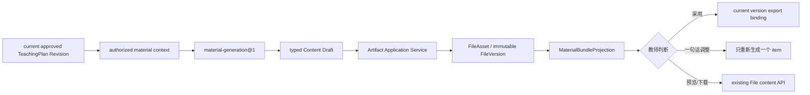

# Material Bundle 设计

## 设计目标

Phase 8A-3 在 current approved TeachingPlan Revision 与课堂实施之间增加一个可重建的材料阶段：



Material Bundle 不是新事实表，也不复制 TeachingPlan 或 File 状态。它只解释“当前批准方案所需的五类材料，分别准备到了什么程度”。

## 1. Material Bundle 读取模型

### 1.1 材料类型

Phase 8A-3 固定支持五类最小材料：

| Material kind | 显示名称 | FileCategory | 首轮文件形式 |
|---|---|---|---|
| `lesson_plan` | 教案 | `lesson_plan` | Markdown Draft；既有正式 DOCX 可作为 adopted item |
| `slide_outline` | PPT 大纲 | `courseware` | Markdown 大纲，不伪装成 `.pptx` |
| `exercise_set` | 课堂练习 | `assessment` | Markdown 练习与教师参考 |
| `board_design` | 板书设计 | `reference` | Markdown 版面结构 |
| `differentiated_support` | 分层支持 | `worksheet` | Markdown 分层提示与任务 |

该映射利用现有 FileCategory 唯一识别 material kind，不新增 Material 表。普通 `upload` 文件即使类别相同，也不能满足 Bundle；只有 `teaching_plan_export` 且具有正确 TeachingPlan binding 的系统成果才进入 Projection。

### 1.2 Contract

```ts
type MaterialBundleProjection = {
  lessonRef: string;
  approvedTeachingPlanRevisionRef: string | null;
  approvedTeachingPlanRevisionNumber: number | null;
  status:
    | "blocked_no_approved_plan"
    | "ready_to_generate"
    | "partially_ready"
    | "waiting_for_teacher"
    | "ready";
  requiredKinds: MaterialKind[];
  items: MaterialBundleItem[];
  missingKinds: MaterialKind[];
  outdatedKinds: MaterialKind[];
  sourceVersionVector: Record<string, string>;
  generatedAt: string;
};

type MaterialBundleItem = {
  kind: MaterialKind;
  status: "missing" | "outdated" | "draft" | "adopted";
  assetRef: string | null;
  assetVersion: number | null;
  versionRef: string | null;
  versionNumber: number | null;
  previewKind: FilePreviewKind | null;
  sourceRevisionRef: string | null;
  sourceRevisionNumber: number | null;
  provenance: MaterialProvenance | null;
};
```

### 1.3 状态计算

| 条件 | item status |
|---|---|
| 没有系统生成/正式导出的同类 FileAsset | `missing` |
| 有同类 current FileVersion，但未绑定 current approved Revision | `outdated` |
| current FileVersion 以 `reference` 绑定 current approved Revision | `draft` |
| current FileVersion 以 `export` 绑定 current approved Revision | `adopted` |

Bundle status：

- 无 current approved Revision：`blocked_no_approved_plan`；
- 全部 missing/outdated：`ready_to_generate`；
- 有可用 item，同时仍有 missing/outdated：`partially_ready`；
- 五类都有 current Draft，但至少一项未采用：`waiting_for_teacher`；
- 五类 current version 均已采用：`ready`。

旧 Revision 的 FileVersion 始终保留。current approved Revision 改变后，旧材料先显示 `outdated`，直到基于新 Revision 局部生成新的 FileVersion；不复制、不覆盖历史。

### 1.4 Provenance

不新增 metadata 表。生成时写 `TeachingMaterialDraftGenerated` Artifact Outbox event，payload 记录：

- `materialKind`；
- `versionRef`；
- `approvedTeachingPlanRevisionRef`；
- `sourceAgentRunRef`；
- `skillRef`；
- `contextManifestHash`。

Projection 通过 File binding 和已有 Outbox provenance 解释当前版本。既有 DOCX 导出使用 `teaching-plan-docx-renderer@1` provenance。Outbox 只用于来源解释，不成为材料生命周期真值；FileVersion 与 binding 仍是唯一材料状态。

## 2. `material-generation@1`

### 2.1 Manifest

| 项 | 值 |
|---|---|
| Skill ref | `material-generation@1` |
| status | `published` |
| purpose | `material_generation` |
| output kind | `draft` |
| human approval | required |
| tools | disabled |
| memory | authorized context only |

### 2.2 输入

- Lesson 最小上下文；
- current approved TeachingPlan Revision 及完整结构化 content；
- adopted Lesson Brief 的教师选择（若存在）；
- current teacher / tenant 的 active confirmed Preference；
- approved plan 引用且通过 Education Facade 授权的 Evidence；
- 本次 requested material kinds；
- 可选的一句话局部调整；
- generatedAt。

必需来源是 Lesson 与 current approved Revision。Lesson Brief、Preference 和 Evidence 都是可选增强；缺失必须进入 ContextManifest / Draft known gaps。

### 2.3 输出

```ts
type MaterialContentDraft = {
  kind: MaterialKind;
  title: string;
  contentMarkdown: string;
  sourceRefs: string[];
  knownGaps: string[];
};
```

输出只包含请求的 kinds，不能擅自生成其他材料。`slide_outline` 明确是大纲，不输出或声称已经创建真实 PowerPoint 文件。

### 2.4 Context 与 Evaluation

Context Builder：

1. 校验 tenant/actor、Lesson 和 approved Revision；
2. 只保留 authorized Evidence；
3. 对 Brief、Preference、Evidence 做确定性长度限制；
4. 记录 included/excluded/missing、version、hash、provenance 和 token estimate；
5. 超出预算时 fail closed，不调用生成器。

Evaluation：

- Contract：requested kinds 完整、唯一、Schema 正确；
- Policy：source refs 全部存在于 Manifest，未使用未确认 Preference/未授权 Evidence；
- Quality：每种材料包含目标、使用说明和明确缺口；
- Operation：记录 deterministic latency、estimated token、retry/cost 基线。

首轮生成器是确定性 Skill 执行，沿用 Lesson Brief 的 `modelProvider=none` 模式。它提供可测试的产品闭环；未来接入 Ark 时新增 SkillVersion，而不是覆盖 `@1` 或修改 Runtime Kernel。

## 3. Runtime 与 Artifact 边界

### 3.1 Runtime 负责

- 加载 published `material-generation@1`；
- 构建授权 Context；
- 运行 validator/evaluation；
- 创建 QueryRun、AgentRun 和 ContextManifest；
- 持久化 immutable typed Content Draft；
- 返回 `sourceAgentRunRef`。

### 3.2 Artifact 负责

- 再次验证 current approved Revision 与 Lesson scope；
- 把 Draft 渲染为安全 Markdown bytes；
- 写 ObjectStore；
- 创建或更新 FileAsset / FileVersion；
- 建立 Lesson、TeachingPlan Artifact/Revision bindings；
- 处理 expected asset version、幂等、Audit、Outbox 和对象补偿；
- 显式 adopt 时给当前 version 增加 current Revision `export` binding。

### 3.3 禁止路径

```text
Skill ─X→ PostgreSQL Repository
Skill ─X→ FileAsset / FileVersion
Runtime ─X→ artifact.file_* SQL
Web ─X→ 伪造 material status
MaterialBundleProjection ─X→ 写数据库
```

跨模块协作使用 `MaterialArtifactPort`。Adapter 可以调用 Artifact Application Service，但 Skill 和 Runtime application code 不 import Artifact Repository 或 ObjectStore Adapter。

## 4. Version 与局部重生成

### 4.1 首次生成

每个 material kind 对应一个长期 FileAsset。首次生成创建 version 1，并以 `reference` 绑定 current approved Revision，因此状态是 Draft。

### 4.2 局部调整

教师对一个 item 输入一句话，例如“第二题简单一点”：

1. 请求只包含该 `kind` 和 adjustment；
2. 客户端提交 current `assetVersion` 与 approved Revision ref；
3. Runtime 创建新的 AgentRun，仅输出该 item Draft；
4. Artifact 在该 FileAsset 上创建新的 immutable FileVersion；
5. 新 version 绑定同一 current approved Revision，状态回到 Draft；
6. 其他四个 item 的 asset/version/binding 不变；
7. 旧版本和之前的 adopted binding 保留历史。

相同 idempotency key + 相同 payload 重放同一结果；相同 key + 不同 payload fail closed。并发 expected version 只有一个成功，另一个返回结构化 `409`。

### 4.3 新 approved Revision

同一 TeachingPlan Artifact 出现新 current approved Revision 后：

- Bundle 将现有 current material versions 标为 `outdated`；
- 重新生成一个 kind 时复用其 FileAsset，创建新 FileVersion；
- 新 version 绑定新 Revision；
- 未重新生成的 kinds 继续 outdated；
- 不静默把旧材料绑定到新计划。

## 5. 教师采用与下载

- **预览**：复用 File detail/content API；Markdown 使用 text preview。
- **下载**：复用 current/historical FileVersion content API。
- **采用**：Artifact Service 为 current version 和 current approved Revision 增加 `export` binding；不修改 TeachingPlan。
- **重新生成**：只针对一个 item；采用状态不会自动复制到新 version。
- **打开文件库**：使用现有 Lesson/asset deep link。

采用不是文件内容修改，也不表示课堂已经实施。Journey 只有在 Bundle `ready` 时把 `materials_available` 记为完成，并进入 `deliver.ready`。

## 6. API

小型路由：

```text
GET  /api/v1/teacher/lessons/:lessonRef/material-bundle
POST /api/v1/teacher/lessons/:lessonRef/material-bundle/generate
POST /api/v1/teacher/lessons/:lessonRef/material-bundle/:kind/adopt
```

生成请求包含 purpose、idempotency key、expected approved Revision、kind (`all` 或单项)、可选 adjustment 和可选 expected asset version。响应返回 AgentRun ref 和重新读取后的 Bundle，不返回完整 Agent internal output。

预览、下载和历史继续走既有 File API，避免复制内容路由。

## 7. Teaching Workspace

新增 `MaterialBundlePanel`，只在存在 current approved plan 或 Journey 位于 materials/deliver 后显示：

- 顶部显示来源 Revision 和整体进度；
- 五个 item 卡展示状态、版本和来源；
- missing/outdated：生成；
- draft：预览、采用、局部调整、下载；
- adopted：预览、局部调整、下载；
- 生成全部只补 missing/outdated，不覆盖已有 current Draft；
- 一句话局部调整使用短输入，不打开 Office 编辑器。

页面每个命令后重新读取 Material Bundle 与 Journey；不在 React state 推断采用状态。

## 8. 无 approved plan 的 Initial Planning Flow

`blocked_no_approved_plan` 是正式、可解释的读取结果，不是空状态错误。服务端生成命令返回 `MATERIAL_APPROVED_PLAN_REQUIRED`：

```text
Lesson
→ Lesson Brief
→ Preparation Task
→ TeachingPlan Proposal
→ in-review Revision
→ 教师显式批准
→ Material generation
```

本阶段不引入空 TeachingPlan、自动批准或 sample fallback。对于尚无 approved baseline 且 Phase 8A-2 当前流程不能生成首版 Revision 的课时，Workspace 继续引导完成正式规划链，不伪造材料。

## 9. 安全与兼容

- ActingContext 只来自服务端 Session；API 不接收 tenant/actor；
- Lesson、Revision、Evidence、Preference、File 全部 tenant scoped；
- 未授权 Evidence 不进入 ContextManifest；
- 不新增 Migration，不修改 45 个历史 SQL 文件；
- 旧 TeachingPlan、DOCX 和 FileVersion 保持可解释；
- 既有 DOCX 若绑定 current Revision，可直接作为 adopted `lesson_plan`；
- UI、Journey 和 API 使用同一 Projection Contract；
- Material Skill/Runtime 不直接 import Education/Artifact Repository 或 PostgreSQL Adapter。

