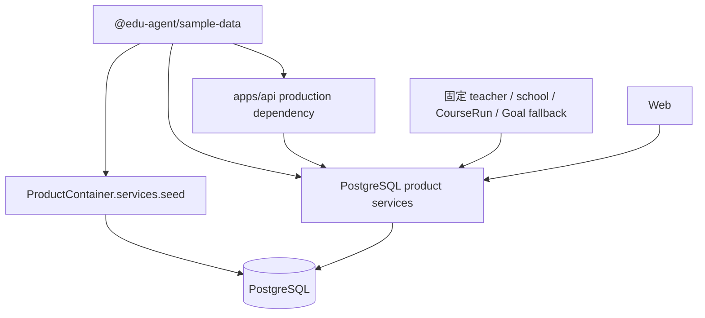
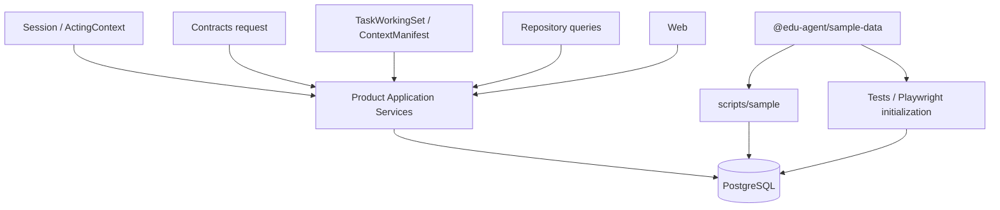

# Phase 2 Sample Data 与产品运行路径边界

状态：完成  
基线：`bfb807508488f716293c64c2c6b98a3e9626f235`  
分支：`codex/phase2-sample-data-boundary`

## 结果

Phase 2 将匿名示例内容保留为可选初始化工具，同时从正式 API package、Product Composition Root、Application Service、Authorization 和 Repository 调用链中移除了 `@edu-agent/sample-data` 与固定 Sample Resource Ref。

当前边界是：

- 正式身份来自服务端 Session 和 ActingContext；
- CourseRun 与资源范围来自 Membership 授权和 Repository；
- Task 输入来自 Contracts 请求、TaskWorkingSet 与持久化 Task；
- Agent Context 来自 AuthorizedContextPlan 与 ContextManifest；
- Sample Data 只能由 `scripts/sample`、自动化测试和 Playwright 初始化使用；
- Seed 写入 PostgreSQL 后，所有页面操作继续走正式 API，不从 Sample package 读取业务状态。

## 修改前依赖图

问题包括：

- API manifest 将 Sample package 作为生产依赖；
- Product Container 构造并公开 Seed Service；
- Read Service 在未提供 CourseRun 时回退固定 Sample CourseRun；
- 学校和教师显示名回退 Sample Fixture；
- Lesson Preparation 和 Assignment Adjustment 使用固定 Sample Goal；
- TeachingPlan 审批使用固定 Sample CourseRun 查找 Artifact；
- Teacher Copilot 从 Sample package 读取 Mock TeachingPlan 目录；
- Model Data Manifest 只允许两个固定 Sample tenant。

## 修改后依赖图

两条路径只在 PostgreSQL 初始化结果处相遇。产品服务不 import Sample package，也不通过 Product Container 获得 Seed 能力。

## 删除的 fallback

| 原行为 | 当前行为 |
| --- | --- |
| 无 CourseRun 参数时使用固定 Sample CourseRun | 只使用 ActingContext 中授权的 `courseRunRefs`；空列表返回安全 `NOT_FOUND` |
| 缺少学校名时使用 Sample 学校 | 学校名必须来自当前 Session workspace |
| 缺少教师名时使用 Sample 教师 | 显示名必须来自认证 Session user |
| 创建备课任务时使用固定 Goal | Repository 查询当前 tenant 的活动 Goal；0 个失败，多个要求显式消歧 |
| 作业 Evidence 调整下一课时使用固定 Goal | 同样通过 Repository 查询并 fail closed |
| 审批 TeachingPlan 时使用固定 CourseRun | 使用 Revision scope、Lesson、Preparation Task 和 ActingContext CourseRun 授权 |
| Teacher Copilot 使用 Sample Mock plan catalog | Mock Provider 根据当前策略与 Evidence 构造确定性 TeachingPlan |
| Model Data Manifest 限定固定 Sample tenant allowlist | 接受经过 Session/Authorization 解析的非空 tenant，并继续强制 synthetic data 与允许用途 |
| Capability Probe Audit 写入 Sample tenant | 写入独立的 system capability-probe scope |
| Demo bypass 直接指定固定 teacher/school Ref | 显式 Local Identity Provider subject 通过 External Identity Link 和 Membership 查询解析 |

## 保留的 Seed 能力

| 能力 | 位置 | 说明 |
| --- | --- | --- |
| 稳定匿名 refs/data | `packages/sample-data` | 不包含产品服务或测试断言 |
| 显式 Seed CLI | `scripts/sample/seed-cli.ts` | `corepack pnpm sample:seed` 的唯一入口 |
| Seed Application Service | `scripts/sample/gate2-demo-seed-service.ts` | 只负责把示例内容写入 PostgreSQL |
| Gate 2.5/2.7 Seed fixtures | `scripts/sample/` | 只供显式 Seed 与测试初始化 |
| 测试 Seed helper | `scripts/sample/seed-sample-data.ts` | 为隔离 PostgreSQL 测试创建短生命周期连接池 |
| Playwright 初始化 | `scripts/testing/run-e2e-app.mjs` | 调用显式 Seed CLI，使用隔离 Volume/ObjectStore |

`apps/api/package.json` 不再依赖 `@edu-agent/sample-data`。根 package 仅以 devDependency 提供给 `scripts/sample` 和测试。

## 架构保护

`tests/architecture/sample-data-boundary.test.ts` 保证：

- API/Web production dependencies 不含 Sample/Test Fixture；
- `apps/api/src` 和 `apps/web/src` 不 import Sample/Test Fixture package；
- Product Container 不构造或公开 Seed Service；
- 固定 Sample tenant、teacher、CourseRun、Lesson、Goal 不进入正式服务；
- 身份和资源入口来自 Session/ActingContext、请求和 Repository。

`tests/postgres/sample-data-boundary.test.ts` 保证：

- 一个已有身份但没有 CourseRun 的工作空间返回结构化 404；
- 响应不泄漏或回退 Sample CourseRun；
- 显式 Seed 后，同一正式 bootstrap API 能读取已持久化课程。

## 验证结果

| 检查 | 结果 |
| --- | --- |
| `pnpm install --frozen-lockfile` | 通过，6 个 workspace projects |
| `pnpm typecheck` | 通过 |
| `pnpm test:unit` | 11 files / 51 tests 通过 |
| `pnpm test:architecture` | 10 files / 61 tests 通过 |
| `pnpm test:static` | 1354 assertions 通过 |
| `pnpm test:e2e` | 1 file / 5 tests 通过 |
| `pnpm test:postgres` | 17 files / 96 tests 通过；隔离 Volume 已清理 |
| `pnpm test:playwright` | 20 tests 通过；显式 Seed CLI、隔离 DB/ObjectStore 通过 |
| `pnpm test:ark-fake` | 1 test 通过；隔离 DB/ObjectStore 通过 |
| `pnpm build` | contracts、API、Web、sample-data、test-fixtures 全部通过 |
| Secret Scan | 407 files；无 Secret |
| Web bundle scan | `@edu-agent/sample-data`、Sample package path、固定 Sample CourseRun 均不存在 |
| Migration | 43 个；相对 Phase 1 基线无修改 |
| 开发状态 | PostgreSQL 与 ObjectStore 未删除或重建；测试临时资源均已清理 |

## 有意保留与未解决问题

- `postgres-gate1b-command-service.ts` 是 Gate 1B 内部 Test Composition 的遗留测试服务；它仍使用稳定测试 Ref，但不进入 Product Container 或正式 API。后续可在独立测试基础设施整理中迁移，Phase 2 不重构 Gate 1B。
- `synthetic-live-model-request.ts` 是显式 Live Provider 验收的匿名请求构造器，不属于普通产品运行链路。
- Local Identity Provider 的合成 profiles 仅用于 local/test，production 仍强制 OIDC 并 fail closed。
- `apiRoutes.demo`、`Gate2DemoIdentitySchema` 等名称是历史契约命名；实际路由已经使用正式 Session/ActingContext。重命名会影响 Contracts/UI，不在本阶段处理。
- `dataMode: "synthetic"` 仍是当前数据治理事实，不代表页面直接读取 Sample package。
- 本阶段未修改 UI、Migration、数据库 Schema、Agent Runtime、七模块边界或教师工作流。

## 最终判定

正式产品路径现在等于：真实服务端身份上下文 + PostgreSQL Repository + 正式业务状态。Sample Data 是显式、可选、可重复的初始化工具，不再是产品服务的依赖或 fallback。
