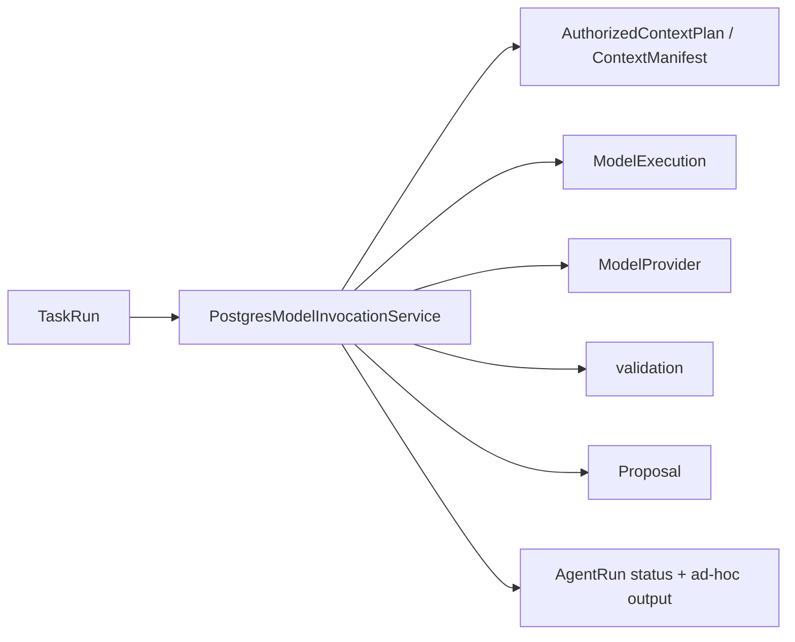
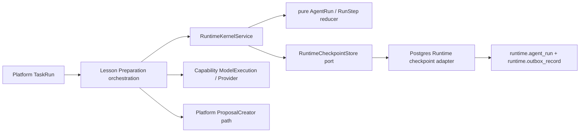
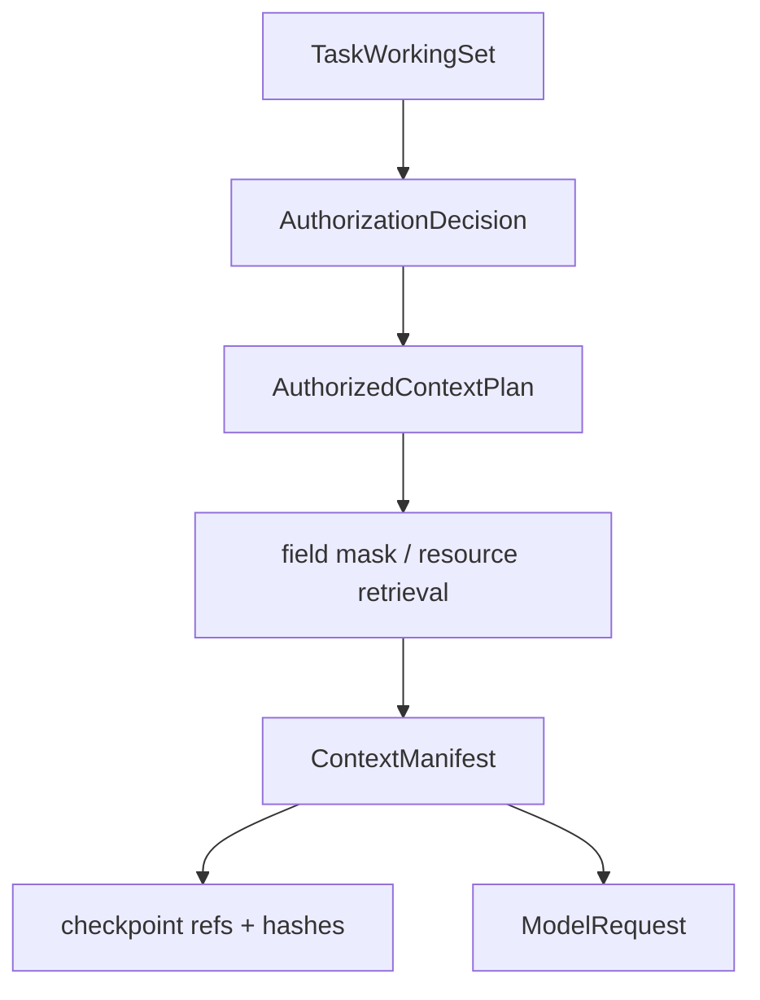

# Phase 4 Agent Runtime Kernel 实施报告

## 1. 结论

Phase 4 已把现有 Lesson Preparation 执行接入一个可版本化、可校验、可恢复的
最小 Agent Runtime Kernel。正式业务状态语义、HTTP Contract、UI 和 43 个历史
Migration 均未改变。

当前运行可以：

- 绑定稳定的 Agent Definition 与 Skill version；
- 建立 AgentRun 和 immutable RunStep；
- 引用已授权 ContextPlan/ContextManifest；
- 在模型、校验、Proposal 阶段写入 checkpoint；
- 记录 attempt、错误、取消、恢复和人工等待；
- API/Worker 中断后结合既有 Outbox/ModelExecution 恢复；
- 只生成 Proposal，等待教师通过 Platform 流程决定是否采用。

## 2. 前后架构图

### 修改前



状态存在于 PostgreSQL，但 Agent 阶段转换散落在 composition service 中，恢复
依赖 ModelExecution 和 Outbox 的分散信息。

### 修改后



Kernel application/domain 不依赖 PostgreSQL、Provider SDK 或 Platform Repository。
PostgreSQL 只存在于 Runtime infrastructure adapter。

## 3. Run 生命周期

Kernel 支持：

```text
queued
→ running
→ waiting_for_tool
→ running
→ validating
→ waiting_for_human
→ succeeded

active state → failed → explicit retry → queued
active state → cancelled
```

Lesson Preparation 在本阶段的真实路径：

```text
queued
→ running
→ validating
→ waiting_for_human
```

`waiting_for_human` 表示 Proposal 已创建但正式 TeachingPlan 仍需教师审阅。
现有 Platform 审批流程不由 Runtime 调用。

为了保持已有 API Contract，数据库顶层 status 使用兼容值：

- Kernel `waiting_for_human` → 兼容 `completed`；
- Kernel 完整状态保存在 `output.runtimeCheckpoint.status`；
- Runs/UI 现有行为不变。

## 4. Step 模型

Lesson Preparation 创建五个有序 Step：

| 顺序 | Step | 输入/输出安全记录 |
|---:|---|---|
| 1 | retrieve | ContextPlan hash → ContextManifest ref |
| 2 | plan | ContextManifest hash + PromptBundle ref → PromptBundle ref |
| 3 | invoke_model | request hash → ModelExecution ref |
| 4 | validate | validation input hash → validated output hash |
| 5 | create_proposal | Task/proposal-only hash → Proposal revision ref |

每个 Step 保存 status、attempt、started/completed time、input hash、output ref 和
safe error category。转换返回新对象；旧 checkpoint 事件保留之前的 Step 版本。

## 5. Context 流程



Checkpoint 不复制完整 Prompt、Evidence 或模型响应，只记录：

- AuthorizedContextPlan ref/hash；
- ContextManifest ref/hash；
- token budget；
- ModelExecution/Proposal ref；
- 缺失信息仍由既有 ContextManifest 保存。

## 6. Checkpoint 与恢复

### 持久化

- 最新 checkpoint：`runtime.agent_run.output.runtimeCheckpoint`；
- 历史事件：`runtime.outbox_record` / `AgentRunCheckpointed`；
- 每次保存先 `SELECT ... FOR UPDATE`；
- SQL 使用 expected checkpoint version 防并发覆盖；
- 每份 checkpoint 有 canonical SHA-256，读取时不匹配则 fail closed；
- Outbox payload 只包含 ref、version、hash、状态和恢复计数。

### Provider 失败

- ModelExecution 保持原有有界 retry/repair；
- RunStep attempt 与 ModelExecution attempt 同步；
- terminal failure 写 failed checkpoint；
- 现有人工 retry 创建新 ModelExecution，并把失败 Step 显式重新排队。

### 进程重启

- queued 请求继续由 Outbox 租约恢复；
- 已 running 的 Lesson Preparation 在重新处理前写 `recovered` checkpoint；
- 中断 Step 回到 queued，`recoveryCount` 增加；
- validating 继续使用已持久化 validated output finalize；
- Proposal 唯一性和既有任务结果复用防止重复 Proposal。

### Tool 与人工等待

Kernel 已有 ToolExecutor Port、`waiting_for_tool`、tool retry、failed 和
human intervention 转换。Lesson Preparation 的 Tool policy 是 disabled，Phase 4
没有启用生产工具。人工等待是一等状态，不被伪装成失败。

## 7. Platform-Agent 边界

Runtime 拥有：

- Agent Definition/version 引用；
- AgentRun；
- RunStep；
- ContextPlan/Manifest 引用；
- checkpoint、attempt、恢复和安全执行摘要。

Platform 继续拥有：

- Course/Lesson/Assignment/Evidence；
- TeachingPlan/Revision/Approval；
- GradeDecision；
- LessonDelivery 和课堂事实；
- 教师 Task 与正式业务状态。

Runtime 只通过 Port 请求 Context、模型、工具和 Proposal。静态测试禁止 Runtime
domain/application import Education、Artifact、Work infrastructure、PostgreSQL、
`pg` 或 Provider SDK。

## 8. 真实 Lesson Preparation 结果

PostgreSQL 集成测试验证：

- 创建时 checkpoint v1/queued；
- model started → v2/running；
- validation started → v3/validating；
- Proposal created → v4/waiting_for_human；
- 五个 Step 均 succeeded；
- 三个转换事件持久化；
- 兼容 AgentRun status 仍为 completed；
- 只创建一个 Proposal，Task 仍进入 awaiting_plan_review；
- 完整模型 Prompt/response 不进入 checkpoint。

## 9. 验证结果

| 验证 | 结果 |
|---|---|
| TypeScript | 通过 |
| Unit + Gate 2 | 12 files，57 tests 通过 |
| Runtime Kernel targeted | 6 tests 通过 |
| Architecture | 12 files，72 tests 通过 |
| Static assertions | 1432 assertions 通过 |
| HTTP/Node E2E | 1 file，5 tests 通过 |
| PostgreSQL | 17 files，96 tests 通过 |
| Default Playwright | 20/20 通过 |
| Fake Ark Playwright | 1/1 通过（timeout/retry/429/repair/cancel） |
| Production build | API/Web/Contracts/fixtures 全部通过 |
| Migration | 43 个，0 修改、0 新增 |

PostgreSQL、Playwright 和 Fake Ark 均使用隔离 Volume/ObjectStore，运行后已清理；
开发数据库、开发 ObjectStore 和上传文件未修改。

## 10. 本阶段未扩展的内容

- Reflection 尚未迁入 Kernel；仍走现有兼容流程；
- 没有完整 Skill Registry 或动态 Agent Definition 存储；
- 没有生产 Tool Registry/ToolInvocation 表；
- 没有 Memory、向量数据库或通用 Planner；
- 当前 API 不直接暴露 Kernel `waiting_for_human`，通过 checkpoint 可审计；
- Platform 教师批准后尚未写 `human_approved` checkpoint；Kernel 已提供合法转换，
  后续可由 Platform 通过 Port 发送完成信号；
- Step 历史目前由 checkpoint Outbox 事件承载，没有新增独立 Step 表。

这些是明确的渐进式边界，不影响 Phase 4 的 Lesson Preparation 可恢复执行。

## 11. 下一阶段 Skill 准备事项

下一阶段应先为现有 Lesson Preparation 定义最小 `SkillVersion` 映射，而不是一次
创建大量 Skill：

1. 将 PromptBundle、output schema、Context policy、tool policy 和 evaluation
   cases 绑定到一个 immutable SkillVersion；
2. 建立 draft → evaluated → published 生命周期；
3. Runtime 只执行 published SkillVersion；
4. 以固定评测集比较版本，失败时可回退旧 SkillVersion；
5. 先迁移 Lesson Preparation，再评估 Assignment Analysis 和 Reflection；
6. Memory/Personalization 在 Skill 与 Context 边界稳定后单独建设。

不建议下一步立即创建向量库、通用 Planner 或多个空 package。
