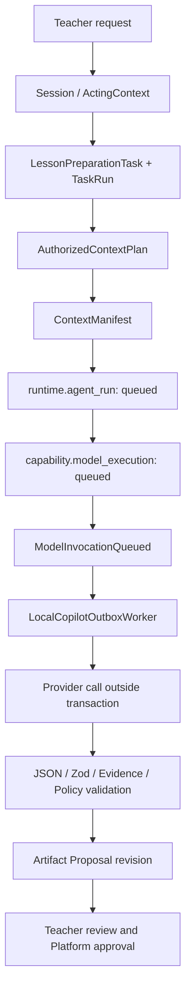

# Phase 4 Agent Runtime 现状审计

> 审计基线：`codex/phase4-agent-runtime-kernel`，基线提交
> `0423cad6481385b2e20a9d57e8910665b159faec`。
>
> 本文只记录当前代码事实；目标设计见
> [agent-runtime-kernel-design.md](./agent-runtime-kernel-design.md)。

## 1. 当前 Agent 执行流程

当前正式的 Lesson Preparation 模型链路由
`PostgresModelInvocationService` 编排：

实际事务边界如下：

1. API 事务创建 TaskRun、ResolvedContract、AuthorizedContextPlan、
   AgentRun、RunManifest、ContextManifest、ModelExecution 和 Outbox；
2. 事务提交后，Worker 领取 `ModelInvocationQueued`；
3. Worker 在数据库事务外调用 `ModelProvider`；
4. Provider 结果写入 ModelExecution，进入 `validating`；
5. 本地执行 JSON/Zod/Evidence/Policy 校验和一次受控修复；
6. Artifact Application 路径创建唯一 Proposal；
7. Runtime 将 AgentRun 标记为 `completed`，Work 将 TaskRun 标记为
   `completed`，Lesson Preparation Task 进入 `awaiting_plan_review`；
8. 后续接受、创建 in-review TeachingPlan、批准等正式状态仍由 Work、
   Artifact 和 Education 拥有，Runtime 不直接批准。

Reflection 使用相同的 ModelExecution 基础设施，但 Phase 4 的最小 Kernel
只接入 Lesson Preparation；不会扩展 Reflection Skill。

## 2. 当前状态对象

### Runtime Schema

| 对象 | 当前职责 | 现状 |
|---|---|---|
| `runtime.agent_run` | 一次 QueryRun/TaskRun 的 Agent 执行记录 | 持久化 provider、profile、状态和安全输出摘要；没有显式 Step/Checkpoint |
| `runtime.run_manifest` | Prompt、Policy、Capability 与 Context 版本清单 | 每个 AgentRun 一份，内容 hash 可追溯 |
| `runtime.authorized_context_plan` | 本次运行获准读取什么 | 封存 purpose、WorkingSet 版本、资源、字段掩码和授权决定 |
| `runtime.context_manifest` | 实际送入模型的资源、Evidence、未知项 | 封存版本、hash、provenance 所需引用；不等于永久授权 |
| `runtime.outbox_record` | Runtime 领域事件 | 支持租约、重试、处理结果和 Consumer Effect；没有 Runtime checkpoint 事件 |

### Capability Schema

| 对象 | 当前职责 | 已有恢复能力 |
|---|---|---|
| `capability.model_execution` | 单次模型执行、预算、usage、请求 ID、输出摘要 | queued/running/retryable/terminal 状态、attempt、timeout、cancel、人工 retry |
| `capability.model_execution_event` | 模型执行状态历史 | append-only，可审计 |
| ModelProvider | Mock、Fake Ark、Volcengine Ark 统一 Port | Provider SDK 仅在 Capability infrastructure |
| PromptBundle | Lesson Preparation/Reflection 的模板和输出 Schema | 显式版本、hash 和输出 Schema 版本 |

### Work 与 Artifact

| 对象 | 所有者 | 与 Runtime 的关系 |
|---|---|---|
| LessonPreparationTask / TaskRun | Work | Task 表达教师工作；TaskRun 绑定 AgentRun |
| TaskWorkingSet | Work | 教师选择的候选上下文，不是授权结果 |
| Proposal revision | Artifact | Runtime 产出被写成待审 Proposal，不是 approved TeachingPlan |
| TeachingPlan / approval | Artifact + Work | 教师显式提交、批准；Runtime 不拥有正式审批状态 |

## 3. 已有恢复机制

- Outbox 使用数据库租约；进程在领取后崩溃，租约过期可重新领取；
- ModelExecution 保存 attempt、safe error、timeout、cancel 和 retry 来源；
- queued/running/validating/terminal 状态均进入 PostgreSQL；
- `processExecution` 对已完成、取消和可恢复状态执行幂等检查；
- Proposal 创建受唯一性和幂等约束保护，Worker 重放不会创建重复 Proposal；
- API/Worker 重启后可从 queued ModelExecution 继续。

这些能力证明执行已具备“持久化作业”的基础，但恢复单位仍然是整个
ModelExecution，而不是清晰的 Agent Run Step。

## 4. 当前缺失能力

| 缺口 | 影响 |
|---|---|
| 没有 `AgentDefinition` 版本引用 | 只能从 PromptBundle/调用代码推断执行定义 |
| 没有显式 `RunStep` | retrieve、plan、model、validate、proposal 混在编排服务里，无法逐步解释 |
| 没有 Runtime 状态机 | AgentRun 使用兼容状态；人工等待被表现为 `completed` |
| 没有 Checkpoint 快照 | 恢复依赖 ModelExecution/Outbox 的分散状态，缺少一个可校验恢复游标 |
| 没有 ToolInvocation 的 Runtime Port/状态 | 旧 Gate 1A fake tool 不是正式 Tool 执行模型 |
| Composition service 仍包含执行阶段切换 | Phase 3 已收口 HTTP/Provider 边界，但 Runtime 流程还未被 Kernel 表达 |
| 缺少 Runtime 边界静态保护 | 需要禁止 Runtime import Platform Repository/PostgreSQL Adapter |

## 5. 应进入 Runtime Kernel 的代码

Phase 4 应由 Runtime Kernel 统一表达：

- AgentDefinition 的稳定 ID、版本、purpose、Skill/Tool/Approval policy；
- AgentRun 生命周期；
- immutable RunStep 描述和 attempt；
- ContextPlan/ContextManifest 的引用，而不是资源内容复制；
- checkpoint version、current step、recovery count 和内容 hash；
- 失败、取消、人工等待和恢复的合法状态转换；
- ModelExecutor、ContextProvider、ProposalCreator、ToolExecutor 等 Port；
- 将 Lesson Preparation 的既有阶段映射为 Kernel Step。

Kernel 不应包含 PostgreSQL SQL、OpenAI SDK、Ark 参数、TeachingPlan
审批命令或教学内容模板。

## 6. 属于 Skill、而非 Kernel 的代码

以下现有能力应保留为 Lesson Preparation Skill 的未来组成部分，本阶段
不建立完整 Skill Registry：

- `lessonPreparationPromptBundle` 的 system/user prompt；
- `teacher-copilot-suggestions@1` 输出 Schema；
- EvidenceRef、Lesson、Objective 和 Policy 校验；
- 修复 prompt 和受控 repair 策略；
- 教学建议的语言、结构和质量评测；
- Lesson Preparation 可使用的上下文字段与 token 分配策略。

Kernel 只运行“哪个版本的 Skill”，不理解“怎样写一份好教案”。

## 7. 当前 Platform-Agent 边界判定

已符合的边界：

- Provider SDK 位于 Capability infrastructure；
- 模型调用在事务外；
- 授权计划与实际 Context 均封存；
- Proposal 与 approved TeachingPlan 明确分离；
- Runtime 不直接发布作业、确认成绩、确认课堂事实或批准 TeachingPlan。

Phase 4 需要补强的边界：

- Runtime application 只能依赖 Port，不能 import Education/Artifact
  Repository 或 PostgreSQL Adapter；
- Proposal 的正式创建仍由 Platform Application Service 完成；Kernel 只通过
  `ProposalCreator` Port 请求该动作并记录返回 ref；
- compatibility orchestration 可以暂时留在 composition，但执行状态转换必须
  由 Kernel 决定，避免继续复制状态机。

## 8. Migration 与兼容约束

仓库现有 43 个历史 Migration 本阶段全部保持不变。为了不新增表：

- 当前 checkpoint 快照可保存在 `runtime.agent_run.output` 的命名字段中；
- 每次 checkpoint 事件可写入现有 `runtime.outbox_record`，形成 append-only 历史；
- 现有顶层 AgentRun 状态和 API 响应保持兼容；Kernel 的完整状态单独封存在
  checkpoint 中；
- ContextPlan/ContextManifest 继续引用既有正式记录，不复制业务数据。

这种兼容落地为下一阶段正式 Skill/Tool 扩展提供可迁移边界，同时避免为
“看起来像 Runtime”提前修改 Schema。
