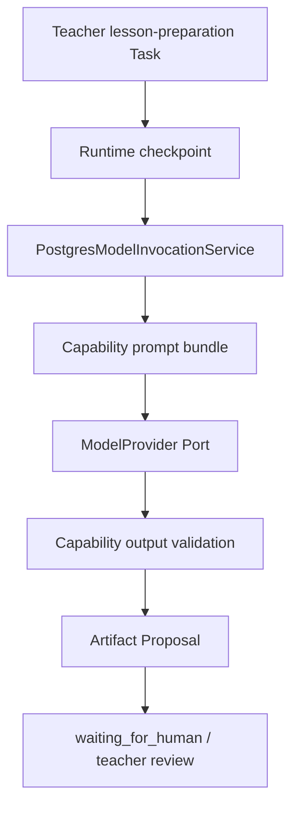

# Phase 5 Skill 现状审计

> 审计基线：`codex/phase5-versioned-skill-registry`，基线提交
> `397f08ff60b8bbeb125d7d4e3a2b2016e847195a`。
>
> 本文只记录 Phase 5 开始时的代码事实；目标设计在下一份 Phase 5 文档中固化。

## 1. 当前 Agent 能力定义在哪里

Lesson Preparation 能力目前不是一个独立、可装载的 Skill，而是分散在四个位置。

| 能力片段 | 当前代码位置 | 当前版本标识 |
|---|---|---|
| Agent 目的、允许的 Skill、Tool 与审批策略 | `apps/api/src/modules/agent-runtime-context/domain/runtime-kernel.ts` | `lesson-preparation-agent@1`、`lesson-preparation@1` |
| Prompt 描述、System Instruction、请求组装与一次修复 Prompt | `apps/api/src/modules/capability-integration/application/lesson-preparation-prompt-bundle.ts` | `prompt-bundle:lesson-preparation-ark@1` |
| 输出 JSON/Zod/Evidence/Scope/Policy 校验 | `apps/api/src/modules/capability-integration/application/model-output-validation.ts` | 隐含依赖输出 Schema 与代码提交 |
| 输出 Schema 与 DTO | `packages/contracts/src/gate2-6a.ts` | `teacher-copilot-suggestions@1` |
| 固定质量与故障评估样例 | `tests/fixtures/gate2-6a-model-evaluation-cases.ts` | 测试数据版本由 Git 提交表达 |
| Provider 调用、预算、Usage、重试与 Proposal 编排 | `apps/api/src/composition/postgres-model-invocation-service.ts` | 运行时读取 PromptBundle 与 ModelExecution 版本 |

`PostgresModelInvocationService` 直接导入 Prompt 组装和输出校验，并在创建请求、
修复、恢复和最终校验等多个阶段引用固定 PromptBundle。Runtime Kernel 创建
Lesson Preparation Run 时则从 `AgentDefinition.allowedSkillVersions[0]` 取值。
因此历史 Run 虽保存 `lesson-preparation@1` 字符串，却不能从统一注册表恢复该版本的
完整 Prompt、策略和评估定义。

## 2. 当前执行链

链路已经具备以下安全基础：

- ContextPlan 与 ContextManifest 已授权并封存；
- ModelProvider SDK 位于 Capability infrastructure，模型调用在事务外执行；
- JSON、Zod、Evidence、Lesson、Objective 与 Policy 校验 fail closed；
- Provider 失败可以 retry，AgentRun 有 checkpoint 和恢复计数；
- Runtime 只产生 Proposal，并不批准 TeachingPlan 或修改 Education 正式事实。

缺口是：Runtime 依赖一个字符串约定，Composition 依赖具体 Prompt/Validator，
而不是先装载不可变 SkillVersion 再执行。

## 3. 哪些属于 Runtime

以下能力与“如何可靠执行”有关，应继续由 Runtime Kernel 拥有：

- `AgentDefinition`、`AgentRun`、`RunStep`、Checkpoint 与 Recovery；
- Run 的状态转换、attempt、当前步骤和安全错误分类；
- `skillId`、`skillVersion` 与 Skill 内容 hash 的历史绑定；
- 通过 Loader Port 装载已发布 SkillVersion；
- ContextManifest、ModelExecution 与 Proposal ref 的执行记录；
- `waiting_for_human` 以及教师确认前不得进入正式状态的不变量。

Runtime 不应理解“一份好的备课建议包含什么”，也不应导入 Skill 的具体实现。

## 4. 哪些属于 Skill

以下能力与“Lesson Preparation 怎样完成”有关，应组成
`lesson-preparation@1`：

- 稳定的目的与输入约束；
- 允许读取的 Context 资源、字段掩码和 Evidence 数量/预算边界；
- PromptBundle 描述、System Instruction、用户消息组装和受控修复 Prompt；
- `teacher-copilot-suggestions@1` 输出 Schema 引用；
- JSON、Zod、Evidence、Scope、虚构事实与教师审批边界校验；
- Contract、Policy、Quality 与 Operation 四类 Evaluation 策略；
- Tool、Memory、Budget 与 Approval policy；
- 可计算且不可变的 Skill 内容 hash。

Skill 只读取 Runtime 提供的 Context 和 Capability Port，不访问 Repository、SQL 或
Platform Entity，不创建 approved TeachingPlan。

## 5. 哪些仍属于 Capability 与 Platform

Capability 继续拥有：

- ModelProvider Port 及 Mock、Fake Ark、Volcengine Ark Adapter；
- Provider 请求、响应、Usage、延迟、Request ID、预算与安全错误归类；
- ObjectStore 与未来 Tool Adapter。

Platform 继续拥有：

- Task、TaskWorkingSet、CourseRun、Lesson、Objective 与 Evidence 正式事实；
- Proposal 的正式创建与幂等；
- TeachingPlan 审阅、批准和 current approved；
- Authorization、Audit、Outbox 与模块状态所有权。

Skill 的 Validator 可以判断输出是否满足已授权 Context，但不能自行扩权或写入这些
正式状态。

## 6. 需要版本化的 Prompt、Schema 与 Validation

| 项目 | Phase 5 版本策略 | 原因 |
|---|---|---|
| Skill Manifest | `lesson-preparation@1` | 历史 Run 的首要解释单位 |
| Input Schema | 明确 ref 与解析器 | 防止调用方以非约定结构绕过 Context Policy |
| Output Schema | 引用 `teacher-copilot-suggestions@1` | 保持现有 API Contract 和 Zod 真值不变 |
| PromptBundle | 引用 `prompt-bundle:lesson-preparation-ark@1` | 保持真实 Ark、Fake Ark 和回归请求一致 |
| Context Policy | Skill 内容的一部分 | 字段和 Evidence 边界会影响模型可见内容 |
| Tool/Memory/Budget/Approval Policy | Skill 内容的一部分 | 执行安全边界必须随版本可解释 |
| Validator | Skill 内容的一部分 | 同一输出在不同校验规则下可能有不同结果 |
| Evaluation Policy | Skill 内容的一部分 | 质量门槛与运行指标需要随版本回放 |

Phase 5 不复制 Contracts 中的 Zod Schema，也不改变其 wire format。Skill 通过版本 ref
引用并复用现有 Schema，避免产生第二真值源。

## 7. 当前 Evaluation 基础

仓库已有 32 个固定、完全合成的 Lesson Preparation 评估案例，覆盖：

- Schema、必填字段和 fail-closed；
- Evidence 可追溯、CourseRun/Lesson/Objective 对齐；
- 不虚构事实与教师审批边界；
- 教学目标一致性、可操作性、完整性和明确未知项；
- timeout、retry、cancel、budget、repair；
- latency、tokens 与 estimated cost。

这些测试证明了策略，但尚未由 Skill Manifest 声明，也没有统一生成
Contract/Policy/Quality/Operation 评估摘要。Phase 5 应复用这些既有样例和校验器，
而不是创建另一套漂移的测试数据。

## 8. 直接依赖与风险

当前需要收口的直接依赖包括：

- Runtime Domain 硬编码 `allowedSkillVersions[0]`；
- Composition 直接导入 Lesson Preparation Prompt 和 Validator；
- Live Probe、Live Test、单元测试直接依赖旧 Capability application 文件；
- Runtime Checkpoint 只保存 `skillVersion`，没有独立 `skillId` 和 Skill 内容 hash；
- 发布状态、废弃状态、重复版本与不可变性没有统一规则；
- 运行结果只有校验成功/失败，没有结构化 Skill Evaluation 摘要。

直接一次性删除旧 import 会扩大回归面。低风险迁移方式是：

1. 在 `apps/api/src/agent/skills` 建立唯一 Skill 实现；
2. 旧 Capability application 文件暂时成为兼容 re-export；
3. Runtime 只依赖 Loader Port 和不可变绑定描述；
4. Composition 通过 Registry 取得 Skill，不再硬编码 Prompt/Validator；
5. 保持 API、UI、数据库和现有测试入口不变。

## 9. Phase 5 约束

- 43 个历史 Migration 不修改，也不新增 Skill 数据表；
- Skill Registry 首先采用进程内、代码版本化的最小实现；
- 不修改现有 HTTP Contract、UI 或教师审批流程；
- 不实现 Memory、向量检索、多 Agent、Skill Marketplace 或动态在线编辑；
- 只注册 `lesson-preparation@1`；可用测试证明 `@2` 能并存，但不发布虚构的新能力；
- 所有正式运行仍通过 Session、ActingContext、Repository、ContextManifest 与
  Platform Application Service。
