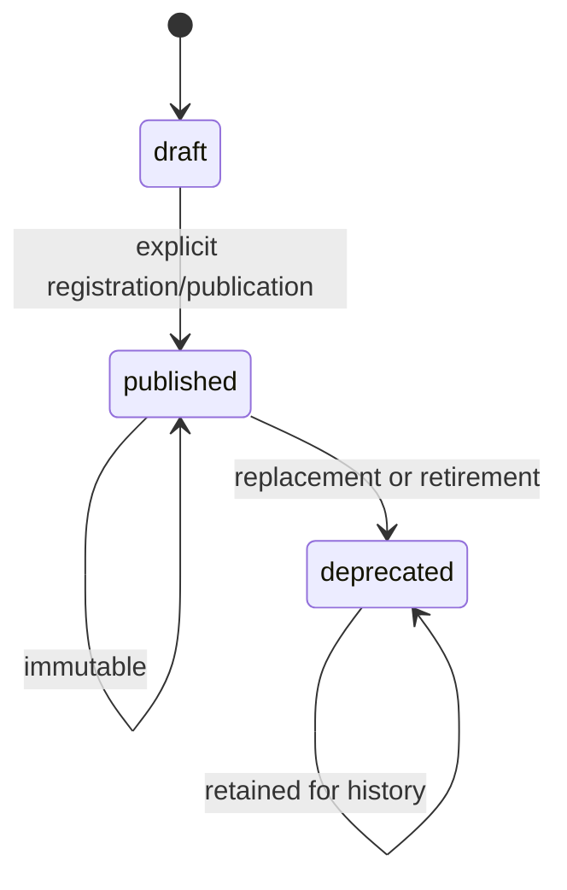
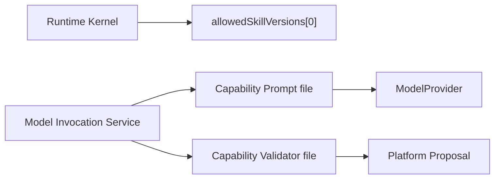
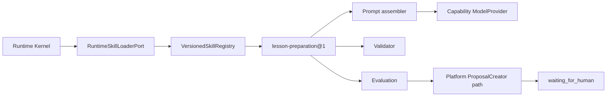
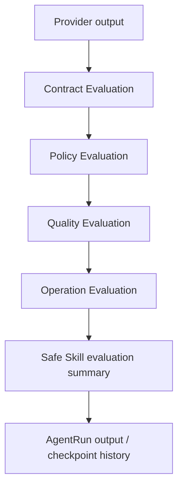

# Phase 5 Versioned Skill Registry 与 Evaluation 报告

> 实施分支：`codex/phase5-versioned-skill-registry`
>
> Phase 4 基线：`397f08ff60b8bbeb125d7d4e3a2b2016e847195a`

## 1. 完成结论

Phase 5 已把原先分散在 Runtime、Capability 与测试中的 Lesson Preparation 能力收口为
一个不可变、可装载、可评估的 `lesson-preparation@1`。新 AgentRun 精确记录 Skill ID、
version、ref 和 Manifest content hash；执行与恢复均按该绑定装载，不会静默切换到“最新”
版本。

本阶段没有修改 HTTP Contract、教师 UI、审批语义、数据库 Schema 或 43 个历史 Migration。
Runtime 仍只产生 Proposal 并进入 `waiting_for_human`，Platform 继续拥有 TeachingPlan 的
审阅和批准。

## 2. Skill 模型

实现位置：`apps/api/src/agent/skills`。

| 对象 | 职责 |
|---|---|
| `SkillManifest` | 绑定 ID、version、purpose、Schema refs、PromptBundle 与全部 policy |
| `VersionedSkillRegistry` | 注册不可变版本、唯一性检查、精确装载与历史读取 |
| `RuntimeSkillLoaderPort` | Runtime 取得不含 Skill 实现细节的绑定描述 |
| `LessonPreparationSkillVersion` | Prompt、Schema、Context policy、Validator 与 Evaluation 的强类型组合 |
| `RuntimeSkillIdentity` | Run Checkpoint 中保存的 ID/version/ref/content hash |

Manifest 内容 hash 覆盖：

- input/output schema refs；
- PromptBundle ref、version 和 content hash；
- Context、Tool、Memory、Budget、Approval 与 Evaluation policy；
- Skill 生命周期状态与 purpose。

可执行函数由 Git 提交版本固定；Run 通过 Manifest hash 核对其配置绑定。

## 3. Skill 生命周期



已实现规则：

- `(id, version)` 唯一，重复注册 fail closed；
- `draft` 与 `deprecated` 不能开始新 Run；
- `published` 和 `deprecated` 可以用于历史解释；
- Manifest hash 被篡改时拒绝装载；
- 新版本与旧版本并存，`lesson-preparation@2` 不能覆盖 V1；
- Phase 5 只正式注册 `lesson-preparation@1`，测试中的 V2 仅验证版本并存规则。

## 4. Runtime 与 Skill 边界

### 修改前



### 修改后



Runtime Domain/Application 不导入具体 Skill 目录。Loader Port 位于 Runtime application，
Registry 以结构化方式实现该 Port。Composition Root 创建内置 Registry 并注入执行服务。

Skill 禁止访问：

- PostgreSQL、Drizzle、SQL 与 Repository；
- Education/Artifact infrastructure；
- OpenAI/Ark SDK；
- sample-data 与 test-fixtures；
- Platform 正式状态写入。

## 5. Lesson Preparation Skill 实现

```text
apps/api/src/agent/skills/lesson-preparation/
├── manifest.ts
├── input-schema.ts
├── output-schema.ts
├── prompt.ts
├── context-policy.ts
├── validator.ts
├── evaluation.ts
└── index.ts
```

实现保持了既有生产行为：

- Input Schema 校验现有 Prompt 输入，缺少 CourseRun/Lesson/Objective 或 scope 不一致时
  fail closed；
- Output Schema 直接复用 Contracts 中的
  `teacher-copilot-suggestions@1`，没有复制 DTO；
- PromptBundle 继续使用原 ref、version、内容和 content hash；
- JSON、Zod、Evidence、CourseRun、Lesson、Objective、虚构事实和审批边界校验迁移到
  Skill 的唯一 Validator；
- 一次受控修复 Prompt 保持不变；
- Tool 与 Memory policy 均为 disabled；
- Approval policy 固定为 Proposal-only + human approval required。

原 Capability Prompt/Validator 文件只保留兼容 re-export，Live Probe、旧测试和其他稳定
调用方不需要一次性改名，也不会形成第二套实现。

## 6. Run 版本绑定与恢复

新建 Lesson Preparation Run 时：

1. Composition 选择精确 `lesson-preparation@1`；
2. Runtime 通过 Loader Port 只装载 published 版本；
3. AgentDefinition 校验该 ref 在允许列表内；
4. Checkpoint 保存 `skillId`、`skillVersion`、`skillRef` 与 `skillContentHash`；
5. RunManifest 和 ModelExecution input summary 同时保存 Skill hash；
6. Request hash 包含 Skill ref/hash。

Worker 恢复 ModelExecution 时：

- 按 input summary 的精确 ref 读取 published 或 deprecated 历史版本；
- 校验 Manifest hash；
- 校验 PromptBundle ref/version 与 output schema；
- 任一不匹配即停止，不回退到其他 Skill；
- Phase 5 以前、尚未保存 Skill hash 的 V1 运行仅按原 PromptBundle ref/version 做明确的
  兼容解析，不使用“latest”。

## 7. Evaluation 流程



### Contract

- 单一、无 Markdown 污染的 JSON；
- Zod Schema 和必填字段；
- 结构错误阻止 Proposal。

### Policy

- EvidenceRef 授权；
- CourseRun/Lesson/Objective scope；
- 不虚构学生、成绩或课堂事实；
- 不绕过教师审批；
- Policy 错误阻止 Proposal。

### Quality

- 明确 known gaps 和 uncertainty；
- 至少一个可操作 teaching move；
- 明确 follow-up evidence；
- 当前是确定性、可解释检查；`needs_review` 不替代教师判断，也不降低阻塞校验。

### Operation

- latency；
- input/output/total tokens；
- attempt count；
- estimated cost；
- 缺失指标标记 `incomplete` 或 `not_recorded`，不伪造通过。

成功的 Lesson Preparation ModelExecution 会把安全 Evaluation 摘要写入 AgentRun output；
完整 Prompt、响应、Secret 和隐藏推理不会写入摘要。

## 8. 测试与证据

| 验证 | 结果 |
|---|---|
| `corepack pnpm install --frozen-lockfile` | 通过，6 个 workspace，lockfile 无变化 |
| `corepack pnpm typecheck` | 通过 |
| `corepack pnpm test:unit` | 13 文件，62 项通过 |
| `corepack pnpm test:architecture` | 13 文件，77 项通过 |
| `corepack pnpm test:migrations` | 1 项通过，43 个 Migration 注册完整 |
| `corepack pnpm test:e2e` | HTTP E2E 5 项通过 |
| `corepack pnpm test:static` | 1,432 项静态断言通过 |
| `corepack pnpm test:postgres` | 17 文件，96 项通过 |
| `corepack pnpm test:playwright` | 20 项通过 |
| `corepack pnpm test:ark-fake` | 1 项通过，timeout/retry/429/repair/cancel 恢复链通过 |
| `corepack pnpm build` | API/Web/Contracts/Sample/Test Fixtures 全部通过 |
| `corepack pnpm test:secrets` | 444 个文件通过，无 Secret 泄漏 |
| `corepack pnpm verify:markdown-links` | 69 个 Markdown、144 个本地链接通过 |

新增测试证明：

- exact published load、draft/deprecated 规则、历史读取与不可变性；
- V2 并存而不覆盖 V1；
- duplicate ref 与 Manifest 篡改 fail closed；
- Contract/Policy/Quality/Operation Evaluation；
- Skill 不访问 Repository、SQL、Provider SDK、sample/test fixture；
- Runtime 只依赖 Loader Port；
- PostgreSQL 中 Run 绑定完整，Evaluation 摘要持久化；
- 原 Proposal、刷新恢复、教师审批、文件、作业、Reflection 与身份流程均保持。

所有 PostgreSQL/Playwright 套件使用并清理独立临时 Volume/ObjectStore，开发状态未改变。

## 9. 保持不变的边界

- 43 个历史 Migration 未修改；
- `packages/contracts` 未修改；
- `apps/web` 未修改；
- API wire format 未修改；
- ModelProvider、真实 Ark、Fake Ark 与 Mock 行为未改；
- TeachingPlan、Evidence、GradeDecision、LessonDelivery 与 Reflection 所有权未改；
- Teacher workflow 仍为 Proposal → 教师审阅 → Platform 正式命令。

## 10. 剩余限制

- Registry 当前随代码发布，不支持数据库管理、在线编辑或管理 UI；
- 只实现 Lesson Preparation Skill，Reflection 尚未迁移为 SkillVersion；
- Evaluation 是确定性规则，没有离线基准结果持久化或版本比较面板；
- Phase 5 不实现 Tool Skill、Memory、向量检索或多 Agent；
- 历史 Phase 5 前 Run 没有 Skill content hash，只能按原 PromptBundle 做兼容解释；
- `waiting_for_human` 到 Runtime `succeeded` 的正式批准回写仍沿用 Phase 4 的后续整合边界，
  本阶段未改变审批流程。

## 11. Phase 6 Memory 准备事项

Phase 6 可以在当前边界上继续，但应先完成以下设计，不应直接让 Skill 查询数据库：

1. 区分 Working、Task、Episodic、Semantic Memory 与教师确认 Profile；
2. 定义哪些内容自动产生、哪些必须教师确认、哪些禁止存储；
3. 建立 MemoryRetriever Port，由 Context Engineering 调用，而不是 Skill 直连 Store；
4. 把授权、provenance、版本、字段掩码和 token budget 写入 ContextManifest；
5. 建立检索、去重、压缩与失效的确定性评估；
6. 通过新的 SkillVersion 显式启用 Memory，绝不改变
   `lesson-preparation@1` 的 disabled policy；
7. 保持 Platform 正式事实与 Memory 推断分离，教师仍拥有最终控制权。

Phase 5 已为 Phase 6 提供稳定入口，但不应在未完成上述授权和数据生命周期设计前存储
个性化推断。
