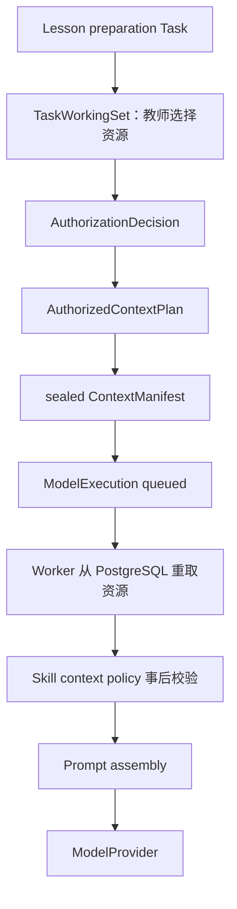

# Phase 6 Context 与 Memory 现状审计

> 审计基线：`6eeb4aefaef7eb2e74fd4d44105112e2bcd43de9`  
> 范围：只审计 lesson-preparation Skill、Runtime Context 和 personalization 边界；不修改 UI、API Contract、Migration 或教师工作流。

## 1. 当前 Context 如何生成

当前 lesson preparation 执行链已经具备可靠的选择、授权和封存步骤，但还没有独立的 Context Builder：

### 已存在的职责

| 对象/代码 | 当前职责 | 真值位置 |
|---|---|---|
| `TaskWorkingSet` | 保存教师为任务选择的 CourseRun、Unit、Lesson、Objective、Evidence 和来源对象 | `work` Schema |
| `AuthorizedContextPlan` | 固化本次运行被允许读取的 refs、field mask、授权决定和工作集版本 | `runtime` Schema |
| `ContextManifest` | 固化实际运行关联的资源 refs、Evidence refs、unknowns 和请求摘要 | `runtime` Schema |
| `AgentRunCheckpoint` | 保存 ContextPlan/Manifest hash、token budget、Skill 版本和执行步骤 | `runtime` Schema |
| `loadPromptContext` | Worker 依据已封存 refs 从 owning repositories 重建输入 | Product composition service |
| `lessonPreparationContextPolicy` | 校验 CourseRun、Lesson、Objective 和 Evidence refs 与请求一致 | Versioned Skill |

每次执行都从服务端会话产生的 ActingContext 和本次任务授权开始。浏览器不能提交 tenant、actor 或角色来扩大范围；Evidence 只按 `ContextManifest.evidenceRefs` 读取。

## 2. 当前哪些信息进入模型

lesson-preparation@1 当前输入包括：

- 教师请求文本、purpose 和 request version；
- CourseRun 的学科、年级、班级和学期；
- CurriculumUnit 标题与描述；
- Lesson 标题、顺序和时长；
- 当前 Lesson 的 LearningObjectives；
- 明确 revision 对应的 approved TeachingPlan 内容；
- 本次授权的 Observation/Claim 摘要、状态和 unknowns；
- Evidence gaps；
- InteractionContract 的策略版本和限制；
- TaskWorkingSet 的版本、purpose、field mask 和有限来源 refs；
- ContextManifest ref；
- 输出 Schema、教师审批边界和 Scope refs。

模型没有直接数据库访问，也不能从 Skill 访问 Repository。完整 Prompt/响应不写入 Audit 或普通日志。

## 3. 当前缺失的信息

现有 ContextManifest 能证明“关联了哪些 refs”，但不能完整解释“为什么选择、如何压缩、消耗多少”：

- 每个资源的类型、版本、内容 hash 和 provenance；
- resource 被包含、压缩或排除的原因；
- ContextPlan 的 actor、tenant、resource types、time range 和具体 token budget；
- 每一段上下文的估算 token；
- 排序分数及稳定的 tie-break 规则；
- 压缩算法及版本；
- required resource 缺失与 optional resource 排除的清晰区分；
- Context 命中价值与越权/过量读取 Evaluation；
- 经教师确认的偏好引用（当前不存在正式偏好存储）。

## 4. 当前 Token 浪费点

| 浪费点 | 影响 | Phase 6 处理 |
|---|---|---|
| Course/Lesson/Objective refs 在 request、scope、working set 和 payload 中重复 | 固定开销随每次运行重复 | Builder 保留协议必需字段，但按 section 计量并避免额外重复扩展 |
| 所有授权 Evidence 摘要原样进入，无排序和长度上限 | Evidence 较多时输入线性增长 | 以教师选择顺序和 Skill policy 排序，确定性压缩摘要 |
| approved TeachingPlan 总是完整序列化 | 长计划占用预算且难解释 | 以字段 mask 提取 Skill 需要的结构，记录压缩 hash；本版本保持 Schema 兼容 |
| Unit 描述、unknowns 和重复空白未规范化 | 低价值字符进入模型 | 标准化空白、稳定去重、按 section 上限压缩 |
| Budget 只在最终 Prompt 上判断 | 无法知道哪个资源消耗预算 | Builder 先估算各 section，再由现有 ModelBudgetPolicy 做最终硬限制 |
| Context policy 在 retrieval 之后才执行 | 发现越权过晚 | Builder 要求带 authorization proof 的 plan，并在组装前 fail closed |

Token 估算只能作为确定性规划指标，真实 Usage 仍以 Provider 返回值为准。

## 5. Evidence Retrieval 审计

当前 Worker 先按 CourseRun 获取教师 Copilot read model，再只映射 `ContextManifest.evidenceRefs`。这保证未选择的 Evidence 不进入最终输入，但读取范围仍比最终使用范围宽。Phase 6 不改 Repository/API；Builder 会再次比较：

1. Teacher request selected refs；
2. AuthorizedContextPlan authorized refs；
3. ContextManifest actual refs；
4. 已取回 snapshot refs。

任一不一致均 fail closed。未来可以增加按 refs 精确读取的 Platform Facade，但它不是本轮前置条件。

## 6. Memory 现状与边界

`personalization-memory-analytics` 当前只有 Schema boundary 和早期 `PersonalizationCandidateSink` 骨架；`personalization` Schema 没有业务表。Work 的 snooze/pin preference 是工作台显示偏好，不能复用为教学偏好；TaskWorkingSet 是任务选择，也不能升级为长期 Memory。

### 允许作为 Memory 的内容

- 教师偏好候选，例如“希望教案更简洁”“偏好用案例引入”；
- 可撤销、可过期、带来源的 episodic candidate；
- Runtime working memory 的执行摘要；
- Task 生命周期内的 task memory；
- 为检索服务的引用和 hash，不复制 Platform 事实。

### 禁止作为 Memory 的内容

- Course、Lesson、TeachingPlan、Evidence、GradeDecision 或 LessonDelivery 的副本真值；
- 未确认的 Agent 推断作为长期教师偏好；
- 一次课堂或作业推断出的长期学生能力标签；
- 未授权的学生内容、完整 Prompt、完整模型响应或隐藏推理；
- 通过 Memory 绕过当前 Session、Membership、CourseRun scope 或 field mask。

### 本阶段持久化裁决

本轮明确禁止修改 Migration，而当前没有 Memory 表。因此 Phase 6 实现可执行的 `MemoryCandidate`、`TeacherPreference` 领域模型、Repository Port 和内存 Adapter，用于验证生命周期与边界；它不会被 Product Composition Root 当作持久化真值。正式持久化必须在后续经评审的前向 Migration 中完成，不能把候选塞入 Runtime/Work JSON 冒充长期 Memory。

## 7. 审计结论

现有授权和封存基础可复用，不需要重写 Runtime 或 Contracts。Phase 6 的最小安全增量是：

1. 在 lesson-preparation Skill 与已授权 Platform snapshots 之间加入纯 Context Builder；
2. 生成可解释的 engineering manifest，并随 AgentRun 执行输出保存安全摘要；
3. 增加 Context Evaluation，校验授权、关键资源、预算和命中价值；
4. 在 personalization 模块建立候选/确认领域边界，但不创建第二事实库；
5. 用架构测试阻止 Context 绕过 Authorization、Skill 访问 Repository、Memory 修改 Platform。
