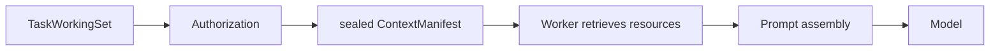
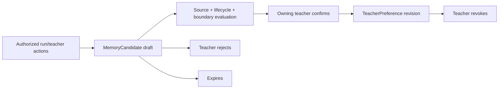

# Phase 6 Context Engineering、Memory 与 Personalization 报告

> 工程状态：完成
>
> 基线：`codex/phase5-versioned-skill-registry` / `6eeb4aefaef7eb2e74fd4d44105112e2bcd43de9`
>
> Phase 6 分支：`codex/phase6-context-memory`

## 1. Context Architecture

### 修改前



已有链路能够封存 refs，却没有独立的排序、压缩、Token 规划和 Context Evaluation。Skill policy 在资源取回后做一致性检查，ContextManifest 不能解释每个资源的 version/hash/provenance 和排除原因。

### 修改后


新增 Context Builder 位于 Versioned Skill 内，是纯函数边界，不 import Repository、PostgreSQL 或 Provider SDK。Composition Service 只负责通过现有 owning adapters 取得已授权 snapshots 并传入 Builder。

## 2. Skill 与历史兼容

- `lesson-preparation@1` 保持不变并继续支持历史 Run 恢复；
- 新运行默认绑定 `lesson-preparation@2`；
- v2 使用 `lesson-preparation-context-policy@2` 和 `lesson-preparation-context-builder@1`；
- Runtime AgentDefinition v2 同时允许历史 v1 和当前 v2；
- Run/Checkpoint 继续记录 skill id、version、ref 和 manifest hash；
- PromptBundle、输出 Schema、API Contract 和教师审批语义未改变。

## 3. 可解释 Context Manifest

AgentRun output 中的安全 engineering manifest 记录：

- Builder/schema 版本；
- ContextManifest ref、AuthorizationDecision ref 和 WorkingSet version；
- field mask 和 time range；
- included resource 的 ref、type、version、content hash、provenance、estimated tokens 和 compression；
- excluded information 及原因；
- missing information；
- planning token budget、分段 token 估算、总估算和 estimator 版本；
- manifest content hash。

它不记录完整 Prompt、完整 Evidence、完整 TeachingPlan 或模型响应。真实 Provider Usage 仍是最终 Token 真值；`unicode-char-estimator@1` 只负责调用前规划。

## 4. Token 优化基础

首版采用确定性、可复现、无需二次模型调用的处理：

- Unicode 规范化和空白折叠；
- teacher request、Unit description、Objective description、TeachingPlan 文本、Evidence summary 和 unknowns 的分段上限；
- Evidence gaps 稳定去重；
- required resources 不因预算静默丢弃；
- 超过预算时在 Provider 调用前 fail closed；
- 纯预算失败仍使用既有 `budget_exceeded / BUDGET_EXCEEDED` wire semantics。

本轮没有引入向量检索、模型压缩调用或隐式全班 Evidence 查询。

## 5. Context Evaluation

`lesson-preparation-context-evaluation@1` 在模型调用前检查：

| 维度 | 检查 |
|---|---|
| Authorization | decision ref、actor/tenant、selected/authorized/sealed/retrieved Evidence 一致 |
| Completeness | CourseRun、Unit、Lesson、Objective、approved TeachingPlan 和当前 WorkingSet |
| Minimization | duplicate refs 和被压缩/排除信息 |
| Budget | 分段与总估算不超过 Runtime input budget |
| Value | 教师选择 Evidence 的命中数量与 hit rate |

Authorization、Completeness、Budget 或 Value 阻断时不调用 Provider；重复 ref 作为 minimization review signal，不破坏历史可兼容输入。

## 6. Memory Architecture



### 分类与所有者

| 分类 | 所有者 | 说明 |
|---|---|---|
| Working Memory | Runtime | 单次 Run 的 checkpoint/output 摘要 |
| Task Memory | Work | TaskWorkingSet、TaskRun 和任务 history |
| Preference Candidate | Personalization | 可确认、拒绝、过期的教师偏好候选 |
| Episodic Candidate | Personalization | 带来源的经验摘要候选，不自动转长期事实 |

### MemoryCandidate

实现字段包括 candidate ref、teacher/tenant owner、type、结构化 summary、source refs/version/hash/provenance、confidence、proposedBy、created/expires time、status、revision 和 content hash。

生命周期为：

```text
draft -> confirmed
draft -> rejected
draft -> expired
```

已确认、拒绝或过期的 Candidate 不可原地编辑。expected version 冲突 fail closed；所有 revision 由 Repository Port 保留历史。

## 7. Personalization Flow

首个闭环只允许教师偏好：

1. Agent 或教师根据可追溯来源提出 Preference Candidate；
2. Candidate 始终以 `draft` 开始；
3. owner 之外的用户不能确认或拒绝；
4. owning teacher 显式确认后才创建 active `TeacherPreference` revision；
5. Preference 保存 source candidate ref/hash；
6. owning teacher 可撤销，旧 revision 保留；
7. 本阶段不会自动把 Preference 注入模型 Context。

Phase 6 显式禁止 learner owner，不建立 StudentProfile 或 LearnerStateEstimate。

## 8. Memory Evaluation

`memory-candidate-evaluation@1` 检查：

- 来源 ref、version、hash 和 provenance；
- draft 是否达到 expiresAt；
- preference/episodic 的结构边界；
- teacher owner，拒绝 learner-owned memory；
- confidence，并把低置信标记为 `needs_review`；
- content hash 完整性。

Memory Service 没有 Course、Lesson、TeachingPlan、Evidence 或 GradeDecision 写端口。

## 9. 数据与持久化边界

- Platform 继续是 Course、Lesson、TeachingPlan、Evidence 和 GradeDecision 的唯一事实源；
- Context Builder 只消费已经授权的 snapshots；
- Context engineering manifest 使用现有 Runtime AgentRun JSON output 保存安全摘要；
- `MemoryCandidateRepository` 是 Personalization Application Port；
- In-memory Adapter 只用于领域/应用测试，Product Composition Root 明确不装配；
- 本阶段未新增 Migration，因此 MemoryCandidate/TeacherPreference 不是跨重启产品能力；
- 未来启用需要前向 Migration、PostgreSQL Adapter、Authorization/Audit 和教师同意交互，不能把 Runtime/Work JSON 当第二事实库。

## 10. 验证结果

| 验证 | 结果 |
|---|---|
| TypeScript | PASS，全部 workspace |
| Unit | PASS，15 files / 72 tests |
| Architecture | PASS，14 files / 82 tests |
| PostgreSQL | PASS，17 files / 96 tests |
| Default Playwright | PASS，20/20 |
| Fake Ark Playwright | PASS，1/1 |
| Production Build | PASS，全部 workspace |
| Migration | 43 个历史 SQL，未修改 |
| API Contract | 未修改 |
| Web/UI | 未修改 |

曾尝试并行启动默认/Fake Ark 两套 Playwright，但两个本机编排器会争用预览进程控制，导致 Web/API 被另一套清理流程提前终止。该次结果不作为产品失败；随后严格串行重跑，默认 20/20、Fake Ark 1/1 全部通过，隔离数据库 Volume 和 ObjectStore 均清理，开发状态未变化。

## 11. 剩余事项与 Phase 7 准备

Phase 6 已达到本阶段定义：Skill-aware Context Builder、可解释 manifest、Context/Memory Evaluation、Memory Candidate 和教师确认 Preference 基础均存在，并且没有把 Memory 变成第二事实源。

进入 Production Deployment + School Pilot 前仍需：

- 经评审的 Personalization 前向 Migration 和 PostgreSQL Adapter（若试点启用偏好）；
- 教师查看、确认、拒绝和撤销偏好的产品交互；
- preference 注入 Context 前的单独 field mask、授权和 Token policy；
- 正式 OIDC、Secret Manager、托管 PostgreSQL/ObjectStore、监控、备份和数据治理；
- 远程 E2E、容量/成本基线和学校试点 Runbook。

这些事项不应回填到本轮或修改历史 Migration。
