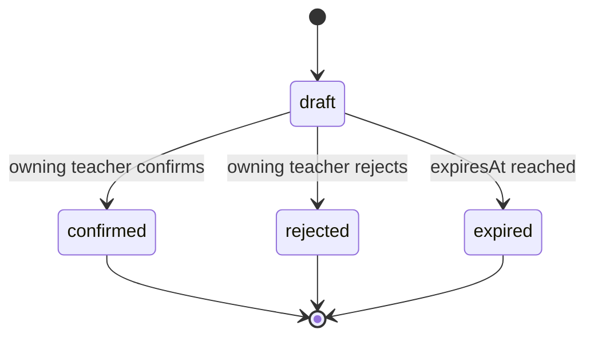
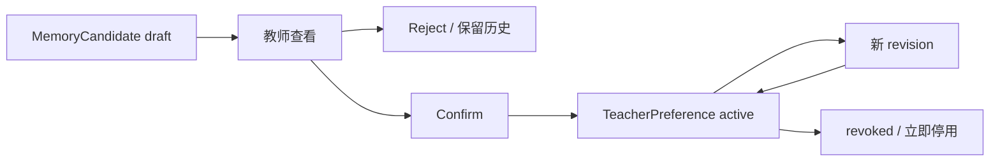
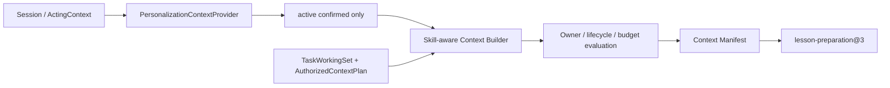

# Phase 7A Memory Persistence 与 Personalization 产品化报告

> 工程状态：完成并通过本地全回归，等待人工审阅  
> 基线：Phase 6 `2441b4bcbc4654774482d161353bb7b6605c130d`  
> 分支：`codex/phase7a-memory-productization`

## 1. 数据库设计

Phase 7A 在既有 `personalization` Schema 中增加第 44 个前向 Migration：

| 表 | 职责 | 可变性 |
|---|---|---|
| `memory_candidate` | 当前候选状态、owner、来源、置信度和生命周期 | 只允许受控状态转换 |
| `memory_candidate_revision` | 每次候选状态版本 | UPDATE/DELETE 被触发器拒绝 |
| `teacher_preference` | 当前教师偏好、来源 Candidate 和 active/revoked 状态 | expected-version 受控更新 |
| `teacher_preference_revision` | 确认、修改、撤销的完整历史 | UPDATE/DELETE 被触发器拒绝 |

当前行也禁止物理 DELETE。产品中的“删除”映射为 reject 或 revoke，以便权限、来源和审计仍可追溯。旧 43 个 Migration 未修改、未改序；迁移注册表当前为 44 项。

回滚策略不是执行破坏性 down migration：发布前先备份；若应用版本需要回退，先停止新写入、恢复升级前快照并部署旧版本；已产生正式偏好数据时使用新的 forward-fix Migration 修正，而不删除/改写历史 Migration。

## 2. Memory 生命周期

- Candidate 始终先是建议，不是长期偏好事实；
- 来源 ref/version/hash/provenance、owner、confidence 和 content hash 均持久化；
- 同一幂等键不同 payload fail closed；
- confirmed/rejected/expired Candidate 不原地改写；
- episodic candidate 仍是候选，不自动形成长期教师或学生画像。

## 3. Preference 流程

设置页“Agent 偏好”支持：

- 查看 AI/教师提出的候选；
- 明确确认或忽略；
- 修改已确认的值并产生新 revision；
- 删除并撤销，保留历史但停止使用；
- 刷新、重新登录和服务重启后恢复。

教师手动记录也先形成 Candidate，不能绕过确认步骤直接写 active preference。

## 4. Context 集成

新 lesson preparation Run 绑定 `lesson-preparation@3`；已发布的 @1/@2 保留，不覆盖历史 Run。

规则：

- Repository 查询必须同时匹配 tenant 和 teacher；
- Candidate、rejected、expired、revoked preference 不会由 Context Port 返回；
- Builder 再次检查 owner scope、按 key 去重，并在 token budget 内选择；
- `teacher-preference-evaluation@1` 在 Context 查询出口复核来源、owner 和 active/revoked 生命周期；
- Preference 只影响建议的表达、组织和详细程度，不能改变 Evidence、教学事实或审批；
- manifest 只记录 ref/key/version/hash/source/token，不保存完整偏好值；
- Context Evaluation 记录 owner、lifecycle、minimization、budget 和使用数量。

## 5. 安全边界

- Personalization Domain/Application 不依赖 PostgreSQL；Repository 通过 Port + Adapter；
- Skill 不访问 Repository、SQL 或 Platform Entity；
- Memory 没有 Course、Lesson、TeachingPlan、Evidence 或 GradeDecision 写端口；
- API 的 tenant/teacher 只来自服务端 Session/ActingContext；
- School A 无法读取 School B 的 Candidate/Preference；
- physical delete、revision overwrite、跨 owner 确认和版本冲突均 fail closed；
- Audit 只保存必要 refs/hash/状态，不记录 Secret、完整 Prompt 或隐藏推理。

## 6. 自动化证据

| 验证 | 结果 |
|---|---|
| TypeScript | PASS，全部 workspace |
| Unit | PASS，15 files / 75 tests |
| Architecture | PASS，14 files / 83 tests |
| Migration registry | PASS，43 historical + 1 Phase 7A |
| PostgreSQL | PASS，18 files / 98 tests；含 restart/revoke/tenant isolation |
| Default Playwright | PASS，21/21；含确认、修改、刷新恢复和撤销 |
| HTTP E2E | PASS，1 file / 5 tests |
| Static assertions | PASS，1515 assertions |
| Secret Scan | PASS，468 files |
| Fake Ark Playwright | PASS，1/1；timeout/retry/429/repair/cancel 可恢复 |
| Production Build | PASS，全部 workspace |
| Bundle Analysis | PASS；initial 810.1 KiB raw / 262.8 KiB gzip |

Playwright 截图输出到被忽略的测试证据目录；隔离 PostgreSQL Volume 和 ObjectStore 在测试后均被清理，开发状态未变化。

## 7. 明确未实现

- 学生长期画像、自动能力标签或自动人格分析；
- 向量数据库、语义检索或 Memory marketplace；
- 多 Agent、Skill marketplace 或自动发布偏好；
- 未确认 Candidate 入模；
- Preference 对正式业务状态的直接修改；
- 完整偏好 taxonomy、批量导入或管理员代替教师确认。

Phase 7A 将 Memory 变成可见、可撤销、可审计的教师能力，而不是隐藏状态；Platform 继续是所有教育业务事实的唯一来源。
