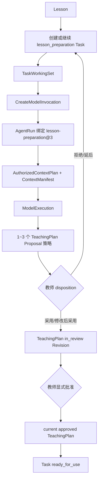

# Phase 8A-2 Lesson Brief → Lesson Preparation 现状审计

## 审计范围

本审计以当前仓库 `1f599e9` 为事实来源，检查了：

- `lesson-preparation@1`、`@2`、`@3` 及 Versioned Skill Registry；
- Lesson Brief 生成、教师处置和 `TaskWorkingSet` 写入；
- Model Invocation、AgentRun、ContextPlan、ContextManifest 与 Proposal 落库；
- Proposal disposition、TeachingPlan `in_review` 与显式批准；
- Teaching Workspace、Agent/Copilot 和 TeachingPlan 页面；
- 相关 Contracts、PostgreSQL Repository 和既有测试。

本阶段不改变 Lesson、TeachingPlan、Task、Proposal 或审批状态的所有权。

## 1. 当前备课流程

当前正式模型链路由 `PostgresModelInvocationService` 负责创建和恢复执行。它在创建时：

1. 锁定并校验 Lesson Preparation Task 及 expected version；
2. 校验请求与当前 `TaskWorkingSet` 的 Objective、Evidence 和版本完全一致；
3. 读取 Lesson、Unit、CourseRun、approved TeachingPlan 基线和授权 Evidence；
4. 封存 `AuthorizedContextPlan` 与 `ContextManifest`；
5. 创建绑定固定 SkillVersion 的 AgentRun / ModelExecution；
6. Worker 重建同一上下文、调用模型、校验输出，并保存 Proposal；
7. 将 Task 推进至 `awaiting_plan_review`，但不批准计划。

Proposal 已支持 1~3 个策略。每个策略已有标题、摘要、依据、适用条件、风险条件、教学动作、练习/后续 Evidence 和完整 `proposedPlanChanges`；同时保存相对 approved 基线的 diff。

教师处置边界已经正确：

- `rejected` / `deferred` 不创建 TeachingPlan Revision，并把待审核 Task 返回 `in_progress`；
- `accepted` / `accepted_with_changes` 只创建 `in_review` Revision；
- 只有独立的 `approveTeachingPlan` 命令才能成为 approved，并把 Task 推进为 `ready_for_use`；
- Proposal disposition 明确记录 `implementationObserved: false`，不会把建议冒充课堂实施事实。

## 2. 当前 Skill 输入与版本

| SkillVersion | 输入版本 | Context | Personalization | 历史用途 |
|---|---|---|---|---|
| `lesson-preparation@1` | `lesson-preparation-input@1` | 旧封存上下文 | 无 | 可解释、可恢复 |
| `lesson-preparation@2` | `lesson-preparation-input@1` | Context Builder v1 | 无 | 可解释、可恢复 |
| `lesson-preparation@3` | `lesson-preparation-input@2` | Context Builder v2 | confirmed active TeacherPreference | 当前默认版本 |

`@3` 当前输入包括：

- TeacherTaskRequest；
- CourseRun、CurriculumUnit、Lesson；
- LearningObjectives；
- current approved TeachingPlan 基线；
- 教师在 `TaskWorkingSet` 中明确选择并授权的 Evidence；
- Evidence gaps；
- InteractionContract；
- WorkingSet version / purpose / field mask /部分来源；
- 当前教师已确认且未撤销的 Preference。

Runtime 在 ModelExecution 的 `inputSummary` 中保存 `skillRef` 与 `skillContentHash`，恢复时通过 `loadHistoricalLessonPreparationSkill` 读取原 SkillVersion。因此新增版本不需要、也不得覆盖 `@1~3`。

## 3. Lesson Brief 缺失位置

Phase 8A-1 已完成的采用流程会：

1. 将 Lesson Brief Snapshot 标记为 `adopted`；
2. 保存教师选中的 `candidateIds`；
3. 将 `lesson-brief-run:<agentRunRef>` 追加到当前 TaskWorkingSet 的 `sourceResourceRefs`；
4. 下一次 Model Invocation 会把该 ref 封存到 AuthorizedContextPlan 和 ContextManifest。

但当前链路只封存了一个不透明 ref，尚未真正消费 Lesson Brief：

- `lesson-preparation@3` 的输入 Schema 没有 `confirmedLessonBrief`；
- Worker 重建 Skill 输入时没有解析 adopted Brief Snapshot；
- Skill 的 `taskWorkingSet` 输入没有携带 `sourceResourceRefs`；
- Context Builder 不校验 Brief 的 tenant、teacher、Lesson、状态或 content hash；
- ContextManifest 虽含 Brief run ref，但没有记录所选候选、Brief hash 与来源版本；
- Prompt 不知道教师确认了哪些教学重点、难点、关注点和 known gaps；
- 因此“采用教学洞察”目前只能影响 Journey 展示，不能影响生成方案。

这是本阶段最核心的断点。

## 4. 当前页面断点

Teaching Workspace 已能显示 Lesson Brief 和 Journey，但 Plan 阶段仍分散在三个页面：

- “继续形成方案”会创建/启动 Task 后跳转 Agent；
- Agent 页面创建 Model Invocation 并等待执行；
- Proposal 生成后跳转 Copilot 页面审阅；
- 采用后再到 TeachingPlan 页面批准。

现有 Copilot 页面已经拥有成熟的多策略选择、diff、拒绝、延后、采用和教师修改能力，应复用其 API 与产品语义。当前缺少的是课时页内的紧凑 Proposal Compare 与一句话调整入口，而不是另一套 Proposal 编辑器。

## 5. 必须保持不变的对象与边界

| 对象 | Owner | 本阶段处理 |
|---|---|---|
| Lesson / Objective / Evidence | Education | 只读，不写入 Lesson Brief 或 Proposal 选择 |
| lesson_preparation Task / TaskWorkingSet | Work | 继续拥有流程和显式上下文选择 |
| AgentRun / ContextManifest / ModelExecution | Runtime / Capability | 保持 Kernel；仅绑定新 SkillVersion 与更完整的可解释上下文 |
| Proposal / Draft / TeachingPlan Revision | Artifact | 继续使用现有 Artifact 与 Revision 历史 |
| SuggestionDisposition | Work | 继续作为教师的正式处置决定 |
| approved TeachingPlan | Artifact + Platform Application Service | 只能通过现有显式批准命令产生 |
| TeacherPreference | Personalization | 仅 confirmed active 偏好可进入上下文 |

本阶段不得新增第二套 Lesson Brief 表、Proposal 表、TeachingPlan 状态或前端状态机。

## 6. 审计结论

最小且安全的实现路线是：

1. 发布不可变的 `lesson-preparation@4`；
2. 由服务端从已封存的 `lesson-brief-run:*` 解析并验证 adopted Brief；
3. 把教师所选候选、known gaps、class focus、source hash/version 注入新 Skill 输入；
4. Context Builder 将 Brief 作为独立、可追溯、授权且有 token 预算的输入；
5. Teaching Workspace 复用现有 Model Invocation、Proposal Detail、Disposition 和 TeachingPlan Approval API，补齐课时页内 Plan Journey；
6. 旧 Run 继续按原 SkillVersion 恢复，所有正式状态边界保持不变。

