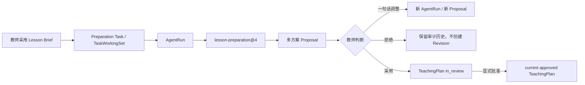

# Phase 8A-2 Lesson Brief → Lesson Preparation 实施报告

## 结论

Phase 8A-2 已把 Phase 8A-1 的教师确认 Lesson Brief 接入现有备课执行链，并保持正式状态边界不变：

Lesson Brief、Task、ModelExecution、Proposal 和 TeachingPlan 仍由各自既有模块拥有；Lesson Journey 只解释下一步，不写入第二套状态。

## 1. 闭环流程

1. `lesson-analysis@1` 生成 Lesson Brief Candidate；
2. 教师选择并采用关注点；
3. Brief 的不可变 AgentRun ref 写入现有 `TaskWorkingSet.sourceResourceRefs`；
4. Journey 返回 `plan.ready / generate_teaching_plan`；
5. Workspace 使用现有 Task 与 Model Invocation API 创建 AgentRun；
6. Runtime 通过 `lesson-preparation@4` 读取教师采用的 Brief、已确认偏好和已授权 Evidence；
7. Agent 生成同一个 Proposal Revision 下的多个方案；
8. 教师可拒绝、采用，或用一句话要求重新生成；
9. 采用只创建 `in_review` Revision；
10. 教师显式批准后，Revision 才成为 current approved。

刷新后页面重新读取 PostgreSQL 中的 Task、ModelExecution、Proposal 和 TeachingPlan State，不依赖组件数组恢复业务状态。

## 2. Skill 版本变化

新增并发布 `lesson-preparation@4`：

| 项目 | Phase 8A-2 |
|---|---|
| Skill ref | `lesson-preparation@4` |
| 输入契约 | `lesson-preparation-input@3` |
| PromptBundle | `prompt-bundle:lesson-preparation-ark@3` |
| Context Policy | `lesson-preparation-context-policy@4` |
| Context Builder | `lesson-preparation-context-builder@3` |
| AgentDefinition | `lesson-preparation-agent@4` |

Registry 继续保留 `@1`、`@2`、`@3`。已有 ModelExecution 仍按封存的 `skillRef` 与 PromptBundle 恢复；只有 TaskWorkingSet 恰好绑定一个教师已采用的 Lesson Brief 时，新执行才选择 `@4`，兼容入口仍使用 `@3`。

`@4` 新增的 `confirmedLessonBrief` 只包含：

- 教师实际选择的重点、难点和关注点；
- Brief content hash、来源 Skill、来源 ContextManifest 和版本向量；
- 与本次授权 Evidence 相交后的班级 Evidence 摘要；
- 已知信息缺口。

未选择、deferred、跨 Lesson、跨教师、跨学校或 hash 不一致的 Brief 均 fail closed。

## 3. Context 与 Proposal

新增 `ConfirmedLessonBriefProvider` 边界及 PostgreSQL 读取实现。Model Invocation 不直接信任前端 Brief 内容，而是根据 `lesson-brief-run:<agentRunRef>` 重新读取并校验不可变 Snapshot。

Context Engineering 记录：

- Brief ref、AgentRun ref、SkillVersion；
- Brief content hash 与原 ContextManifest hash；
- selected candidate ids；
- source version vector；
- token 估算；
- Brief 与 Evidence 授权评价。

Proposal Compare 展示每个候选的目标、课堂流程、活动、练习、风险、依据与已知缺口。页面不把候选复制成新的业务对象，也不把成功生成显示为已批准。

## 4. 教师调整体验

教师选择“说一句话调整”后，只需输入类似“这个班基础较弱，减少讨论，多做分步练习”的短指令：

1. 当前 Proposal 以 `deferred` 保留，note 记录调整意图；
2. Task 保持可继续状态；
3. 系统用同一已授权 WorkingSet 创建新的 AgentRun；
4. 新 Proposal 成功后替换当前比较卡，历史版本仍可在 Runs/Audit 中追溯。

“不采用本次方案”会清空当前页面的 Proposal/Execution 卡片并返回可重新生成状态，但不会删除服务端历史。已取消或已完成的历史备课任务不再被生成流程误当作当前开放任务；教师可以显式新建一轮备课。

## 5. 数据与审批边界

- Skill 不访问 Education/Artifact Repository；
- Runtime 只记录执行、Step、Checkpoint、Manifest 和 Proposal 生成过程；
- Lesson Brief 不写回 Lesson、Objective、Evidence 或 TeachingPlan；
- 未确认 Brief 不能进入 `@4` Context；
- Agent 不创建 approved TeachingPlan；
- rejected/deferred Proposal 不创建 in-review Revision；
- accepted Proposal 只创建 in-review Revision；
- current approved 只由现有 Platform Application Service 的显式 approve 命令产生；
- 课堂实施事实和备课完成状态均不由本流程自动修改。

本阶段没有新增或修改数据库 Migration。仓库仍有 45 个 Migration，且相对 Phase 8A-1 基线的 Migration diff 为零。API Contract 仅向 `LessonJourneyActionKind` 增加 `generate_teaching_plan`，既有路由和响应保持兼容。

## 6. 测试结果

| 验证 | 结果 |
|---|---|
| `pnpm install --frozen-lockfile` | 通过，6 个 workspace，lockfile 未变化 |
| `pnpm typecheck` | 通过 |
| `pnpm test:unit` | 18 files / 94 tests 通过 |
| `pnpm test:architecture` | 16 files / 93 tests 通过 |
| `pnpm test:postgres` | 21 files / 104 tests 通过 |
| `pnpm test:playwright` | 22 / 22 通过 |
| `pnpm test:ark-fake` | 1 / 1 通过 |
| `pnpm build` | 通过 |
| `git diff --check` | 通过 |

新增回归覆盖：

- `@1~4` Skill 历史与旧 Run 版本绑定；
- adopted Brief 选择最小化与 Manifest 记录；
- Brief/Evidence 未授权时 fail closed；
- 无 Brief 不提供新方案生成入口；
- adopted Brief 进入 `plan.ready`；
- rejected Proposal 不修改 current approved；
- accepted Proposal 只创建 in-review；
- explicit approve 才产生新的 current approved Revision；
- Workspace 多方案比较、一句话调整入口、拒绝后恢复；
- Phase 8A-2 与历史 Gate 2.5 连续运行不互相污染；
- Fake Ark 的 timeout、retry、429、repair failure 和 cancellation。

PostgreSQL、默认 Playwright 和 Fake Ark 均使用独立数据库 Volume 与 ObjectStore，结束后自动清理；开发数据未变化。pnpm store 为 `D:\03_Edu-Agent\.pnpm-store\v11`。测试报告默认写入项目内 `.local-data/test-output`，不会在 `D:\` 根目录创建缓存或测试产物。

生产构建中的 Teaching Workspace chunk 为 93.40 kB（gzip 27.78 kB）。

## 7. 当前保留的限制

- 本阶段沿用现有“基于 current approved TeachingPlan 形成修订 Proposal”的 Artifact 语义；尚无 approved baseline 的全新课时仍需要后续单独设计首版 TeachingPlan bootstrap，避免用虚构空计划冒充正式基线。
- 多方案由当前 Provider 输出能力决定；Mock/Fake Ark 保证确定性测试，真实 Ark 仍需独立 live 开关验收。
- 教材、课程标准和考点知识源仍未接入，Lesson Brief 的 known gaps 会继续明确这一缺口。

这些限制未通过前端假数据或隐式 fallback 掩盖。

## 8. 下一步建议

Phase 8A-3 可优先处理教学材料包：从已批准 TeachingPlan 生成 PPT/教案/练习候选，并继续保持“Agent 生成 Draft、教师确认、Artifact 管理版本”的边界。首版 TeachingPlan bootstrap 应作为一个独立、受测试保护的小阶段先行解决，而不是在材料阶段引入虚构 baseline。
