# Phase 8A-3 Material Bundle 建设报告

> 状态：IMPLEMENTED，等待产品人工验收
>
> 基线：Phase 8A-2 `2a0b07a`
> 范围：current approved TeachingPlan Revision → 教学材料草稿 → Artifact 版本 → 教师采用

## 1. Material Bundle 设计

`MaterialBundleProjection` 是 Artifact 模块提供的纯读取投影，不是新表，也不是第二套文件真值。它按 `lessonRef` 和 current approved TeachingPlan Revision 重建五个固定 item：

| kind | Artifact category | 当前产物 |
|---|---|---|
| `lesson_plan` | `lesson_plan` | 教案 Markdown；既有正式 DOCX export 可直接识别为 adopted |
| `slide_outline` | `courseware` | PPT 内容大纲 Markdown，不声称已经生成 PPTX |
| `exercise_set` | `assessment` | 课堂练习 Markdown |
| `board_design` | `reference` | 板书设计 Markdown |
| `differentiated_support` | `worksheet` | 分层支持材料 Markdown |

Bundle 状态为 `blocked_no_approved_plan`、`ready_to_generate`、`partially_ready`、`waiting_for_teacher` 或 `ready`；item 状态为 `missing`、`outdated`、`draft` 或 `adopted`。Projection 只解释 FileAsset、current FileVersion、binding 和 provenance，不写业务状态。

## 2. `material-generation@1`

新增不可变、可加载、可评估的 SkillVersion：

- manifest 固定 purpose、Context/Tool/Memory/Budget/Approval/Evaluation policy；
- input schema 只接受 current approved Revision、Lesson、已采用 Lesson Brief、confirmed Preference、已授权 Evidence 与本次 material requirement；
- output schema 只允许五类 `MaterialContentDraft`；
- Context Builder 记录 resource ref/version/hash/provenance、missing/excluded information 与 token estimate；
- Validator 验证请求 kind、来源引用、必需结构及未支持的权威知识声明；
- Evaluation 记录 contract、policy、quality 和 operation 结果。

本阶段使用确定性内容生成器以稳定验证 Skill/Artifact 边界；它不伪装真实 Office 文件，也没有改写 Runtime Kernel。后续可在同一 SkillVersion 流程中接入 ModelProvider，但不能改变教师采用边界。

## 3. Artifact 流程

```mermaid
flowchart LR
    PLAN["current approved TeachingPlan Revision"] --> CONTEXT["Authorized ContextManifest"]
    CONTEXT --> SKILL["material-generation@1"]
    SKILL --> DRAFT["MaterialContentDraft"]
    DRAFT --> APP["Artifact Application Service"]
    APP --> ASSET["FileAsset"]
    ASSET --> VERSION["immutable FileVersion"]
    VERSION --> REF["reference binding to approved Revision"]
    REF --> REVIEW["Teacher preview / download"]
    REVIEW --> ADOPT["export binding = adopted"]
```



Skill、Runtime application service 和 Web 均不能直接创建 FileAsset/FileVersion。正式写入只发生在 Artifact Application Service，通过 ObjectStore + PostgreSQL 事务、幂等键、expected version、Audit 与 Outbox 完成。

API 保持小响应：

```text
GET  /api/v1/teacher/lessons/:lessonRef/material-bundle
POST /api/v1/teacher/lessons/:lessonRef/material-bundle/generate
POST /api/v1/teacher/lessons/:lessonRef/material-bundle/:kind/adopt
```

预览、下载和历史继续复用既有 File API，不复制内容端点。

## 4. Version 策略

- 首次生成一个 kind：创建一个 FileAsset + version 1；
- 局部调整只请求目标 kind，并在同一 FileAsset 上创建新 immutable FileVersion；
- 其他四个 item 的 asset/version 不变；
- 旧 version、旧 provenance 与旧 adopted binding 保留；
- 新 version 不自动继承 adopted 状态，必须重新预览并采用；
- 同一 idempotency key + 同一 payload 重放原结果；相同 key + 不同 payload fail closed；
- expected asset version 冲突返回结构化 `409`；
- 新 current approved Revision 出现后，旧材料显示 `outdated`，不会静默改绑。

## 5. Bootstrap 与数据边界

没有 current approved TeachingPlan 时，Bundle 明确返回 `blocked_no_approved_plan`，生成命令 fail closed。唯一合法引导是：

```text
Lesson → Lesson Brief → Preparation Task → Proposal
→ in-review Revision → Teacher Approval → Material generation
```

本阶段没有修改 Lesson、TeachingPlan 或 File 的状态语义，没有新增/修改 Migration，没有 material 表，也没有 sample fallback。当前仓库实际有 45 个 Migration：43 个 Verified 基线 Migration、Phase 7A personalization Migration 和日历类别 Migration；相对 Phase 8A-2 的 SQL diff 为 0。

## 6. Teaching Workspace

Journey 的 materials 阶段现在读取同一 `MaterialBundleProjection`：

- approved plan 后显示五项材料与来源 Revision；
- “生成材料包”只补齐未生成/已过期的项；
- 每项支持预览、局部一句话调整、下载和采用；
- 命令完成后重新读取 Bundle 与 Journey，React 不推断正式采用状态；
- Bundle `ready` 后才记录 `materials_available` milestone，并进入 `deliver.ready`；
- approved plan 仍不等于已授课。

## 7. 安全与架构保护

- ActingContext 只来自 HttpOnly Session；请求不接受 tenant/actor；
- source adapter 通过现有 Facade/Read Port 读取 current approved plan、Brief、Evidence 和 Preference；
- Runtime/Skill 不 import Education/Artifact Repository 或 PostgreSQL Adapter；
- 跨模块执行事实持久化复用既有 Model Invocation application boundary，没有新增 Composition repository orchestrator；
- File/Revision/Context 全部 tenant scoped，跨学校访问不泄漏资源存在性；
- 未授权 Evidence 不进入 ContextManifest。

## 8. 自动化验证

| 验证 | 结果 |
|---|---|
| `corepack pnpm install --frozen-lockfile` | 通过，workspace 与 lockfile 无变化 |
| `corepack pnpm typecheck` | 通过，5 个 workspace project |
| `corepack pnpm test:unit` | 20 files / 103 tests 通过 |
| `corepack pnpm test:architecture` | 17 files / 97 tests 通过 |
| `corepack pnpm test:static` | 通过，1,567 assertions |
| `corepack pnpm test:e2e` | 1 file / 5 tests 通过 |
| `corepack pnpm test:node-smoke` | 5 tests 通过 |
| `corepack pnpm test:postgres` | 22 files / 107 tests 通过；隔离 Volume/ObjectStore 已清理 |
| `corepack pnpm test:playwright` | 23/23 通过；含完整 Material Bundle 浏览器流程 |
| `corepack pnpm test:ark-fake` | 1/1 通过；timeout/retry/429/repair/cancel 恢复无回归 |
| `corepack pnpm build` | API、Web、contracts、sample/test fixtures 全部通过 |
| Migration diff | 45 个可执行；相对 Phase 8A-2 SQL diff 为 0 |

新专项测试覆盖：

- 无 approved plan 时阻断；
- Skill schema、缺口、授权与五类输出；
- Projection 缺失/draft/adopted/outdated；
- 首次五项生成及幂等重放；
- 板书单项重生成只产生目标 FileAsset 的新版本；
- 采用 binding 与历史保留；
- 跨学校读取/生成拒绝；
- Journey 只有材料全部 adopted 后进入 deliver；
- 页面生成、预览、下载、采用与状态刷新。

Playwright 截图保存在 Git-ignored 隔离证据目录：`.local-data/test-output/playwright/evidence/phase8a3-material-bundle/01-material-bundle-generated-and-adopted.png`。

## 9. 未实现能力与下一步

- 当前 `slide_outline` 是可用内容大纲，不是 PPTX；本阶段明确禁止 Office 编辑器和真实 PPT 自动生成；
- 未接入教材/课程标准/考点 Knowledge Layer，因此材料不声明不存在的权威来源；
- 未接入多模态、图片生成或题库；
- 没有自动采用、自动批准或自动声明课堂实施；
- 下一阶段应先人工验收五项材料内容和局部重生成体验，再决定 Phase 8A-4 课堂快速反馈/Reflection Journey，不能绕过 current approved plan。
