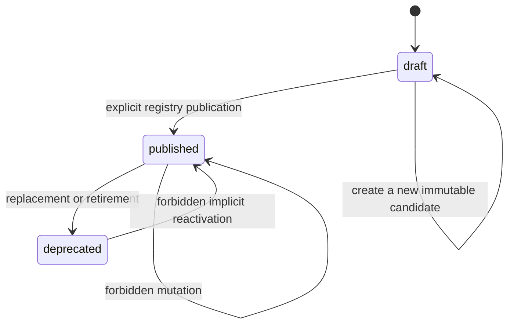
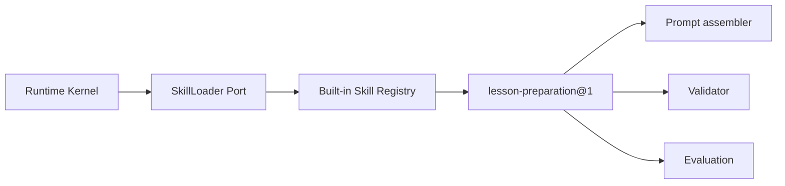
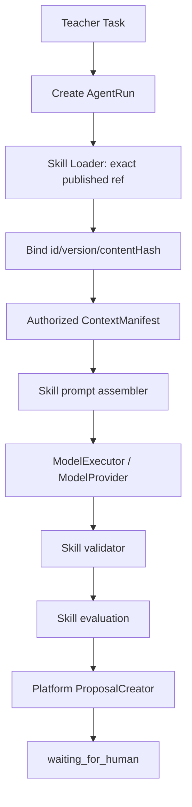
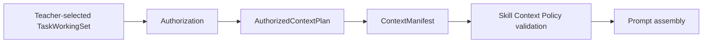

# Versioned Skill System 设计

> Phase 5 仅实现一个内置、代码版本化的 `lesson-preparation@1`。
> 当前事实审计见 [phase5-skill-audit.md](./phase5-skill-audit.md)。

## 1. 目标与边界

Skill 是可版本化、可评估、可发布的 Agent 能力单元，不是一个 Prompt 文件的别名。
一个 SkillVersion 必须把输入、输出、Context、工具、预算、审批和评估策略绑定成一个
不可变、可解释的整体。

Skill 不拥有业务事实。它只接收 Runtime 已授权并封存的 Context，调用 Runtime/Capability
提供的 Port，输出 Proposal/Draft 候选。Proposal 的正式创建、TeachingPlan 的审阅和批准
仍由 Platform Application Service 完成。

Phase 5 不建立数据库 Registry、管理 UI、Marketplace、Memory 或多 Agent 编排。

## 2. SkillVersion

最小内部模型如下。它是 API 进程内类型，不进入 HTTP Contract。

```ts
interface SkillVersion<TInput, TValidatedOutput> {
  readonly id: string;
  readonly version: string;
  readonly ref: `${string}@${string}`;
  readonly status: "draft" | "published" | "deprecated";
  readonly purpose: string;
  readonly inputSchema: SkillSchema<TInput>;
  readonly outputSchema: SkillSchema<TValidatedOutput>;
  readonly contextPolicy: ContextPolicy;
  readonly toolPolicy: ToolPolicy;
  readonly memoryPolicy: MemoryPolicy;
  readonly budgetPolicy: BudgetPolicy;
  readonly approvalPolicy: ApprovalPolicy;
  readonly evaluationPolicy: EvaluationPolicy;
  readonly prompt: PromptAssembler<TInput>;
  readonly validate: OutputValidator<TInput, TValidatedOutput>;
  readonly evaluate: OutputEvaluator<TInput, TValidatedOutput>;
  readonly contentHash: string;
}
```

`contentHash` 由不含可执行函数的规范化 Manifest 内容计算，包括所有 schema ref、policy、
PromptBundle ref/version/hash 和评估规则版本。函数实现仍由 Git 提交固定；Manifest hash
提供 Run 级别的可核对绑定。

## 3. Lesson Preparation Skill Manifest

`lesson-preparation@1` 固定以下内容：

| 字段 | 值或规则 |
|---|---|
| `id` / `version` | `lesson-preparation` / `1` |
| `purpose` | `lesson_preparation` |
| 输入 Schema | Skill 内部 `lesson-preparation-input@1`，校验 Prompt 输入结构 |
| 输出 Schema | 复用 Contracts 的 `teacher-copilot-suggestions@1` |
| Prompt | 复用 `prompt-bundle:lesson-preparation-ark@1` 的原内容和 hash |
| Context | 只允许已封存的 CourseRun、Lesson、Objective、TeachingPlan 摘要和 Evidence refs |
| Tool | `disabled`，允许列表为空 |
| Memory | `disabled`，Phase 5 不检索或写入 Memory |
| Budget | 使用现有 Context token budget 和 Model budget；Skill 不自行扩大 |
| Approval | `proposal_only` 且 `human_approval_required` |
| Evaluation | Contract、Policy、Quality、Operation 四类 |

输入和输出 Schema 由 Zod 解析。输出 Schema 只引用 Contracts 中的现有对象，不复制 DTO，
从而保证 Web、API、Fake Ark 与真实 Ark 继续共享同一 wire format。

## 4. 生命周期



规则：

1. `(id, version)` 在 Registry 中全局唯一；
2. `published` 和 `deprecated` SkillVersion 都被冻结，不能原地修改；
3. 执行新 Run 只能装载 `published` 版本；
4. 历史解释可以读取 `published` 或 `deprecated` 版本；
5. `draft` 不可执行；
6. 新行为必须使用新版本，例如 `lesson-preparation@2`；
7. 注册相同 ref 的不同 payload 必须 fail closed；
8. Phase 5 的内置 Registry 随应用发布，不支持运行时上传代码。

`deprecated` 表示不再用于新 Run，不表示删除历史版本。

## 5. Skill Registry 与 Loader

Registry 是最小进程内目录，职责只有：

- 注册不可变 SkillVersion；
- 检查 ref、状态和 Manifest content hash；
- 拒绝重复或被篡改的版本；
- 按精确 ref 装载新执行版本；
- 按精确 ref 读取历史版本；
- 向 Runtime 返回不含 Skill 实现细节的绑定描述。



Runtime Kernel 不写 `if (skill === "lesson-preparation")`。它只请求一个精确 skill ref，
校验返回绑定是否被当前 AgentDefinition 允许，并把 `skillId`、`skillVersion`、
`skillContentHash` 写入 Checkpoint。

Lesson Preparation 的 Composition Service 知道当前业务要执行的 Skill 类型，因此可以从
Registry 取得强类型可执行版本；它不再分别导入 Prompt 和 Validator。

## 6. Runtime 与 Skill 的调用关系



恢复时以 Checkpoint 中保存的精确 ref 和 content hash 重新装载 Skill。若版本不存在、状态
不允许或 hash 不匹配，Run fail closed，不静默切换到“最新”版本。

## 7. Context Policy

Skill 的 Context Policy 描述能力需要和允许使用什么，不负责取得数据库对象。实际流程仍是：



Lesson Preparation V1 的最小策略：

- `purpose` 必须是 `lesson_preparation`；
- CourseRun、Lesson 与至少一个 LearningObjective 必须明确；
- Evidence 只能使用输入中列出的 refs；
- `knownGaps` 和 `uncertaintyNote` 必须存在；
- 未授权学生、成绩、文件原文和隐藏字段不得进入 Prompt；
- Skill 接受 Runtime 已决定的 token budget，不得提升预算；
- 缺少必要资源时 fail closed，不能用固定 sample ref 补齐。

## 8. Evaluation

### Contract Evaluation

- 输出可提取为唯一 JSON；
- 通过 `teacher-copilot-suggestions@1` Zod Schema；
- 必填字段、枚举和数组边界满足约束。

### Policy Evaluation

- EvidenceRef 全部属于本次授权列表；
- CourseRun、Lesson 和 Objective 与 Context 一致；
- 不虚构学生、成绩、课堂事实或文件；
- 不声称自动批准、发布或实施；
- 未知项和不确定性明确。

### Quality Evaluation

- 与教学目标和课时主题一致；
- 输出结构完整；
- 建议可执行且保持教师最终决定权；
- 已知缺口不被模型补造成事实。

质量评估在 Phase 5 采用确定性、可解释规则；不使用第二个模型为第一个模型打分。

### Operation Evaluation

记录已有 ModelExecution 指标：

- latency；
- input/output/total tokens；
- attempt/retry；
- estimated cost（若当前 Provider/预算服务能够提供）；
- Provider 与 Request ID 的安全引用由 Capability 继续持有。

Operation 指标缺失应标记为 `not_recorded`，不得伪造为零或通过。

## 9. 兼容迁移策略

为保持 API、UI 和测试入口不变：

- 新的唯一实现位于 `apps/api/src/agent/skills/lesson-preparation`；
- 原 Capability Prompt 和 Validator 文件保留为兼容 re-export；
- `PostgresModelInvocationService` 改为从 Registry 装载 Skill；
- 旧 Checkpoint 缺少独立 `skillId/contentHash` 时仅允许按已保存的
  `lesson-preparation@1` 做兼容解析；新 Checkpoint 必须保存完整绑定；
- 已持久化 PromptBundle、RunManifest、ModelExecution 与 Proposal 结构不变；
- 不新增或修改 Migration，不改变 HTTP Contract。

## 10. 架构约束

Skill 目录禁止导入：

- 任一模块的 `infrastructure` 或 Repository；
- PostgreSQL Adapter、`pg`、Drizzle 或 SQL；
- Education/Artifact 可变 Entity；
- OpenAI/Ark SDK；
- `@edu-agent/sample-data` 或 `@edu-agent/test-fixtures`。

允许依赖：

- `@edu-agent/contracts` 中现有稳定 Schema/DTO；
- Runtime 提供的 Context/Loader Port 类型；
- Capability 的抽象请求/结果类型；
- 无副作用的标准库 hash 与本地纯函数。

## 11. Phase 6 准备边界

Manifest 预留 `memoryPolicy`，但 Phase 5 固定为 disabled。未来 Memory/Personalization 必须：

- 先经过 ActingContext 与目的授权；
- 由 Context Engineering 选择并记录 provenance；
- 只向 Skill 提供已封存 Context，不让 Skill 直接查询 Memory Store；
- 将自动推断、教师确认偏好和不可存储信息分开；
- 通过新 SkillVersion 启用，不能静默改变 `lesson-preparation@1`。
