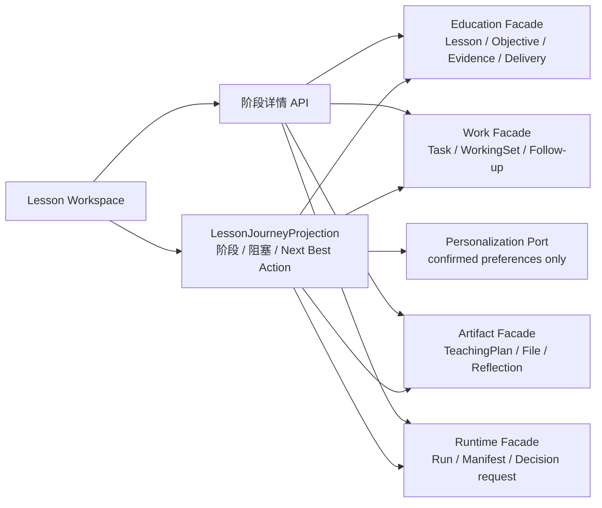
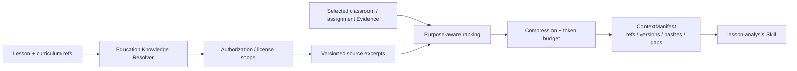

# Teaching Workspace 产品设计到系统架构映射

> 状态：DESIGN ONLY  
> 输入：[Teaching Workspace 产品重构设计](../product/teaching-workspace-redesign.md)  
> 约束：本方案不修改代码、数据库、API Contract、UI 或现有业务状态语义。  
> 目标：把“系统负责准备，教师负责判断”的 Lesson Journey 映射到当前 Edu-Agent 的真实对象、服务与边界，并给出可渐进实施的技术路线。

## 0. 架构结论

Teaching Workspace 不需要建立第二套 Lesson、TeachingPlan、Delivery、Evidence 或 Reflection。正确做法是：

1. 保留现有模块作为正式状态所有者；
2. 在 Work 的读取侧增加一个可重建的 `LessonJourneyProjection`，只负责判断当前阶段、阻塞原因和下一步动作；
3. 由小型、按需加载的读取接口提供各阶段详情，不建立巨型 Lesson Dashboard；
4. Agent 继续只产生 Proposal / Draft，Platform Application Service 才能形成正式 Revision、File 或教学事实；
5. 第一轮优先复用现有表和 API。只有确实需要保存“新的正式历史”时，才增加前向 Migration；
6. `LessonJourneyState` 是对现有状态的确定性解释，不是新的业务真值状态机。

目标依赖关系如下：



`LessonJourneyProjection` 不写回这些模块。任何“批准、确认、发布、完成”仍必须调用对应状态所有者的正式命令。

---

## 1. 当前实现基线

### 1.1 当前状态所有者

| 模块 | 当前正式状态 | 主要数据对象 / 表 | 当前 Application Service / Facade |
|---|---|---|---|
| Identity / Governance | Session、ActingContext、Membership、AuthorizationDecision、Audit | `governance.*` 与身份会话对象 | Identity Context / Authorization Facade |
| Education | CourseRun、CurriculumUnit、Lesson、LearningObjective、Evidence、LessonDelivery、ClassroomObservation | `education.course_run`、`curriculum_unit`、`lesson`、`learning_objective`、Evidence 表、`lesson_delivery*`、`classroom_observation*` | `PostgresLessonPreparationService` 的课程读取；`PostgresClassroomReflectionService` 的 Delivery / Observation 命令 |
| Work | Lesson Preparation Task、TaskWorkingSet、资源选择、状态历史、Reflection Follow-up、工作台投影 | `work.task`、`lesson_preparation_task_details`、`task_working_set*`、状态历史与 follow-up 表 | `PostgresLessonPreparationService`、`TeacherCopilotApplicationFacade`、Workbench Service |
| Artifact | TeachingPlan Revision、Reflection Revision、FileAsset、FileVersion、绑定与导出 | `artifact.artifact*`、`teaching_plan_scope_*`、`lesson_reflection_*`、`file_asset`、`file_version`、`artifact_file_binding` | `PostgresGate2ReadService`、`PostgresGate2TeacherCopilotService`、`PostgresClassroomReflectionService`、`PostgresFileArtifactService` |
| Runtime | AgentRun、RunStep、Checkpoint、AuthorizedContextPlan、ContextManifest、Proposal 生成过程 | `runtime.agent_run`、`run_manifest`、`authorized_context_plan`、`context_manifest` 及 checkpoint 存储 | `RuntimeKernelService` |
| Capability | ModelExecution、Provider 能力、工具调用、ObjectStore Adapter | `capability.model_execution*`、`tool_execution` | `PostgresModelInvocationService`、ModelProvider / ObjectStore Ports |
| Personalization | MemoryCandidate、confirmed TeacherPreference 及修订历史 | `personalization.memory_candidate*`、`teacher_preference*` | `PostgresPersonalizationService`、Personalization Context Port |

### 1.2 当前 Web 入口

当前 [TeachingWorkspacePage.tsx](../../apps/web/src/pages/TeachingWorkspacePage.tsx) 已经读取真实 CourseRun、Unit、Lesson、Task、TeachingPlan、File、Assignment、Delivery 和 Reflection 状态。它的主要问题不是缺少真值，而是：

- 页面按“课程 / 作业 / 考试”和对象栏目组织，而不是按教师当前任务组织；
- “准备度”由目标、Task、approved plan、文件四项粗粒度计算，不能表达阻塞原因和下一步决策；
- 重点难点直接从当前 approved plan 或目标拼装，不是有来源、有缺口说明的 Lesson Brief；
- [ClassroomReflectionPanel.tsx](../../apps/web/src/components/portal/ClassroomReflectionPanel.tsx) 将严谨的数据结构直接暴露为长表单；
- Agent、TeachingPlan、文件和 Reflection 虽有真实页面，但上下文在页面间切换时需要教师自行理解。

因此 Phase 8A 的重点是增加“解释层”和“任务流信息架构”，而不是复制数据。

---

## 2. Lesson Journey 与当前对象映射

### 2.1 总映射

| Lesson Journey 阶段 | 教师看到的产品结果 | 当前正式对象 | 当前读取 / 命令 API | 当前 Application Service | 当前缺口 |
|---|---|---|---|---|---|
| 进入课时 | 课时、班级、时间、上一课衔接、当前状态 | CourseRun、CurriculumUnit、Lesson、LearningObjective | `GET /api/v1/teacher/course-runs/:ref/units`、`GET /api/v1/teacher/units/:ref/lessons`、`GET /api/v1/teacher/lessons/:ref` | `PostgresLessonPreparationService` | 缺少一个统一 Journey 摘要和 Next Best Action |
| 看懂本课 | 目标、已有计划、Evidence、已知缺口、重点难点候选 | Lesson、LearningObjective、Lesson Evidence links、Evidence Observation / Claim、历史 TeachingPlan、confirmed TeacherPreference | Lesson API、`GET /lessons/:lessonRef/teaching-plans`、Task WorkingSet / Context API、Assignment analytics / Evidence API | `PostgresLessonPreparationService`、`PostgresGate2ReadService`、`PostgresAssignmentLearningService`、Personalization Context Port | 缺少具备 provenance、版本向量和缺口说明的 Lesson Brief 读取结果；缺少权威课程标准 / 教材知识源 |
| 确认教学意图 | 教师确认关注点、选择班级 Evidence、说一句调整要求 | Task、TaskWorkingSet、resource selections、Purpose | `POST /lesson-preparation/tasks`、`PUT /tasks/:ref/resource-selections`、WorkingSet / AuthorizedContextPlan API | `PostgresLessonPreparationService`、`TeacherCopilotApplicationFacade` | 当前需要在多个页面操作；“采用这个重点”尚无独立对象，最小实现应把选择写入新 Task 的 WorkingSet，而不是新造 Lesson 状态 |
| 定方案 | 多个备课建议、差异说明、采用 / 调整 / 暂缓 | AgentRun、ModelExecution、Proposal、TeachingPlan draft / in_review / approved、Task 状态 | Model invocation API、Proposal disposition API、TeachingPlan review / approve API、Task lifecycle API | `RuntimeKernelService`、`PostgresModelInvocationService`、`PostgresGate2TeacherCopilotService`、`PostgresLessonPreparationService` | 当前 Agent 入口与课时 Journey 分离；缺少按教师决策组织的嵌入式方案比较 |
| 准备材料 | 教案、练习、板书、课件大纲及其版本和来源计划 | approved TeachingPlan Revision、FileAsset、FileVersion、ArtifactFileBinding、TeachingPlan export | File list/detail/content/version/binding API、approved TeachingPlan DOCX export API | `PostgresFileArtifactService` | 缺少按 Lesson + approved Revision 计算的材料包；“有文件”不等于“材料已齐” |
| 课堂后快速反馈 | 基本按计划 / 有调整 / 未完成、节奏、显著现象 | LessonDelivery draft / confirmed Revision、ObservedPedagogicalMove、InstructionalDecision、ClassroomObservation draft / confirmed Revision | `POST /classroom/deliveries`、Delivery detail/update/confirm/amend；Observation create/update/confirm/supersede | `PostgresClassroomReflectionService` | 当前长表单过重；应把点击选择映射为 draft，仍由教师确认后才成为事实 |
| 课后反思 | planned vs implemented、达成情况、Evidence 一致 / 冲突、下一步候选 | LessonReflection Artifact / Revision、confirmed Delivery、confirmed Observation、selected Assignment Evidence | Reflection create/detail/update/generate/confirm/history、Implementation summary | `PostgresClassroomReflectionService`、`PostgresModelInvocationService` | Reflection 生成还没有作为独立 Versioned Skill 暴露；授权上下文虽存在但 UI 不够可见 |
| 推动下一课 | 下一课备课 Task、Assignment draft、TeacherTodo | Reflection follow-up、Task / TaskWorkingSet、Assignment、TeacherTodo、Workbench projection | Reflection follow-ups、Assignment create、Todo create、Task APIs | `PostgresClassroomReflectionService` 及各目标模块 Service | “没有后续动作”目前无法与“尚未处理”严格区分；需要显式 follow-up decision 才能精确关闭 Journey |

### 2.2 关键语义映射

```mermaid
flowchart LR
    LESSON["Lesson + Objectives"] --> BRIEF["Lesson Brief\n读取快照 / 建议"]
    EVIDENCE["Selected Evidence"] --> BRIEF
    BRIEF --> TASK["Preparation Task + WorkingSet"]
    TASK --> RUN["AgentRun + ContextManifest"]
    RUN --> PROPOSAL["Proposal / Draft"]
    PROPOSAL --> REVIEW["教师审阅"]
    REVIEW --> PLAN["approved TeachingPlan Revision"]
    PLAN --> FILES["FileAsset / FileVersion"]
    PLAN --> DELIVERY["LessonDelivery draft"]
    DELIVERY --> CONFIRM["教师确认实施事实"]
    CONFIRM --> OBS["confirmed Observation"]
    CONFIRM --> REFLECT["Reflection Draft"]
    OBS --> REFLECT
    REFLECT --> RCONFIRM["confirmed Reflection Revision"]
    RCONFIRM --> FOLLOW["显式 Follow-up"]
```



必须保留以下边界：

- `approved TeachingPlan` 不等于课堂已实施；
- Proposal disposition 的 accepted 不等于正式计划批准，更不等于真实实施；
- 快速反馈只创建 / 更新 draft；只有教师确认的 Delivery / Observation 才是正式事实；
- Reflection 是新的 Artifact Revision，不覆盖原 TeachingPlan；
- Task `ready_for_use` 不等于 `completed`，完成备课仍是显式教师动作；
- TeacherPreference 只影响表达、组织和建议偏好，不改变 Lesson、Evidence 或 TeachingPlan 真值。

---

## 3. 新增读取模型设计

### 3.1 决策总表

| 候选模型 | 是否需要 | 首轮是否新增数据库 | Owner | 生命周期 | 结论 |
|---|---|---:|---|---|---|
| `LessonJourneyProjection` | 需要 | 否 | Work 读取侧 | 每次读取按源版本向量重算；可丢弃重建 | 必须先做，作为 Workspace 导航和 Next Best Action 的唯一解释层 |
| `LessonBriefSnapshot` | 需要 | 首轮不需要；需要独立审阅历史时再加 | Education 提供事实；Artifact 持久化候选快照 | generated → reviewed / superseded；源版本变化即失效 | 首轮实时计算并封存 provenance；教师选择进入 TaskWorkingSet。后续如需跨 Task 复用，再作为 versioned Artifact 持久化 |
| `MaterialBundleProjection` | 需要 | 否 | Artifact 读取侧 | 随 approved plan、FileVersion、Binding 变化重算 | 从现有文件和绑定计算，不能成为第二个文件真值 |
| `AgentDecisionRequest` | 需要 | 否 | Runtime 拥有等待事实；Work 投影负责展示 | open → answered / dismissed / superseded | 从 `waiting_for_human`、Proposal、validation failure、Checkpoint 推导，不新建业务表 |

### 3.2 `LessonJourneyProjection`

建议字段：

```text
lessonRef
courseRunRef
currentStage
stageStatus
nextBestAction
blockingReasons[]
completedMilestones[]
sourceRefs[]
sourceVersionVector
lastCalculatedAt
deepLink
```

规则：

- 只读、可重建，不允许写回源状态；
- 输入必须通过当前 Session / ActingContext 授权；
- 不读取跨 CourseRun 或未选择的 learner Evidence；
- `sourceVersionVector` 至少覆盖 Lesson、Task、TeachingPlan Revision、File binding、Delivery Revision、Reflection Revision；
- 首轮同步计算即可。将来出现列表性能问题时，可复用 Workbench 的 Outbox 投影方式持久化缓存，但缓存仍不是业务真值；
- API 返回状态、原因、refs 和 deep links，不返回所有阶段的完整正文。

建议将它实现为 Work 读取 Facade，通过各模块 Facade / Read Port 聚合；禁止在 Work Repository 中跨 Schema 写入或直接复制正式对象。

### 3.3 `LessonBriefSnapshot`

它应表达“系统在某个源版本集合上形成的可解释课时洞察”，不是新的课程事实。

建议内容：

```text
lessonRef
objectiveSummaries[]
teachingFocusCandidates[]
difficultyCandidates[]
commonMisconceptions[]
classEvidenceSummary[]
knownGaps[]
sourceRefs[]
sourceVersions[]
sourceHashes[]
knowledgeSourceVersions[]
generatedBySkillRef
generatedAt
```

首轮策略：

- 由 Education Read Port 提供 Lesson / Objective / Evidence 的授权快照；
- 由 `lesson-analysis` Skill 生成候选表达；
- Runtime 的 ContextManifest 封存实际来源；
- 教师点击“采用这些关注点”时，把选中的 refs、Purpose 和一句调整意图写入新的 Preparation Task / TaskWorkingSet；
- 不把未确认的重点难点回写 Lesson；
- 源对象版本变化后旧快照显示“来源已更新”，不能静默继续当作当前结论。

若未来要求独立查看、修改和审计每次 Brief，而不依附某个 AgentRun 或 Task，则使用现有 Artifact / ArtifactRevision 机制新增 `LessonBrief` 类型，并增加明确的 Lesson scope 关系。由于当前 Artifact 基表虽支持字符串类型，但没有通用 Lesson scope 查询关系，这一步应通过新的前向 Migration 完成，不能把 `lessonRef` 仅藏在 JSON 中作为长期方案。

### 3.4 `MaterialBundleProjection`

建议字段：

```text
lessonRef
approvedTeachingPlanRevisionRef
requiredMaterialKinds[]
items[] { kind, assetRef, versionRef, status, provenance }
missingKinds[]
generatedAt
```

数据来源：`FileAsset`、`FileVersion`、`ArtifactFileBinding`、TeachingPlan export 和 approved Revision。首轮不建表；Artifact Read Facade 实时计算。

重要裁决：

- “存在一个关联文件”不能等于“材料齐备”；
- `requiredMaterialKinds` 应来自当前方案或教师选择，不应固定要求每课都有 PPT；
- DOCX / 文件渲染是 Artifact / Capability 的确定性能力，不是 Skill；
- Agent 可以生成材料内容 Draft，Artifact Application Service 负责创建正式 FileAsset / FileVersion；
- 同一 approved Revision 的重复生成继续使用现有幂等与版本规则。

### 3.5 `AgentDecisionRequest`

建议字段：

```text
requestRef
runRef
taskRef
lessonRef
decisionKind
title
options[]
recommendedOption
reason
sourceVersion
status
deepLink
```

首轮从现有 Runtime / Platform 状态推导：

- `AgentRun.waiting_for_human`；
- Proposal 待 disposition；
- TeachingPlan `in_review`；
- Model validation failure / recoverable failure；
- Context 缺失且需要教师选择资源。

Runtime 拥有“为什么执行暂停”的事实；Work 只投影“老师现在要做什么”。教师作答后必须调用对应 Platform 或 Runtime 命令，不能在 Projection 上直接标记完成来伪造源状态。

---

## 4. `LessonJourneyState` 设计

### 4.1 状态不是新真值

推荐读取模型：

```text
stage:
  understand | plan | materials | deliver | reflect | improve

status:
  unavailable | ready | in_progress | waiting_for_agent |
  waiting_for_teacher | needs_attention | completed
```

`stage + status` 每次由源对象计算。不能让前端或单独的 `lesson_journey` 表自行推进。

### 4.2 阶段规则

| 阶段 | 进入条件 | 完成 / 退出条件 | 教师动作 | Agent / 系统动作 | 主要状态来源 |
|---|---|---|---|---|---|
| `understand` 看懂本课 | Lesson 可访问 | 已创建带有明确 Purpose / 资源选择的 Preparation Task，或已采用有效 Brief 形成 WorkingSet | 确认关注点、选择 Evidence、说一句调整意图 | 汇总 Lesson、Objectives、已授权 Evidence、历史 plan、已知缺口 | Lesson、Objective、Evidence、TaskWorkingSet |
| `plan` 定方案 | 有有效 Lesson 与 Preparation Task | 存在 current approved TeachingPlan Revision；Task 是否完成仍独立判断 | 采用 / 调整 / 拒绝 / 延后、提交 in-review、批准；显式完成 Task | Runtime 生成 Proposal，校验并等待教师 | Task 状态、AgentRun、Proposal、TeachingPlan lifecycle |
| `materials` 准备材料 | 有 current approved Revision | 当前方案声明需要的材料均为 ready；没有材料需求时可显式跳过 | 预览、重新生成、确认可用或说明无需材料 | 计算 MaterialBundle，生成内容 Draft，Artifact 创建文件 | approved Revision、FileAsset / FileVersion / Binding |
| `deliver` 课堂反馈 | 课时可记录；时间结束只产生提醒，不产生事实 | 存在 current confirmed LessonDelivery Revision | 选择“基本按计划 / 有调整 / 未完成”，补充少量关键现象并确认 | 预填 planned steps，整理为 Delivery draft；不自动确认 | LessonDelivery、Observation drafts / revisions |
| `reflect` 课后反思 | 有 confirmed Delivery | 存在 current confirmed Reflection Revision | 选择观察和 Evidence、修正不准确处、确认 | 对比 planned / implemented，生成 Reflection Draft | Delivery、Observation、selected Evidence、Reflection lifecycle |
| `improve` 推动下一课 | Reflection 已确认 | 教师已明确选择后续行动，或明确选择“本次无需后续” | 创建下一课 Task、Assignment draft、Todo，或确认无需后续 | 提议候选行动，不自动创建 | Reflection follow-up、Task、Assignment、Todo |

### 4.3 阻塞与优先级

同一 Lesson 可能同时存在多个未完成事项，Next Best Action 按以下优先级计算：

1. 安全、授权、版本冲突或数据不一致；
2. 已发起但等待教师的决定，例如 Proposal、in-review plan、Delivery / Reflection draft；
3. 已失败但可恢复的 AgentRun；
4. 临近上课且尚无 approved plan；
5. 已 approved 但材料不齐；
6. 已结束课程的 Delivery 记录；
7. confirmed Delivery 后的 Reflection；
8. confirmed Reflection 后的可选 follow-up。

不得用日历时间自动声称 Delivery 已发生，也不得因为 approved plan 存在而自动完成 Preparation Task。

### 4.4 当前无法精确表达的两个状态

1. **材料无需准备**：当前只能看到有没有文件，缺少“本方案明确不需要某类材料”的决策。首轮可在 Journey 读取层把“无声明需求”显示为可选，而不是缺失；以后再为材料需求增加明确的方案字段。
2. **反思已看过但无需后续**：当前零个 follow-up 既可能表示未处理，也可能表示无需处理。精确关闭 Journey 最终需要一个显式 `ReflectionFollowUpDecision` 或等价的 reviewed/no_action 记录；在此之前不能假装已经处理。

---

## 5. Agent Skill 映射

### 5.1 Runtime、Skill 与 Platform 的职责

| 层 | 应负责 | 不应负责 |
|---|---|---|
| Runtime Kernel | Run / Step、Checkpoint、Recovery、ContextManifest、Tool routing、Evaluation 执行、waiting_for_human | 教学 Prompt、教材知识判断、批准计划、创建正式文件或课堂事实 |
| SkillVersion | 输入 / 输出 Schema、Prompt、Context / Tool / Memory / Budget / Approval / Evaluation Policy | Repository、SQL、跨租户资源检索、正式状态写入 |
| Platform Application Service | 授权读取、创建 Task、TeachingPlan Revision、FileVersion、Delivery、Observation、Reflection、Follow-up | 隐式采用模型建议、绕过教师确认 |
| Capability Adapter | ModelProvider、ObjectStore、确定性渲染器、未来知识源连接器 | 业务生命周期和审批语义 |

### 5.2 Skill 规划

| 能力 | 是否应为独立 Skill | 理由 | 首轮输入 | 输出 | 正式落地者 |
|---|---|---|---|---|---|
| `lesson-preparation` | 是，保留现有 @1/@2/@3，并新增版本而非覆盖 | 已有独立目的、Schema、Context Policy、Evaluation 与审批边界 | TaskWorkingSet、LessonBrief、selected Evidence、confirmed preferences | TeachingPlan Proposal / Draft | Artifact / Teacher Copilot Application Service |
| `lesson-analysis` | 是 | 重点难点、教材分析、常见错误属于可版本化、可评估的教学推理能力 | Lesson、Objectives、知识来源、selected Evidence、历史 plan | LessonBrief candidate | 首轮进入 TaskWorkingSet；未来可由 Artifact 保存 versioned Brief |
| `material-generation` | 是，但只负责教学内容 | 练习、板书、课件大纲有独立输出 Schema 和质量评估 | approved Revision、材料类型、教师偏好 | material content draft | Artifact Service 创建 FileAsset / FileVersion；DOCX/PPTX 渲染器仍是 Capability |
| `reflection-analysis` | 是 | 当前已有 reflection model invocation，但应提升为可解释、可版本化 Skill | confirmed Delivery、confirmed Observations、selected Evidence、approved plan | Reflection Draft | Artifact / Reflection Application Service |
| `next-lesson-adjustment` | 暂不独立 | 当前与 lesson-preparation 的输入输出和审批语义高度重合 | Reflection + selected Evidence + next Lesson | TeachingPlan Proposal | 先作为 `lesson-preparation` 的 purpose / context variant；出现独立评估需求后再拆 Skill |

### 5.3 Skill 演进规则

- 历史 Run 固定记录 `skillId`、`skillVersion`、manifest hash；
- 已 published 版本不可原地修改；
- 新的 Lesson Workspace 不能在 Runtime 中写 `if (stage === ...)` 的教学 Prompt 分支；阶段只选择一个已发布 Skill；
- Skill 只接收 Context Builder 输出的授权快照，不直接查询 Education / Artifact Repository；
- TeacherPreference 只从 confirmed、active、同 tenant / owner 的 Personalization Port 进入 Context；
- 每个 Skill 都要评估来源完整性、未授权信息、虚构事实、关键缺口和 token 使用；
- `material-generation` 的“生成内容”与“写成正式文件”必须分成两个步骤。

---

## 6. Teaching Knowledge Source 规划

### 6.1 当前缺口

当前仓库已经有：

- `curriculumFrameworkRef`；
- LearningObjective 的 `knowledgeConceptRefs` 和 `competencyRefs`；
- Lesson、TeachingPlan、Evidence、文件和教师确认偏好；

但没有可被产品当作权威来源的完整课程标准、教材版本 / 章节、学科知识图谱、考点映射和常见错误库。模型目前不能把自身常识伪装为学校或教材事实。

### 6.2 推荐的 Education Knowledge Layer

它应先作为 Education 模块内的子域和 Ports，而不是第八模块、独立微服务或向量数据库。

建议概念：

```text
CurriculumStandardVersion
TextbookEdition
TextbookSection
KnowledgeConcept
ConceptPrerequisite
AssessmentBlueprint
AssessmentPoint
MisconceptionPattern
LessonKnowledgeMapping
KnowledgeSourceDocument
```

所有知识条目至少需要：

- 稳定 ref 与 version；
- 来源机构、文档、页码 / 章节或 URL；
- 学科、年级、教材版本和适用时间；
- 内容 hash；
- 授权 / 许可证和 tenant 可见范围；
- 生效、过期、被替代状态；
- 人工校验状态；
- 可用于模型的字段掩码。

### 6.3 责任边界

| 责任 | Owner |
|---|---|
| 权威知识实体、版本、适用范围和 Lesson 映射 | Education |
| 原始 PDF / DOCX 等来源文件及版本 | Artifact |
| 外部知识源连接、解析和内容获取 Adapter | Capability |
| 授权、tenant / license 边界、Audit | Identity / Governance |
| 检索、排序、压缩和 ContextManifest | Runtime Context Builder |
| 把知识与课堂 Evidence 组合为教学建议 | Skill |

推荐流程：



向量检索将来可以作为 Knowledge Retrieval Port 的一种 Adapter，但不能替代版本、来源、授权和精确引用。

### 6.4 缺口呈现规则

- 没有已授权教材内容时，明确显示“尚未接入当前教材版本”；
- 没有班级 Evidence 时，输出通用教学候选并标记“无班级证据”；
- 课程标准与课堂 Evidence 冲突时，同时展示，不让模型静默裁决；
- 考点关联必须引用对应 blueprint version；
- Agent 推断出的“常见错误”只能是候选，除非来源于受控知识库或可追溯 Evidence。

---

## 7. Lesson Workspace UI 信息架构映射

本节只定义技术组件和数据边界，不修改现有 UI。

### 7.1 页面结构

```text
LessonWorkspacePage
├── LessonContextHeader
│   └── 班级 / 单元 / 课时 / 时间 / current approved / 来源状态
├── LessonNextBestActionCard
│   └── 一个主动作 + 原因 + 阻塞说明
├── LessonJourney
│   ├── UnderstandStagePanel
│   ├── PlanStagePanel
│   ├── MaterialStagePanel
│   ├── DeliveryFeedbackPanel
│   ├── ReflectionReviewPanel
│   └── FollowUpPanel
├── AgentWorkspacePanel
│   └── 当前 Skill、授权上下文、生成状态、教师决策
└── LessonHistoryDrawer
    └── Plan / File / Delivery / Observation / Reflection / Run 时间线
```

### 7.2 组件与现有页面的关系

| 新组件 | 复用的数据 / 逻辑 | 当前组件处理方式 |
|---|---|---|
| `LessonContextHeader` | CourseRun、Unit、Lesson、Objectives | 从 `TeachingWorkspacePage` 抽出课时头部；不复制请求状态 |
| `LessonNextBestActionCard` | `LessonJourneyProjection` | 替换当前粗粒度准备度主操作；准备度可作为次级进度信息保留 |
| `LessonJourney` | Projection + 每阶段 detail API | 替换当前“重点难点 / 文件 / 课堂记录”平铺栏目 |
| `LessonBriefPanel` | LessonBriefSnapshot、source refs、known gaps | 不在前端自行拼接重点难点 |
| `PlanDecisionPanel` | Proposal、TeachingPlan state、Task state | 复用 TeachingPlan / Agent API；完整审阅页仍可作为深链接 |
| `MaterialBundlePanel` | MaterialBundleProjection、File content | 复用现有预览与文件定位；不维护独立文件数组 |
| `QuickClassroomFeedback` | Delivery draft、Observation draft | 渐进替代 `ClassroomReflectionPanel` 的长表单 happy path；高级修订仍可进入详情 |
| `ReflectionReviewPanel` | Reflection draft / confirmed、Manifest | 只让教师修正不准确处；完整历史从 drawer 查看 |
| `AgentWorkspacePanel` | AgentDecisionRequest、Run、ContextManifest | 保留当前 Agent 页面作为高级解释 / Runs 入口，不把 Agent 降级成聊天框 |
| `LessonHistoryDrawer` | 各模块 revision/event API | 按 refs 时间排序，详情按需请求；不新增历史真值表 |

### 7.3 API 形态建议

未来可新增一个小型读取 Contract：

```text
GET /api/v1/teacher/lessons/:lessonRef/journey
```

只返回：

- 当前 stage / status；
- Next Best Action；
- blocking reasons；
- 每阶段的摘要状态与正式 refs；
- source version vector；
- detail links。

详细正文继续由现有或阶段专属 API 获取。不要把全部 TeachingPlan 内容、所有文件、所有 Evidence、所有 Run 和历史塞入同一个响应。

写操作继续调用现有 owner 命令，不提供 `POST /journey/complete-stage` 之类会伪造状态的万能端点。

### 7.4 加载与失败策略

- Journey 摘要失败时显示哪一个来源不可用，而不是整页白屏；
- Agent 失败在当前阶段显示安全错误和恢复动作，不要求教师去 Runs 页面才知道；
- 来源版本变化时提示刷新 / 重新生成，不静默混用旧 Brief 与新 Evidence；
- 未授权 Evidence 只显示“有资源未获授权”，不泄漏内容和对象是否存在；
- 所有按钮是否启用必须由后端状态和 expected version 决定，前端不维护可修改业务副本。

---

## 8. 数据迁移与兼容风险

### 8.1 第一轮无需 Migration

以下能力可以由现有数据实时计算：

- `LessonJourneyProjection`；
- `MaterialBundleProjection`；
- `AgentDecisionRequest`；
- Journey UI 重排；
- 从现有 Delivery / Observation draft 生成快速反馈交互；
- Lesson Brief 的即时授权快照与 ContextManifest；
- 新 SkillVersion 的代码注册；
- 用现有 TaskWorkingSet 保存教师选择的 Evidence、Purpose 和资源 refs。

虽然不需要 SQL Migration，新增读取 API / Skill 输入输出仍需要新的 Contracts 和自动化测试；历史 Contract 不应被原地破坏。

### 8.2 未来可能需要前向 Migration

| 需求 | 是否应迁移 | 原因与推荐位置 |
|---|---|---|
| 独立、可审阅、可复用的 Lesson Brief 历史 | 可能需要 | 使用 Artifact Revision，并增加 `lesson_brief_scope` 或等价明确关系；不要只把 lessonRef 塞进 JSON |
| “本次无需后续行动”的正式决策 | 需要 | Work 或 Reflection follow-up scope 增加显式 decision / reviewed 状态，区分未处理与 no_action |
| 方案声明的材料需求 | 可能需要 | 优先放入新版 TeachingPlan structured content；若需要独立生命周期再新增 scope，不先造表 |
| 原始课堂快速反馈信号历史 | 可选 | 若产品需要在 confirm 前跨设备持续编辑，可在 Education 增加 draft signal；首轮可直接映射到 Delivery / Observation draft |
| 课程标准、教材、考点和知识映射 | 需要 | Education 内新增 versioned knowledge tables；仍使用现有 Schema，不创建第八 Schema |
| Reflection Skill 版本绑定 | 通常不需要业务迁移 | Runtime / model execution 已有版本与 manifest 能力；若当前表缺少某个明确 skill 字段，只能用新的前向 Runtime Migration，不能改历史表 |

### 8.3 不应发生的迁移

- 不新增 `lesson_journey` 业务真值表来复制 Task / Plan / Delivery 状态；
- 不把所有阶段状态塞进 `education.lesson`；
- 不修改历史 Migration；
- 不将 Evidence、Plan、Delivery 和 Reflection 合并为一个 JSON 文档；
- 不新建第八 Schema；
- 不因 UI 重排重写历史 Revision。

### 8.4 兼容策略

- 旧 Lesson 没有 Brief 时，Journey 计算为 `understand.ready`，而不是数据错误；
- 旧 approved plan 仍可直接进入 materials / deliver，不强制补跑新 Skill；
- 已确认 Delivery / Reflection 始终优先于新的 UI 草稿；
- 新 Skill 只用于新 Run，历史 Run 继续加载其绑定版本；
- Journey projection 的算法必须版本化，例如 `lesson-journey-projection@1`，便于解释历史显示差异，但它本身不成为业务事实。

---

## 9. 低风险 MVP 实施顺序

### Step 0：固定语义和读取契约

目标：先建立 `LessonJourneyProjection@1` 的纯计算器和测试，不改页面。

- 输入为当前 Facade 返回的授权 DTO；
- 输出 stage、status、next action、blocking reasons、source version vector；
- 覆盖 approved ≠ delivered、ready_for_use ≠ completed、zero follow-up ≠ no_action；
- 验证 School / CourseRun / learner Evidence 隔离。

验收：同一组源状态在 API、Lesson 页面和 Workbench 得到相同解释。

### Step 1：Lesson Brief

目标：让“看懂本课”先有价值，同时不建立新事实表。

- 新建 `lesson-analysis@1`；
- Context 只包括 Lesson、Objectives、现有 approved plan、教师选择的 Evidence 和确认偏好；
- 暂无权威教材时明确 known gaps；
- 结果通过 Run / ContextManifest 可解释；
- 教师采用的关注点进入 Preparation TaskWorkingSet。

验收：未选择的 Evidence 不进入 Manifest；Brief 不写回 Lesson。

### Step 2：方案生成与决策收口

目标：把现有 `lesson-preparation` 流程嵌入 Journey，而不是重写。

- 新版本 Skill 接收 Lesson Brief 选择；
- 页面提供采用、局部调整、重生成、延后；
- 继续使用 Proposal disposition、in-review 和 approve 命令；
- 批准后不自动完成 Task。

验收：刷新 / 重启后 Task、Run、Proposal、Plan 状态一致。

### Step 3：材料包

目标：按 approved Revision 展示可用成果与缺口。

- 先计算 `MaterialBundleProjection`；
- 复用现有 DOCX 导出、FileVersion、预览和绑定；
- 首轮只增加一个高价值材料生成路径，不建设完整办公套件；
- 生成内容和正式文件写入分开授权。

验收：同一 Revision 幂等；新 Revision 产生新 FileVersion；旧版本可追溯。

### Step 4：课堂快速反馈

目标：把长表单变成 30–60 秒确认，同时不降低事实标准。

- “基本按计划 / 有调整 / 未完成”先创建或更新 Delivery draft；
- 计划步骤默认预填，教师只点选差异；
- 显著现象生成 Observation draft；
- 最后一次“确认课堂记录”才形成正式 confirmed Revision；
- 完整字段放进“查看 / 高级修订”。

验收：任何快捷点击都不能直接生成 confirmed fact；修订保留 supersedes/history。

### Step 5：Reflection

目标：把当前 reflection invocation 提升为 `reflection-analysis@1`。

- 只读 confirmed Delivery、confirmed Observation、selected Assignment Evidence；
- 生成 planned vs implemented 的 Reflection Draft；
- 教师只修正不准确处并确认；
- 后续 Task / Assignment / Todo 逐项显式创建。

验收：Reflection 不修改 TeachingPlan；重复生成幂等；follow-up 不自动创建。

### Step 6：权威 Teaching Knowledge

目标：在产品闭环验证后，再接课程标准、教材和考点来源。

- 先支持一个学科、一个教材版本、一个课程标准版本；
- 建立版本、来源、许可、适用范围和引用；
- 再评估全文检索或向量 Adapter；
- 不把模型常识回填为权威知识。

---

## 10. 测试与架构保护建议

未来实施时至少增加：

### 10.1 纯状态计算测试

- 无 Task → `understand.ready`；
- Run 执行中 → `plan.waiting_for_agent`；
- Proposal 待处理 → `plan.waiting_for_teacher`；
- plan approved、Task ready_for_use → 方案完成但 Task 未 completed；
- 有 approved plan、无 confirmed Delivery → `deliver.ready`，不能显示“已授课”；
- 有 confirmed Delivery、无 Reflection → `reflect.ready`；
- confirmed Reflection、零 follow-up → `improve.waiting_for_teacher`，不能自动 complete。

### 10.2 架构规则

- Journey Projector 只能依赖 Read Facade / Ports，不直接跨模块 Repository；
- Skill 不 import PostgreSQL Adapter、Education Repository 或 Artifact Repository；
- Runtime 不写 Platform Entity；
- UI 不用 local state / sessionStorage 作为 Journey 真值；
- Lesson Brief 和 Material Bundle 不复制正式 File / Plan 生命周期；
- Knowledge retrieval 必须经过 Authorization 与 ContextManifest。

### 10.3 业务回归

- 现有 Lesson Preparation、TeachingPlan 审批、文件版本、Delivery、Observation、Reflection 和 follow-up API 行为不变；
- 旧数据可以直接显示在新 Journey；
- Context 只包含明确选择且授权的 Evidence；
- verified SkillVersion、Run、Revision 和 FileVersion 历史可解释；
- 服务重启后 Projection 能从 PostgreSQL 重算。

---

## 11. 五年演进路线

### 阶段一：从对象页面变成任务旅程

先用现有真实状态建立 Journey、Next Best Action、Lesson Brief、方案决策、材料包、快速反馈和 Reflection。目标是让教师每次打开课时只面对一个最重要决定。

### 阶段二：建立可信的学科知识底座

接入有版本、有授权、有引用的课程标准、教材和考点；让 Agent 能说明“为什么这样建议”，并明确不知道什么。不要以向量库替代知识治理。

### 阶段三：让材料和 Evidence 真正循环

教学材料、课堂确认和作业 Evidence 自动回到下一课 Context。系统学习的是可追溯的工作结果，不是给教师或学生贴永久标签。

### 阶段四：形成教师可治理的个性化工作方式

TeacherPreference 逐步影响方案长度、活动偏好、材料形式和提醒方式；所有长期理解都可见、可修改、可撤销。个性化不能替代课程标准或班级 Evidence。

### 阶段五：成为学校级教学协作基础设施

在正式身份、数据治理和权限成熟后，支持校本知识、教研协作和跨课程复用。个人教师仍掌握课堂事实、审批和后续行动的最终决定权。

五年后的 Edu-Agent 不应因为“保存了更多电子教案”而被每天打开。教师愿意每天打开它，应当是因为：

- 它知道今天哪节课最需要处理；
- 它已经把可计算、可检索、可生成的准备工作做好；
- 它只在必须由教师判断时打断教师；
- 它能把一句反馈变成可追溯的实施记录和反思草稿；
- 它让下一节课自动带着上一节课的 Evidence 开始；
- 它不会越权替教师发布、批准或声称课堂发生了什么；
- 它对每条建议都能回答来源、版本、授权范围和缺口。

最终产品不是电子教案系统，而是以 Lesson Journey 为界面、以 Platform 真值为基础、以 Versioned Skill 为能力、以 ContextManifest 为解释链、以教师确认作为正式边界的 AI 教学工作台。
