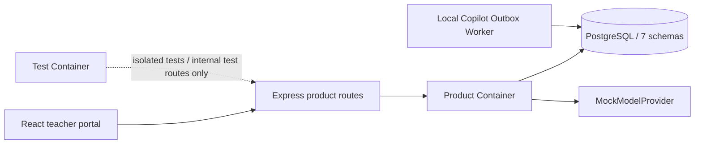
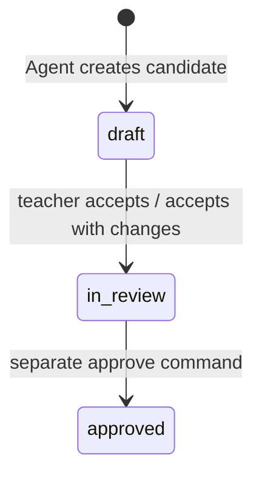

# Gate 2.4 — Teacher Copilot 正确性与可恢复性

## 1. Gate 目标

Gate 2.4 不扩展产品面，而是修正既有 Teacher Copilot 切片的安全、状态和恢复语义：

> 教师提交的真实请求必须成为持久化 Task 输入；Proposal 必须可在刷新或直接 URL 后继续审阅；接受建议只能形成待审核版本，单独批准后才改变当前正式 TeachingPlan。

本 Gate 基于 `feat/teacher-portal-ui-v1` 的已验证提交 `43c8e03a8e0e7060989d886442de283ae6f43fc5` 实施。

## 2. 范围与非目标

### 已实现

- 开发/E2E/PostgreSQL 测试数据库生命周期隔离；
- Demo identity 默认 fail closed、显式本地绕过和注入 Audit；
- Product/Test Composition Root 分离；
- Teacher Task typed request 持久化；
- Proposal 待审列表、详情、Evidence、Disposition 和直接 URL 恢复；
- `draft → in_review → approved` 生命周期及四类明确读取；
- Disposition 和 Approval 并发、幂等、版本冲突；
- 应用级本地 Outbox Worker；
- Copilot、Teaching Plan、Runs 和教学页真实入口的最小 UI 调整。

### 明确未实现

正式登录/SSO、Todo、Calendar、独立 TeacherWorkItem、完整课程树、LocalObjectStore、文件上传/版本、PPT/Word/Excel、新 Artifact 类型、通用 AgentContextBinding、学生长期模型、DeepSeek、云部署、多 Agent、v0.4。

## 3. Composition Root



- `apps/api/src/index.ts` 只创建 Product Container。
- Product routes 只调用 PostgreSQL-backed read/command services；没有内存 Repository 或 Mock fallback。
- Gate 1A 内存容器通过 Test Container 保留，只有测试显式提供并开启 internal routes 时可用。
- API/PG 失败会返回错误，不会回落到前端数组或伪成功。

## 4. Teacher Task Request

请求不是新聚合，而是现有 `work.task` 的类型化输入：

```text
request_text
actor_ref
purpose
course_run_ref
learning_objective_refs[]
selected_evidence_refs[]
created_at
request_version = 1
```

物理存储为 `work.task.request_payload jsonb` 与 `request_version`。同一对象还会：

- 写入 Resolved Learning Interaction Contract 的 sealed payload；
- 写入 `runtime.context_manifest.request_summary`；
- 进入 RunManifest hash；
- 作为真实 `requestText` 传给 `MockModelProvider`；
- 由 Proposal detail 和 Run explanation 读取。

系统只保存请求摘要与显式上下文引用，不记录隐藏思维链。

## 5. Proposal 恢复 API

| Method | Route | 语义 |
|---|---|---|
| `POST` | `/api/v1/demo/teacher-copilot/tasks` | 创建幂等 Task/Run/Proposal |
| `GET` | `/api/v1/demo/teacher-copilot/proposals` | 只列 pending Proposal |
| `GET` | `/api/v1/demo/teacher-copilot/proposals/:proposalRevisionRef` | 读取请求、Task/Run、Contract、Evidence、策略、diff、draft、Disposition、in-review |
| `POST` | `/api/v1/demo/suggestions/:proposalRevisionRef/dispositions` | 最终处置 |

Proposal 详情以 tenant-scoped PostgreSQL 查询重建，不依赖 React state 或 `sessionStorage`。Web 深链接为 `/copilot/proposals/:proposalRevisionRef`；刷新不会触发新的模型执行。

## 6. TeachingPlan 生命周期与读取语义



- Agent 只能创建 Proposal 和 `draft`。
- `accepted` / `accepted_with_changes` 创建新的 `in_review` Revision，parent 是该 Proposal 的 draft。
- `rejected` / `deferred` 不创建 in-review Revision，不修改当前计划。
- `in_review` 不等于当前正式教学计划。
- 单独 approve command 创建新的 `approved` Revision，parent 是 in-review Revision。
- `artifact.artifact.current_approved_revision_ref` 只指向最新批准版本。
- `current_in_review_revision_ref` 只指向当前待审核版本，批准后清空。
- ArtifactRevision 的数据库 Trigger 拒绝原地 `UPDATE` / `DELETE`；修改已批准内容必须走新 Revision。
- Gate 2.4 不创建 `published`。

读取 API 不再使用含混的 `latest`：

| Route | 返回 |
|---|---|
| `/teaching-plan/current-approved` | 当前正式、已批准版本 |
| `/teaching-plan/current-in-review` | 当前待审核版本或 `null` |
| `/teaching-plan/drafts` | draft 列表 |
| `/teaching-plan/history` | 全部 TeachingPlan Revision 历史 |

## 7. Disposition 并发与幂等

每个 Proposal Revision 只能有一个有效最终处置：

- Proposal Revision 在事务内 `FOR UPDATE`；
- 客户端必须提供 `expectedProposalRevisionNumber`；
- 处置保存不含 idempotency key 的语义 fingerprint；
- 同一 idempotency key + 同 payload 返回原结果；
- 同一 idempotency key + 不同 payload 返回幂等冲突；
- 不同 key + 同一语义 payload 返回原 Disposition；
- 不同 key + 不同最终处置返回 `409 PROPOSAL_ALREADY_DISPOSED`；
- 并发不同处置只有一个提交；
- 版本不匹配返回 `409 PROPOSAL_VERSION_CONFLICT` 及结构化 details。

四种结果：

| Disposition | 新建 in_review | 修改 current approved | 创建实施事实 |
|---|---:|---:|---:|
| `accepted` | 是 | 否 | 否 |
| `accepted_with_changes` | 是 | 否 | 否 |
| `rejected` | 否 | 否 | 否 |
| `deferred` | 否 | 否 | 否 |

处置始终返回 `implementationObserved=false`、`instructionalDecisionCreated=false`。

## 8. Demo identity

- 默认无身份：`401 AUTHENTICATION_REQUIRED`。
- 只提供一个身份 Header：`401`。
- 错误租户或 actor：`403 AUTHORIZATION_DENIED`。
- 只有 `DEMO_AUTH_BYPASS=true` 且 `APP_ENV=local|demo` 才能注入合成教师。
- production / `NODE_ENV=production` 禁止 bypass。
- 每次注入写 `DemoIdentityInjection` Audit。

本 Gate 不实现正式登录或 SSO。

## 9. Outbox：同步状态与异步事件

业务正确性不依赖 Worker。以下状态在原业务事务中同步提交：

- Task / TaskRun / Resolved Contract；
- ModelExecution / AgentRun / ContextManifest；
- Proposal / TeachingPlan Revision；
- SuggestionDisposition；
- current approved / current in-review pointers；
- Authorization、Idempotency 与 Audit；
- 各模块 Outbox record。

本地 Worker 消费：

- Work：`TeacherCopilotTaskCompleted`、`SuggestionDisposed`、`TeachingPlanApproved`；
- Runtime：`AgentRunCompleted`；
- Capability：`MockModelExecutionCompleted`；
- Artifact：`PedagogicalSuggestionProposed`、`TeachingPlanDraftProposed`、`TeachingPlanSubmittedForReview`、`TeachingPlanApproved`。

Worker 使用 `pending/retry/processing`、租约到期回收、attempt count 和 `work.outbox_consumer_effect` 幂等收据。停止 Worker 不影响业务事务；重启会恢复处理。该语义是 at-least-once + 幂等消费，不是 exactly-once。

## 10. 数据库生命周期安全

- 开发 Compose Project：`edu-agent-dev`；
- 开发 Volume：`edu-agent-dev-postgres-data`；
- E2E/PG tests：每次独立 `edu-agent-e2e-<run-id>` Project 与 Volume；
- 临时 Volume 在 `finally` 中清理；
- runner 对比测试前后开发 Volume identity、`environments/local/postgres/.env.local` 和本地上传目录；
- 删除长期开发 Volume 必须设置 `ALLOW_DESTRUCTIVE_DB_RESET=1`，否则在 Docker 调用前拒绝。

`git clean -fdx` 不属于任何测试或 Demo 启动链。

## 11. UI 行为

- Copilot 接受真实任务文本，显示待审 Proposal，支持直接 URL 与刷新恢复；
- Proposal 详情显示教师请求、所选 Evidence、策略和结构化 diff；
- 教师可接受、修改后接受、拒绝、延后；
- 已处置 Proposal 的控制区锁定，不显示可重复处置的假入口；
- Teaching Plan 明确分开“当前已批准”和“当前待审核”，批准是独立按钮；
- Runs 显示请求摘要、Evidence refs、权限、Audit 和 Outbox 状态；
- 教学页“调整下一课”和“生成新版本”进入真实 Copilot；
- 一级路由、侧边栏、字体和 Design Token 未重构。

## 12. 验收证据

自动测试覆盖：

- typed request 的 Task/Contract/ContextManifest/Mock input 持久化；
- Proposal list/detail/refresh recovery；
- current approved、current in-review、drafts、history；
- reject/defer 不改变 current；
- 四种 Disposition、并发、幂等和结构化冲突；
- approval、approval replay、Revision immutable；
- Worker 租约崩溃恢复；
- identity 401/403/bypass/Audit；
- Product/Test Root 边界；
- E2E 临时 Volume 独立与受保护本地状态不变；
- Playwright 完整接受/批准/拒绝/Run 链路。

验收命令见根 [项目 README](../../README.md)。
