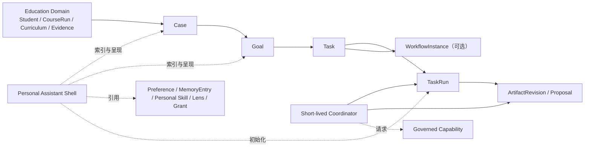
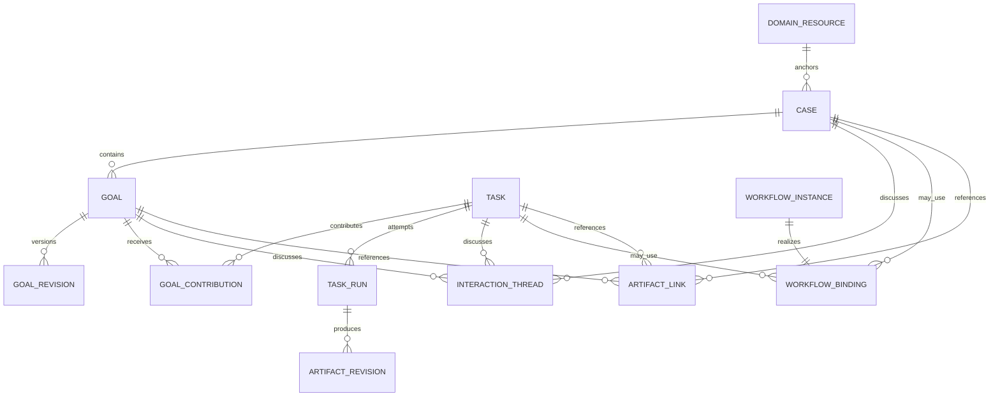
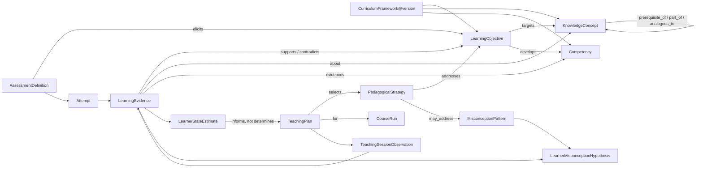
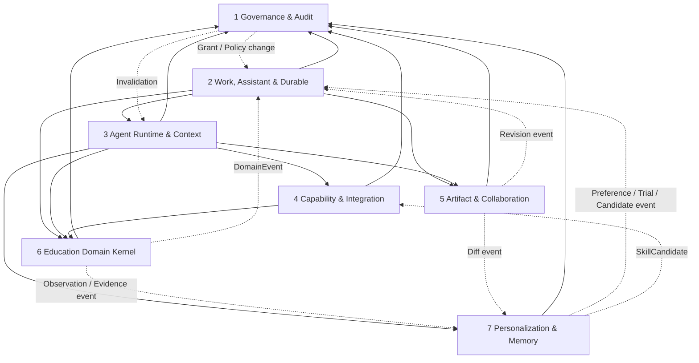

# 1. 对上述批评的逐项接受、部分接受或拒绝

> 修订对象：《教育智能体平台架构红队审查与 v0.3 建议》<br>
> 修订版本：v0.3.1<br>
> 修订原则：保留 v0.3 的安全边界，修复其对长期连续性、程序性个性化和教育领域语义的过度削弱；不恢复长期自主 Agent、Workspace 上帝对象或通用 Memory 真值库。

## 1.1 总体裁决

Claude 的核心诊断成立：v0.3 对 v0.2 做了必要减法，但把“不得让 Agent 持有长期权力”扩大成了“系统不应持有长期个人连续性”，又把“Memory 不得成为业务事实源”扩大成了“Memory 不应有持久对象”，并将 Skill 精简到了难以编译稳定个人做法的程度。Education Domain Services 也确实停留在占位名，尚不足以保证系统真正理解课程、学习证据、教学决策与成长。

但 Claude 的修正也有四个需要阻止的反向风险：

1. `Case → Goal → Task → TaskRun` 不能变成所有教育活动必须经过的严格树；`CourseRun` 是领域实体，不是天然的 Case，简单 Query 和原子 Command 也不需要 Case/Task。
2. Personal Assistant Shell 不能重新包装成拥有隐藏人格、全量记忆和跨角色上下文的长期 Agent；它只能是持久配置、索引和连续性投影。
3. MemoryEntry 不能成为新的杂物箱。学生敏感陈述、正式目标、已确认偏好和可执行方法，仍应分别进入 Observation/Case、Goal、Preference 和 Skill。
4. 风险等级由“用途和影响”决定，而不只由对象名称决定。格式偏好用于私人教案可能是 A 级，用于处分通知或对外承诺时可能上升到 C 级。

## 1.2 逐项裁决

| 批评或修改建议 | 裁决 | v0.3 的问题 | Claude 建议中需要修正的部分 | v0.3.1 处理 |
|---|---|---|---|---|
| Task 不能成为整个平台唯一中心；增加 Case/Goal | **部分接受** | v0.3 将 Goal 降为 Task 字段，并让 Task 承担过多长期连续性 | 不采用强制树；CourseRun、Student、Class 等仍是独立领域聚合，Task 也可独立存在 | 建立“领域对象—Case/Goal—Task/TaskRun”三种状态中心；Goal 成为独立、版本化对象 |
| 删除长期进程但保留 Personal Assistant Shell | **部分接受** | Interaction Assistant 只剩 UX 人格，缺少可见的跨会话连续性 | Shell 不能持有隐藏认知状态、角色权限或一个固定心理人格 | 新增持久 Shell；只持有交互契约和对 Preference、MemoryEntry、Skill、Case、Goal、Lens、Grant 的引用/投影 |
| Skill 允许非持久 Procedure Hints | **接受** | 纯说明型 Skill 每次仍需重新规划，稳定性和成本收益不足 | 不新增可独立运行、可等待或可重试的 Procedure 引擎 | Skill 内加入类型化 Procedure Hints，经编译形成当前 TaskRun 的 ExecutionPlan |
| 增加独立 Playbook/Procedure 层 | **拒绝进入 v0.3.1** | — | 它会与 Skill、ExecutionPlan、Workflow 形成第四套控制流 | 先采用带 Procedure Hints 的 Skill；只有 Spike 证明其表达不足才重新立项 |
| MemoryEntry 应成为非权威持久对象 | **接受但严格限界** | 仅从日志和事实源临时重建，会丢失用户主动保存的叙事、反思与压缩经验 | MemoryEntry 不能复制 DomainRecord、Goal、Preference、LearnerStateEstimate 或 Skill | 新增 Narrative、Episodic、Reflective、ProceduralSummary 四类；可审查、编辑、版本化、过期和删除 |
| Profile 继续作为可重建投影 | **接受** | v0.3 此处正确 | 不应因新增 MemoryEntry 又把 Profile 变成写入源 | Profile/Personalization View 只读聚合 Canonical Source、MemoryEntry 和有效推断 |
| 补齐 Education Domain Kernel | **完全接受** | “Education Domain Services”只是容器名，无法约束教学语义 | 领域模型不能把教学流派固化成算法，也不能把逻辑图等同于图数据库 | 增加课程、目标、概念、能力、测评、尝试、证据、推断、策略、计划和支持 Case 的明确模型 |
| 所有个性化不应走同一重型发布链 | **接受** | v0.3 虽提到透明低风险试验，但主数据流仍只有一条 Candidate 发布链 | A/B/C 不能仅按数据类型分类；同一偏好在不同用途下风险不同 | 使用 effect × subject × audience × reversibility × sensitivity 分级；A 轻量、B 发布、C 专业决策 |
| Ingress 增加 Query | **接受** | 把纯读取写成 Command 破坏缓存、副作用和 Task 创建语义 | 自然语言并不天然是 Query，仍需解析意图 | `Query / Command / DomainEvent / ObservationEvent / WorkflowSignal` 五类信封 |
| Space 可授权本地协作资源 | **部分接受** | “Space 不授予任何权限”过于绝对 | 含学生敏感数据的 Space-local Artifact 不能仅凭成员身份开放 | SpaceMembership 可授予本地 read/comment/propose；仍须同时满足内容分类、来源与外发 Policy |
| TaskWorkingSet 不保存长期 access 结论 | **接受** | `access: aggregate` 容易被当成持久授权 | 即使保存 decision expiry，Commit 仍不能信任旧决定 | 只保存 ResourceRef、purpose、requested field mask/granularity、decision reference 和 source version hint |
| WorkflowInstance 是长期运行状态真值源 | **接受并加限定** | Task 与 Workflow 都保存 waiting/running，可能双写分裂 | Workflow 完成不等于 Task 已验收，Task 生命周期仍有自己的权威状态 | Workflow 写内部运行状态并发事件；Task 仅投影 execution/attention，完成由 Work 模块验收 |
| 增加 AuthorizedContextPlan | **接受** | v0.3 有预授权流程，但没有冻结“授权后可取什么”的一等契约 | 它只是授权决定的执行计划，不是新的授权凭证 | Context 模块生成不可变计划，逐项引用 AuthorizationDecision；过期或提交时重算 |
| CapabilitySpec 拆为三层 | **接受** | 单 Schema 字段过多，会产生虚假默认值和配置疲劳 | GovernanceProfile 不能由 Tool 发布者自证可信 | Descriptor/ExecutionContract 由 Capability 模块管理；GovernanceProfile 由治理模块管理 |
| Artifact 分为四类 | **接受并采用组合模型** | v0.3 分类较多但共用一个发布状态机 | “家长消息”可能同时有内容草稿和发送提案，不能强行只归一类 | ContentArtifact、OperationalProposal、ConfigurationAsset、EvidenceAsset 共用 Revision 基础设施，各自有状态机 |
| 19 个逻辑组件收敛到 7 个模块 | **接受（工程层）** | 即使模块化单体，19 个顶级 API 仍会造成首版契约膨胀 | 不能为了凑 7 个模块抹掉内部状态所有权和安全边界 | 收敛为 7 个模块化单体模块，逻辑子组件保留为内部包，不独立部署 |
| Spike 的统一 95% 等门槛过于武断 | **接受** | 部分数值没有真实基线，只适合作为讨论初值 | 安全结果仍应有硬门，例如未授权执行和跨租户泄漏必须为零 | 先做基线与风险分层，再冻结质量阈值；安全不变量保持零容忍 |

# 2. 修订后的核心架构裁决

## 2.1 不再寻找唯一中心

v0.3.1 使用三个相互连接、互不夺权的中心：

| 中心 | 核心对象 | 解决的问题 | 状态权威 |
|---|---|---|---|
| 教育领域中心 | Student、Class、CourseRun、CurriculumFramework、Assessment、LearningEvidence | 教什么、谁在学习、发生了什么、证据是什么 | Education Domain Kernel |
| 长期连续性中心 | Case、Goal、Personal Assistant Shell | 为什么持续工作、长期想改变什么、系统如何保持人与目标的连续性 | Work & Assistant；个性化数据由各自来源所有 |
| 有限执行中心 | Task、TaskRun、WorkflowInstance、Artifact/Proposal | 这一次要完成什么、怎样执行、等待什么、产出什么 | Work、Durable Workflow、Artifact 各自所有 |

因此新的总裁决是：

> 领域事实以教育对象为中心；长期协作以 Case/Goal 为中心；有限执行以 Task/TaskRun 为中心；个人连续性以 Personal Assistant Shell 为入口，但任何一个对象都不能成为全平台上帝对象。



## 2.2 十三项最终裁决

1. `CourseRun`、Student、Class 和 Curriculum 是长期领域对象，不塞入 Case；Case 只是围绕一个持续目的建立的协调边界。
2. `Goal` 是独立、版本化、可协商的结果意图，不再是 Task 的普通字段；Task 完成不自动证明 Goal 达成。
3. Task 必须有限、可验收；纯 Query 和简单原子 Command 可以不创建 Task。
4. `WorkflowInstance` 只拥有可恢复过程状态；Case、Goal、Task 和领域状态均不由 Workflow 直接改写。
5. Personal Assistant Shell 持久存在，但不是进程、Actor、权限主体、记忆数据库或领域事实源。
6. 每次开放任务创建短生命周期 Task Coordinator；每次 Query 可创建只读 AgentRun，但不得因“回答问题”静默升级为 Command。
7. Skill 采用类型化、非持久 Procedure Hints；它能降低重复规划成本，但不能包含 Timer、Signal、Retry、Compensation、Secret 或授权。
8. Memory 分为 Canonical Source、持久 MemoryEntry 和运行期 Memory View；MemoryEntry 对外部现实不具业务权威。
9. Profile 保持为可重建投影；学生状态采用带证据、不确定性、时效和用途限制的 LearnerStateEstimate。
10. Education Domain Kernel 以“目标—活动/测评—尝试—证据—推断—教学响应—复评”闭环组织，而不是以文档生成为中心。
11. 个性化按 A/B/C 风险分流；B 级试用用独立 TrialBinding，C 级不能静默试用或自动发布为个体决策。
12. Space 只授予 Space-local 协作权限；TaskWorkingSet 和 Context 都不能产生领域数据权限。
13. 物理实现采用 7 模块模块化单体；跨模块通过应用接口和 Outbox 事件通信，不先拆微服务。

## 2.3 “懂人、懂教学、会成长”的工程含义

这三个目标不能靠一个更长的 Prompt 实现：

- **懂人**：用户能共同维护 Goal、Preference、MemoryEntry 和 Personal Skill；系统保留情境、反例和变化历史，不把行为压缩成固定人格。
- **懂教学**：任何学生状态推断都必须能回到 LearningObjective、Attempt、LearningEvidence 和推断模型；任何策略建议都说明目标、机制、适用情境、证据与再评条件。
- **会成长**：系统学习的是可撤销的偏好、可验证的程序能力和有时效的教育推断；它也要主动保留探索、反思、复评和不同策略的空间。

这里吸收的是教育实践约束，而不是新的 Agent 框架：

- [UNESCO 的生成式 AI 教育指南](https://www.unesco.org/en/articles/guidance-generative-ai-education-and-research?hub=195885)要求以人的能动性、年龄适切性和教育目的为中心；
- [LearnLM 的教育原则](https://blog.google/products-and-platforms/products/education/google-learnlm-gemini-generative-ai/)把主动学习、认知负荷、动态适配、好奇心和元认知作为评价维度，而不仅是答案正确率；
- [Tutor CoPilot 的随机试验](https://arxiv.org/abs/2410.03017)和 [ASSISTments 的实践研究](https://ies.ed.gov/learn/blog/assistments-research-practice-scale-education)说明 AI 更可靠的角色之一是帮助教师/辅导者采用更好的策略并根据证据调整教学；
- [Khanmigo 的设计实践](https://blog.khanacademy.org/khan-academys-7-step-approach-to-prompt-engineering-for-khanmigo/)强调提示、自我解释和主动学习，而 [无护栏生成式 AI 的课堂实验](https://doi.org/10.1073/pnas.2422633122)提醒系统不能把即时完成率误当成独立学习；
- [OECD 形成性评价框架](https://www.oecd.org/en/publications/unlocking-high-quality-teaching_f5b82176-en/full-report/using-formative-assessment-and-feedback_189fb6dc.html)把学习目标、诊断、反馈和适应教学视为循环过程；这正是 Case/Goal 与 LearningEvidence 持续连接的原因。

## 2.4 修订后的 Ingress

```typescript
type IngressEnvelope =
  | QueryEnvelope
  | CommandEnvelope
  | DomainEventEnvelope
  | ObservationEventEnvelope
  | WorkflowSignalEnvelope;
```

| 类型 | 业务语义 | 是否可产生业务副作用 | 默认持久工作对象 |
|---|---|---:|---|
| Query | 获取、解释或比较当前信息 | 否；审计和缓存不算业务副作用 | 无；复杂只读推理保留 RunManifest |
| Command | 请求系统改变状态或产生持久成果 | 可能 | 原子动作可直达；多步、异步、可审查工作创建 Task |
| DomainEvent | 权威领域事实已经发生 | 事件本身否；消费者可派生 Command | 规则满足时创建/更新 Case、Goal 或 Task |
| ObservationEvent | 记录行为、表现或反馈 | 不得直接改变正式状态 | 进入证据/学习管道 |
| WorkflowSignal | 定向推进既有 WorkflowInstance | 由 WorkflowDefinition 决定 | 不新建 Task，除非流程显式派生 |

自然语言输入只是一种媒介。系统先判断它表达 Query 还是 Command；若 Query 在回答过程中需要保存 Artifact、发送消息或修改状态，必须生成可见的 CommandProposal，不能静默升级。

## 2.5 修订后的核心不变量

1. Shell、Agent、Skill、MemoryEntry、Lens、Space 和 Context 均不授予领域权限。
2. Agent 不拥有 Case、Goal、Task、Workflow、Artifact 发布状态或 DomainRecord。
3. 长期 Workflow 的执行状态只有 WorkflowInstance 可写；Task 只持有粗粒度投影。
4. MemoryEntry 不覆盖 Canonical Source；Profile 不回写任何来源。
5. LearnerStateEstimate 是用途受限的推断，不是学生属性或机会资格。
6. Skill 的 Procedure Hints 只能编译为当前 TaskRun 的 ExecutionPlan，不能自行持久、等待或重试。
7. Candidate/Trial/Published 使用不同对象和命名空间；试用不能通过改状态伪装成已发布能力。
8. Space-local 权限不能沿 Artifact lineage 反向获得源学生数据，也不能覆盖敏感内容 Policy。
9. 任何持久副作用仍需 Commit-time Authorization、幂等和审计。
10. 教学效率指标不得压过学习者能动性、独立完成、迁移、公平机会和教师专业判断。

# 3. `Case/Goal/Task/TaskRun` 完整模型

## 3.1 模型不是强制树

主路径是：

```text
Case → Goal → Task → TaskRun
```

但约束是：

- Case 可有多个 Goal；Goal 必须属于一个主 Case，但可以引用其他 Case；
- Task 可以有一个 `primary_goal_id`，并通过 `GoalContribution` 支持其他 Goal；
- 一次性 Task 可以没有 Case/Goal；
- CourseRun、Student、Class、CurriculumFramework 是 Case 的 anchor，不是 Case 的父节点；
- Goal 可以被多个 Task 推进，也可以因新证据被修订、暂停或放弃；
- Case/Goal 可以长期存在而没有运行中的 Task 或 Workflow；
- 一个 Case 不应成为其引用的领域数据副本或授权容器。



## 3.2 对象定义

### Case

Case 是跨 Task、跨时间、围绕一个持续教育目的形成的协调边界。

```yaml
case:
  id: case_student_support_88
  kind: student_support
  purpose: 支持学生在一次函数单元中的理解、信心与独立解题
  anchor_refs:
    - learner:student_88
    - course_run:math_8_3_2026_fall
  participant_refs:
    - role:case_steward/teacher_1024
    - role:learner/student_88
  confidentiality: restricted_student_support
  lifecycle_state: active
  review_policy_ref: review_every_2_weeks
  opened_at: 2026-09-10
  version: 3
```

Case 不保存学生成绩、心理结论、课程进度或沟通全文；它只引用这些领域对象和成果。

### Goal

Goal 是某个时间范围内共同追求、可依据证据重新讨论的结果意图。

```yaml
goal:
  id: goal_linear_function_transfer
  case_id: case_student_support_88
  active_revision: 2
  owners: [teacher_1024, student_88]
  outcome_statement: 能在新的生活情境中解释斜率含义并独立建模
  indicator_refs:
    - evidence_rule:transfer_task_rubric_v2
    - learner_self_report:confidence_check
  horizon: 2026-10-31
  review_at: 2026-10-01
  lifecycle_state: active
```

Goal 不等于 LearningObjective：前者是情境化承诺，后者是课程/教学构念。Goal 可引用多个 LearningObjective。

### Task

Task 是有限、可交付、可验收的工作承诺。

```yaml
task:
  id: task_analyse_attempts_17
  primary_goal_id: goal_linear_function_transfer
  objective: 分析最近两次迁移题尝试并形成教学调整建议
  acceptance:
    - 引用全部纳入分析的 Attempt
    - 区分观察、推断和建议
    - 教师完成审查
  work_state: active
  execution_projection: running
  attention_projection: none
  contract_version: 2
```

`execution_projection` 不是 Task 自己的运行真值。它从 TaskRun 或 WorkflowInstance 单向投影。

### TaskRun

TaskRun 是对某一 TaskContract 版本的一次执行尝试。

```yaml
task_run:
  id: run_17_02
  task_id: task_analyse_attempts_17
  task_contract_version: 2
  run_kind: bounded_agent
  state: running
  plan_ref: execution_plan_501
  run_manifest_ref: manifest_501
  started_at: 2026-09-18T09:00:00Z
```

TaskRun 不等待跨天 Signal。出现长期等待时，它以 `handed_off` 结束，并由 WorkflowInstance 接管耐久过程。

### 连接对象与版本对象

`Case → Goal → Task → TaskRun` 中的箭头表示可追溯的工作关系，不表示后一对象的全部状态归前一对象所有。以下对象把关系显式化：

```yaml
goal_revision:
  id: goal_linear_function_transfer_r2
  goal_id: goal_linear_function_transfer
  outcome_statement: 能在新的生活情境中解释斜率含义并独立建模
  indicator_refs: [transfer_task_rubric_v2, confidence_check]
  horizon: 2026-10-31
  review_at: 2026-10-01
  change_reason: 新证据显示程序计算已稳定，目标转向迁移与解释
  authored_by: [teacher_1024, student_88]
  created_at: 2026-09-18T08:00:00Z
```

GoalRevision 不可变；修订 Goal 时创建新版本，不能覆盖旧目标后伪造连续进展。

```yaml
goal_contribution:
  id: contribution_711
  goal_id: goal_linear_function_transfer
  task_id: task_analyse_attempts_17
  relation: evidence_for_review
  expectation: 形成是否调整教学策略所需的证据摘要
  result_refs: [artifact:evidence_analysis_17@r3]
  assessment: accepted
  assessed_by: teacher_1024
```

GoalContribution 只表达 Task 如何预期或实际推进 Goal。Task 完成不会自动把 Goal 标为 achieved；Goal owner 在复评时依据多个 Contribution 与领域证据判断。

```yaml
task_contract_revision:
  task_id: task_analyse_attempts_17
  version: 2
  objective: 分析最近两次迁移题尝试并形成教学调整建议
  acceptance_refs: [acceptance_set_17_v2]
  required_output_types: [EvidenceAnalysisDraft, OperationalProposal]
  acting_context_intent: course_teacher
  created_by: teacher_1024
```

每个 TaskRun 固定一个 TaskContractRevision；Task 需求改变时创建新版本，运行中的 Run 不热更新。

| 连接对象 | 含义 | 状态所有者 | 写入者 | 读取者 | 生命周期 |
|---|---|---|---|---|---|
| GoalRevision | Goal 的不可变语义版本 | Work & Assistant | Goal owner/参与者；Agent 只起草 Proposal | Case、Runtime、教育领域、审计 | append-only；被后续 revision supersede |
| GoalContribution | Task 与一个或多个 Goal 的预期/实际贡献 | Work & Assistant | Task/Goal owner、验收器 | Goal review、Shell、分析 | proposed → active → assessed → accepted/rejected/superseded |
| TaskContractRevision | 某次可执行承诺的不可变版本 | Work & Assistant | Task owner/Task Controller | TaskRun、Workflow、审计 | append-only；新 Run 选择确定版本 |
| WorkflowBinding | Case/Task 与 WorkflowInstance 的用途关系，不保存流程状态 | Work & Assistant | Task/Case Controller | UI、投影器、Durable Engine | proposed → active → completed/detached |
| ArtifactLink | Case/Goal/Task/Run 与特定 ArtifactRevision 的 input/output/evidence/proposal 关系 | 关系发起对象的模块；Artifact 校验 revision | 用户、Controller、受控 Runtime | Case/Goal/Task、lineage、审计 | append/corrected；删除受两端 retention 约束 |
| ThreadAnchor | InteractionThread 的唯一主锚点与可见性策略 | Work & Assistant | Thread Service | UI、Context、审计 | active → archived；换主锚点必须新建 Thread |

## 3.3 状态所有权矩阵

| 对象/状态 | 状态所有者 | 允许写入者 | 主要读取者 | 生命周期 |
|---|---|---|---|---|
| Case lifecycle、participant、anchor | Work & Assistant 模块 | Case steward、授权协作者、确定性 Case 规则 | Shell、教育领域、Runtime、Artifact | proposed → active ↔ monitoring/paused → resolved → closed；可 reopened |
| Goal identity 与 GoalRevision | Work & Assistant 模块 | Goal owner/参与者；Agent 只能提交 GoalProposal | Case 参与者、Runtime、教育领域 | draft → active ↔ paused → achieved/not_achieved/abandoned/superseded |
| Task work state、验收 | Work & Assistant 模块 | Task owner、Task Controller、授权审批者 | Shell、Runtime、Workflow、协作者 | proposed → ready → active → review → completed；cancel_requested → cancelled |
| Task execution/attention projection | Work & Assistant 投影器 | 只消费 Run/Workflow 事件 | UI、Shell、通知 | 随源事件重建，不人工直接改 |
| TaskRun state | Agent Runtime & Context；记录索引由 Work 管理 | Runner/Job Worker 通过受控 Run API | Task Controller、审计、Evaluator | queued → running → succeeded/failed/timed_out/cancelled/handed_off |
| WorkflowInstance 内部状态 | Work & Assistant 的 Durable Engine | Workflow Engine；人/系统只发送合法 Signal | Task 投影器、Case、审计 | created → running ↔ waiting_* → compensating/completed/failed/cancelled |
| InteractionThread 与 Message | Work & Assistant 模块 | 参与者、Assistant UI；系统通知有明确 emitter | 参与者、受授权 Runtime | open → archived；Message 追加写、不可作为状态覆盖 |
| ArtifactRevision 内容版本 | Artifact & Collaboration 模块 | 用户或 AgentRun 经 Artifact API | Task、Case、Goal、审查者 | immutable revision chain |
| Artifact/Proposal 发布或承诺状态 | 对应 Artifact 类别的所有模块 | 见第 9 节分类状态机 | Domain、Work、协作者 | 各类型独立，不复用一个通用状态机 |

## 3.4 Task 与 Workflow 的单向同步

当 Task 进入 Durable Workflow：

```text
Task(work_state = active)
→ StartWorkflow command
→ WorkflowInstance(state = running)          # 真值
→ WorkflowStateChanged
→ Task execution_projection = running         # 投影

WorkflowInstance(state = waiting_signal)       # 真值
→ WorkflowStateChanged
→ Task execution_projection = waiting          # 投影
→ Task attention_projection = external_party   # 投影
```

规则：

- Task Controller 不能直接把 Workflow 从 waiting 改成 running；
- Workflow 收到 Signal 后先提交自身状态与 Outbox，再更新 Task 投影；
- Task 取消先进入 `cancel_requested`，向 Workflow 发送取消 Signal；Workflow 完成补偿/终止后，Task 才进入 cancelled 或 review；
- Workflow completed 只表示过程完成。Task Controller 还要检查 Artifact、Domain 状态和 acceptance criteria，才能把 Task 设为 completed；
- 投影失败可以从 Workflow History 重建，不产生双主状态。

## 3.5 InteractionThread 的关系

InteractionThread 允许四种主锚点：

| 主锚点 | 用途 | 何时应新开 Thread |
|---|---|---|
| Personal Assistant Shell | 日常入口、未归类问题、跨会话恢复 | 对话形成明确 Case/Task 后可派生专用 Thread |
| Case | 长期支持、课程改进、家校协作讨论 | 目的或可见参与者显著变化 |
| Goal | 围绕目标定义、证据和复评 | 目标被 supersede 后可归档 |
| Task | 当前执行、澄清、审查和接管 | 新 Task 或权限参与者变化 |

Message 可以链接多个 Case/Goal/Task/Artifact，但一个 Thread 只有一个主锚点和一套可见性规则。聊天内容不直接更新 Goal、MemoryEntry 或 DomainRecord；它只能产生显式 Proposal/Command。

## 3.6 三个纵向例子

| 场景 | 领域锚点 | Case | Goal | 典型 Task |
|---|---|---|---|---|
| 一学期课程实施 | CourseRun、Class、CurriculumFramework | `course_delivery` 或 `teaching_improvement` Case，可选 | 改善一次函数单元的理解与迁移 | 分析作业、调整教学计划、生成活动、单元复盘 |
| 学生支持 | Student、CourseRun、LearningEvidence | StudentSupportCase | 在约定周期内改善某构念表现、信心或独立性 | 诊断、共同设定支持、实施辅导、复评、协同沟通 |
| 班级管理 | Class、Term、Relationship | ClassManagementCase | 改善某一具体课堂协作问题，而非给班级贴标签 | 收集观察、共同讨论规则、实施小范围策略、复评 |

# 4. Personal Assistant Shell 模型

## 4.1 定义与边界

> Personal Assistant Shell 是每个用户在一个 tenant 内的持久协作入口、交互契约和连续性索引；它不是持续运行的 Agent。

它可以：

- 记住用户明确选择的交互方式；
- 展示 Active Case、Goal、Task、待审 Proposal 和近期 Artifact；
- 引用已确认 Preference、MemoryEntry、Personal Skill、Lens 和 AutomationGrant；
- 根据授权和情境初始化一次 Query 或 Task；
- 呈现主动建议、到期复评和用户可接管点；
- 让用户查看、修正、禁用和导出“系统当前如何适配我”。

它不能：

- 成为用户角色或授权主体；
- 持有领域数据副本、Workflow 状态或 Tool Secret；
- 直接调用 Tool、发布 Artifact、发送消息或修改 Case/Goal；
- 保存隐藏思维链、心理人格标签或无界聊天摘要；
- 自动把一次对话变成长期记忆；
- 跨 tenant 静默合并学校数据。

## 4.2 数据结构

```yaml
personal_assistant_shell:
  id: shell_teacher_1024_school_01
  person_id: teacher_1024
  tenant_id: school_01
  interaction_contract:
    assistant_name: 小助
    response_density: concise
    initiative_mode: suggest_with_digest
    explanation_mode: show_sources_on_demand
  reference_indexes:
    preference_view_ref: pref_view_1024
    memory_index_ref: memory_index_1024
    personal_skill_index_ref: skill_index_1024
    active_case_goal_view_ref: continuity_1024
    lens_refs: [lens_math_teaching, lens_homeroom]
    automation_grant_refs: [grant_weekly_draft]
  continuity_cursor:
    last_seen_event_id: event_99021
    last_opened_anchor: case_teaching_improvement_7
  version: 8
```

Shell 保存引用和投影游标，不复制引用对象内容。`interaction_contract` 只描述可编辑的协作呈现，不推断“性格”。

## 4.3 状态所有权

| 状态 | 所有者 | 写入者 | 读取者 | 生命周期 |
|---|---|---|---|---|
| Shell identity、tenant scope、interaction contract | Work & Assistant | 用户；迁移/管理员仅执行受控操作 | UI、Session Initializer、Runtime | provisioned → active → suspended → archived/deleted |
| Active Case/Goal/Task continuity view | Work & Assistant 投影 | Case/Goal/Task 事件投影器 | Shell UI、Context Planner | 可重建；不人工改 |
| Preference refs | Personalization & Memory | 用户/Preference 服务 | Shell、Context | 引用随 Preference 状态变化 |
| MemoryEntry refs | Personalization & Memory | Memory 服务 | Shell、Authorized Memory retrieval | 不在 Shell 内删除或改写 |
| Personal Skill refs | Capability & Integration | Skill 发布服务 | Shell、Runtime | candidate/trial/published 状态分别呈现 |
| Lens refs | Artifact & Collaboration | 用户/Lens 服务 | Shell UI | active/archived |
| AutomationGrant refs | Identity, Governance & Audit | 用户或有资格授权者 | Shell、Workflow、Policy | effective/expired/revoked |
| Continuity cursor | Work & Assistant | Session/Notification 服务 | Shell | 每次消费事件推进，可重建 |

## 4.4 新任务初始化

```text
用户输入
→ 解析 Query 或 Command
→ 读取 Shell 的 InteractionContract 和 continuity descriptors
→ 用户选择/系统建议 Case、Goal 与 ActingContext
→ Policy 计算可访问范围
→ Query：创建只读 RunManifest，按需构建 Context
→ Command：创建/关联 Task 和 TaskRun
→ Runtime 按 TaskContract 创建短生命周期 Coordinator
→ Coordinator 完成后终止；结果回到 Task/Artifact/Case 视图
```

Shell 只提供“从哪里继续”的候选。选择某个 Active Case 不等于获得该 Case 引用资源的访问权。

## 4.5 主动服务

Shell 不运行后台循环。主动性来自显式事件和授权：

```text
Case review_due / Goal revalidation_due / Workflow timer / DomainEvent
→ Proactivity Policy 检查用户偏好、打扰预算和 AutomationGrant
→ AssistanceOpportunity
→ 生成建议或创建被授权的 draft-only Task
→ Shell Inbox / Digest
→ 用户接受后形成 Command；或在 Grant 范围内执行
```

没有 AutomationGrant 时，系统最多提出建议。即使已有 Grant，Shell 也不是执行者；Workflow/Task Service 以授权服务身份执行，并在 Commit-time 再校验。

## 4.6 跨会话与跨学校

- 新会话加载的是 `ContinuitySnapshot`：Active Case/Goal、待用户事项、最近发布成果和适用 Preference 的描述级索引，不加载全部历史对话；
- 用户可以从 Case/Goal 时间线继续，也可以启动完全独立的 Query/Task；
- Shell 按 `(person_id, tenant_id)` 隔离。跨校只允许显式导出可移植 Preference、MemoryEntry 和 Personal Skill；
- 依赖原学校学生数据、内部模板、关系权限或 Tool 的引用在导出时剥离并生成依赖报告；
- 设备同步只同步 Shell 配置和授权可见的引用，不同步本地缓存或 Agent scratchpad。

## 4.7 “系统如何理解我”界面

界面固定分为：

1. **我明确设置的**：Preference、交互方式、通知和主动性；
2. **我保存的记忆**：MemoryEntry 及来源、时效、可见范围；
3. **正在尝试的**：TrialBinding、适用范围、退出按钮和当前效果；
4. **已经发布的个人方法**：Personal Skill 版本、依赖、评测和回滚；
5. **正在持续推进的**：Case、Goal、下一次复评；
6. **系统只是推测的**：Inference/Candidate，默认不影响行为；
7. **我授权系统做的**：AutomationGrant 的动作、对象、时间和撤销入口。

任何用户均可暂停长期适配而不影响基本功能。停用 Shell 个性化后，系统退化为显式指令 + 当前任务上下文，而不是拒绝服务。

# 5. Skill/Procedure/Workflow 边界裁决

## 5.1 三种方案比较

| 方案 | 表达能力 | 稳定性与成本 | 主要风险 | 裁决 |
|---|---|---|---|---|
| 纯说明型 Skill | 方法说明、示例、模板、Rubric | 每次需要模型重新解释和规划；Token 与行为波动较大 | 个性化工作习惯停留在 Prompt 层，难回放、难比较 | **不作为默认定义** |
| Skill + 非持久 Procedure Hints | 在说明之外提供类型化阶段、能力依赖、前置条件和后置检查 | 可预编译 PlanSkeleton、缓存能力解析、减少重复规划；仍允许任务级调整 | 若语法无限扩张会变成 Workflow DSL | **v0.3.1 最终采用** |
| 独立 Playbook/Procedure 层 | 可维护一套介于 Skill 与 Workflow 之间的执行模板 | 对复杂、重复操作可能更稳定 | 新增对象、发布链和控制流；与 Skill/Plan 重叠 | **当前拒绝**；只有 Spike 证明中间层不可避免时再立项 |

最终定义：

> Skill 是版本化、可测试的方法能力包；可以包含受限、非持久、非授权性的 Procedure Hints。Runtime 将其编译为本次 TaskRun 的 ExecutionPlan。Skill 本身不执行、不等待、不恢复。

## 5.2 SkillPackage

```yaml
skill_package:
  id: personal.lesson_planning.evidence_first
  version: 3.1.0
  owner_scope: user:teacher_1024
  status: published
  applicability:
    task_types: [lesson_planning]
    subject: mathematics
    lesson_modes: [new_topic, review]
  input_contract:
    required: [course_run_ref, target_learning_objectives]
    optional: [recent_learning_evidence_ref]
  output_contract:
    produces: [TeachingPlanDraft]
  capability_requirements:
    - id: retrieve_recent_learning_evidence
      effect_class: read
      input_type: CourseRunRef
      output_type: LearningEvidenceSummary
    - id: render_slide_deck
      effect_class: draft
      optional: true
  preconditions:
    - predicate: target_learning_objectives_present
    - predicate: curriculum_version_resolved
  procedure_hints:
    - phase: inspect_evidence
      intent: 先理解近期表现和不确定性
      consumes: [LearningEvidenceSummary]
      produces: [EvidenceInterpretationDraft]
      preferred_after: []
    - phase: choose_pedagogical_response
      intent: 比较多种教学策略，不把推断当结论
      consumes: [EvidenceInterpretationDraft, PedagogicalStrategyDescriptors]
      produces: [StrategyRationaleDraft]
      preferred_after: [inspect_evidence]
    - phase: compose_teaching_plan
      consumes: [StrategyRationaleDraft]
      produces: [TeachingPlanDraft]
      preferred_after: [choose_pedagogical_response]
  post_checks:
    - evaluator: objective_alignment
    - evaluator: evidence_claim_separation
    - evaluator: cognitive_load_and_active_learning
  resource_refs:
    - template:school_lesson_plan_v6
    - rubric:teaching_plan_quality_v3
  evaluation_suite_ref: eval:lesson_skill_31
```

## 5.3 Procedure Hints 的硬限制

允许：

- 有序或弱依赖的阶段；
- 每个阶段的意图、输入类型、输出类型；
- 抽象 Capability Requirement 与版本范围；
- 可判定的前置条件；
- 推荐步骤和可选步骤；
- 确定性 Evaluator 及教育质量 Rubric；
- 示例、反例、模板和资源；
- 任务级可覆盖的结构化参数。

禁止：

- 持久变量、Workflow state 或跨 Run cursor；
- Timer、Schedule、Signal、Human Approval；
- Retry policy、Compensation 或故障恢复；
- 任意循环、递归、动态子流程生成；
- Secret、凭证或直连 API；
- `allowed_tools` 形式的权限授予；
- 绑定某个用户角色以扩大 ActingContext；
- 直接写 DomainRecord、Preference、MemoryEntry 或 Skill 新版本；
- 未设置上限的“反思直到满意”。

Procedure Hint 中的 `capability_requirements` 只表示“做好此方法通常需要什么能力”。Runtime 仍需从当前 tenant 可用目录中解析 Descriptor，并对每次调用执行 Policy。依赖不存在或无权限时，Skill 应降级、向用户说明缺口或判定不适用，不能自行绕过。

## 5.4 从个人习惯编译为执行能力

```text
行为轨迹 / Artifact Diff / 用户反思
→ PatternCandidate
→ ProceduralSummary MemoryEntry（可选，供人审查）
→ SkillCandidate + Procedure Hints
→ 静态检查和历史回放
→ 用户编辑/确认
→ TrialBinding 固定 candidate version
→ 试用 Task
→ 发布 Personal Skill version
```

运行时：

```text
TaskContract
→ 选择 Skill@version
→ 检查 applicability / preconditions
→ 在已授权可发现能力中解析 Capability Requirements
→ 编译 PlanSkeleton
→ Task Coordinator 只允许做有界 PlanPatch
→ 固化 ExecutionPlan@TaskRun
→ 执行并运行 post_checks
```

这样能降低成本和波动：

- 方法阶段和输入输出无需每次由强模型重新发明；
- 能力解析结果按 tenant、Skill version 和 Policy version 短期缓存；
- ExecutionPlan 有确定版本，可进行 Tool mock、离线回放和新旧 Skill 对比；
- Task Coordinator 只处理当前例外，不重新规划整个方法；
- 所有实际步骤和结果仍记录在 TaskRun，而不污染 Skill。

## 5.5 相邻对象边界与状态所有权

| 对象 | 控制什么 | 状态所有者 | 写入者 | 读取者 | 生命周期 |
|---|---|---|---|---|---|
| SkillPackage | 可复用方法、资源、Procedure Hints、评测 | Capability & Integration | 用户/学校发布流程；Agent 只起草 Candidate | Runtime、Shell、评测 | draft → candidate → validated → trial_eligible → published → deprecated/retired |
| Procedure Hints | Skill 版本内的非持久方法骨架 | 随 SkillPackage | Skill 编辑/发布流程 | Plan Compiler | 无独立运行状态；版本随 Skill |
| PlanSkeleton | Skill 与当前 Task 的编译中间物 | Agent Runtime & Context | 确定性 Plan Compiler | Coordinator、Eval | 本次编译产生；TaskRun 固化后可丢弃 |
| ExecutionPlan | 本次 TaskRun 的实际步骤和依赖 | Agent Runtime & Context | Compiler + 有界 Coordinator PlanPatch | Runner、Task Controller、审计 | proposed → validated → running → completed/failed/superseded |
| WorkflowDefinition | 必须可靠发生的长期过程 | Work & Assistant | 受治理发布流程 | Durable Engine、管理员 | draft → validated → published → deprecated/retired |
| WorkflowInstance | Timer、Signal、等待、重试、补偿和实例状态 | Work & Assistant / Durable Engine | Workflow Engine | Task/Case 投影、审计 | created → running/waiting → completed/failed/cancelled |
| CapabilityDescriptor | 模型和人如何发现能力 | Capability & Integration | Capability 发布者 | Catalog、Runtime | draft → active → deprecated |
| AutomationGrant | 系统在何种范围可主动/自动执行 | Identity, Governance & Audit | 用户或有资格授权者 | Workflow、Policy、Shell | proposed → effective → expired/revoked |

裁决边界：

- 若“步骤只是推荐做法”，放 Skill；
- 若“这一次必须怎样做”，编译进 ExecutionPlan；
- 若“跨时间必须等待、恢复、重试或补偿”，放 Workflow；
- 若“周期性触发并允许执行”，必须另有 AutomationGrant；
- 若需要一个独立 Playbook 才能表达，先检查它是否其实是 Skill 的 Procedure Hints 或 WorkflowDefinition。

# 6. MemoryEntry 与 Memory View 模型

## 6.1 三层模型

| 层 | 含义 | 是否权威 | 是否持久 |
|---|---|---:|---:|
| Canonical Source | DomainRecord、Case、Goal、Task、Artifact、Observation、Inference、Preference、Skill 等原始来源 | 按各自语义决定 | 是 |
| MemoryEntry | 用户保存或确认的长期叙事、情景摘要、反思和程序经验 | 对外部事实非权威；对“用户保存了这段理解”本身权威 | 是、版本化 |
| Memory View | 面向一次 Query/Task 的授权召回结果 | 否 | Run 范围，可留 ContextManifest |

MemoryEntry 不是 Canonical Source 的副本。若一个陈述已有明确类型，应放回原类型：

- 有验收、期限和进展：`Goal`；
- 明确默认选择：`Preference`；
- 可执行稳定方法：`SkillPackage`；
- 学生表现：`LearningEvidence`；
- 学生掌握或误解结论：`LearnerStateEstimate` / Inference；
- 学校制度：`Policy`；
- 课程事实：DomainRecord。

## 6.2 四类 MemoryEntry

| 类型 | 作用 | 示例 | 禁止替代 |
|---|---|---|---|
| Narrative | 用户对当前阶段、意图和工作背景的自述 | “本学期我想逐步增加项目式学习，但不希望每节课都使用” | 不能代替可跟踪 Goal、身份或心理画像 |
| Episodic | 值得跨任务保留的一次经历摘要 | “上次三班用生活场景引入后讨论更充分；见课堂记录……” | 不能代替原 Task、Artifact、LearningEvidence |
| Reflective | 用户或经确认的系统反思、经验解释 | “低密度课件可能减少了讲解切换，但在复习课上信息不足” | 不能当作因果结论或统一 PedagogicalStrategy |
| ProceduralSummary | 人可读的工作方法总结 | “备课时通常先看近期证据，再设计开场复习和分层练习” | 不能直接执行；稳定后应形成 SkillCandidate |

重要限界：

- “学生在全班回答时紧张”若需要教学支持，应作为带权限的 LearnerSelfReport/Observation 并进入 StudentSupportCase；不能藏在教师私人 Memory 中驱动高影响决策。
- “请永远记住我不用红色批注”是 Preference，不是 Narrative。
- “这学期提升学生迁移能力”是 Goal；Narrative 可以保存用户为什么重视它。
- 系统从五十次任务压缩出的经验先是 `candidate ProceduralSummary`，用户确认后才可进入默认 Memory View。

## 6.3 数据结构

```yaml
memory_entry:
  id: memory_reflection_302
  owner_ref: user:teacher_1024
  tenant_id: school_01
  type: reflective
  status: confirmed
  content: >
    三班在新授课中对生活场景引入参与较好，但复习课需要更直接的结构提示。
  epistemic_mode: user_edited_system_summary
  source_refs:
    - teaching_session:session_91
    - artifact:lesson_reflection_22
  applicability:
    course_run: math_8_3_2026_fall
    lesson_mode: new_topic
  counterexample_refs:
    - teaching_session:session_97
  visibility: private
  classification: personal_teaching_reflection
  permitted_uses: [personal_assistance, skill_candidate_generation]
  valid_from: 2026-09-01
  review_at: 2026-11-01
  expires_at: null
  provenance:
    drafted_by: summarizer_v4
    confirmed_by: teacher_1024
  version: 2
  supersedes: memory_reflection_302_v1
```

`confidence` 只用于 system summary 或 inferred interpretation；用户自述不标伪精确置信度，而记录 `asserted_by`、时间和适用情境。

## 6.4 状态、写入者和生命周期

| 状态/动作 | 所有者 | 允许写入者 | 默认读取者 | 规则 |
|---|---|---|---|---|
| 用户直接保存 | Personalization, Memory & Learning Analytics | 用户经 Memory Service | 用户、授权 Context Service | 可直接 confirmed；仍需分类和用途 |
| 系统总结 | 同上 | Summarizer 只能写 candidate | 用户；默认不进入 Runtime | 必须显示来源、遗漏风险和编辑入口 |
| 用户编辑 | 同上 | 用户 | 同上 | 创建不可变新版本，旧版本 superseded |
| 分享 | 同上 + Governance 决策 | 所有者显式授权 | 指定 Space/参与者 | 分享副本/引用有独立 scope；不共享底层私有来源 |
| 过期 | 同上 | Retention/Revalidation Worker | 用户仍可查看 | 从默认召回排除，可重新确认 |
| 删除 | 同上 | 所有者或依法有权主体 | 无内容读取 | 立即排除检索并清索引；保留不含内容的审计 tombstone |

生命周期：

```text
user draft → confirmed → superseded | expired | deleted
system candidate → confirmed | rejected | expired
confirmed → needs_review → reconfirmed | expired
```

学校默认不能查看教师的私人 MemoryEntry。学生 MemoryEntry 的可见性依据年龄、目的和学校政策，但不能采用“家长或教师可见全部交互”的笼统规则。涉及安全、支持或法定义务的信息，应通过明确的领域 Observation/Case 流程处理，而不是暗中提升 Memory 权限。

## 6.5 删除、移植和跨校

- 删除 MemoryEntry 不删除依法必须保留的原始 Task/DomainRecord，但立即停止把该 MemoryEntry 用于个性化；
- 删除后清除全文/向量 Descriptor、摘要缓存和 Shell 引用；
- 导出包含内容、版本、来源类型、适用情境和依赖清单；默认不导出原学校学生数据、内部 Artifact 或私有 Tool 引用；
- 跨校导入先进入 `imported_pending_review`，用户确认适用范围后才生效；
- 共享 Memory 不是组织知识。值得学校复用的内容应另行发布为 KnowledgeAsset 或 Skill。

## 6.6 Memory View 召回

```text
Query/Task information need
→ ContextPlan
→ Data Access Intent
→ AuthorizationDecision
→ AuthorizedContextPlan
→ 从 Canonical Source 与 confirmed MemoryEntry 检索 descriptor
→ relevance / applicability / freshness / diversity / privacy cost 排序
→ 取回当前版本
→ 冲突与反例聚类
→ Memory View
→ ContextPackage + ContextManifest
```

Memory View 每项至少包含：

```text
source_ref
memory_type / canonical_type
summary
applicability
status
age / review_at
provenance
conflicts / counterexamples
permitted_use
activation_state = published | trial | explicit_current_instruction
```

候选 MemoryEntry 默认不进入 Memory View。B 级 Trial 只有在 `TrialBinding` 明确包含该候选并且当前 Task 命中 scope 时才能进入，且必须标为 trial。

## 6.7 Profile 的位置

Profile/Personalization View 继续是可重建投影：

```text
Canonical Source
+ confirmed MemoryEntry
+ active Preference
+ published Personal Skill
+ valid Inference
+ active TrialBinding（单独标记）
→ purpose-specific Profile Projection
```

Profile 字段必须指向来源，不能吸收 MemoryEntry 文本后失去版本和删除能力。Open Learner Model 的研究长期强调学习者可检查、质疑甚至协商模型；v0.3.1 因此把 LearnerState View 设计成可展开证据、用途和不确定性的界面，而不是一个不可见分数。[相关早期研究](https://www.dai.ed.ac.uk/papers/documents/rp760.html)

# 7. Education Domain Kernel

## 7.1 领域内核的目的

Education Domain Kernel 不是“教育名词字典”，而是确保平台能回答五个问题：

1. 当前课程与学习活动面向什么 Objective、Concept 和 Competency？
2. 学生实际做了什么，系统观察到了什么？
3. 哪些证据支持或反驳哪一个学习推断？
4. 教师为什么选择某种 PedagogicalStrategy，何时需要复评？
5. 学习者、教师和家庭如何共同参与长期 Goal，而不是被系统画像驱动？

[证据中心设计（ECD）](https://www.ets.org/research/policy_research_reports/publications/report/2003/hsgs.html)区分“想推断什么、什么表现构成证据、什么任务能产生这些表现”；这直接对应 `LearnerStateEstimate`、`LearningEvidence` 和 `Assessment/Attempt` 的分离。[1EdTech CASE](https://www.1edtech.org/standards/case)证明课程标准、能力和关联需要稳定标识与版本关系，[QTI](https://www.1edtech.org/standards/qti/index)可作为题目和测评交换边界，但两者都不是本平台完整领域模型。

教育设计还采用以下约束：

- 形成性评价只有在证据被用于反馈和调整教学时才真正“形成性”，因此 LearningEvidence 必须能连接到 TeachingDecision 和后续复评；[OECD 2025](https://www.oecd.org/en/publications/unlocking-high-quality-teaching_f5b82176-en/full-report/using-formative-assessment-and-feedback_189fb6dc.html)
- Goal 应支持学习者共同定义、计划、监控和反思，而不是只有系统优化指标；[CAST UDL 3.0](https://udlguidelines.cast.org/more/about-guidelines-3-0/)、[EEF 元认知与自我调节指南](https://educationendowmentfoundation.org.uk/education-evidence/guidance-reports/metacognition)
- StudentSupportCase 应采用目标—干预—进度监测—调整的循环，而不是一次诊断后固定策略；[NCII 进度监测](https://intensiveintervention.org/data-based-individualization/progress-monitoring)
- FamilyCommunicationCase 必须支持双向、积极、与学习相关且尊重家庭经验的沟通；[AERO 家校合作指南](https://www.edresearch.edu.au/guides-resources/practice-guides/engaging-families-support-student-learning-secondary-school)

## 7.2 五个内部子域

```text
Curriculum & Knowledge
Course & Teaching Practice
Assessment & Learning Evidence
Learner Development
Support & Education Relationships
```

它们首版同属一个 Education Domain 模块，但各自拥有明确表、聚合与写入 API。

## 7.3 核心实体、权威性和生命周期

| 实体 | 认识论类别与含义 | 状态所有者 | 允许写入者 | 主要读取者 | 生命周期 |
|---|---|---|---|---|---|
| CurriculumFramework | 经授权发布的课程/标准框架版本 | Education Domain | 官方导入管道、课程治理者 | Course、Context、规划、检索 | draft/imported → reviewed → published → superseded/retired |
| CourseRun | 某课程在学期、班级、教师关系中的正式运行实例 | Education Domain | 教务/课程服务 | Work、教师、Context、分析 | planned → active → completed → archived |
| LearningObjective | 可教学、可观察的目标；分 framework 与 course-local 版本 | Education Domain | 课程发布者；教师可草拟 course-local revision | TeachingPlan、Assessment、Goal | draft → reviewed → published → superseded |
| KnowledgeConcept | 学科概念节点，不含学生掌握状态 | Education Domain | 学科内容发布流程 | 课程、测评、检索、Agent | draft → published → superseded/retired |
| Competency | 跨任务表现构念、维度和 Rubric 定义，不是个人标签 | Education Domain | 课程/测评治理者 | Assessment、Goal、Estimate | draft → validated → published → superseded |
| Assessment | `AssessmentDefinition` + `Administration`；前者是版本化设计，后者是正式实施记录 | Education Domain | 教师/测评发布流程；交付系统创建 Administration | 学生、教师、Evidence pipeline | definition: draft→published；administration: scheduled→open→closed/invalidated |
| Attempt | 学习者对 Activity/Item 的一次实际尝试及条件 | Education Domain | 受信交付系统；授权教师可更正 | Evidence、教师、Learner View | append/corrected；不原地覆盖 |
| LearningEvidence | 从 Attempt、作品或观察提取的、指向 Objective/Concept/Competency 的可追溯证据 | Education Domain | 确定性 scorer、授权教师、受验证证据管道 | Estimate、教师、学生、Case | captured → validated → sealed → superseded/withdrawn |
| MisconceptionPattern | 已发布的典型错误机制/表现模式知识 | Education Domain | 学科专家发布流程 | Evidence matcher、教师、Agent | draft → validated → published → superseded |
| LearnerMisconceptionHypothesis | 关于某学习者可能存在某错误机制的推断 | Education Domain | 版本化推断发布器；教师可 contest | 教师、学生视图、支持 Case | candidate → current → stale/superseded/withdrawn |
| LearnerStateEstimate | 关于学习者在特定构念/情境下状态的概率性估计 | Education Domain | 经验证的 learner-model publisher | 教师、学习者、Context、Case | candidate → current → stale → superseded/withdrawn |
| PedagogicalStrategy | 教学策略知识：机制、适用条件、变体、证据、禁忌与复评方式 | Education Domain | 教研/学科发布流程 | 教师、Skill、Agent、Eval | draft → reviewed → published → superseded |
| TeachingPlan | 面向 CourseRun/目标的语义化 ContentArtifact；计划不等于已实施 | Artifact owns revision；Education owns semantic validation | 教师或 AgentRun 起草；教师发布 | 教师、学生适当视图、Runtime | draft → review → approved/published → superseded |
| StudentSupportCase | 带学生、参与者、敏感等级、Goal、支持行动和复评计划的 Case 类型 | Work owns lifecycle；Education owns support detail | Case steward、合资格支持人员；Agent 只提 Proposal | 授权团队、学生适龄视图、Shell | triage → active ↔ monitoring → resolved → closed/reopened |
| FamilyCommunicationCase | 围绕明确目的、双向信息、承诺和未决问题的 Case 类型 | Work owns lifecycle；Education owns communication detail | 授权教师/班主任/支持人员；家庭可回应 | 参与者、Shell、Workflow | open → active/waiting_response → resolved → closed |

“状态所有者”按字段而不是按页面划分。StudentSupportCase 的通用 Case lifecycle 在 Work 模块，诊断资料、支持详情和学习证据链接在 Education Domain；两者通过 `case_id` 和事件连接，不互相复制字段。

## 7.4 必须拆开的几个概念

### LearningObjective、Goal 与 Competency

- `LearningObjective`：课程或教学设计希望学生学习什么；
- `Competency`：可跨任务表现、需要证据支持的构念；
- `Goal`：某个 Case 中参与者在一个时期共同追求什么，可以引用 Objective/Competency。

### Attempt、LearningEvidence 与 LearnerStateEstimate

- `Attempt`：学生做了什么；
- `LearningEvidence`：该表现对哪个目标或构念提供何种支持/反证；
- `LearnerStateEstimate`：基于多项证据的、可证伪的当前推断。

正确答案不自动等于掌握；错误答案也不自动等于 Misconception。必须保留任务条件、提示使用、响应过程、评分规则和证据覆盖。

### Misconception

一个 `Misconception` 名字不足以表达两种语义，v0.3.1 强制拆分：

1. `MisconceptionPattern`：学科知识中已知的典型错误模式；
2. `LearnerMisconceptionHypothesis`：该模式是否适用于某个学生的推断。

Agent 可以匹配和解释候选，但不能把模式命中直接写成学生事实。

### TeachingPlan 与 TeachingSession

TeachingPlan 是计划 Artifact。是否真正采用、采用了哪些变体、学生如何响应，应形成 `TeachingSessionRecord/Observation`。不能用“已发布教案”推断“教学已按计划实施”。

## 7.5 逻辑知识图与学习证据关系



逻辑关系是一等领域数据，但不要求图数据库。首版使用：

```text
curriculum_node
curriculum_edge(from_id, to_id, relation_type, framework_version, provenance)
evidence_target(evidence_id, target_id, relation_type, extraction_rule)
estimate_evidence(estimate_id, evidence_id, support_direction, model_version)
artifact_alignment(artifact_revision_id, objective_or_concept_id)
```

这些表使用稳定 ID、类型化边、版本、valid time 和 provenance。只有真实多跳查询在关系库上无法满足质量或性能时才评估图数据库。

## 7.6 Agent 草稿与正式数据边界

| 结果 | Agent 可做 | 正式写入条件 |
|---|---|---|
| Curriculum/LearningObjective 对齐 | 提出映射候选和依据 | 课程治理者发布版本 |
| Assessment | 生成 Item/AssessmentDefinition 草稿 | 教师/测评审核；发布后才能实施 |
| Attempt | 不得生成或补造 | 受信交付系统记录，纠错有审计 |
| LearningEvidence | 可提取 EvidenceCandidate | 确定性评分规则或授权教师验证 |
| LearnerStateEstimate | 可做解释或模型候选 | 版本化推断发布器固定模型、证据、用途和时效 |
| Misconception | 可匹配 Pattern 并提出 Hypothesis | 作为 Inference 发布，不能写成 Domain Fact |
| PedagogicalStrategy | 可检索、比较、解释 | Strategy 本身由专业发布流程管理；个案选择由教师负责 |
| TeachingPlan | 可创建 ContentArtifact 草稿 | 教师审查发布；实施另有 Observation |
| StudentSupportPlan | 可创建 OperationalProposal | 合资格人员/团队确认并绑定复评 |
| Family message | 可创建 ContentArtifact + SendProposal | 事实复核、接收方和 Commit-time Authorization 后发送 |

## 7.7 进入 Context 的教育切片

Runtime 不加载一个“完整学生画像”，而请求 `PedagogicalContextSlice`：

```yaml
pedagogical_context_slice:
  course_run_ref: math_8_3_2026_fall
  target_objective_refs: [lo_linear_function_transfer]
  concept_refs: [concept_slope, concept_rate_of_change]
  recent_evidence_summary:
    evidence_refs: [le_91, le_104, le_119]
    coverage: limited_to_transfer_tasks
  learner_state_estimates:
    - ref: lse_44
      uncertainty: high
      permitted_use: teaching_support_recommendation
  learner_voice_refs: [self_reflection_12]
  strategy_descriptors:
    - strategy_multiple_representations
    - strategy_guided_self_explanation
  missing_evidence:
    - oral_explanation
  revalidation_condition: collect_unprompted_transfer_attempt
```

Context 中必须同时呈现证据缺口、反例和允许用途。系统不能只把估计最高的“下一策略”塞给 Agent。

## 7.8 成长闭环

```text
共同定义 Goal
→ 设计能引出思考的活动/Assessment
→ Attempt 与 LearningEvidence
→ 带不确定性的 LearnerStateEstimate
→ 教师/学习者共同选择 PedagogicalStrategy
→ TeachingPlan / Support Action
→ 实施 Observation
→ 反馈、反思、复评
→ 修订 Goal、策略或估计
```

闭环不是固定 Workflow：教学判断可以改变路径，Goal 可以重新协商，学生可以质疑 LearnerStateEstimate，不同策略可以并存。Workflow 只承担其中必须定时、等待和留痕的部分。

# 8. 三级个性化机制

## 8.1 风险不是对象标签

分级依据：

```text
subject vulnerability
× impact on opportunity or professional judgment
× external audience/commitment
× reversibility
× data sensitivity
× scope and duration
```

取最高适用等级。例如“简短表达”用于个人笔记是 A 级，用于家长沟通草稿通常至少 B 级，若涉及处分、支持资格或正式承诺则是 C 级。

## 8.2 A/B/C 完整机制

| 维度 | A：低风险可逆适配 | B：个人流程、Skill、自动化 | C：学生机会、高影响策略、外部承诺 |
|---|---|---|---|
| 典型对象 | UI 布局、字号、个人输出密度、默认导出格式 | 个人 Skill、Procedure Hints、常用能力组合、定时草稿 | 难度/路径机会、支持分流、资源分配、正式家校消息、高影响教学决策 |
| 数据来源 | 当前显式设置、低敏感 UI 行为、个人格式 Diff | 显式流程、TaskRun、Artifact Diff、MemoryEntry、重复序列 | 正式领域数据、LearningEvidence、学习者表达、专业判断、多源评估 |
| 禁止来源 | 学生敏感推断、他人评价 | 单次偶然行为、无机会分母的重复、学生结果对教师偏好的简单归因 | 单一 LLM 推断、单次表现、隐藏 Memory、人格/学习风格标签 |
| 生效门 | 显式设置直接生效；用户开启自适应后可透明、局部试用 | Candidate + 支持/反例 + 回放 + 用户确认 | 专业审查 + Policy + 目的/权利评估 + 个案授权 |
| 回放 | 不要求；需确定性 UI/格式测试 | Skill 必须离线回放；Automation 做 dry-run/模拟 | 回放仅作安全检查，不能证明教育因果或公平 |
| 确认 | 显式设置无需二次确认；自动适配显示提示和撤销 | 必须确认 Skill/流程；AutomationGrant 单独签发 | 责任教师/合资格团队确认；必要时学生/家庭参与 |
| 试用 | 可在当前设备/用户范围即时、可逆试用 | 通过 `TrialBinding` 限 scope、期限、版本；默认 draft-only | 不允许系统对个体静默试用；只能作为有治理的专业实践或研究 Pilot |
| 审批 | 无专业审批 | 高风险 Tool/自动化按动作另行审批 | 必须有专业责任、Commit Boundary 和适用治理审批 |
| 撤销 | 一键恢复上一个设置 | 停用 Trial/Skill/Grant；在途 Workflow 安全停止 | 立即暂停策略/自动化；已发生承诺用更正/补偿，不能假装回滚 |
| 效果评估 | 时间、操作次数、撤销率、打扰和控制感 | Task 成功、修改距离、成本、延迟、漂移、控制感 | 学习与迁移、机会分布、公平性、能动性、心理安全、教师负担和负面结果 |

## 8.3 A 级状态

使用 `AdaptationSetting`：

```text
suggested → active → reverted
explicit setting → active
active → superseded/disabled
```

状态所有者是 Personalization, Memory & Learning Analytics；用户和受限 Adaptation Service 可写，Shell/UI/Context 可读。系统自动激活的前提是用户已开启对应自适应类别，界面必须显示“本次采用了什么”和恢复入口。A 级设置不得改变教育内容事实、权限、学生机会或外部消息。

## 8.4 B 级状态与试用隔离

```text
candidate
→ validated_offline
→ user_approved_for_trial
→ trial_active
→ trial_completed
→ published | revised | rejected | expired
```

核心对象：

| 对象 | 状态所有者 | 写入者 | 读取者 | 作用 |
|---|---|---|---|---|
| PersonalizationCandidate | Personalization 模块 | Pattern/LLM pipeline，只写候选 | 用户、Eval、Trial Service | 隔离尚未生效的结论 |
| TrialBinding | Personalization 模块 | 用户确认后由 Trial Service 创建 | Context、Runtime、Shell | 绑定 candidate version、用户、scope、期限和模式 |
| Published Personal Skill | Capability 模块 | Skill 发布服务 | Runtime、Shell | 正常能力目录中的稳定版本 |
| Preference | Personalization 模块 | 用户/明确确认动作 | Context、Shell | 简单稳定默认 |
| AutomationGrant | Governance 模块 | 用户/有资格授权者 | Policy、Workflow、Shell | 授权动作，不等于 Skill |

Trial 与 Published 必须隔离：

1. Candidate 存在 Candidate Store，不出现在默认 Capability Catalog；
2. `TrialBinding` 引用不可变 candidate version、eligible task types、tenant/user、开始/结束时间和 `draft_only | reversible_execution`；
3. Context Service 只有在当前 Task 命中 TrialBinding 且 Policy 允许时，才把 candidate descriptor 加入 `AuthorizedContextPlan.personalization_bindings`；
4. ContextItem 明确带 `activation_state: trial`，不得与 published overlay 合并；
5. RunManifest 固定 candidate hash、TrialBinding ID 和基线版本；
6. 试用产生的 Observation 标记 `exposure=trial`，不计入普通模式支持度，防止自我强化；
7. 试用到期立即停止加载。发布时创建新的 Published Skill/Preference，Candidate 只记录 `promoted_to`，不能原地改名；
8. 用户拒绝后保存最小 suppression fingerprint 与期限，避免重复打扰；不保存完整被拒内容作为隐藏偏好。

## 8.5 C 级专业决策

C 级个性化不以“系统更懂学生”为授权理由。

```text
Evidence + Learner/Teacher/Family input
→ HighImpactRecommendation
→ 专业审查与替代方案
→ 个案决策 / OperationalProposal
→ Commit-time Authorization
→ 有限实施
→ 预先约定的复评
→ 继续 / 调整 / 停止
```

规则：

- `Published PedagogicalStrategy` 只表示该策略经过知识发布，可供专业人员选择；不表示它已被自动批准用于某学生；
- LearnerStateEstimate 只能按 `permitted_decision_uses` 进入推荐；
- 每次个案选择记录责任人、目标、证据、替代方案、预期收益、可能伤害和 revalidation condition；
- 影响课程机会、分组、支持资格或对外承诺时，不允许 `none_within_grant` 式无确认自动化；
- 学生能看到适龄的推断、证据和申诉入口；Goal 尽可能共同制定；
- 教学实验若用于研究或系统级策略优化，应走学校治理、伦理和评测协议，不伪装成“产品试用”。

## 8.6 防固化与“成长”要求

- 不存固定学习风格；记录某策略在某情境下的响应证据；
- LearnerStateEstimate 有 valid time、uncertainty、evidence coverage 和 revalidation；
- 个性化保留探索预算、不同表达和更高挑战机会；
- 支持逐步撤除 scaffold，评估无辅助完成和迁移，而不只评估有 AI 时的成功；
- 学生可检查和质疑自己的 LearnerState View；
- Goal 显示成长轨迹、机会和反思，不显示单一能力排名；
- C 级效果必须按群体和个体检查错误率、机会差异和撤销/申诉。

# 9. 修订后的 7 模块架构

## 9.1 七个模块化单体模块

| # | 模块 | 负责与拥有的状态 | 允许写入者 | 主要读取者 | 明确禁止 |
|---:|---|---|---|---|---|
| 1 | Identity, Governance & Audit | Tenant、Account、RoleAssignment、Relationship、Policy、DelegationGrant、AutomationGrant、AuthorizationDecision、GovernanceProfile、审计 | 身份同步、组织/治理管理员、授权用户、PDP | 全部模块通过 API 读取决策；审计人员 | 不运行 Agent，不持有业务内容，不相信 Tool 自报风险 |
| 2 | Work, Assistant & Durable Execution | Ingress、Case、Goal、Task、TaskRun 索引、InteractionThread、Personal Assistant Shell、TaskWorkingSet、WorkflowDefinition/Instance、Schedule、工作投影 | 用户/协作者、Task Controller、Workflow Engine、投影器 | Shell、Runtime、Artifact、Education、通知 | 不保存领域事实副本，不执行模型推理，不把 Task 状态写成 Workflow 真值 |
| 3 | Agent Runtime & Context | TaskRun 权威运行状态、Query/AgentRun、ExecutionPlan、ContextPlan、AuthorizedContextPlan、ContextPackage/Manifest、RunManifest、ModelProfile、预算、EvaluatorResult | Runtime、Runner、Context Builder、Eval Harness | Work、审计、开发运维 | 不写 Task 验收、DomainRecord、Preference、MemoryEntry、Grant、Workflow state 或发布状态 |
| 4 | Capability & Integration | CapabilityDescriptor、ExecutionContract、SkillPackage、Connector/Adapter 版本、ToolExecution、ToolResult、能力发布 | 能力开发者、Skill 发布流程、Tool Gateway | Runtime、Workflow、Shell、管理员 | Descriptor 不授予权限；连接器不能绕过 Domain API 或 Secret Broker |
| 5 | Artifact & Collaboration | Space、SpaceMembership、Lens、Artifact identity/revision/lineage、Diff、Review、Space-local comment | 用户、协作者、AgentRun 经 API、Artifact Worker | Work、Runtime、Education、Shell | SpaceMembership 不传递领域权限；Artifact 不冒充 DomainRecord |
| 6 | Education Domain Kernel | Curriculum、CourseRun、Objective、Concept、Competency、Assessment、Attempt、LearningEvidence、Estimate、Strategy、教学和支持领域状态 | 教务/教学/测评系统、授权教育者、验证后的推断发布器 | Context、Work、Artifact、Personalization、报表 | 不依赖 Agent 框架；Agent 只能提交 Command/Proposal |
| 7 | Personalization, Memory & Learning Analytics | Preference、MemoryEntry、Observation normalization、Inference/Candidate、TrialBinding、ProfileProjection、Pattern、个性化评测 | 用户、受控采集/分析管道、Trial/Projection Worker | Shell、Context、Skill 发布、用户界面 | 不修改领域状态，不自授 AutomationGrant，不把 Candidate 混入 Published |

七个模块是代码所有权和事务边界，不是七个微服务。首版可以使用一个进程、一个 PostgreSQL 集群中的独立 schema、一个对象存储和若干 Worker。

## 9.2 从 19 个组件到 7 个模块

| v0.3 逻辑组件 | v0.3.1 所属模块 |
|---|---|
| Identity & Relationship、PDP、Tenant Configuration、Audit | 1. Identity, Governance & Audit |
| Ingress、Task Service、Durable Workflow Port、Queue/Scheduler/Event Router | 2. Work, Assistant & Durable Execution |
| 新增 Case/Goal、Personal Assistant Shell | 2. Work, Assistant & Durable Execution |
| Path Selector、Context Service、Bounded Agent Runner、Model Profile、运行评测 | 3. Agent Runtime & Context |
| Capability Catalog、Tool Gateway、能力 Release | 4. Capability & Integration |
| Artifact Service、新增 Space/Lens 协作状态 | 5. Artifact & Collaboration |
| Education Domain Services、Knowledge Service | 6. Education Domain Kernel |
| Observation/Personalization Pipeline、MemoryEntry、Profile | 7. Personalization, Memory & Learning Analytics |

Release 不再是一个万能服务：

- Policy/Grant/GovernanceProfile 发布属于模块 1；
- WorkflowDefinition 发布属于模块 2；
- ModelProfile 与 Eval 基线属于模块 3；
- Skill/Capability/Connector 发布属于模块 4；
- Artifact 发布属于模块 5；
- Curriculum/Strategy/Assessment 发布属于模块 6。

它们共享签名、版本和审计基础库，但不共享状态机。

## 9.3 总体依赖



同步依赖只能沿实线；虚线是 Outbox 事件。模块 6 不依赖模块 3，确保正式教育状态在没有 Agent Runtime 时仍可运行。

## 9.4 调用、事件和禁止依赖

| 模块 | 允许同步调用 | 主要异步事件 | 禁止依赖 |
|---|---|---|---|
| Governance | 各模块提供的只读 ResourceAttributeProvider | PolicyChanged、GrantRevoked、RelationshipChanged、AuditAlert | Agent 输出、Memory 推断或 Prompt 作为授权依据 |
| Work & Assistant | Governance、Runtime、Artifact、Education 的公开 API | Case/Goal/Task/Workflow 状态事件、AssistanceOpportunity | 其他模块数据表、Tool Adapter、Personalization 内部模型 |
| Agent Runtime & Context | Governance、Capability、Artifact、Education、Personalization 的只读/命令 API | RunCompleted、ContextUsed、EvalCompleted | 直接写任何业务 schema；自行签发 Grant |
| Capability & Integration | Governance、外部 Connector、Education/Artifact 公开 Command API | ToolExecuted、ConnectorFailed、SkillPublished | 跨模块 SQL；使用 SpaceMembership 推断 Domain 权限 |
| Artifact & Collaboration | Governance、对象存储 | RevisionCreated、Released、SpaceMembershipChanged | 读取源 DomainRecord 来“恢复”已脱敏内容；直接发送 Proposal |
| Education Domain | Governance；必要时 Artifact 内容读取 API | DomainEvent、LearningEvidenceValidated、EstimatePublished | Runtime、Shell、Skill 或 Candidate 表 |
| Personalization & Memory | Governance、来源模块只读 API | CandidateCreated、TrialEnded、PreferenceChanged、MemoryChanged | 写 Case/Goal、Domain、Skill published 或 Grant |

## 9.5 事务边界

必须同一事务提交：

- 领域记录变更 + Education Outbox；
- Case/Goal/Task 权威状态变更 + Work Outbox；
- WorkflowInstance 状态 + Workflow History/Outbox；
- ArtifactRevision 元数据 + 内容哈希/lineage；
- Preference/MemoryEntry/Candidate/Trial 状态迁移 + Personalization Outbox；
- Policy/Grant 变更 + 审计记录；
- ToolExecution 状态 + 幂等键/结果引用。

不得以跨模块数据库事务为默认协调手段。跨模块操作使用：

```text
Command + idempotency key
→ owning module transaction
→ Outbox event
→ projection / next command
```

例外是同一模块内的 typed Case profile：Work 模块写 Case lifecycle，Education 模块写 support detail。创建过程先生成 `case proposed`，Education 接受并写 detail 后发布 `CaseActivated`；失败可安全重试，不形成半个 active Case。

## 9.6 AuthorizedContextPlan

正确数据流：

```text
Task/Query Need
→ ContextPlan（需要什么）
→ DataAccessIntent[]（准备读取什么）
→ Governance AuthorizationDecision[]
→ AuthorizedContextPlan（允许怎样取）
→ Source Retriever
→ Redaction / Local Processing
→ ContextPackage
```

```yaml
authorized_context_plan:
  id: acp_501
  run_anchor: task_run:run_17_02
  tenant_id: school_01
  retrievals:
    - source: education.learning_evidence
      resource_selector:
        course_run: math_8_3_2026_fall
      requested_field_mask: [objective_ref, response_pattern, occurred_at]
      authorized_field_mask: [objective_ref, response_pattern, occurred_at]
      granularity: learner_selected
      purpose: teaching_adjustment
      residency: school_region
      model_eligibility: approved_private_model_only
      decision_ref: auth_decision_881
      expires_at: 2026-09-18T09:10:00Z
  personalization_bindings:
    - trial_binding: trial_skill_44
      activation_state: trial
  plan_version: 1
```

状态所有者是 Agent Runtime & Context；Context Planner 创建，Governance 为每个 retrieval 写 AuthorizationDecision，Retriever 读取。它的生命周期只覆盖一次 Run/短 TTL。Decision 过期、资源版本变化、模型路由改变或进入 Commit Boundary 时必须重新授权。

## 9.7 Space-local 权限与 TaskWorkingSet

### Space

SpaceMembership 可以授予：

```text
space.read_metadata
space.read_local_artifact
space.comment
space.create_proposal
space.manage_member（若具备）
```

但访问一个 Artifact 需要同时满足：

```text
Space-local allow
AND Artifact classification/lineage policy allow
AND current purpose/field obligations
```

例如加入数学教研 Space 可以阅读普通共享教案，但不能因此查看教案来源中的学生作答明细；若共享 Artifact 本身包含可识别学生信息，Membership 也不能覆盖敏感内容 Policy。

| 对象 | 状态所有者 | 写入者 | 读取者 | 生命周期 |
|---|---|---|---|---|
| Space | Artifact & Collaboration | Space owner/admin | 成员、Shell、Work | proposed → active → archived/deleted |
| SpaceMembership | Artifact & Collaboration | 有资格管理员/邀请接受者 | Governance、Space UI | invited → active → suspended/removed/expired |
| Space-local ACL | Governance Policy + Space attributes | 治理管理员 | PDP | versioned effective/superseded |

### TaskWorkingSet

```yaml
task_working_set:
  task_id: task_901
  resources:
    - resource_ref: assignment_set:recent_math_class803
      purpose: teaching_adjustment
      requested_field_mask: [item_id, error_code, count]
      requested_granularity: class_aggregate
      latest_decision_ref: auth_decision_901
      decision_expires_at: 2026-09-18T09:10:00Z
      source_version_hint: assignment_watermark_550
  lifecycle: active
  expires_at: 2026-09-19T00:00:00Z
```

明确删除 `access`、`allowed`、`role_union` 等字段。TaskWorkingSet 的状态所有者是 Work 模块，Task Controller 在授权流程后更新 decision reference，Runtime/Context 读取；生命周期为 `draft → active → frozen → expired/purged`。它是资源需求清单，不是授权缓存。每次读取要验证 Decision TTL/版本，Commit 必须重算。

## 9.8 Capability 三层契约

### CapabilityDescriptor

模型、人和 Catalog 用于发现：

```text
id
version
name/description
domain
input_schema_ref / output_schema_ref
effect_class = read | draft | reversible_write | commit | destructive
capability_tags
```

状态所有者：Capability & Integration。能力发布者写，Runtime/Catalog/Shell 读。生命周期：`draft → active → deprecated → retired`。

### ExecutionContract

Gateway 用于可靠执行：

```text
adapter_ref
sync | async
timeout
idempotency semantics
partial_success model
resource_extractor
concurrency key
error taxonomy
result contract
conformance suite
```

状态所有者：Capability & Integration。集成开发者提交、Conformance Pipeline 验证后生效；Gateway/Workflow 读取。生命周期：`draft → verified → active → suspended/superseded`。

### GovernanceProfile

组织如何允许使用：

```text
capability_ref
trust_tier
allowed_tenants / purposes
data_classification constraints
model / residency constraints
approval policy
rate / cost limits
egress policy
effective time
```

状态所有者：Identity, Governance & Audit。安全/租户治理者写，PDP/Runtime/Gateway 读。生命周期：`draft → effective → suspended/revoked/superseded`。第三方 Tool 不能发布一个 GovernanceProfile 来证明自己安全。

Runtime 在调用前形成短期 `ResolvedCapabilityBinding`：

```text
Descriptor@version
+ ExecutionContract@version
+ GovernanceProfile@version
+ AuthorizationDecision
→ executable binding for one ActionIntent
```

该 Binding 只属于一次 Run/Call，不回写目录。

## 9.9 四类 Artifact

所有类别共享：

```text
Artifact identity
immutable Revision
content hash
parent/derived_from
provenance
type-aware Diff
retention metadata
```

但状态机和所有者不同：

| 类别 | 示例 | 业务状态所有者 | 写入者 | 读取者 | 生命周期 |
|---|---|---|---|---|---|
| ContentArtifact | 教案、课件、题目、分析报告、消息正文 | Artifact & Collaboration | 用户、AgentRun 经 Artifact API | 协作者、审查者、Runtime | draft → in_review → approved/published → superseded/archived |
| OperationalProposal | 发送家长消息、调整日程、启动支持、正式发布测评的提案 | Work 或目标 Education aggregate；Artifact 只存正文 Revision | 用户/Agent 起草；责任人审批；执行服务提交 | 参与者、Workflow、Domain | draft → validated → pending_approval → approved → committing → committed/rejected/expired/failed |
| ConfigurationAsset | Skill、WorkflowDefinition、Template、Policy bundle、Evaluator config | 相应发布模块（1/2/3/4）；Artifact 存版本内容 | 有资格发布流程 | Runtime、管理员 | draft → validated → approved → published → deprecated/retired |
| EvidenceAsset | 原始作答附件、来源包、评测报告、模型评估数据包 | Education/Eval 拥有语义状态；Artifact 拥有文件与 lineage | 受信采集器、评测管道、授权人员 | Evidence pipeline、审查者 | captured → validated → sealed → superseded/retained/deleted_by_policy |

正式成绩、CourseRun 状态、已发送记录和授权关系仍是 DomainRecord。

一个家长消息使用组合：

```text
ContentArtifact：消息正文草稿
+ OperationalProposal：向哪些接收方、以什么身份、何时发送
→ Commit-time Authorization
→ DomainRecord：实际发送记录
```

这比把“家长消息”强行归入一个 Artifact 类更准确。

# 10. 从 v0.3 到 v0.3.1 的明确变更清单

```text
[保留] Agent、Skill、Shell、Space、Lens 和 Context 均不能授予领域权限。
[保留] Agent 不直接写 DomainRecord、Workflow state、Preference、MemoryEntry、Grant 或发布状态。
[保留] Commit-time Authorization、幂等、审计和领域服务防御性校验。
[保留] 多 Agent 默认关闭；只用于独立并行、隔离上下文或独立复核。
[保留] 短期 Agent Runtime 与 Durable Workflow 的双执行语义。
[保留] Profile 为可重建投影，LearnerStateEstimate 必须带证据、不确定性和用途。
[保留] PostgreSQL、对象存储、搜索索引和 Outbox 为首版默认；不默认图数据库、Feature Store 或双框架。

[修正] “Task 是运行时唯一聚合根” → Task 只是有限执行中心。
[新增] Case、Goal、GoalRevision、GoalContribution；领域对象、长期连续性和有限执行形成三种中心。
[新增] Personal Assistant Shell；持久但无权限、无 Tool、无正式状态、无自主进程。
[新增] Shell ContinuitySnapshot 和“系统如何理解我”的用户控制界面。
[修正] Interaction Assistant “无持久认知状态” → 不持有隐藏认知状态，但可通过 Shell 引用显式、可治理的长期数据。

[修正] Skill 纯说明模型 → Skill + 类型化、非持久 Procedure Hints。
[新增] capability_requirements、preconditions、recommended phases、post_checks 和 Plan Compiler。
[拒绝] v0.3.1 新增独立 Playbook/Procedure 层。

[修正] “Memory 只是检索视图” → Canonical Source + 持久 MemoryEntry + Run-scoped Memory View。
[新增] Narrative、Episodic、Reflective、ProceduralSummary MemoryEntry。
[保留] MemoryEntry 对外部事实非权威，不能复制 Goal、Preference、DomainRecord、Inference 或 Skill。

[新增] Education Domain Kernel：CurriculumFramework、CourseRun、LearningObjective、KnowledgeConcept、Competency、Assessment、Attempt、LearningEvidence、MisconceptionPattern/Hypothesis、LearnerStateEstimate、PedagogicalStrategy、TeachingPlan、StudentSupportCase、FamilyCommunicationCase。
[新增] curriculum_edge、evidence_target、estimate_evidence 等逻辑知识/证据关系。
[保持] 逻辑图进入领域模型，但图数据库仍需真实查询 Spike。

[拆分] 个性化发布链 → A 级即时可逆适配、B 级工作方法/Skill/Automation、C 级高影响专业决策。
[新增] TrialBinding、trial Context overlay、candidate/published 分区和试用暴露标记。
[新增] 试用事件去偏机制，防止 Trial 自我强化。

[新增] Ingress Query；纯读取不再强行归为 Command。
[修正] Space 权限 → 可授予 Space-local 协作动作，但不传播 Domain 权限；敏感 Artifact 仍需内容 Policy。
[修正] TaskWorkingSet → 删除 access 结论，只保留 ResourceRef、purpose、requested field mask/granularity 和 Decision 引用。
[新增] AuthorizedContextPlan，逐项绑定 Policy Decision、字段、用途、模型资格、驻留和 TTL。
[修正] WorkflowInstance 是长期执行状态真值源；Task running/waiting 是投影，Task completed 仍由验收决定。

[拆分] CapabilitySpec → CapabilityDescriptor + ExecutionContract + GovernanceProfile。
[拆分] Artifact → ContentArtifact + OperationalProposal + ConfigurationAsset + EvidenceAsset；共享 Revision，不共享业务状态机。
[收敛] 19 个顶级逻辑组件 → 7 个模块化单体模块。
[修正] Spike 的质量阈值先依据真实基线分层确定；未授权执行、跨租户泄漏等安全不变量仍为零容忍。
```

# 11. 仍需通过 Spike 决定的问题

下列问题保留明确接口，但 v0.3.1 不凭架构推理提前冻结实现。指标先建立真实基线，再由产品、教育、安全与工程共同确定；不得复用一个未经验证的统一 95% 阈值。

| Spike | 要决定的问题 | 最小实验 | 主要观测 | 决策规则 |
|---|---|---|---|---|
| 1. Case/Goal 粒度 | Course delivery、教学改进、学生支持和班级管理应如何开 Case；Goal 是否常跨 Case | 用 30 个真实学期案例做事件建模和教师卡片排序 | 用户能否识别当前长期主题；Case 数量、跨链路、重复 Goal | 若严格层级导致大量复制，保留 primary lineage + contribution link；不扩张 Case 字段 |
| 2. Shell 连续性 | Shell 是否让用户更有连续感，而非增加监视感或信息噪声 | 8～12 周教师/学生纵向原型；比较无 Shell、仅最近任务、完整 ContinuitySnapshot | 恢复时间、重复说明、控制感、误召回、敏感信息顾虑 | 只保留被证明有净价值的 continuity section；默认私有、可关闭 |
| 3. Procedure Hints 编译 | 带 Hints 的 Skill 能否显著降低规划成本并保持适应性 | 对 20～30 个备课/沟通任务比较纯说明、Hints、手写固定 Plan | Task 成功、修改距离、Plan 稳定性、Token、异常适配成本 | Hints 若无法覆盖且反复出现同一中间需求，才重新评估 Playbook |
| 4. MemoryEntry 质量 | 用户是否愿意审查记忆，四类是否可区分，召回是否真正有用 | 真实纵向任务生成候选，用户标注“保存/改写/删除/错误类型” | 精确度、编辑时间、过期率、误用率、重复源比例 | 若系统候选噪声高，退化为用户主动保存 + 周期性整理 |
| 5. 教育领域粒度 | Objective、Concept、Competency、Evidence 的粒度能否跨学科复用 | 数学、语文和项目学习各建一个小型框架与两类 Assessment | 映射一致性、教师可解释性、证据覆盖、跨教材对齐 | 不追求全局统一粒度；允许框架版本和 typed alignment |
| 6. LearnerStateEstimate | 哪种估计在目标学科/数据密度下校准，怎样向学生开放 | 以留出 Attempt 和教师/学生盲评比较简单规则、统计模型和无估计基线 | 校准、更新速度、反例恢复、可理解性、申诉、群体误差 | 未校准前只显示证据摘要，不显示掌握概率或用于策略路由 |
| 7. A/B Trial 隔离 | Candidate 是否能在不污染 Published 和行为学习的情况下试用 | 注入并发 Trial、过期、撤销、模型切换和候选升级 | 错误加载、版本复现、撤销延迟、试用事件污染 | 任何跨用户/跨 scope 或 Candidate 泄漏均阻止上线 |
| 8. C 级教育决策 | 哪些教学建议真正属于 C；专业审查是否可用 | 与教师、学生支持人员和家长评审 50 个边界场景 | 分类一致性、责任理解、机会/公平风险、确认负担 | 争议场景按较高风险处理；通过研究试点而非产品默认降级 |
| 9. Durable 实现 | PostgreSQL 状态机何时不足以支持 Case review 和长期 Workflow | 实现学生支持复评、家校等待和跨天审批，注入重复 Signal、崩溃、版本升级 | 恢复正确性、开发/运维成本、状态迁移难度 | Durable Port 保持；只有简单实现出现真实恢复/版本瓶颈才引入专用引擎 |
| 10. 七模块约束 | 模块是否足够少且状态所有权不泄漏 | 建立模块依赖测试、schema access lint 和三条端到端 walking skeleton | 循环依赖、跨 schema SQL、事务补偿、团队认知负担 | 若需拆分，按吞吐/隔离/团队边界拆 Worker 或服务，不按名词拆 |

Spike 通过前不得冻结的部分只有：

- Case 类型和 Goal 粒度的最终产品词汇；
- Procedure Hints 的最大表达力及是否需要 Playbook；
- MemoryEntry 自动候选的默认开启范围；
- 各学科 LearnerStateEstimate 的模型与展示方式；
- C 级个性化的具体准入场景；
- Durable Workflow 的具体实现产品；
- 图数据库、Feature Store 和独立流平台。

可以立即冻结的部分是状态所有权、不变量、五类 Ingress、三层 Capability、四类 Artifact、Trial/Published 隔离，以及 7 模块的禁止依赖。
