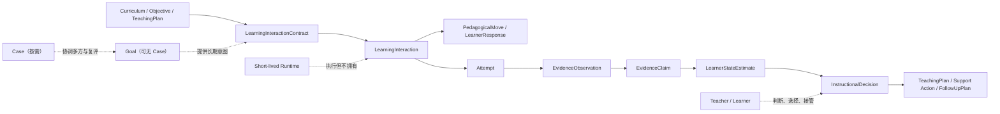
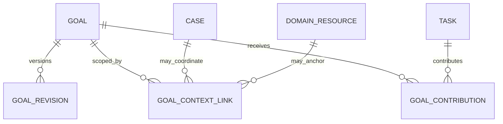
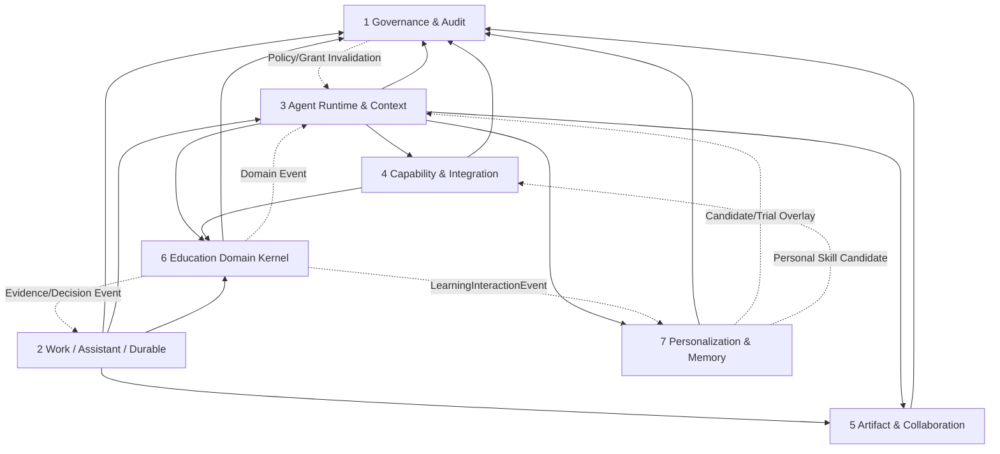

# 教育智能体平台 v0.3.2 架构修订

> 副标题：教学交互、学习证据与人类成长闭环<br>
> 修订基线：`教育智能体平台v0.3.1架构修订.md`<br>
> 文档性质：规范性增量修订，不重写 v0.3.1 全部架构<br>
> 状态：架构候选基线；第 15 节所列关键假设通过 Spike 后冻结为工程基线<br>
> 核心原则：保留 v0.3.1 的安全、治理和状态边界，补齐“懂教学、懂成长”的运行语义；不恢复长期自主 Agent，不新增教学流程引擎，不把教育对象堆砌成僵化流程。

# 0. 文档定位与适用规则

## 0.1 本次修订解决什么

v0.3.1 已经解决了五类基础问题：

1. 以教育领域、长期连续性和有限执行形成三种中心，而不是让 Task 或 Agent 成为唯一中心；
2. 用 Personal Assistant Shell 保留跨会话连续性，但不让 Shell 获得权限、Tool 和正式状态；
3. 用 Canonical Source、MemoryEntry、Memory View 区分事实、长期个人记忆和运行期召回；
4. 用 Education Domain Kernel 建立课程、目标、测评、尝试、证据、推断、策略和支持 Case；
5. 用 A/B/C 风险机制隔离低风险适配、个人工作方法和高影响教育决策。

但 v0.3.1 仍缺少一层关键语义：

> 当教师、学生和 Agent 在一次真实教学或学习互动中协作时，系统应如何决定“帮助到什么程度、何时提问、何时提示、何时允许答案、什么能成为学习证据、谁有最终教学判断权”。

如果不补这一层，平台可能成为一个“拥有教育名词和完善治理的通用工作平台”，却不能稳定支持：

- 有目的的启发、支架和逐步撤除帮助；
- 教师实时判断与接管；
- 学生独立性、迁移、保持和自我解释；
- 形成性评价后的反馈、教学调整与复评；
- 对学习机会、可及性和 AI 参与程度的公平解释；
- 学习过程中的能动性、反思和成长。

v0.3.2 因此只聚焦六个修订面：

1. 放松 Goal 与 Case 的强制层级；
2. 增加 Learning Interaction Contract；
3. 重构学习证据链；
4. 增加教学决策、Teacher Copilot 和形成性反馈闭环；
5. 补齐 AI 使用、学术诚信与 Wellbeing 高敏感边界；
6. 明确个人可携带层和七模块内部边界。

## 0.2 与 v0.3.1 的优先级

- 本文明确标记为“替代”的条款，覆盖 v0.3.1 对应条款；
- 本文没有触及的 v0.3.1 状态所有权、授权、Artifact、Workflow、Memory、Skill 和模块边界继续有效；
- 本文新增对象必须服从 v0.3.1 的 Commit-time Authorization、Provenance、版本、Outbox、幂等和审计规则；
- 本文中的 `must / 必须` 是架构不变量，`should / 应` 是默认策略，`may / 可以` 是受场景约束的扩展点。

## 0.3 本次明确不做什么

v0.3.2 不做以下事情：

- 不新增名为 Pedagogical Runtime 的第八个服务或长期运行 Agent；
- 不把 Explore、Teach、Practice、Assessment 等模式做成全平台刚性状态机；
- 不为每一种教学动作建立独立聚合或数据库表；
- 不把 UDL 实现成“给不同类型学生固定生成不同版本”；
- 不建立心理诊断、治疗或自动风险画像 Agent；
- 不使用 AI 文风检测结果自动判定学术不端；
- 不把每一次师生互动默认完整记录为可长期分析数据；
- 不把跨学校连续性实现为一个拥有全量数据的全球 Personal Assistant Shell。

# 1. 对本轮建议的最终裁决

| 建议 | 裁决 | v0.3.2 最终处理 |
|---|---|---|
| 增加 Pedagogical/Learning Interaction Runtime | 接受问题、改造实现 | 增加 `LearningInteractionContract` 与有限 `LearningInteraction`；运行仍由短生命周期 Agent Runtime 承担 |
| 拆分学习证据语义 | 完全接受 | `Attempt → EvidenceObservation → EvidenceClaim → LearnerStateEstimate` |
| 区分辅助、独立、迁移和保持 | 完全接受 | 新增 `AssistanceContext`、`EvidenceUseClass` 和 construct-specific validity |
| 增加 LearningOpportunity/Exposure | 完全接受 | 增加 `LearningOpportunity`；Exposure 作为事件/投影，不另建通用聚合 |
| 分开 Strategy、Decision 和 Move | 完全接受 | Strategy 是知识，Decision 是专业选择，Move 是交互事件 |
| Teacher Copilot 优先 | 接受为产品与运行优先级 | 定义教师协作通道，不创建长期教师 Agent 类型 |
| 建立学习模式状态机 | 部分接受 | 使用 primary mode + modifiers + 局部转换约束；Assessment 使用更严格隔离 |
| 结构化 UDL | 部分接受 | 作为活动/契约中的设计选项、学习者选择和环境支持，不扩张为大量聚合 |
| 增加反馈、复评、进度监测对象 | 接受语义、压缩对象 | `FeedbackAction` 为事件；复评和监测统一进入 `FollowUpPlan` |
| 元认知成为领域对象 | 接受目标、压缩实现 | 一个 `MetacognitiveEpisode`，不建立七套流程对象 |
| 增加 AI 使用与学术诚信模型 | 完全接受 | `AIUsePolicy` + `AIContributionRecord` + 证据用途约束 |
| Wellbeing 建立独立边界 | 完全接受 | 高敏感 bounded context；只做支持、转介和安全升级，不做临床诊断 |
| Goal 不强制属于 Case | 完全接受 | `case_id` 改为可选；Goal 使用 scope/context 建模 |
| 日常家校沟通不应自动成为 Case | 完全接受 | 引入明确 Case 升级门槛 |
| Shell 拆成校内 Shell 和可携带层 | 部分接受 | Shell 仍是 tenant-local；增加显式导出/导入的 `PortablePersonalPackage` |
| 模块 2 内部进一步分区 | 完全接受 | 分为 Work Core、Assistant Continuity、Durable Execution，物理上仍是七模块单体 |
| 把全部建议名词建为一等实体 | 拒绝 | 只为有独立身份、状态、并发和生命周期的对象建聚合；其余使用值对象、事件或投影 |

# 2. 修订后的核心架构裁决

## 2.1 四种状态中心，不寻找唯一中心

v0.3.2 保持 v0.3.1 三中心，但把教学互动的有限语义边界显式化：

| 状态中心 | 代表对象 | 回答的问题 | 权威模块 |
|---|---|---|---|
| 教育领域中心 | CourseRun、LearningObjective、Assessment、Attempt、Evidence、Estimate | 教什么、发生了什么、证据说明什么 | Education Domain Kernel |
| 长期连续性中心 | Case、Goal、Personal Assistant Shell | 为什么持续工作、长期想改变什么、如何继续 | Work & Assistant；Shell 仅为投影入口 |
| 有限工作中心 | Task、TaskRun、WorkflowInstance、Artifact/Proposal | 这一次要交付什么、怎样执行、等待什么 | Work、Runtime、Workflow、Artifact 各自所有 |
| 教学互动边界 | LearningInteractionContract、LearningInteraction、InstructionalDecision | 这次教学互动怎样帮助、怎样保留能动性、怎样形成有效证据 | Education Domain Kernel；Runtime 只执行契约 |

教学互动边界不是第四个“平台中心”，也不是新的执行引擎。它是 Education Domain 对 Agent Runtime 的领域契约。



## 2.2 十六项规范性裁决

1. Goal 可以独立存在、关联多个 Case，或仅以 Person、CourseRun、Class、Project、Organization、Portfolio 为 scope。
2. Case 只在需要持续协调、多个参与者、敏感处置、未决承诺或周期复评时建立。
3. `LearningInteractionContract` 是教学语义契约，不是 WorkflowDefinition，也不拥有 Timer、Signal、Retry 或 Compensation。
4. `LearningInteraction` 是一次有限教学/学习互动的领域记录；它可以由一次 TaskRun 承载，但两者状态不互相取代。
5. Agent Runtime 执行已发布契约，不能自行扩大帮助范围、改变证据用途或发布新的教学政策。
6. `PedagogicalStrategy` 是可复用专业知识；`InstructionalDecision` 是特定情境下的专业选择；`PedagogicalMove` 是实际发生的互动事件。
7. Attempt 必须记录任务版本、机会、辅助条件、AI 贡献和关键环境条件；缺少这些条件的 Attempt 不得被默认为独立能力证据。
8. EvidenceObservation 只描述观察到的表现；EvidenceClaim 才表达该表现对某个构念的支持、反证或不足。
9. LearnerStateEstimate 必须说明构念、情境、时间、证据、模型版本、不确定性、用途和禁止用途。
10. 没有获得适当学习机会或因环境障碍未能参与，不能被推断为能力不足。
11. 学习模式是契约参数，不是学生固定类型；系统不得把“喜欢视频”“需要提示”等变成学习风格或身份标签。
12. Teacher Copilot 默认提供证据、备选行动和风险提示，教师保留接受、修改、拒绝和不记录理由的权利。
13. 正式 Assessment 的 AI 使用、提示、答案释放和证据用途必须由已发布 `AIUsePolicy` 决定。
14. 普通聊天、情绪措辞或低置信度模型判断不得自动写入 Wellbeing、Memory、Profile 或 StudentSupportCase。
15. Personal Assistant Shell 仍是 tenant-local；跨租户携带只通过用户发起、可预览、可删减、可审计的导出/导入。
16. 所有新增语义都进入现有七模块，不增加微服务数量，也不恢复长期 Agent 进程。

## 2.3 研究依据如何进入架构

本架构吸收的是原则，不绑定任何教育 Agent 产品：

- Study Mode 和 Claude Learning Mode 的启发式提问、分步解释与理解检查，说明教学交互需要与普通问答不同的契约；但基于指令的模式可能不一致，因此必须版本化、评测并允许教师接管；
- Tutor CoPilot 的实践支持“AI 帮助教师采用更好的教学策略”，但其年级适切性等问题说明建议必须带适用条件和教师判断；
- 无护栏生成式 AI 的课堂研究表明，即时完成表现不能等同于独立学习，因此辅助条件必须进入 Evidence；
- ECD 强调构念、可观察表现和任务机会的分离，因此 Attempt、Observation、Claim、Estimate 不能合并；
- UDL 强调学习者变异、选择、可及性和环境障碍，而不是固定学习风格；
- 形成性评价只有在证据真正改变反馈、活动或教学决策时才构成闭环。

参考：

- [OpenAI Study Mode](https://openai.com/index/chatgpt-study-mode/)
- [Claude for Education](https://www.anthropic.com/news/introducing-claude-for-education)
- [Tutor CoPilot](https://arxiv.org/abs/2410.03017)
- [Generative AI without guardrails can harm learning](https://doi.org/10.1073/pnas.2422633122)
- [ETS Evidence-Centered Design](https://www.ets.org/Media/Research/pdf/TC-10-07.pdf)
- [CAST UDL Guidelines 3.0](https://udlguidelines.cast.org/)
- [EEF Metacognition and Self-Regulated Learning](https://educationendowmentfoundation.org.uk/education-evidence/guidance-reports/metacognition)

# 3. Goal 与 Case 模型修订

## 3.1 替代 v0.3.1 的强制关系

v0.3.1 的以下约束：

```text
Goal 必须属于一个主 Case
```

在 v0.3.2 中替换为：

```text
Goal 必须有 scope 和 owner
Goal 可以没有 Case
Goal 可以通过 GoalContextLink 关联零个、一个或多个 Case/领域对象
Case 可以协调一个或多个 Goal
```



## 3.2 修订后的 Goal

```yaml
goal:
  id: goal_teaching_transfer_2026
  owner_refs: [teacher_1024]
  scope_type: course_run
  scope_refs: [course_run:math_8_3_2026_fall]
  primary_context_ref: course_run:math_8_3_2026_fall
  case_refs: []
  active_revision: 3
  lifecycle_state: active
```

允许的 `scope_type` 首版包括：

```text
person
course_run
class
project
organization
portfolio
multi_context
```

Goal 仍然必须：

- 有明确 owner 或共同 owner；
- 有可重新协商的 outcome statement；
- 有 review condition 或 review date；
- 有 indicator/evidence references，或明确说明当前仍在探索指标；
- 使用不可变 GoalRevision；
- 不因 Task completed 自动进入 achieved。

## 3.3 GoalContextLink

`GoalContextLink` 是连接记录，不是新聚合：

```yaml
goal_context_link:
  goal_id: goal_teaching_transfer_2026
  context_ref: case:case_teaching_improvement_91
  relation: coordinated_by
  valid_from: 2026-09-01
  valid_to: null
```

`relation` 可以是：

```text
primary_context
anchored_in
coordinated_by
contributes_to
related_context
```

连接不会传递权限。访问 Goal 及其关联 Case、CourseRun、Student 或 Artifact 时，仍分别授权。

## 3.4 何时建立 Case

满足下列任一强条件，或同时满足多个弱条件时，才应建立 Case：

### 强条件

- 涉及多个责任人或跨角色持续协调；
- 涉及学生支持、Wellbeing、安全、申诉或其他敏感事项；
- 存在需要追踪的外部承诺、审批、等待或法定时限；
- 需要周期性复评、重新分配行动或正式关闭；
- 单个 Task 无法表达目的、历史、参与者和未决问题。

### 弱条件

- 预计跨多个 Task 或多个工作周；
- 需要长期 Goal 和多个证据来源；
- 同一目的下会产生多类 Artifact 和沟通；
- 用户需要一个独立的协作可见性边界。

以下情况默认不建立 Case：

- 单次 Query；
- 单次教案、课件或题目生成；
- 一次日常家长通知；
- 一次会议安排；
- 一次作业数据分析；
- 只有一个短期 Task、无持续复评和未决责任的工作。

## 3.5 日常家校沟通与 FamilyCommunicationCase

```text
日常信息发送
→ ContentArtifact
+ Send OperationalProposal
→ Commit-time Authorization
→ Communication DomainRecord
```

只有当沟通具备以下特征之一，才升级为 `FamilyCommunicationCase`：

- 存在需要持续解决的明确问题；
- 涉及多轮双向信息、承诺和跟进；
- 与 StudentSupportCase 中的 Goal 或 Wellbeing 支持关联；
- 有正式复评日期；
- 涉及多名工作人员或跨机构协作；
- 需要高敏感访问边界。

## 3.6 Goal/Case 状态所有权

| 对象/状态 | 状态所有者 | 写入者 | 读取者 | 生命周期 |
|---|---|---|---|---|
| Goal identity、scope、active revision | Work & Assistant | Goal owner、共同参与者；Agent 只起草 Proposal | Shell、Education、Runtime、审计 | draft → active ↔ paused → achieved/not_achieved/abandoned/superseded |
| GoalRevision | Work & Assistant | Goal owner/参与者 | Goal review、Context、Education | append-only；由新版本 supersede |
| GoalContextLink | Work & Assistant | Goal owner、Case steward、确定性绑定规则 | Shell、Case、Context | active → ended/corrected |
| Case lifecycle | Work & Assistant | Case steward、授权参与者 | Shell、Education、Workflow | proposed → active ↔ monitoring/paused → resolved → closed/reopened |
| Case 专业详情 | Education Domain 对应子域 | 合资格教育或支持人员 | 明确授权参与者 | 依 Case 类型定义 |

# 4. Learning Interaction Contract

## 4.1 定义

> `LearningInteractionContract` 是一次或一类教学/学习互动的版本化领域契约。它定义目标、参与者、帮助边界、能动性、证据条件、可及性选择、安全规则和教师接管点。

它不是：

- Prompt；
- Skill；
- WorkflowDefinition；
- Lesson Plan 的同义词；
- Agent 人格；
- 权限凭证；
- 学生画像；
- 固定教学法。

它解决的问题是：同一个模型面对“自由探索、引导练习、独立练习、正式测评、教师课堂 Copilot”时，不能采用同一套默认行为。

## 4.2 对象类型

`LearningInteractionContract` 是 Education Domain 中的版本化配置聚合。其较大正文可以作为 `ConfigurationAsset` 保存，但语义发布状态属于 Education Domain。

```yaml
learning_interaction_contract:
  id: lic_linear_function_guided_practice
  version: 4
  purpose: guided_conceptual_practice
  objective_refs:
    - learning_objective:lo_slope_as_rate
  participant_model:
    primary_learner: student
    responsible_educator: course_teacher
    ai_channel: learner_facing
  primary_mode: guided_practice
  mode_modifiers: [socratic_questioning, self_explanation]
  assistance_policy_ref: assistance_math_guided_v3
  hint_policy_ref: hint_ladder_math_v2
  answer_release_policy_ref: answer_release_guided_v2
  agency_policy_ref: learner_choice_standard_v1
  evidence_capture_policy_ref: evidence_guided_practice_v2
  ai_use_policy_ref: ai_use_practice_allowed_v3
  accessibility_options_ref: access_options_math_v2
  teacher_override_policy_ref: teacher_override_default
  escalation_policy_ref: learning_safety_standard
  validity:
    effective_from: 2026-09-01
    expires_at: null
  lifecycle_state: published
```

## 4.3 必要组成

| 组成 | 解决的问题 | 形式 |
|---|---|---|
| Objective Binding | 互动服务于什么目标 | Objective/Competency/Goal refs |
| Participant Model | 谁在学习、谁负责、AI 面向谁 | 值对象 |
| Interaction Mode | 当前主要教学意图 | 枚举 + modifiers |
| Assistance Policy | 帮助可以到什么程度 | 版本化策略 |
| Hint Policy | 提示级别、条件和撤除 | 版本化策略 |
| Answer Release Policy | 何时允许示例、部分答案、最终答案 | 版本化策略 |
| Agency Policy | 学习者选择、跳过、求助、质疑和退出 | 版本化策略 |
| Evidence Capture Policy | 记录什么、为何记录、保存多久 | 版本化策略 |
| Evidence Use Policy | 哪些表现可用于何种推断 | EvidenceRule refs |
| Accessibility Options | 表征、表达和访问支持 | 值对象/资源引用 |
| Teacher Override | 教师接管、冻结、改变模式 | 版本化策略 |
| Safety/Escalation | 风险内容和升级边界 | Governance/Domain policy refs |

这些组成可以复用，但不会自动授予 Tool、数据或执行权限。

## 4.4 LearningInteraction

`LearningInteraction` 是一次有限的教学/学习互动记录：

```yaml
learning_interaction:
  id: li_20260918_0081
  contract_ref: lic_linear_function_guided_practice@v4
  context_refs:
    - course_run:math_8_3_2026_fall
    - task:task_guided_practice_81
  participant_refs:
    - learner:student_88
    - responsible_educator:teacher_1024
  runtime_ref: task_run:run_81_01
  primary_mode: guided_practice
  state: active
  started_at: 2026-09-18T09:00:00Z
```

规则：

- 它可以没有 Task，例如教师在课堂工具中启动一个临时互动；
- 复杂或需交付的互动可以绑定 TaskRun；
- 它不等待跨日 Signal；需要跨日等待时，由 WorkflowInstance 拥有等待状态；
- Runtime 崩溃不改变已经提交的领域事件；
- 互动完成不自动发布 EvidenceClaim 或 LearnerStateEstimate；
- 互动的 transcript 不是正式状态，也不应默认永久保存。

## 4.5 模式不是全局状态机

首版支持以下 primary mode：

```text
explore
explain
guided_practice
independent_practice
assessment
reflection
creation
review
```

协作通道另行建模：

```text
teacher_copilot
learner_facing
co_reflection
observer_only
```

不将 `teacher_copilot` 与学习模式混在同一个枚举中。

一次 LearningInteraction：

- 只有一个当前 primary mode；
- 可以带多个 modifier；
- 可以在允许的局部转换中切换；
- 不要求所有课堂活动经过统一顺序；
- 进入 `assessment` 时必须重新绑定或确认更严格的 Contract；
- 从 guided practice 切换到 independent practice 时必须清空不应继承的提示状态；
- 模式切换形成事件，但不自动形成 LearnerStateEstimate。

## 4.6 AssistancePolicy 与 HintPolicy

帮助级别不是全学科统一阶梯。Contract 只定义通用框架，具体级别由学科、年龄、活动和目标配置：

```text
L0  无内容帮助，仅澄清操作
L1  促使回忆目标、条件或已有知识
L2  提供方向性问题或检查点
L3  提供局部提示、表示或示例类比
L4  提供分步支架或部分解法
L5  展示完整示例或最终答案
```

规则：

- 级别编号只表示帮助强度，不表示教学质量；
- 学生可以请求帮助，但 Contract 决定可提供的最大级别；
- Runtime 应记录实际使用的帮助，而不是只记录 Contract 上限；
- 提示应支持逐步撤除，不得永久强化依赖；
- Assessment 默认不允许 Runtime 自行提高帮助级别；
- 教师可以即时覆盖，但覆盖形成可审计的 `TeacherOverrideEvent`；
- 某种支持是否影响证据有效性，由构念和 EvidenceRule 决定，而不是由固定全局表决定。

## 4.7 状态所有权

| 对象/状态 | 状态所有者 | 写入者 | 读取者 | 生命周期 |
|---|---|---|---|---|
| LearningInteractionContract identity/version/status | Education Domain | 课程/教研发布者；教师可发布 course-local 版本；Agent 只起草 | Runtime、教师、Evidence pipeline、审计 | draft → reviewed → published → superseded/retired |
| Contract 内容资产 | Artifact & Collaboration | Education 发布流程 | Education、Runtime | immutable revision chain |
| LearningInteraction lifecycle | Education Domain | 受信交付服务、授权教师 | Runtime、Evidence、Work、审计 | planned → active ↔ paused → completed/aborted/invalidated |
| Runtime 执行状态 | Agent Runtime & Context | Runner | Work、Education、审计 | queued → running → succeeded/failed/cancelled |
| Mode/override event | Education interaction event stream | 交付系统、教师 | Evidence pipeline、教师复盘 | append/corrected |
| Contract 权限判断 | Governance | PDP/Policy Engine | Runtime、Education | Decision TTL 内有效；提交时重算 |

# 5. 学习证据模型修订

## 5.1 替代 v0.3.1 的 LearningEvidence 聚合

v0.3.1 的 `LearningEvidence` 同时承担了“可观察表现”和“该表现说明什么”，边界仍然过粗。

v0.3.2 采用：

```text
LearningOpportunity
→ Attempt
→ EvidenceObservation
→ EvidenceClaim
→ LearnerStateEstimate
```

其中：

- `LearningOpportunity`：学习者是否实际获得了适合的学习/展示机会；
- `Attempt`：学习者在具体任务、条件和辅助下做了什么；
- `EvidenceObservation`：从 Attempt、作品或人工观察中可靠观察到什么；
- `EvidenceClaim`：这些 Observation 对某个 Objective/Concept/Competency 支持、反驳或不足到什么程度；
- `LearnerStateEstimate`：综合多项 Claim 后，对特定构念、情境和时间的概率性估计。

`LearningEvidence` 保留为 API 总称与兼容性读模型，不再作为拥有混合状态的独立写入聚合。

## 5.2 LearningOpportunity

```yaml
learning_opportunity:
  id: opportunity_transfer_task_118
  learner_ref: student_88
  objective_refs: [lo_linear_function_transfer]
  activity_ref: activity_transfer_task_12@v3
  planned_at: 2026-09-17T10:00:00Z
  offered_at: 2026-09-18T09:10:00Z
  access_state: accessible
  engagement_state: engaged
  completion_state: completed
  support_options_offered:
    - visual_representation
    - read_aloud_on_request
  barrier_event_refs: []
```

必须区分：

```text
planned
offered
accessible / inaccessible / unknown
accessed / not_accessed
engaged / declined / interrupted
completed / partial / not_completed
```

规则：

- planned 不等于 offered；
- offered 不等于 accessible；
- accessed 不等于 engaged；
- 未完成不等于能力不足；
- 因时间、设备、语言、残障支持缺失或其他环境障碍未参与，不能更新为负向 LearnerStateEstimate；
- “没有证据”必须保留为 missing/unknown，而不是推断失败；
- Opportunity 数据不得被用于惩罚没有被提供同等机会的学习者。

`ExposureRecord` 不作为新的顶级聚合。它是由 Opportunity、Interaction 和 Attempt 事件生成的分析投影。

## 5.3 Attempt

Attempt 的最小结构增加：

```yaml
attempt:
  id: attempt_9102
  learner_ref: student_88
  opportunity_ref: opportunity_transfer_task_118
  activity_ref: activity_transfer_task_12@v3
  objective_refs: [lo_linear_function_transfer]
  interaction_ref: li_20260918_0081
  response_artifact_ref: artifact:student_response_9102@r1
  assistance_context:
    maximum_allowed_level: L3
    actual_levels_used: [L1, L2]
    teacher_assistance: none
    peer_assistance: none
    ai_assistance: guided_questions
    answer_exposure: false
  ai_contribution_ref: ai_contribution_551
  environment_context:
    time_limit: none
    language_support: standard
    accessibility_supports: [visual_representation]
  started_at: 2026-09-18T09:11:00Z
  submitted_at: 2026-09-18T09:18:00Z
  record_state: sealed
```

Attempt 是发生记录，不保存“掌握”“薄弱”“不自律”等判断。

## 5.4 AssistanceContext

`AssistanceContext` 是 Attempt 和 LearningInteractionEvent 的值对象，至少包括：

- assistance source：teacher、peer、AI、resource、none；
- assistance level；
- actual hint sequence；
- answer exposure；
- scaffolding type；
- whether assistance was requested or pushed；
- whether support is an accessibility accommodation；
- whether support is part of the construct definition；
- mode at time of response；
- policy/contract version。

重要边界：

- 可及性支持不天然降低证据价值；
- 是否影响证据，取决于测量构念。例如数学建模中的文字朗读与阅读解码测评中的文字朗读具有不同含义；
- 教师正常课堂支持不能简单压缩成“受助=无效”；
- 证据管道必须使用 construct-specific EvidenceRule。

## 5.5 EvidenceObservation

```yaml
evidence_observation:
  id: obs_7001
  source_refs: [attempt:attempt_9102]
  observed_feature:
    type: explanation_contains_rate_relationship
    value: true
  extraction_method:
    kind: deterministic_rubric
    version: slope_explanation_rubric_v4
  observer_ref: scorer:rubric_engine_v4
  assistance_context_ref: attempt_9102.assistance_context
  observed_at: 2026-09-18T09:18:10Z
  validation_state: validated
  provenance_ref: provenance_7001
```

Observation 可以来自：

- 确定性评分规则；
- 人工 Rubric；
- 教师结构化观察；
- 学习者自述；
- 经验证的模型提取。

不同来源必须保留不同权威性。LLM 提取默认是 `ObservationCandidate`，除非该提取管道已通过特定用途评测并按规则发布。

## 5.6 EvidenceClaim

```yaml
evidence_claim:
  id: claim_8011
  target_ref: competency:linear_function_transfer
  facet: assisted_transfer_explanation
  claim_type: supports
  observation_refs: [obs_7001, obs_7002]
  evidence_rule_ref: evidence_rule_transfer_explanation_v3
  strength: moderate
  uncertainty: 0.31
  permitted_uses:
    - formative_feedback
    - teacher_planning
  prohibited_uses:
    - summative_grade
    - placement
    - independent_mastery
  valid_time:
    observed_from: 2026-09-18
    expires_at: 2026-10-18
  lifecycle_state: current
```

EvidenceClaim 是可争议、可撤回、可被新证据替代的推断，不是正式成绩或学生永久属性。

## 5.7 EvidenceUseClass

首版提供以下用途分类：

```text
assisted_performance
independent_performance
explanation
fluency
near_transfer
far_transfer
retention
collaboration
metacognitive_self_report
accessibility_observation
```

这不是固定能力维度。学科可以发布自己的 facet 和 EvidenceRule，但必须映射到：

- 证据来自何种任务；
- 在什么帮助条件下；
- 用于什么决策；
- 有何禁止用途；
- 何时需要重新验证。

## 5.8 LearnerStateEstimate

```yaml
learner_state_estimate:
  id: lse_9201
  learner_ref: student_88
  construct_ref: competency:linear_function_transfer
  facets:
    independent_transfer:
      estimate: uncertain
      claim_refs: [claim_7990]
    assisted_transfer:
      estimate: emerging
      claim_refs: [claim_8011]
    explanation:
      estimate: developing
      claim_refs: [claim_8011, claim_8012]
  model_ref: learner_model_transfer_v2
  valid_context_refs: [course_run:math_8_3_2026_fall]
  known_gaps:
    - no_delayed_retention_evidence
    - limited_independent_attempts
  permitted_uses: [teacher_planning, learner_feedback]
  prohibited_uses: [tracking, permanent_label, automatic_opportunity_restriction]
  effective_at: 2026-09-18T10:00:00Z
  revalidate_after: 2026-10-02
  lifecycle_state: current
```

禁止建立一个跨所有学科、年龄和目标通用的“掌握度总分”。Estimate 必须面向构念与用途。

## 5.9 状态所有权与写入

| 对象/状态 | 状态所有者 | 写入者 | 读取者 | 生命周期 |
|---|---|---|---|---|
| LearningOpportunity | Education Domain | 教师、课程/活动交付服务 | Evidence、教师、公平性分析 | planned → offered → accessed/declined/inaccessible → completed/closed |
| Attempt | Education Domain | 受信交付系统；授权教师可更正 | Evidence、教师、学习者视图 | append → sealed；correction 形成新版本 |
| EvidenceObservation | Education Domain | 确定性 scorer、授权观察者、已验证提取管道 | Claim publisher、教师 | candidate → validated → sealed/withdrawn |
| EvidenceClaim | Education Domain | 版本化推断发布器、授权教师 | Estimate、教师、学习者、Case | candidate → current → contested/stale/superseded/withdrawn |
| LearnerStateEstimate | Education Domain | 经验证的 learner-model publisher | 教师、学习者、Context、Case | candidate → current → stale/superseded/withdrawn |
| LearningEvidenceView | 可重建投影 | 只消费上述事件 | UI、Context、分析 | 可重建；不得人工写入 |

## 5.10 一致性不变量

1. Agent/LLM 不能直接创建 validated Observation、current Claim 或 current Estimate。
2. 每个 Claim 必须引用 Observation、EvidenceRule、辅助条件和 Provenance。
3. 每个 Estimate 必须引用 Claim，而不能直接引用聊天摘要。
4. 高辅助条件下的成功不能自动更新 independent facet。
5. 没有 Opportunity 或 Opportunity 不可及，不能产生负向能力 Claim。
6. 旧 EvidenceRule 生成的 Claim 不被静默重解释；规则升级产生新 Claim 版本。
7. Evidence 被撤回时，依赖它的 Claim 和 Estimate 必须进入重算或 stale。
8. 自述可以成为 LearnerVoice/Metacognitive Evidence，但不能单独决定成绩、分班或机会。
9. 对学生不利的 C 级用途必须重新读取原始证据与当前授权，不能只读摘要投影。
10. 所有 Evidence 写入使用幂等键；重复事件不得生成重复 Claim。

# 6. 教学决策、Teacher Copilot 与形成性反馈

## 6.1 三层边界

| 对象 | 含义 | 是否长期复用 | 谁最终负责 |
|---|---|---:|---|
| PedagogicalStrategy | 关于教学机制、适用条件、变体、风险和复评的专业知识 | 是 | 教研/学科发布者 |
| InstructionalDecision | 在特定学生、班级、课程和证据情境中选择什么及为什么 | 情境化、可版本化 | 教师或合资格教育人员 |
| PedagogicalMove | 互动中实际发生的一次提问、提示、表示、反馈或撤除支架 | 否；事件 | 当时的教师/受控 Runtime |

系统不能因为检索到某个 Strategy，就直接改变教学计划或学生机会。

## 6.2 InstructionalDecision

只对具有持续影响、改变计划、支持、机会或评价方式的选择建立正式 `InstructionalDecision`。日常的每一句追问不建立 Decision。

```yaml
instructional_decision:
  id: decision_3011
  context_refs:
    - course_run:math_8_3_2026_fall
    - goal:goal_teaching_transfer_2026
  objective_refs: [lo_linear_function_transfer]
  evidence_considered:
    claim_refs: [claim_8011, claim_7990]
    opportunity_refs: [opportunity_transfer_task_118]
    learner_voice_refs: [metacognitive_episode_77]
  alternatives:
    - guided_self_explanation
    - worked_example_comparison
    - additional_independent_transfer
  selected_strategy_ref: strategy:guided_self_explanation@v3
  rationale: 当前受助解释已有进展，但独立迁移证据不足；先撤除部分提示后复评
  expected_outcome: 形成至少一次无内容提示的独立迁移表现
  follow_up_plan:
    reassessment_activity_ref: activity_transfer_task_14@v1
    review_at: 2026-09-25
    success_evidence_rule_refs: [evidence_rule_independent_transfer_v2]
    stop_or_change_conditions:
      - learner_requests_alternative
      - barrier_observed
      - repeated_nonproductive_struggle
  decided_by: teacher_1024
  lifecycle_state: active
```

Agent 只能生成 `InstructionalDecisionProposal`。责任人接受后，Education Domain 才创建正式 Decision。

## 6.3 PedagogicalMove

首版使用类型化事件，不为每个 Move 建独立聚合：

```text
ask_open_question
probe_reasoning
request_self_explanation
surface_prior_knowledge
offer_representation
give_directional_hint
give_partial_scaffold
show_worked_example
release_answer
provide_feedback
invite_reflection
withdraw_scaffold
offer_choice
pause_or_escalate
```

每个事件可以记录：

- interaction id；
- actor；
- move type；
- purpose；
- strategy/contract ref；
- assistance level；
- target objective；
- timestamp；
- learner response ref；
- retention class。

不保存模型隐藏推理链。Prompt、内部 reasoning 和完整 transcript 不是教育证据。

## 6.4 Teacher Copilot 运行契约

Teacher Copilot 是 `participant_model.ai_channel = teacher_copilot` 的 LearningInteractionContract profile，而不是长期 Agent 类型。

它可以：

- 汇总当前可用 Evidence，并显式显示证据缺口；
- 提出两到三个教学动作备选及各自适用条件；
- 提醒帮助程度、机会和可及性问题；
- 起草问题、活动、反馈、TeachingPlan Revision 或 Decision Proposal；
- 在课堂中提供短时、可忽略的建议；
- 根据教师接受、修改和拒绝形成 B 级个人方法候选。

它不能：

- 自动改变成绩、分组、分班、机会、支持资格或 Goal；
- 自动向学生或家长发送承诺；
- 把教师没有采纳的建议记录成已实施教学；
- 把教师拒绝建议解释为能力或态度问题；
- 在没有当前授权时读取额外学生数据；
- 把教师私人工作习惯默认展示给学校管理者；
- 以“最优策略”隐藏不确定性和替代方案。

## 6.5 教师接管与解释

每条可行动建议至少显示：

```text
目标是什么
使用了哪些 Evidence/Observation
缺少什么证据
为什么建议该 Strategy/Move
还有哪些合理替代
预计影响什么
何时应停止或复评
AI 是否使用了个性化 Candidate/Trial
```

教师可以：

- 接受；
- 修改后接受；
- 拒绝；
- 暂不决定；
- 请求其他方案；
- 标记证据错误；
- 要求不将本次选择用于个性化。

拒绝理由默认不是必填，避免把教师变成给系统标注数据的劳动力。

## 6.6 形成性反馈闭环

```text
LearningObjective / Goal
→ LearningOpportunity
→ Attempt
→ EvidenceObservation / Claim
→ FeedbackAction
→ LearnerResponse / Revision Attempt
→ InstructionalDecision
→ FollowUpPlan
→ Reassessment
→ Goal / TeachingPlan / Estimate review
```

`FeedbackAction` 是 InteractionEvent，至少说明：

- 针对哪个目标和 Observation；
- 描述了什么差距或成功；
- 给出何种下一步；
- 是否要求学习者行动；
- 是否保留选择；
- 是否产生新的 Attempt。

`FollowUpPlan` 是 InstructionalDecision、TeachingPlan 或 SupportPlan 中的值对象，统一承载：

- reassessment；
- progress monitoring；
- review time/event；
- expected evidence；
- stop/change conditions；
- responsible person。

不额外建立通用 Feedback Engine、Reassessment Engine 或 Progress Monitoring Engine。

## 6.7 状态所有权

| 对象/状态 | 状态所有者 | 写入者 | 读取者 | 生命周期 |
|---|---|---|---|---|
| PedagogicalStrategy | Education Domain | 教研/学科发布流程 | 教师、Runtime、Skill、Eval | draft → reviewed → published → superseded |
| InstructionalDecisionProposal lifecycle | Work & Assistant | 用户或 AgentRun 经 Proposal API | 责任教师、Case team | draft → validated → accepted/rejected/expired |
| InstructionalDecisionProposal 内容版本 | Artifact & Collaboration | Proposal API | 责任教师、Case team | immutable revision chain |
| InstructionalDecision | Education Domain | 教师/合资格教育人员、受控确定性规则 | TeachingPlan、Case、Context、审计 | active → reviewed → superseded/withdrawn |
| PedagogicalMove/LearnerResponse | Education event stream | 教师、学习者、受控 Runtime | Evidence、教师复盘 | append/corrected；按 retention policy 删除或聚合 |
| FeedbackAction | Education event stream | 教师、受控 Runtime | 学习者、Evidence、教师 | append/corrected |
| FollowUpPlan | 无独立状态所有者；作为所属 Decision/Plan 的值对象 | Decision owner、Plan owner | Workflow、教师、Case | 随所属聚合版本化；不独立迁移状态 |

## 6.8 教师习惯如何编译，但不控制教学

Teacher Copilot 的使用轨迹可以进入 v0.3.1 的个性化学习链，但必须先区分它学习的究竟是什么：

| 观察到的重复模式 | 风险 | 可以形成 | 不可以直接形成 |
|---|---:|---|---|
| 教师总希望先看证据缺口，再看建议 | A/B | UI Preference、建议排序 Preference | 学生能力判断 |
| 教师备课通常先分析 Attempt，再改 TeachingPlan | B | Personal Skill Candidate + Procedure Hints | Durable Workflow、权限 |
| 教师常把建议改为更短的课堂提问 | B | 表达/操作方式 Candidate | 全校 PedagogicalStrategy |
| 教师对部分学生倾向直接降低任务难度 | C | 需要公平性审查的 Pattern/Alert | Personal Skill、自动化或默认路由 |
| 某教学策略在特定情境多次有效 | C | Strategy/Decision Research Candidate | 自动发布为该学生唯一策略 |

B 级 Trial 可以在当前 TaskRun 中通过 `TrialBinding` 进入 Context，但必须：

- 在 ContextManifest、RunManifest 和输出解释中标明 candidate/trial/version；
- 只影响允许的教师个人工作步骤、排序或表达；
- 不改变 LearningInteractionContract 的最大帮助、EvidenceUse、AIUse、Safety 或 TeacherOverride；
- 不直接改变学生机会、任务难度、分组、评分或支持资格；
- 结束后由 Personalization 模块独立评估，不让 Trial 产生的行为直接证明自身有效；
- 撤销后不再被新 Run 召回。

当个人习惯开始影响学生机会、高影响教学策略或外部承诺时，即使来源是重复、稳定的教师行为，也必须升级为 C 级专业决策，不能继续作为个人 Skill 自动执行。

# 7. 学习者能动性、UDL 与元认知

## 7.1 不能把“个性化”做成路径锁定

学习者个性化的默认目标不是让系统更准确地预测“这个学生是什么样的人”，而是：

- 提供多个有意义且可进入的学习路径；
- 允许学习者表达目标、困难、偏好和反例；
- 在需要时提供支架，并能逐步撤除；
- 持续检查独立性、迁移和保持；
- 让学习者理解系统使用了哪些证据；
- 允许质疑、修正和请求新的学习机会。

系统不得依据过去表现永久限制：

- 任务难度；
- 学科机会；
- 表达方式；
- 课程与活动推荐；
- 与教师或同伴合作的机会；
- 对未来能力的预期。

## 7.2 UDL 的结构化位置

UDL 不建立成一个独立运行时，而进入三个现有对象：

| 位置 | 结构化内容 | 状态所有者 |
|---|---|---|
| Activity/Assessment Definition | 多种表征、行动与表达方式、参与方式、无障碍要求 | Education Domain |
| LearningInteractionContract | 本次可提供的选择、支持、替代通道与学习者控制点 | Education Domain |
| LearningOpportunity | 实际提供了哪些选项、是否可访问、是否遇到障碍 | Education Domain |

建议的值对象：

```yaml
udl_design_options:
  representation:
    - symbolic
    - visual
    - verbal
  action_and_expression:
    - written_response
    - oral_explanation
    - diagram
  engagement:
    - individual
    - peer_discussion
    - contextual_choice
  learner_choice:
    choice_points:
      - representation
      - response_format
    default_is_reversible: true
  accessibility_support_refs:
    - read_aloud_on_request
    - keyboard_navigation
```

规则：

- 提供选项不等于降低目标；
- 可及性支持不应被记录为学习者缺陷；
- `BarrierObservation` 是关于环境—活动交互的事件，不是长期学生标签；
- 系统不使用“视觉型/听觉型学习者”等固定学习风格路由；
- 学习者过去选择某种方式，不等于未来只能获得该方式；
- 选择记录的默认用途是改善体验，不得自动用于分班或机会限制。

## 7.3 学习模式中的能动性

每个 LearningInteractionContract 必须声明：

- 学习者是否可以选择模式或活动；
- 是否可以请求更多/更少帮助；
- 是否可以跳过、暂停和返回；
- 是否可以看到目标与当前模式；
- 是否可以要求解释为什么系统这样帮助；
- 是否可以请求教师介入；
- 是否可以拒绝将某次非正式互动用于个性化；
- 正式 Assessment 中哪些选择因测量要求受限。

“鼓励坚持”不能演变为阻止退出或重复施压。连续无效尝试、明显障碍或学习者明确请求改变时，Contract 必须允许改变策略或升级给教师。

## 7.4 MetacognitiveEpisode

元认知不只靠 Prompt，但也不建立独立元认知流程引擎。使用一个结构化、学习者参与的 `MetacognitiveEpisode`：

```yaml
metacognitive_episode:
  id: meta_77
  learner_ref: student_88
  interaction_ref: li_20260918_0081
  objective_refs: [lo_linear_function_transfer]
  plan:
    learner_statement: 我准备先画图，再说明两个量怎样一起变化
    strategy_refs: [strategy_visualize_relationship]
  monitor:
    learner_noticed:
      - 我能算出斜率，但不确定单位代表什么
    help_requested: directional_question
  evaluate:
    learner_statement: 画图帮助我解释，但换成新的情境还需要再试一次
    next_step_preference: independent_transfer_task
  authored_by: student_88
  ai_assistance:
    level: L1
    contribution: question_prompts_only
  visibility: learner_and_course_teacher
  record_state: current
```

边界：

- 学习者原始表达与 AI 摘要分开保存；
- AI 可以提出反思问题或起草摘要，但不得伪造学习者声音；
- 自我报告是 Evidence 来源之一，不是掌握、努力或人格的确定事实；
- 学习者可以编辑、撤回或限制可见性；
- 元认知活动应嵌入具体学科和任务；
- 系统不能因学习者不愿写反思而判定其缺乏元认知能力。

## 7.5 个性化如何使用这些数据

| 数据 | 默认风险级别 | 可以做什么 | 不可以做什么 |
|---|---:|---|---|
| 临时表示方式选择 | A | 当前互动适配、可逆 UI 默认 | 固定为学习风格 |
| 多次明确表达的交互偏好 | A/B | 形成可审查 Preference Candidate | 改变学习机会 |
| 支架使用轨迹 | B/C，取决于用途 | 改善帮助策略、提示撤除 | 自动贴“提示依赖”标签 |
| MetacognitiveEpisode | B；高影响用途升 C | 反思、共同制定下一步 | 单独决定能力或分组 |
| BarrierObservation | C（涉及学生机会时） | 改善环境和支持 | 归因为学生缺陷 |
| 教学策略响应 | B/C | 提供多策略候选、发现反例 | 永久排除未奏效策略 |

# 8. AI 使用与学术诚信模型

## 8.1 目的

平台不以“是否使用 AI”作简单二元判断，而要回答：

1. 该活动允许什么类型的 AI 帮助？
2. 学习者实际使用了什么帮助？
3. AI 对最终 Artifact 或 Attempt 有多大贡献？
4. 该表现仍可以支持什么 EvidenceClaim？
5. 谁能据此作出反馈、评分或学术诚信判断？

## 8.2 AIUsePolicy

`AIUsePolicy` 是 Education Domain 的版本化政策对象，可以绑定：

- CourseRun；
- Activity；
- Assignment；
- AssessmentDefinition/Administration；
- Artifact 类型；
- LearningInteractionContract。

`AIUsePolicy` 表达教学与测评语义，例如“允许方向性提示但不允许生成答案”。Governance 模块仍然拥有访问控制、模型资格、数据驻留、法定限制和学校不可覆盖的强制规则。两者冲突时采用更严格结果，但 Governance 不重写 Education Domain 中的教学语义。

```yaml
ai_use_policy:
  id: ai_policy_transfer_assignment_v2
  applies_to_ref: activity:transfer_assignment_12@v3
  purpose: formative_practice
  allowed:
    clarification: true
    guiding_questions: true
    directional_hints: true
    worked_examples: false
    partial_solution: false
    final_answer: false
    drafting: false
    language_revision: allowed_with_disclosure
  disclosure_required: true
  evidence_rules:
    independent_mastery: not_permitted_if_content_help_used
    formative_feedback: permitted
  teacher_override: allowed_and_logged
  lifecycle_state: published
```

政策必须面向活动和目的。学校不能只设一个“AI 全开/全关”的全局开关解决所有教学与评价问题。

## 8.3 AIContributionRecord

```yaml
ai_contribution_record:
  id: ai_contribution_551
  subject_ref: attempt:attempt_9102
  model_or_service_ref: governed_model_profile_12
  contract_ref: lic_linear_function_guided_practice@v4
  contribution_types:
    - guiding_question
    - representation_suggestion
  maximum_assistance_level: L2
  answer_exposure: false
  user_disclosure:
    status: confirmed
  system_observation:
    status: recorded_by_platform
  provenance_ref: provenance_ai_551
  record_state: sealed
```

来源分开：

- 平台内可验证的 AI 交互记录；
- 学习者主动披露；
- 教师观察；
- 外部系统声明；
- 检测器推断。

检测器推断只能是低权威 `InferenceCandidate`。不得仅凭文风、概率分数或单一检测工具作出违规结论。

## 8.4 对 Evidence 的影响

EvidenceRule 应明确：

- 哪些 AI contribution 不影响构念；
- 哪些只允许形成 assisted Evidence；
- 哪些使某次 Attempt 不可用于独立或总结性判断；
- 是否需要重新进行受控独立尝试；
- 如何处理可及性工具、翻译、语法修订和领域内容生成的差异。

示例：

```text
AI 帮助检查拼写
≠ 自动使数学建模 Evidence 无效

AI 生成核心论证
→ 不能作为学生独立论证能力 Evidence

AI 提供一步方向性提示
→ 可以用于形成性反馈
→ 不能单独证明完全独立掌握
```

## 8.5 学术诚信处理

```text
可疑信号
→ IntegrityConcernProposal
→ 汇总原始证据、政策版本、学生说明与不确定性
→ 授权教师/学校流程审查
→ 必要时提供重新展示学习的机会
→ 人类作出正式决定
```

Agent 不得：

- 自动定性为作弊；
- 自动处分或通知家长；
- 把拒绝披露等同违规；
- 用非透明检测器覆盖学生陈述；
- 将一次问题写入长期人格或诚信 Profile。

## 8.6 状态所有权

| 对象/状态 | 状态所有者 | 写入者 | 读取者 | 生命周期 |
|---|---|---|---|---|
| AIUsePolicy | Education Domain | 学校/课程/教师治理流程 | Runtime、Assessment、Evidence、用户界面 | draft → reviewed → published → superseded |
| AIContributionRecord | Education Domain；附件由 Artifact 保存 | 平台交付系统、用户披露、授权更正者 | Evidence、教师、学习者 | captured → disclosed/verified → sealed/corrected |
| IntegrityConcernProposal lifecycle | Work & Assistant | 教师、规则或 Agent 经 Proposal API 起草 | 授权审查者、学生适龄视图 | draft → review → resolved/dismissed |
| IntegrityConcern evidence/content bundle | Artifact & Collaboration | Proposal API、受信证据采集器 | 授权审查者、学生适龄视图 | immutable revision chain |
| 正式诚信决定 | Education Domain 的 Integrity 子域；若外部学校系统为权威则仅保存引用 | 授权人员/委员会 | 当事人、审计 | 按学校政策；不得由 Agent 写入 |

# 9. Wellbeing 与心理支持边界

## 9.1 定位

平台可以支持：

- 学生主动表达当前感受和支持需要；
- 提供一般性、非临床的情绪调节与求助信息；
- 帮助联系明确的学校支持人员；
- 协调授权的支持行动和复评；
- 在学校政策要求的安全情境下触发升级。

平台不提供：

- 心理疾病诊断；
- 临床风险评分；
- 治疗计划；
- 自动危机处置决定；
- 通过普通聊天建立隐性心理画像；
- 将 Wellbeing 信息混入一般 LearnerStateEstimate。

## 9.2 严格分区

首版不增加第八模块，但在 Education Domain 内建立高敏感 bounded context：

```text
Wellbeing Support Boundary
├── WellbeingSelfReport
├── QualifiedStaffObservation
├── WellbeingSupportCase detail
├── SupportAction
├── ReferralRecord
└── SafetyEscalationRecord
```

该子域必须具备：

- 独立 schema/API；
- 独立字段级 Policy；
- 更短或明确的 retention；
- 单独审计；
- 默认不进入普通 Context；
- 不进入通用搜索和向量索引；
- 不进入教师个人 Memory；
- 不用于普通个性化训练或 Skill 候选；
- 模型供应商与数据驻留单独批准。

## 9.3 允许的数据来源

| 来源 | 可否进入 Wellbeing | 条件 |
|---|---:|---|
| 学生明确自述 | 可以 | 显示用途、可见者和安全例外 |
| 合资格人员结构化观察 | 可以 | 带角色、时间、情境和证据 |
| 家长/教师提供 | 可以作为来源陈述 | 不自动成为事实或诊断 |
| 普通聊天情绪词 | 默认不可以 | 只能触发当下安全响应评估，不沉淀画像 |
| LLM 情绪/风险推断 | 不可直接进入 | 仅作为瞬时安全分类信号；高风险需政策化人工升级 |
| 学业表现下降 | 不可以推断心理问题 | 可提示教师关注整体情境，但不写 Wellbeing |

## 9.4 WellbeingSupportCase

`WellbeingSupportCase` 是高敏感 Case 类型：

- Work & Assistant 拥有 Case lifecycle；
- Wellbeing 子域拥有专业详情；
- Case Shell 只显示用户有权看到的最小摘要；
- 普通 Personal Assistant Shell 不显示敏感正文；
- Case 参与者由显式关系和职责计算，不能由班级/SpaceMembership 自动继承；
- 家长、教师、心理教师和学生的可见性按年龄、目的、法律和学校政策分别计算；
- Agent 只可起草 SupportActionProposal 或 ReferralProposal。

## 9.5 安全升级

安全升级采用确定性政策与人工责任链：

```text
当前互动检测到明确安全信号
→ 立即提供适龄的安全提示与人工求助入口
→ 评估当前 Policy、地区、年龄、职责和可用支持渠道
→ 创建 SafetyEscalationProposal 或触发政策明确允许的紧急动作
→ 记录最小必要审计
→ 合资格人员接管
```

系统必须区分：

- 一般压力或低落表达；
- 请求支持；
- 明确安全风险；
- 对他人或环境的即时风险；
- 不确定且需要澄清的信号。

具体分类、措辞和升级动作必须经地区法律、学校制度、心理专业人员和真实演练确定，不能仅凭架构文档冻结。

## 9.6 状态所有权

| 对象/状态 | 状态所有者 | 写入者 | 读取者 | 生命周期 |
|---|---|---|---|---|
| WellbeingSelfReport | Wellbeing 子域 | 学生；授权人员可帮助记录但必须标明 | 学生、明确授权支持人员 | current → corrected/withdrawn；按政策保留 |
| QualifiedStaffObservation | Wellbeing 子域 | 合资格人员 | 授权 Case team | captured → validated → superseded/withdrawn |
| WellbeingSupportCase lifecycle | Work & Assistant | Case steward、授权支持人员 | 最小化 Shell、授权团队 | triage → active ↔ monitoring → resolved → closed/reopened |
| Wellbeing 专业详情 | Wellbeing 子域 | 合资格支持人员 | 受限团队 | 依专业与法律政策 |
| SafetyEscalationRecord | Wellbeing 子域 | 受控安全流程、合资格人员 | 安全责任人、Governance 审计 | opened → acknowledged → handed_over → resolved |
| Clinical diagnosis/treatment | 外部专业系统 | 合资格临床人员 | 法定授权对象 | 不由本平台创建；只保存最小必要引用 |

# 10. Personal Assistant Shell 与可携带个人层

## 10.1 Shell 继续保持 tenant-local

Personal Assistant Shell 的 v0.3.1 定义继续有效：

- 是持久协作入口、交互契约和连续性索引；
- 不是 Agent 进程；
- 不是权限主体；
- 不直接执行 Tool；
- 不保存正式领域状态；
- 不拥有 Memory、Preference、Skill、Case 或 Goal；
- 只引用当前用户在该 tenant 中有权访问的投影。

跨学校连续性不能通过“一个全球 Shell 自动读取多个 tenant”实现，因为这会破坏：

- 学校数据控制；
- 学生和同事信息隔离；
- 角色与授权边界；
- 数据保留与删除；
- 学校政策差异；
- 用户对携带内容的选择权。

## 10.2 PortablePersonalPackage

新增显式的 `PortablePersonalPackage`，它不是长期在线数据源，而是用户控制的导出/导入包。

可以纳入：

- 用户明确选择的个人 UI/表达 Preference；
- 用户拥有知识产权且不含学校受限信息的 Personal Skill；
- 用户主动选择的 Narrative/Reflective/ProceduralSummary MemoryEntry；
- 个人模板和方法说明；
- 用户自述的长期职业或学习方向；
- AI 使用素养和个人控制设置；
- 来源、版本和适用情境。

默认排除：

- RoleAssignment、Grant、AuthorizationDecision；
- 学校 Policy；
- Student、Class、CourseRun 和 Assessment 正式数据；
- LearnerStateEstimate；
- 任何学生、家长、同事或学校敏感数据；
- Active Case 和 tenant Goal 的正式记录；
- Wellbeing 数据；
- 外部承诺、已发送记录和 WorkflowInstance；
- 学校拥有或许可不允许迁移的 Skill/Template。

个人 Goal 若需携带，只导出为用户可编辑的 Goal Proposal 或 Narrative，不携带原 tenant 的正式状态和参与者关系。

## 10.3 导出/导入流程

```text
用户发起导出
→ 系统列出候选内容及排除原因
→ Governance 与来源模块校验权属、第三方数据和保留要求
→ 用户预览、删减和确认
→ 生成不可变、签名、加密的 PortablePersonalPackage
→ 用户持有或发送到目标 tenant
→ 目标 tenant 重新校验和展示冲突
→ 以 Candidate/Proposal 导入
→ 用户逐项确认后成为新 tenant 的 Preference/MemoryEntry/Personal Skill
```

禁止：

- 后台持续跨 tenant 同步；
- 自动恢复原学校角色；
- 自动激活原 tenant AutomationGrant；
- 自动把导入 Memory 当作当前学校事实；
- 把来源学校的个人 Skill 直接发布为目标学校正式 Skill；
- 因用户没有导入历史数据而降低服务质量或机会。

## 10.4 状态所有权

| 对象/状态 | 状态所有者 | 写入者 | 读取者 | 生命周期 |
|---|---|---|---|---|
| Tenant Personal Assistant Shell | Work & Assistant | 投影器、用户显式设置 | 用户、Context Planner | active → archived；可重建 |
| Portable export selection | Personalization | 用户、来源校验器 | 用户、Governance | draft → validated → confirmed/cancelled |
| PortablePersonalPackage 语义状态 | Personalization | 导出服务 | 用户、目标导入服务 | created → exported → imported/expired/revoked |
| Package 内容/哈希 | Artifact & Collaboration | 导出服务 | 用户、目标 tenant | immutable Evidence/Configuration asset |
| Imported Preference/Memory Candidate | Personalization | 目标用户确认、导入服务 | Shell、用户 | candidate → confirmed/rejected/expired |
| Imported Personal Skill Candidate | Capability & Integration | 目标用户确认、Skill 导入验证器 | 用户、Skill 管理界面 | candidate → validated → published/rejected/expired |
| 导出/导入授权与审计 | Governance | PDP、审计服务 | 用户、审计人员 | append-only |

# 11. 七模块架构的 v0.3.2 修订

## 11.1 模块数量不变

仍采用七个模块化单体模块：

| # | 模块 | v0.3.2 新增/修订职责 | 明确不拥有 |
|---:|---|---|---|
| 1 | Identity, Governance & Audit | AIUse/Wellbeing/interaction 的访问、用途、模型资格、驻留和法定治理决策；portable 导出审计 | 教学语义 Policy、Evidence 内容、Shell |
| 2 | Work, Assistant & Durable Execution | Goal 无 Case、GoalContextLink、Case 升级门槛、Decision Proposal 工作流、Shell continuity | 学习互动语义、正式 Evidence、Wellbeing 详情 |
| 3 | Agent Runtime & Context | 执行 LearningInteractionContract、运行期模式/预算、构建 PedagogicalContextSlice | Contract 发布状态、InstructionalDecision、Evidence/Estimate |
| 4 | Capability & Integration | 支持教学能力 Descriptor/Contract、受控 Tool 调用、Skill 与模型连接 | 教学政策、权限、学生状态 |
| 5 | Artifact & Collaboration | Contract/Policy 大正文、Attempt 附件、AIContribution 附件、Proposal 与 Diff | Evidence 语义、正式教学决定 |
| 6 | Education Domain Kernel | LearningInteraction、Opportunity、Observation、Claim、Estimate、Decision、AIUse、Wellbeing 子域 | Agent 运行状态、个性化 Candidate |
| 7 | Personalization, Memory & Learning Analytics | 从互动和教师选择学习 A/B Candidate、portable selection/import、效果评估 | 正式教学状态、C 级决策、授权 |

## 11.2 模块 2 内部分区

模块 2 内部明确分为三个 package，但不独立部署：

```text
2A Work Core
   Case / Goal / Task / Proposal / InteractionThread

2B Assistant Continuity
   Personal Assistant Shell / ContinuitySnapshot / Inbox / Proactivity view

2C Durable Execution
   WorkflowDefinition / WorkflowInstance / Schedule / Signal / Retry / Compensation
```

依赖规则：

- 2B 只能通过 2A 和其他模块公开 read model 获取连续性数据；
- 2B 不能成为 Workflow 状态仓库；
- 2C 不读 Shell 内部状态；
- 2C 只能通过 Command 修改 2A 对象；
- Case/Goal 不依赖 Workflow 才能存在；
- Shell 不依赖某个长期 Agent 进程才可工作。

## 11.3 模块 6 内部分区

```text
6A Curriculum & Knowledge
6B Course & Teaching Practice
6C Learning Interaction
6D Assessment & Evidence
6E Learner Development
6F Support, Family & Wellbeing
```

这些是内部 bounded packages，不是六个微服务。

关键禁止依赖：

- 6C/6D 不直接依赖模块 3 的 Agent 实现；
- 6D 不直接读取 Personalization Candidate；
- 6F Wellbeing 不进入通用 Education search/index；
- 6E Estimate 不读取 Shell/Memory 作为原始事实；
- 6B TeachingPlan 可以读取已发布 Strategy，但不能把 Runtime 建议当作已实施教学。

## 11.4 修订后的依赖图



模块 6 向模块 3 暴露领域 API 和事件，但不依赖模块 3。即使 Agent Runtime 停止，课程、测评、Attempt、Evidence、Decision 和支持 Case 仍可正常运行。

## 11.5 关键接口

下列是领域接口示意，不是具体业务代码：

```text
Education.prepareLearningInteraction(request)
Education.startLearningInteraction(contract_ref, participants, context_refs)
Education.appendInteractionEvent(interaction_id, event, idempotency_key)
Education.recordAttempt(attempt, provenance)
Education.publishObservation(candidate_ref, validation_decision)
Education.publishEvidenceClaim(observation_refs, rule_ref)
Education.publishLearnerStateEstimate(claim_refs, model_ref)
Education.proposeInstructionalDecision(context, evidence_refs, alternatives)
Education.commitInstructionalDecision(proposal_ref, human_decision)
Education.buildPedagogicalContextSlice(query, authorized_context_plan)

Personalization.preparePortableExport(selection)
Personalization.importPortablePackage(package_ref, conflict_policy)
```

每个写接口必须：

- 明确 owning module；
- 带 idempotency key；
- 验证 source version；
- 重新检查 AuthorizationDecision；
- 提交 Outbox；
- 返回权威对象引用，而不是让调用者复制状态。

## 11.6 Context 修订

`PedagogicalContextSlice` 增加：

```yaml
pedagogical_context_slice:
  target_objective_refs: [lo_linear_function_transfer]
  active_goal_refs: [goal_teaching_transfer_2026]
  interaction_contract_descriptor:
    ref: lic_linear_function_guided_practice@v4
    mode: guided_practice
    maximum_assistance: L3
    answer_release: conditional
  opportunity_summary:
    offered: 3
    inaccessible: 1
    completed: 2
  evidence_summary:
    independent: limited
    assisted: emerging
    transfer: uncertain
    retention: missing
  evidence_refs: [claim_7990, claim_8011]
  known_gaps:
    - no_delayed_retention_evidence
    - limited_independent_attempts
  learner_voice_refs: [metacognitive_episode:meta_77]
  strategy_options:
    - guided_self_explanation
    - worked_example_comparison
  prohibited_uses:
    - automatic_placement
    - permanent_label
  explanation_manifest:
    source_refs: [...]
    policy_decision_refs: [...]
    freshness: [...]
```

Context 不加载：

- 全量 transcript；
- 全量学生 Profile；
- 无关 Goal/Case；
- Wellbeing 数据；
- 未授权 Memory；
- 被禁止用于当前 purpose 的 Estimate；
- 未标识 Candidate/Trial 的个性化内容。

# 12. 端到端关键数据流

## 12.1 教师课堂 Copilot

```text
教师打开 CourseRun/TeachingSession
→ Query 当前 Objective、Opportunity、Evidence 和已发布 Strategy
→ Governance 生成 AuthorizedContextPlan
→ Education 返回 PedagogicalContextSlice
→ Runtime 绑定 teacher_copilot Contract
→ Agent 生成带证据和替代方案的 MoveSuggestion
→ 教师接受、修改、拒绝或忽略
→ 实际动作才记录 PedagogicalMove（按 retention policy）
→ LearnerResponse / Attempt
→ ObservationCandidate
→ 验证后 Observation / Claim
→ 教师决定是否形成 InstructionalDecision / FollowUpPlan
```

状态所有权：

- 建议属于 Run/Proposal；
- 实际动作属于 InteractionEvent；
- 正式教学决定属于 Education；
- 教师接受/拒绝轨迹进入 Personalization 时必须按 A/B/C 风险处理；
- 管理者默认看不到教师逐条选择轨迹。

## 12.2 学生引导练习到独立复评

```text
Goal/Objective
→ guided_practice Contract（最大 L3）
→ Attempt A 使用 L2 提示
→ assisted EvidenceClaim
→ FeedbackAction：明确已理解部分与下一步
→ independent_practice Contract（最大 L0/L1）
→ 清空上一互动提示状态
→ Attempt B
→ independent EvidenceClaim
→ 延迟安排 transfer/retention Opportunity
→ 新 Evidence 更新 Estimate
```

Attempt A 的成功不得直接写入 independent facet；Attempt B 失败也不应抹去 A 中已经显示的受助理解，而应形成更精确的差异。

## 12.3 独立 Goal，无 Case

```text
教师设定“本学期改进课堂提问质量”的个人 Goal
→ scope = course_run / portfolio
→ Shell 提醒 review date
→ 多个 Task 和 Reflection 为 GoalContribution
→ 不建立 Case
→ 若后来形成跨教师教研项目，再通过 GoalContextLink 关联 TeachingImprovementCase
```

## 12.4 家校沟通升级

```text
一次作业提醒
→ ContentArtifact + SendProposal
→ 发送并形成 CommunicationRecord
→ 不建立 Case

同一问题持续、多方参与、有支持 Goal 和复评
→ 提议 FamilyCommunicationCase
→ Case steward 确认参与者、敏感级别和目的
→ 后续沟通、行动、等待和复评进入 Case
```

## 12.5 Wellbeing 支持

```text
学生明确请求帮助
→ 当下提供适龄支持与人工联系入口
→ 按 Policy 判断是否需要 SupportCase/SafetyEscalation
→ 最小必要数据进入 Wellbeing 分区
→ 合资格人员接管
→ 普通 Shell 仅展示用户有权看到的待办/状态摘要
→ 不进入 LearnerStateEstimate、通用 Memory 或 Skill 学习
```

# 13. v0.3.2 核心不变量

## 13.1 人与教学

1. 教师拥有正式教学决定的最终责任；Agent 只能在授权范围内建议和执行已确认动作。
2. 学习者可以知道当前互动目标、模式和 AI 帮助边界，并在适用场景中请求改变或人工介入。
3. 个性化不能永久限制学习机会，也不能把过去表现固化成身份。
4. 效率、完成率和建议采纳率不得压过独立性、迁移、能动性、公平和结果质量。
5. 不存在全平台统一“最佳教学策略”；Strategy 必须说明适用条件、机制、风险和复评。

## 13.2 证据

6. Attempt 不是 EvidenceClaim，EvidenceClaim 不是 LearnerStateEstimate。
7. 所有正式 Claim 都必须回到 Observation、Attempt/来源、Opportunity、AssistanceContext 和 EvidenceRule。
8. 受助表现与独立表现必须分开；是否可合并由 construct-specific rule 决定。
9. 缺少机会、机会不可及或证据不足时，状态是 unknown/missing，不是 low ability。
10. Estimate 必须有 valid time、context、uncertainty、permitted/prohibited uses 和 revalidation。
11. 学生可以看到适龄的 Evidence 摘要、提出纠错或要求重新展示学习。
12. LLM 不直接写 validated Observation、Claim、Estimate、成绩或正式支持结论。

## 13.3 运行与状态

13. LearningInteractionContract 不拥有 Timer、Signal、Retry 或 Compensation。
14. LearningInteraction 语义状态属于 Education；TaskRun 执行状态属于 Runtime；跨日等待属于 WorkflowInstance。
15. Runtime 不拥有 Contract、Goal、Decision、Evidence 或发布状态。
16. Task completed、Workflow completed、LearningInteraction completed 和 Goal achieved 是四种不同结论。
17. Context、Shell、Skill、Space、Lens、Memory 和 Agent 均不授予权限。
18. 所有持久副作用进行 Commit-time Authorization、幂等和审计。

## 13.4 隐私与高风险

19. 普通聊天不得自动形成心理画像或 Wellbeing 记录。
20. Wellbeing 数据不进入通用搜索、Memory、Profile 或个人 Skill 学习。
21. AI 检测器推断不能单独形成学术不端决定。
22. C 级决策必须有人类责任人、证据、解释、申诉/纠错和撤销路径。
23. Teacher Copilot 的逐条接受/拒绝数据默认属于教师个人工作数据，不自动向管理者开放。
24. PortablePersonalPackage 不包含 Grant、角色、学生数据、Case 正式状态、Wellbeing 或学校政策。

## 13.5 架构复杂度

25. v0.3.2 不增加第八模块。
26. PedagogicalMove、FeedbackAction、BarrierObservation 等优先采用类型化事件，不默认建聚合。
27. UDL、Assistance、Agency、Hint、Answer Release 优先采用版本化策略和值对象，不建立第二套 Workflow。
28. 首版不默认图数据库、Feature Store、流平台或独立 Pedagogical Engine。
29. 多 Agent 默认关闭；教学互动通常由一个短生命周期 Coordinator 完成。
30. 新对象只有在拥有独立身份、并发、状态和生命周期时才成为聚合。

# 14. 从 v0.3.1 到 v0.3.2 的迁移清单

```text
[保留] 三中心模型、短生命周期 Agent、Personal Assistant Shell、三层 Memory、A/B/C 个性化和七模块单体。
[保留] Agent 不直接写正式 DomainRecord、WorkflowInstance、Grant、Preference、MemoryEntry 或发布状态。
[保留] Skill + 非持久 Procedure Hints；不新增通用 Playbook/Procedure Engine。
[保留] WorkflowInstance 是长期执行状态真值源；Task waiting/running 只是投影。
[保留] 四类 Artifact 和 CapabilityDescriptor/ExecutionContract/GovernanceProfile。

[修正] Goal 必须属于主 Case → Goal 只必须有 scope/owner，可关联零到多个 Case。
[新增] GoalContextLink；连接 Goal、Case 和领域上下文，但不传递权限。
[新增] Case 升级门槛；简单 Query、单次 Task 和日常沟通不创建 Case。
[修正] FamilyCommunicationCase → 只用于持续、多方、含承诺或复评的沟通。

[新增] LearningInteractionContract；定义模式、帮助、提示、答案释放、能动性、证据、可及性和教师接管。
[新增] LearningInteraction；作为有限教学互动记录，不替代 TaskRun 或 WorkflowInstance。
[新增] LearningInteractionMode + collaboration channel；不建立全局刚性状态机。
[新增] AssistancePolicy、HintPolicy、AnswerReleasePolicy、AgencyPolicy 和 EvidenceCapturePolicy。
[拒绝] 新增独立 Pedagogical Runtime 服务。

[拆分] LearningEvidence 写模型 → Attempt、EvidenceObservation、EvidenceClaim、LearnerStateEstimate。
[保留] LearningEvidence 作为 API 总称和兼容性读模型。
[新增] LearningOpportunity；区分 planned/offered/accessible/accessed/engaged/completed。
[新增] AssistanceContext 和 EvidenceUseClass。
[修正] LearnerStateEstimate → 支持 construct-specific facet，不建立全局掌握总分。

[拆分] PedagogicalStrategy → Strategy 知识保持不变，新增 InstructionalDecision 和 PedagogicalMove。
[重命名] v0.3.1 文字中未形成稳定对象的 TeachingDecision → 统一使用 InstructionalDecision。
[新增] InstructionalDecisionProposal、FollowUpPlan、FeedbackAction。
[新增] Teacher Copilot Contract profile；不创建长期教师 Agent。

[新增] UDLDesignOptions；进入 Activity、Contract 和 Opportunity，不建立学生学习风格。
[新增] MetacognitiveEpisode；保留学习者原声、AI 参与和可见性。
[拒绝] 为计划、监控、评价等分别建立通用元认知流程对象。

[新增] AIUsePolicy、AIContributionRecord 和 IntegrityConcernProposal。
[禁止] AI 检测分数自动形成学术不端结论。

[新增] Wellbeing 高敏感 bounded context、WellbeingSupportCase detail 和 SafetyEscalationRecord。
[禁止] 普通聊天、情绪词或学业下降自动写入心理 Profile。
[禁止] 平台创建临床诊断或治疗状态。

[保留] Personal Assistant Shell 为 tenant-local。
[新增] PortablePersonalPackage；显式导出、预览、删减、签名、导入为 Candidate。
[禁止] 跨 tenant 自动同步 Shell、Grant、Case、学生数据和 Wellbeing。

[拆分] 模块 2 内部为 Work Core、Assistant Continuity、Durable Execution。
[拆分] 模块 6 内部为 Curriculum、Teaching、Interaction、Evidence、Development、Support/Wellbeing。
[保持] 物理模块总数为 7。
```

## 14.1 数据迁移策略

迁移必须采用可回滚的增量方式：

```text
1. 增加新表、事件版本和兼容读模型
2. Goal.case_id 改为 nullable，并回填 scope/context
3. 为现有 Attempt 回填 known/unknown AssistanceContext
4. 把现有 LearningEvidence 拆为 Observation/Claim 候选
5. 人工或规则验证后发布新 Claim
6. 建立 LearningEvidence compatibility view
7. 新写入切换到 v0.3.2 API
8. 双读对比与审计
9. 停止旧混合写入
10. 经过保留期后再移除旧字段
```

历史数据无法可靠区分 Observation 与 Claim 时：

- 不伪造精度；
- 原记录进入 `legacy_evidence_record`；
- 标明 `assistance_context = unknown`；
- 禁止用于 independent mastery、placement 等高影响用途；
- 只在人工确认或新证据产生后升级。

Goal 迁移：

- 现有 Goal 保留原 Case link；
- `scope_ref` 从 Case anchor 推导为候选，经 owner/规则确认；
- 不因变成可选关系而自动移除 Case；
- 新 Goal 默认先选择 scope，再判断是否需要 Case。

# 15. 必须通过 Spike 决定的问题

| Spike | 验证什么 | 最小实验 | 主要成功信号 | 失败后调整 |
|---|---|---|---|---|
| 1. Contract 表达力 | 一个 Contract 能否覆盖不同学科而不变成 Workflow | 数学引导练习、语文写作反馈、项目学习讨论各建一个 Contract | 教师能理解并修改；Runtime 行为稳定；没有大量学科特例 | 减少通用字段，允许学科 typed extension；不新增引擎 |
| 2. 模式与帮助边界 | guided/independent/assessment 是否能可靠隔离 | 同一任务在三种模式回放，注入模式切换和恢复 | 提示状态不泄漏；Assessment 不越权；事件可复现 | 强化 Contract binding 和状态清理；必要时独立 Assessment Runner |
| 3. Evidence 拆分 | Observation、Claim、Estimate 是否能被教师区分 | 用真实作答让教师审查旧 LearningEvidence 与新证据链 | 能指出来源、辅助条件和不确定性；争议可定位 | 简化 UI，但不重新合并写模型 |
| 4. Assistance validity | 什么支持影响何种构念 | 数学、阅读、写作各选两个任务比较辅助/独立表现 | EvidenceRule 能解释支持为何有效/无效；不误伤可及性支持 | 由学科发布专用规则，禁用全局默认推断 |
| 5. Opportunity 公平性 | 缺少机会是否被误判为能力不足 | 构造未提供、不可及、主动拒绝和完成四类轨迹 | Estimate 对前两类保持 unknown；教师能看见障碍 | Opportunity 不进入 Estimate，先只做证据缺口提示 |
| 6. Teacher Copilot | 实时建议是否帮助而不打断教师 | 课堂或模拟课堂对比无 Copilot、课后建议、实时建议 | 教师控制感、适切性、采用后质量和可忽略性改善 | 退回课前/课后模式，缩小实时功能 |
| 7. 形成性闭环 | Feedback 是否真正改变下一步学习 | 追踪 Objective→Attempt→Feedback→Revision→Reassessment | 后续行动清楚；反馈不是只生成文字；教师能修订 Decision | 把 FeedbackAction 简化为 Plan 中动作，减少自动生成 |
| 8. UDL/能动性 | 结构化选项是否增加可及性而不形成标签 | 多种表征/表达/选择原型，访谈学生和教师 | 选择可逆、目标不降低、障碍被归因于环境 | 删除低价值追踪字段，只保留活动设计选项 |
| 9. 元认知 | MetacognitiveEpisode 是否有学习价值且负担可接受 | 在具体学科任务中比较自由反思、结构化反思、无反思 | 学生原声真实；下一步更清晰；不增加过高负担 | 改为抽样或用户触发，不默认每次执行 |
| 10. AI 使用与证据 | AIContribution 是否足以支持公平判断 | 平台内提示、外部 AI 披露、语言修订、答案生成四类案例 | 政策与 EvidenceUse 一致；无需依赖不可靠检测器 | 缩小到平台内可验证记录 + 用户披露 |
| 11. Wellbeing 边界 | 安全升级是否正确且不造成普遍监控感 | 与心理教师、校方、学生代表做情景演练和权限测试 | 正常表达不沉淀画像；明确风险能及时交给人；访问最小化 | 缩小功能为人工入口与确定性安全流程 |
| 12. Portable package | 可携带性是否不泄漏学校/第三方数据 | 构造教师跨校、学生转学、个人 Skill 三类导出 | 用户可理解选择；受限数据零泄漏；导入不自动生效 | 首版只支持显式 Preference/Template 导出 |
| 13. 事件粒度与隐私 | Move/Response 记录到何种程度才有价值 | 完整、抽样、摘要、仅 Attempt 四种采集策略 | 教学价值、成本、隐私和监控感达到可接受平衡 | 默认只保留关键事件和派生 Observation |
| 14. 七模块边界 | 新增语义是否造成循环依赖 | 三条 walking skeleton + schema access lint + failure injection | 模块 6 不依赖 Runtime；无跨 schema 写；恢复正确 | 按状态所有权调整内部 package，不按名词拆微服务 |

## 15.1 Spike 之前可以冻结的内容

可以立即冻结：

- Goal 不强制属于 Case；
- Case 升级门槛；
- LearningInteractionContract 不等于 Workflow；
- Attempt/Observation/Claim/Estimate 的认识论分离；
- Opportunity 和 AssistanceContext 必须进入证据解释；
- Runtime 不拥有正式教学状态；
- Teacher Copilot 不拥有最终教学判断；
- AIUsePolicy 和 AIContribution 必须影响证据用途；
- Wellbeing 不进入普通 Memory/Profile；
- Shell tenant-local、portable 显式导入导出；
- 七模块和禁止依赖；
- 未授权执行、跨租户泄漏、Candidate 冒充 Published 为零容忍。

Spike 后再冻结：

- 各学科 Hint Ladder；
- LearningInteractionMode 的最终词汇；
- Assistance level 的学科映射；
- Evidence facet 和模型；
- 实时 Teacher Copilot 的默认开启范围；
- PedagogicalMove 的采集粒度和保留期；
- 元认知活动频率；
- AIUsePolicy 的学校默认模板；
- Wellbeing 的地区化安全分类和升级动作；
- Portable package 首版具体字段。

# 16. v0.3.2 架构完成定义

v0.3.2 不能仅因本文完成而被视为工程基线。只有满足以下条件，才能进入 v0.4 实施冻结：

1. 三条纵向 walking skeleton 可运行：
   - 教师 Copilot；
   - 引导练习到独立复评；
   - 长期 Goal/Case 支持；
2. Evidence 链能从 Claim 回溯到 Observation、Attempt、Opportunity、Assistance 和规则版本；
3. Runtime 崩溃、重试和模型切换不会改变正式证据语义；
4. Assessment 模式不存在提示状态泄漏；
5. 教师可以接管、质疑证据并修改 Decision；
6. 学生可以查看适龄证据、纠错和请求新的学习机会；
7. Wellbeing、普通学习数据和个人 Memory 通过权限与存储测试证明隔离；
8. Portable package 不包含任何未授权第三方或 tenant 数据；
9. 七模块依赖测试不存在跨 schema 写和循环状态所有权；
10. 真实用户研究证明系统减少负担的同时，没有显著降低控制感、能动性或专业判断。

最终架构原则是：

> 平台不替人定义成长，也不把教学变成一套自动流程。它持续保留目标、情境、证据、选择和反思，使教师、学生和家庭能够在新的证据出现时共同调整方向；Agent 负责理解、建议、组合与执行有限工作，但人的判断、学习机会和正式状态始终有明确所有者。
