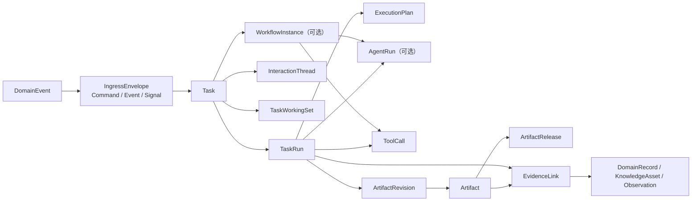
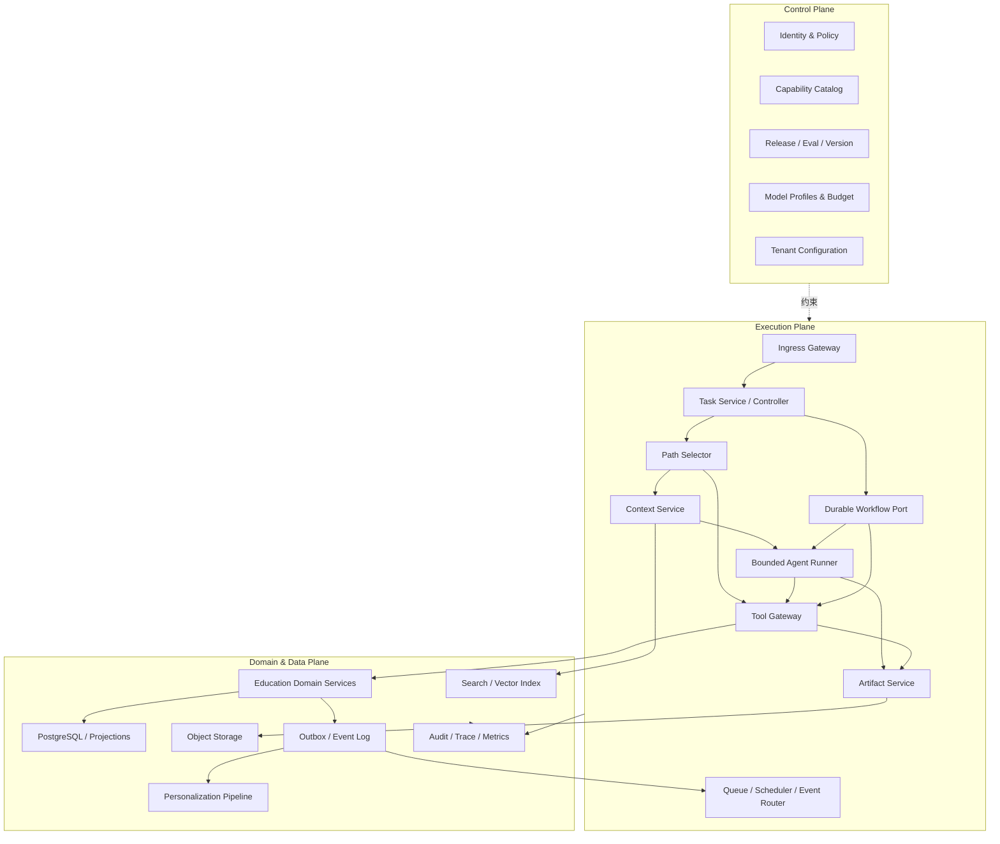
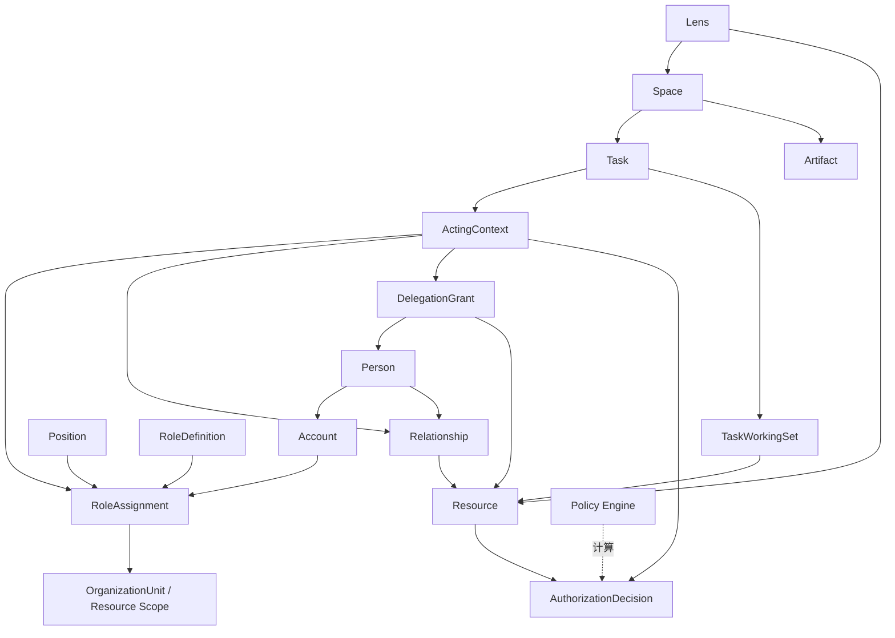
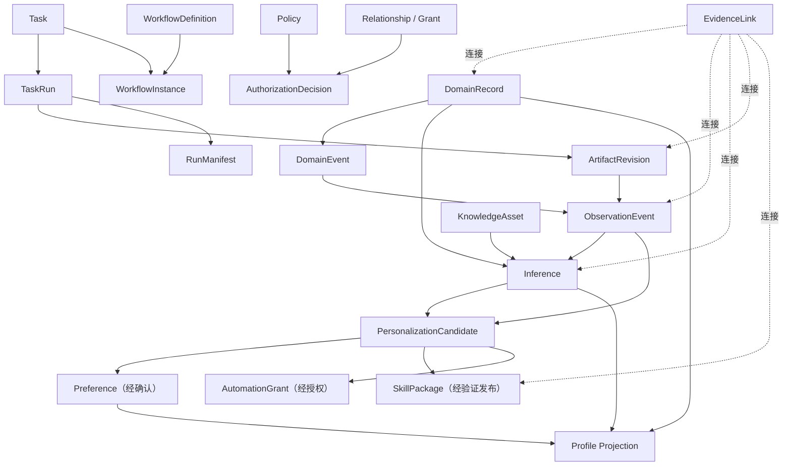
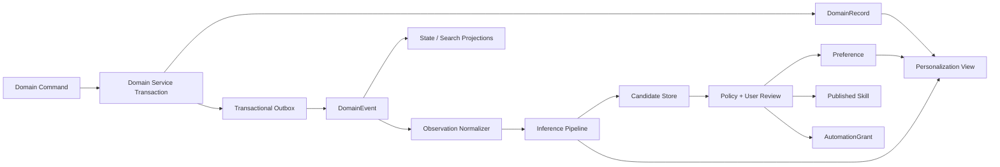
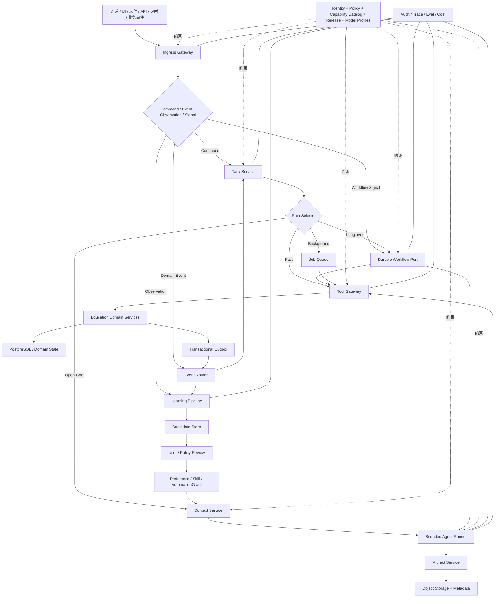

# 教育智能体平台架构红队审查与 v0.3 建议

> 审查对象：`教育智能体平台架构探索与先进Agent系统对比_v0.2.md`<br>
> 基线指纹：SHA-256 `0811D0520EA73B00A83BF259ACA13E11B622EC983CD287EFBF55B822234BDD0B`（1,917 行）<br>
> 审查日期：2026-07-27<br>
> 审查角色：首席系统架构师 / 架构红队 / 反方评审<br>
> 文档性质：架构决策建议，不是实现规格，也不替代用户研究、数据治理评估和工程 Spike<br>
> 结论置信度：凡标注“高”的结论可直接进入 v0.3 基线；“中”的结论应保留接口并用 Spike 决策；“低”的结论不得固化为平台能力。

# 1. 执行摘要

## 1.1 总体评价

v0.2 是一份质量较高的**架构探索清单**，但还不是一份可持续迭代的**架构基线**。

它正确识别了若干根本问题：平台不能以聊天为中心；确定性业务逻辑不能交给 Agent；Artifact、Task 和长期过程必须独立建模；上下文需要按需加载；正式 State 不能由 LLM 自由写入；个性化必须可见、可撤销；高影响动作要在承诺边界重新授权。这些判断应保留。

但文档的综合方案犯了一个典型错误：把多个先进系统各自解决的局部问题，压缩成一个同时拥有微内核、多平面、动态 DAG、长期 Workflow、多 Agent、Workspace Overlay、Context Compiler、Evidence Graph、Memory Repository、Feature Store 和十余类 Registry 的平台蓝图。结果是：

- 概念数量已经超过首版团队能够稳定实现和验证的范围；
- 多个组件在争夺同一职责；
- 权限、状态权威性和个性化写入边界仍没有形成不可绕过的不变量；
- “可配置”被误当成“边界清晰”；
- 框架能力被提前当成产品架构。

我的总体判断是：

> v0.2 的产品方向大体正确，核心运行模型尚未闭合；若直接据此开发，最可能得到的不是“教育智能操作系统”，而是一个高成本、难调试、权限语义不稳定的 Agent 编排平台。

## 1.2 最严重的九个问题

1. **Workspace 是上帝对象。** 它同时承载数据范围、权限暗示、上下文、能力、Agent、Skill、Tool、事件订阅、策略和 UI；任何跨空间任务都会变成隐式权限合并。
2. **Context Compiler 是第二个上帝对象。** 它被要求解析身份、授权、检索、记忆、能力、冲突、压缩和预算，无法独立测试，也会成为延迟和故障集中点。
3. **长期 Personal Education Coordinator 会成为“混淆代理”。** 它既理解目标又选择权限上下文、工具、工作流和交付，容易把用户拥有的多种角色合并成一个过度授权身份。
4. **`ExecutionRequest` 抹平了 Command、Event 和 Workflow Signal 的语义。** “请求做某事”和“某事已经发生”不能使用同一处理契约；否则事件重放可能重复执行副作用。
5. **Skill 已膨胀成第二个 Workflow Engine。** 当前 Skill 同时包含步骤、Agent、Tool、Hook、权限、并行、评测和个性化更新，和动态 DAG、WorkflowDefinition 职责重叠。
6. **Memory、Profile 和 Inference 的边界没有真正成立。** 文档声明它们分开，但示例仍把同一行为模式复制到 Memory、Profile 和 Personal Skill；三者会互相覆盖。
7. **个性化学习链缺少隔离写入区。** LLM 推断、行为模式、候选偏好和正式业务数据之间没有完整的发布门，尤其会对学生形成不可接受的反馈闭环。
8. **授权模型只有方向，没有可执行语义。** “角色 + 工作空间 + 情境”不足以回答谁以什么身份、为何、在什么时间、对哪个字段执行什么动作；更没有阻止多角色权限取并集。
9. **存储与框架组合过早。** 关系库、图数据库、向量库、Event Store、Feature Store、Git 仓库和 Durable Engine 被同时列为默认组件，首版会先承担分布式一致性成本，再获得尚未验证的价值。

## 1.3 最值得保留的设计

- 从 Conversation 转向 **Task、Artifact、Workflow、Event、Evidence**；
- Service 管理领域事实，Tool 是安全适配层，Agent 只处理开放判断；
- 正式 State 不由 LLM 直接修改；
- Fast Path、能力渐进披露和按风险路由；
- Artifact 的版本、来源、人工修改、审批、发布和回滚；
- Agent Runtime 与长期业务过程在**语义上**分离；
- 在真正产生持久影响前执行 Commit-time Authorization；
- 个性化候选需要证据、置信度、衰减、修正和回滚；
- 多 Agent 只作为有条件的执行策略；
- 用多类场景 Spike 验证抽象，而不是用单一聊天 Demo 证明平台。

## 1.4 必须推翻或重构的设计

- 推翻“每个用户拥有一个长期主 Agent”作为运行时中心；
- 拆除 Workspace 对权限、数据边界和能力授权的隐式控制；
- 拆分 Context Compiler，并把授权放到模型之外；
- 不再把所有入口统一成无差别的 `ExecutionRequest`；
- 删除 Skill 的可执行图、权限和 Hook 编排职责；
- 删除 Skill 的运行时多层继承；改为不可变版本和发布时解析的受限变体；
- 将 Memory 从权威数据类型降为“跨任务检索与呈现视图”；
- 将 Profile 改为可重建的投影，不作为事实源；
- 不默认引入 LangGraph + Temporal + 图数据库 + Feature Store；
- 不允许 Agent、Skill、Workspace 或个性化扩大权限。

## 1.5 推荐总体方向

推荐采用“**Task 中心、三平面、双执行语义、单一事实源、异步学习**”的平衡架构：

- **Task 是工作责任与执行生命周期的中心对象**；
- **Control Plane** 管理身份、授权、能力目录、版本、模型与发布；
- **Execution Plane** 包含快速路径、受限 Agent Run、Tool Gateway 和 Durable Workflow；
- **Domain/Data Plane** 保持教育事实、Artifact 和推断数据的权威边界；
- Agent 是短生命周期执行者，不是用户身份或事实持有者；
- Workspace 被拆成 `Space`、`Lens` 和 `TaskWorkingSet`；
- Skill 是轻量、版本化、按需加载的方法包；Workflow 才管理可恢复过程；
- 个性化只通过候选区进入 Preference、Skill 或 Automation Grant；
- v0.3 先以模块化单体、PostgreSQL、对象存储、搜索索引、队列/Outbox 构建；只有 Spike 证明必要后才增加 Temporal、图数据库或 Feature Store。

这一方向的核心不是少做功能，而是先建立五条硬边界：

1. LLM 不能成为正式事实源；
2. 上下文不能成为授权凭证；
3. Workspace 不能授予权限；
4. 个性化不能扩大权限或降低学生机会；
5. 任何持久副作用都必须经过当前授权、幂等和审计检查。

## 1.6 结论置信度

| 结论 | 置信度 | 依据 | v0.3 处理 |
|---|---|---|---|
| Task、TaskRun、Artifact、WorkflowInstance 分离 | 高 | 四者分别承载责任、尝试、成果和长期过程；生命周期与失败语义不同 | 进入基线 |
| Agent 不得成为身份、授权、正式状态或长期记忆的所有者 | 高 | 可直接消除混淆代理、状态污染和不可追责写入 | 进入架构不变量 |
| Workspace 必须拆为 Space、Lens、TaskWorkingSet | 高（内部模型） | 数据协作、界面聚合和任务上下文不是同一边界 | 进入基线；产品术语仍需用户测试 |
| Context 规划、授权、检索和组装必须分责 | 高 | 安全性、缓存失效、延迟归因和独立测试均要求分离 | 进入基线 |
| Agent Runtime 与 Durable Workflow 应分离语义，但不应默认同时引入两个框架 | 高 | 认知循环与可靠长期过程有不同确定性、恢复和版本语义 | 进入基线 |
| Memory 只作检索视图、Profile 只作可重建投影 | 高 | 可避免与正式事实、观察和推断重复存储 | 进入基线 |
| PostgreSQL + 对象存储 + 搜索索引 + Outbox 足以支撑首个生产阶段 | 中 | 满足已知访问模式，但尚无真实负载和跨天流程数据 | 作为默认方案，以压测和 Spike 复核 |
| `Space`、`Lens` 是否应直接成为用户界面用语 | 中 | 内部边界清晰，不代表用户心智模型接受这些名称 | 接口可用原术语，先做术语测试 |
| 类型化 Artifact Diff 能显著降低教师审查成本 | 中 | 代码场景证据不能直接迁移到教案、课件和题目 | 只实现两种 Artifact 原型后决策 |
| 从行为轨迹发现稳定个人工作流能产生净价值 | 中偏低 | 需要足够纵向数据，且编辑可能代表纠错而非偏好 | 仅做 Candidate 与离线回放，不承诺自动生成 Skill |
| 多 Agent 在教育任务中有稳定质量收益 | 低 | 只有独立并行和独立复核有理论收益，缺少本项目成本/质量数据 | 默认关闭，以任务基准决定 |
| 首版需要 Temporal、图数据库或 Feature Store | 低 | 当前没有吞吐、查询或恢复证据支持 | 推迟，不进入 v0.3 必选技术栈 |
| 学生个性化能改善长期教育结果且不固化机会 | 低 | 这是因果、长期、公平性问题，不能由架构推出 | 仅建议态；通过教育研究和受控试点决策 |

# 2. 重新定义问题

## 2.1 真正要解决的核心问题

本项目不是在寻找“最强 Agent 架构”，而是在解决下面这个更具体的问题：

> 如何把学校中异构、跨角色、跨系统、跨时间的教育目标和事件，转化为可追责、可恢复、可审查的工作；在不把概率模型变成事实源、授权者或人的固定画像的前提下，逐步减少每个用户完成这些工作的摩擦。

这里有四个同时成立、彼此制约的系统目标：

1. **工作完成**：开放目标能被分解、执行、验证并产生可编辑成果；
2. **教育权威性**：课程、学生、作业、审批等正式事实仍由领域系统掌握；
3. **治理可靠性**：每次读取、推断、写入、发布和自动化都能说明主体、目的、依据和授权；
4. **受控适配**：系统能学习个人习惯，但个人模型可解释、可修正、可失效，且不能固化学生。

因此，平台首先是一个“**受治理的教育工作与 Artifact 协同平台**”，其次才是 Agent 平台。“教育智能操作系统”可以保留为产品愿景，但不能作为无限扩大内核范围的理由。

## 2.2 必须明确的非目标

v0.3 不应承诺：

- 为每个教育角色预建一个长期自主 Agent；
- 用同一个抽象覆盖即时问答、月考流程、学生画像和 UI 个性化；
- 自动从少量行为中生成并启用个人 Skill；
- 让学校通过无限 Overlay 改写内核；
- 用一个通用图引擎表达所有业务逻辑；
- 在首版支持任意 Artifact 的自动语义合并；
- 通过引入多个框架获得“未来可扩展性”；
- 让模型推断直接影响评分、纪律、资源机会或正式学生记录。

## 2.3 v0.2 混淆的层次

| 层次 | v0.2 中的表现 | 混淆后果 | v0.3 处理 |
|---|---|---|---|
| 产品愿景 | 教育智能操作系统、适配每个人 | 容易把所有未来需求纳入首版内核 | 作为方向，不作为技术边界 |
| 平台能力 | Agent、Skill、Tool、Workflow、记忆、插件 | 能力清单被误当成架构 | 按责任、状态权威和副作用重新划分 |
| 业务功能 | 备课、测评、家校、日程、学生支持 | 与运行时组件同层排列 | 由领域 Service 和场景应用负责 |
| 运行时机制 | Router、Planner、DAG、Subagent、Model Router | 每个请求似乎都要进入 Agent Runtime | 先做路径选择，再决定是否使用模型 |
| 数据模型 | Knowledge、State、Memory、Profile、Evidence | 同一结论被多处存储 | 事实、观察、推断、偏好和投影分离 |
| 用户体验 | 工作台、聊天、卡片、Workspace | UI 容器被当成权限和上下文边界 | `Space`、`Lens`、`TaskWorkingSet` 分离 |
| 治理要求 | Permission、Policy、Approval、Audit | 被画成横切平面，却无决策契约 | 独立 Policy Decision Point，读写两次校验 |
| 部署与基础设施 | 图库、向量库、Event Store、Temporal | 在负载和团队能力未知时提前选型 | 先以接口和 Spike 决策 |

## 2.4 判断架构是否成功的标准

v0.3 的成功不应以“有多少种 Agent”衡量，而应以这些问题能否得到确定答案衡量：

- 一次输入是 Command、Event 还是 Signal？
- 它创建、更新还是仅唤醒哪个 Task？
- 当前操作者以什么 Acting Capacity 行动？
- 使用了哪些数据，为什么允许使用，数据当时是否有效？
- 哪一步是确定性代码，哪一步由模型判断？
- 谁能产生草稿，谁能提交正式变更，谁对最终结果负责？
- 失败后重试会不会重复发送、重复记账或覆盖新状态？
- 结果是消息、Artifact Revision，还是领域状态变更？
- 个性化结论来自哪些观察，何时失效，用户如何撤销？
- 任意一次运行能否按当时的 Prompt、Model、Skill、Tool、Policy 和数据版本重放或解释？

# 3. 当前架构假设审查

| 假设 | 判断 | 风险 | 原因 | 建议 |
|---|---|---|---|---|
| “教育智能操作系统”适合作为架构边界 | 部分成立 | 高 | 适合作为愿景，但“OS”隐喻会鼓励无边界平台化 | 用“受治理的教育工作与 Artifact 平台”定义 v0.3 范围 |
| Workspace 是主要上下文单位 | 错误 | P0 | 一次任务会跨课程、班级、学生、日程和沟通；Workspace 不能同时是数据和权限边界 | 拆为 `Space`、`Lens`、`TaskWorkingSet` |
| Workspace Overlay 可解决学校与个人差异 | 高风险 | P0 | 任意多层覆盖会导致来源不可解释、冲突不可预测，尤其不能用于权限和政策 | 仅允许对有 Schema 的 UI/默认值做 Typed Patch；发布时解析 |
| 每个用户需要一个长期主 Agent | 错误 | P0 | 会合并多角色、长期记忆和权限，形成单点与混淆代理 | 保留 UX 层助手人格；执行时创建 Task-scoped Coordinator Run |
| 所有入口可统一成 ExecutionRequest | 部分成立 | P0 | 可以统一传输信封，但 Command、Event、Signal 的处理和幂等语义不同 | 使用带 `kind` 的 `IngressEnvelope`，保留原始语义 |
| Context Compiler 是核心差异化能力 | 部分成立 | P0 | 上下文质量确实关键，但单一 Compiler 承担授权、检索、能力和预算会成为上帝对象 | 拆为 Scope Resolver、Context Planner、Retriever、Assembler；授权独立 |
| 权限过滤应在检索和推理前完成 | 成立 | 中 | 能减少泄漏，但只做一次仍会受到权限变化和陈旧上下文影响 | 查询前过滤，Commit 前重新授权；领域 Service 再做防御性校验 |
| 动态 DAG 应是复杂任务的默认表示 | 证据不足 | P1 | 很多任务用一个 Agent Run + 几个 Tool 即可；图的动态修改、恢复和版本化成本高 | 只在存在并行、显式依赖或局部恢复价值时生成 ExecutionPlan |
| Agent Runtime 与 Workflow Engine 应分离 | 成立 | 中 | 认知循环和长期可靠过程的语义不同 | 分离语义和接口；不要默认同时采用 LangGraph 与 Temporal |
| Task、Artifact、Workflow 应成为一等对象 | 成立 | 低 | 它们分别承载目标、成果和长期过程 | 再增加 `TaskRun` 与 `ArtifactRevision`，避免 Task 和执行实例混淆 |
| 多 Agent 能提高复杂任务质量 | 部分成立 | 高 | 只对独立并行、隔离上下文或独立复核有净收益 | 默认单 Agent；用成本/延迟预算和结构化委派门槛启用 |
| 用户行为可形成个人 Skill | 部分成立 | P0 | 重复行为可能是偶然约束或不得不做的补救，不等于偏好 | 先形成 Pattern/Inference，再经回放、确认、试用后发布 Skill |
| 五级自治可表达用户授权 | 部分成立 | P0 | 单一等级无法表达动作、对象、时间、目的、风险和通知条件 | 五级只作 UI 预设，底层使用细粒度 `AutomationGrant` |
| Knowledge、State、Memory、Profile、Skill 可以清晰分开 | 部分成立 | P0 | Knowledge/State/Skill 可分；Memory 是跨多类数据的使用视图，Profile 是投影 | 删除通用 MemoryRecord 作为事实源；新增 Observation、Inference、Preference |
| Evidence Graph 应作为独立核心存储 | 证据不足 | P2 | 大多数证据是可用关系表和链接表达的溯源边；图数据库未必必要 | 先做统一 Provenance Envelope + EvidenceLink；需要时生成图投影 |
| 图数据库适合课程与关系知识 | 证据不足 | P2 | 查询模式和规模尚未知，关系库边表可能足够 | 以查询基准而不是概念完整性决定 |
| Skill 应支持运行时继承 | 错误 | P0 | Prompt/步骤的多层合并不可预测、不可稳定测试 | 不可变版本 + 明确变体；仅对受限字段做发布时 Patch |
| 统一 Registry 能带来扩展性 | 部分成立 | P1 | 需要目录，但十余个 Registry 会形成治理和版本碎片 | 合并为 Capability Catalog、Policy Registry 和 Release Registry |
| 不同模型可按任务强弱动态切换 | 部分成立 | P1 | “小/中/强模型”不足以约束数据驻留、稳定性和回退行为 | 使用经评测的 Model Profile，并把版本写入 RunManifest |
| 学校、个人和任务配置可自然叠加 | 高风险 | P0 | 当前指令、学校政策、个人偏好不是同一类值，不能用一条全局优先级链 | 按 claim 类型分别处理冲突，强制策略不可被 Overlay 覆盖 |
| 首版需要 Durable Workflow 产品 | 证据不足 | P1 | 长期流程目标成立，但吞吐、数量、补偿复杂度和团队运维能力未知 | 定义 Durable Port；用跨天场景 Spike 决定 Temporal 引入时点 |

# 4. 架构问题清单

## 4.1 P0：不修改就会导致架构方向错误

| ID | 文档位置或概念 | 问题、根因与后果 | 建议修改 |
|---|---|---|---|
| P0-01 | 2.3、4.3～4.6、`WorkspaceSpec` | Workspace 同时包含 Scope、Role、Agent、Skill、Tool、Knowledge、Event、Policy 和 UI。根因是把“用户看到的空间”误当成运行时边界。后果是跨空间任务会隐式合并权限，配置变化会改变数据可见性，测试矩阵指数增长。 | Workspace 不再是内核对象。协作容器叫 `Space`，界面默认叫 `Lens`，任务数据集合叫 `TaskWorkingSet`；三者不能授予权限。 |
| P0-02 | 2.4、3.2、10.2 的 Personal Education Coordinator | 长期主 Agent 被赋予目标理解、身份角色解析、路径选择、调度、进度、确认、综合和反馈职责。根因是把 UX 人格、控制平面和执行者混成一个对象。后果是单点瓶颈、角色权限取并集、长期上下文污染和不可复现。 | 使用确定性的 Task Controller；只有开放任务创建短生命周期 Coordinator Run。身份、授权、预算、重试、Workflow 状态和正式提交全部外置。 |
| P0-03 | 3.3、12.2 Context Compiler | 同时承担身份、权限、检索、记忆、能力、冲突、预算和压缩。根因是把所有“模型前工作”归入一个名字。后果是延迟不可归因、缓存不安全、组件不可独立演进。 | 拆成 Subject Resolver、Scope Resolver、Policy Decision Point、Context Planner、Source Adapters、Assembler；输出可解释 `ContextPackage`。 |
| P0-04 | 3.2、12.1 `ExecutionRequest` | 将对话、UI、定时、行为事件、API 和 Workflow 恢复统一为“执行请求”。根因是只统一了形状，没有保留语义。后果是事件重放可能重复执行，Workflow Signal 可能错误创建新任务，行为日志可能直接触发 Agent。 | 统一为传输层 `IngressEnvelope`，内部明确 `Command`、`DomainEvent`、`ObservationEvent`、`WorkflowSignal` 四类。 |
| P0-05 | 5.6、6.6～6.7、12.4 Skill | Skill 包含步骤图、并行、Agent、Tool、Hook、权限、个性化和评测。根因是把“做事说明”提升为运行引擎。后果是 Skill、Plan 和 Workflow 三套控制流互相嵌套，权限藏进 Prompt 包。 | Skill 只保留说明、适用条件、资源、模板、示例和可选脚本；可执行控制流属于 ExecutionPlan 或 WorkflowDefinition；权限永远外置。 |
| P0-06 | 5.3～5.8 个性化学习链 | “低风险静默试用”“候选 Skill 下一次应用”没有定义隔离环境、用户可见性和影响范围。根因是把预测置信度等同于授权。后果是错误模式进入默认行为，学生可能被历史推断限制。 | 所有推断先进入 Candidate Store；只有可逆 UI 默认可做透明实验。Skill、Automation、跨系统动作和学生支持策略必须经过风险门与显式授权。 |
| P0-07 | 2.8、6.4～6.6 Memory/Profile/Skill | “老师先分析作业”可同时存为程序性 Memory、ProfileAttribute 和 Skill。根因是按产品名词分类而不是按事实/观察/推断/承诺分类。后果是旧推断覆盖新事实，删除一处仍在另一处生效。 | 新增 Observation、Inference、Preference；Profile 只作投影；Memory 只作检索视图；Skill 仅在方法被发布后存在。 |
| P0-08 | 4.1～4.5 Role Graph 与跨空间桥接 | 只说明动态计算，没有定义 Acting Capacity、Purpose、Relationship、字段级义务和 deny/approval 合并。根因是默认多角色可组合。后果是老师可能在班主任任务中调用科组长或家长身份权限。 | RBAC 提供粗粒度资格，ReBAC 表达学校关系，ABAC 表达时空/目的/敏感度，Policy Engine 输出 allow/deny/obligations；每个步骤单独计算，不做角色全集。 |
| P0-09 | 6.1 Scope、6.8 存储、10.2 数据平面 | `tenant_id` 只是字段，没有多租户隔离不变量、数据驻留、密钥、连接器身份和跨校迁移规则。根因是把租户字段误当成隔离策略。后果是测试环境、缓存、向量索引或模型调用发生跨校泄漏。 | 所有持久记录和缓存键强制 tenant 绑定；连接器、索引、密钥和审计按租户隔离；跨租户只允许显式 Bridge Contract。 |

## 4.2 P1：会严重影响扩展性或可维护性

| ID | 文档位置或概念 | 问题、根因与后果 | 建议修改 |
|---|---|---|---|
| P1-01 | 3.4 动态 DAG | 把节点重试、幂等、审批、证据、成本和失败替代都压入动态图。根因是没有区分“当前计划”与“可靠编排”。后果是团队事实上自研 Workflow Engine，恢复、升级和调试成本失控。 | 简单任务使用线性/反应式 Agent Run；只有明确依赖、并行和局部恢复收益的任务生成有限 ExecutionPlan。 |
| P1-02 | 8.7～8.9、10.1 | 因 LangGraph 与 Temporal 各擅长一部分，就隐含采用双框架。根因是按能力清单选框架，而不是先定义状态所有权。后果是团队同时承担两套状态、重试、可观测和升级模型。 | 先定义 BoundedAgentRunner 与 DurableWorkflowPort；v0.3 不同时绑定两者。 |
| P1-03 | 10.3、12.8 Task | Task 在综合方案后段才出现，缺少 goal revision、责任人、取消、等待原因、多次 Run 和幂等语义。根因是仍以 Agent 调用链而非工作责任建模。后果是恢复、追责和多次尝试无稳定落点。 | Task 成为首要聚合根；把一次执行拆为 TaskRun，把对话拆为 InteractionThread。 |
| P1-04 | 3.7 Artifact | 直接借用 branch/diff/merge，但教育 Artifact 通常是结构化文档，且发布版本与草稿不同。根因是把 Git 文本语义机械迁移到教育内容。后果是产生教师无法理解、系统无法安全自动合并的冲突。 | 使用类型感知 Revision 与 Diff；只在并行提案时分支；发布生成不可变 Release。 |
| P1-05 | 6.5 全局优先级 | “法律 > 学校 > 当前指令 > 偏好……”混合了政策、事实、指令和推断。根因是试图用一个全序解决不同类型的冲突。后果是偏好可能错误覆盖事实，或旧政策以“高优先级”压住新政策。 | 按 Policy、Domain Fact、User Preference、Inference 分别解决冲突；无法裁决时保留并列并阻断高风险动作。 |
| P1-06 | 2.9 十余类 Registry | 每类对象一个 Registry。根因是按名词而不是共同的发现、发布和版本语义拆服务。后果是授权、版本、缓存与发布逻辑重复且逐渐不一致。 | 合并为 Capability Catalog（Tool/Skill/AgentProfile/Workflow/Evaluator）、Policy Registry、Release Registry。 |
| P1-07 | 6.8 存储组合 | 关系库、图数据库、Event Store、向量库、Feature Store、Git 和 Workflow Store 同时出现。根因是把每种未来查询的最佳工具都当成首版依赖。后果是尚未验证价值就承担同步、备份、权限和运维复杂度。 | PostgreSQL + 对象存储 + 派生搜索索引为默认；Outbox/流负责事件；其他存储以基准测试为准。 |
| P1-08 | 3.6 动态模型路由 | 只按任务难度路由。根因是把模型选择视为成本/能力匹配，遗漏数据分类、部署边界、版本稳定性、回退语义和评测门。后果是敏感数据进入错误部署，或 fallback 静默改变高风险行为。 | 使用版本化 Model Profile；高风险场景禁止未经评测的自动 fallback。 |
| P1-09 | 3.2、3.5 Event | 没有事件 ID、分区键、顺序、至少一次投递、去重、Outbox 和消费水位。根因是把 Event 当作触发消息而非可重放事实通知。后果是重复副作用、乱序覆盖和数据库已提交但事件丢失。 | 定义 Event Contract 与幂等消费者；领域事务通过 Transactional Outbox 发布。 |
| P1-10 | 3.6 Tool 动态暴露、7.4 Tool | Tool Schema 有风险字段，但没有资源提取器、数据分类、部分成功、补偿、Secret Broker 和 MCP 信任等级。根因是把 Tool 描述元数据误当成执行安全。后果是未授权对象访问、凭证扩散以及部分成功后重复写入。 | 建立 Tool Gateway 与更完整的 CapabilitySpec；MCP annotation 只作提示，不能作为授权依据。 |
| P1-11 | 10.2 Governance 平面 | 治理被画成横线，却没有“谁做最终决策”的组件。根因是把治理当成横切关注点而非可调用的决策契约。后果是 Router、Agent、Tool 和 Service 各自解释权限。 | Policy Decision Point 是唯一授权决策者；Domain Service 仍做最终防御性校验。 |
| P1-12 | 3.3 Context 缓存 | 没有说明权限变化、学生转班、政策新版本和敏感数据对缓存的影响。根因是把缓存只视为性能手段。后果是用户在权限撤销后仍能从旧 Context 获取敏感信息。 | 缓存键含 tenant、subject、source version、policy version、classification；权限撤销触发失效。 |
| P1-13 | 10.5 个性化横跨所有层 | “横跨”没有定义单向写入契约。根因是把个性化当作每个组件都能自由读取和更新的全局能力。后果是个性化逻辑侵入领域服务，正式状态与推断发生循环更新。 | 个性化只输出 Preference Snapshot、Recommendation 和候选 Patch；各层通过只读契约消费。 |
| P1-14 | 7.1 Agent 综合输出与验证 | Agent 既执行又综合，Verifier 也可能是同类 Agent。根因是没有把验证种类和责任拆开。后果是相关性错误被“自我审批”，最终提交无人负责。 | 结构校验、业务规则、证据覆盖由确定性 Evaluator；主观质量可用独立模型评审；提交责任仍归人或授权主体。 |

## 4.3 P2：可在后续演进中处理

| ID | 文档位置或概念 | 问题、根因与后果 | 建议修改 |
|---|---|---|---|
| P2-01 | 4.6 智能空间 | 自动聚合很可能生成大量临时空间和信息碎片。根因是把一次查询结果实体化为长期容器。后果是导航膨胀、归档不清和用户误认为获得了新权限。 | 将其建模为可过期 Saved Lens，不创建新权限或数据容器。 |
| P2-02 | 4.7 动态 UI | 按行为持续改变首页。根因是把短期点击模式当作稳定偏好。后果是破坏肌肉记忆、培训材料和支持人员对界面的共同理解。 | 采用固定组件槽位、可解释建议和一键恢复，不做静默重排。 |
| P2-03 | 6.2 课程知识图谱 | 图模型可能有价值，但没有列出必须通过图查询解决的产品问题。根因是由“关系丰富”直接推导“需要图数据库”。后果是新增一套权限、同步和运维体系，却未必改善查询。 | 先用关系边表与搜索；只有多跳查询质量/性能 Spike 通过后引入图数据库。 |
| P2-04 | 3.7 Artifact 自动合并 | 课件、题目和家长消息的语义冲突很难自动安全合并。根因是把文本可合并等同于教育意图可合并。后果是正确答案、语气承诺或教学目标被静默改变。 | v0.3 支持版本与对比；自动合并只对结构独立、可验证字段开放。 |
| P2-05 | 14.5 Marketplace | 市场会带来供应链、版权、数据外传和质量治理成本。根因是在内部发布链成熟前追求生态规模。后果是恶意或不兼容能力进入学校生产环境。 | 推迟到学校内部发布链和 Skill 签名机制成熟以后。 |
| P2-06 | 5.9 教育结果反馈 | 教育结果受教师、班级、时间和测量方式共同影响。根因是把相关性反馈误作个性化策略的因果效果。后果是系统强化表面上“有效”但实际有偏的策略。 | 只作为低权重证据；需要试验设计、对照和人工解释。 |
| P2-07 | 6.8 Feature Store | 尚未形成稳定特征、训练管线和在线/离线一致性需求。根因是从未来机器学习愿景倒推首版基础设施。后果是重复存储、双写漂移和额外值班负担。 | 先用版本化投影表；规模和模型训练需求出现后再评估。 |

## 4.4 P3：命名、表达或实现细节

| ID | 文档位置或概念 | 问题、根因与后果 | 建议修改 |
|---|---|---|---|
| P3-01 | `StateSnapshot` | 名字暗示所有状态都是同类快照；根因是没有区分事实、投影和推断。后果是开发者可能用同一更新语义处理三者。 | 分为 DomainRecord、StateProjection、InferenceSnapshot。 |
| P3-02 | Role Graph “继承” | 角色关系更常是 assignment、membership、responsibility；根因是借用了面向对象继承隐喻。后果是隐式权限扩张和难以解释的角色冲突。 | 使用 RoleAssignment 与 Relationship；继承只限显式授权模型。 |
| P3-03 | Workflow 定义 | 7.3 把 Workflow 描述为“任务实例”，12.6 又叫 WorkflowSpec；根因是定义与运行状态未分层。后果是版本升级和恢复时无法说明实例绑定哪个定义。 | 明确 WorkflowDefinition 与 WorkflowInstance。 |
| P3-04 | Evidence Graph | 名字提前绑定图实现；根因是把逻辑关系模型等同于存储技术。后果是团队可能在查询需求出现前引入图数据库。 | 对外称 Provenance & Evidence；图只是可选投影。 |
| P3-05 | Personal Operating Model | 名字暗示系统拥有一个完整、稳定的人格模型；根因是用“个人操作系统”隐喻描述多个用途投影。后果是用户误解、开发者固化标签。 | 改为 Personalization View，强调可重建、按情境、非身份。 |

## 4.5 关键争议的替代方案与裁决

| 争议 | 当前方案、问题与根因 | 可选方案 | 代价与适用条件 | 最终推荐 |
|---|---|---|---|---|
| 任务协调主体 | 长期 Personal Education Coordinator 集中理解、授权上下文、规划与交付；根因是把统一体验误作统一运行主体 | A. 长期用户 Agent；B. 每任务临时 Coordinator；C. 统一 Interaction Assistant + 按需 Task Coordinator | A 连贯但形成混淆代理；B 最清晰但体验人格不连续；C 多一个 UX/Runtime 契约，适合多入口平台 | **C**；体验连续，执行和权限不连续 |
| Context 构建 | 单一 Context Compiler 包含身份、授权、检索、能力和预算；根因是以“模型调用前处理”划边界 | A. 保留 Compiler；B. 完全分散到各 Agent；C. 独立 Policy + Context Planner/Retriever/Assembler | A 易启动但不可测；B 重复且泄漏；C 接口较多，但可缓存、可解释、可独立压测 | **C**；Context Service 可作为一个部署单元，但内部职责不可合并 |
| 短期与长期执行 | 动态 DAG + LangGraph + Temporal 倾向同时引入；根因是按框架特长拼装 | A. 自研统一引擎；B. 短期 Runner + Durable Port；C. 首日绑定 LangGraph + Temporal | A 统一但研发风险极高；B 需清楚移交协议；C 能力强但团队同时承担两套状态语义 | **B**；首版可用 PostgreSQL 状态机实现 Port，Spike 后再选产品 |
| Workspace | Workspace 同时是 UI、权限、数据和上下文容器；根因是希望一个对象解释全部用户场景 | A. 保留上帝 Workspace；B. Workspace 仅为页面/视图；C. 拆为 Space、Lens、TaskWorkingSet | A 配置直观但跨空间权限失控；B 最简单但协作与任务集合无落点；C 概念多两个，但每个边界可测试 | **C**；产品层可继续显示“工作空间” |
| Skill 表达力 | Skill 包含步骤图、Agent、Tool、Hook、权限与评测；根因是把所有可复用做法装进单包 | A. 重型可执行 Skill；B. 轻量说明/资源包；C. 再增加 Recipe 中间层 | A 成为第二 Workflow；B 简单但确定性流程需另建 Workflow；C 只有出现大量中间案例才有价值 | **B**；v0.3 不设 Recipe，控制流归 Plan/Workflow |
| Memory/Profile | 同一结论可复制为 Memory、Profile、Skill；根因是按产品入口而非认识论状态分类 | A. 通用 Memory Store；B. 事实/观察/推断/偏好分源，Memory/Profile 作视图；C. Agent-owned 文件记忆 | A 易检索但权威性混乱；B 数据模型要求较高但一致性最好；C 可读但权限、并发、删除和结构查询弱 | **B**；文件只用于叙事知识和发布包 |
| 个性化生效 | 从行为模式直接更新个人模型或低风险 Skill；根因是把预测可信度当授权 | A. 自动生效；B. Candidate→回放→确认/透明试验→发布；C. 只允许显式设置 | A 学习快但会静默固化；C 最安全但差异化弱；B 管线和 UX 成本较高，适合渐进个性化 | **B**；Pilot 初期可退化为 C，学生高影响用途保持 C |
| 多 Agent | 主 Agent 可按需创建多个专业 Agent；根因是默认“复杂任务需要更多角色” | A. 默认多 Agent；B. 默认单 Agent、门槛式委派；C. 永不使用多 Agent | A 成本和错误面高；C 放弃独立并行/复核收益；B 需要任务基准和并发预算 | **B**；仅独立并行、隔离上下文或独立复核时启用 |

# 5. 教育平台整体运行时架构

## 5.1 核心对象：以 Task 为中心，而不是以 Agent、Conversation 或 Workspace 为中心

### 5.1.1 选择结论

推荐以 **Task** 作为运行时的聚合根。

原因不是 Task 比其他对象“更高级”，而是它是唯一能稳定连接以下责任的对象：

- 谁提出或触发了目标；
- 目标当前版本是什么；
- 使用哪些资源和权限；
- 由哪些 Run 执行；
- 是否进入长期 Workflow；
- 产生或修改哪些 Artifact；
- 当前在等待谁或什么；
- 谁负责审查和提交；
- 最终成功、失败、取消或撤销；
- 哪些事件、证据和成本属于这件工作。

其他对象的地位如下：

| 对象 | 定义 | 是否持久 | 与 Task 的关系 | 不应承担的职责 |
|---|---|---:|---|---|
| `IngressEnvelope` | 外部输入的统一传输信封，保留 Command/Event/Signal 类型 | 是，至少留审计摘要 | 创建、更新或唤醒 Task | 不表示业务目标本身 |
| `Task` | 一项有目标、责任、状态和交付条件的工作 | 是 | 聚合根 | 不保存 Agent 内部思维或 Workflow 细节 |
| `TaskRun` | 对某个 Task 目标版本的一次执行尝试 | 是 | 一个 Task 可有多次 Run | 不等于 Conversation |
| `InteractionThread` | 人与系统围绕 Task 的连续交互记录 | 是 | 一个 Task 可有多个 Thread | 不作为正式状态源 |
| `ExecutionPlan` | 某次 Run 的有限执行计划，可线性也可成图 | 是，审计级 | 属于 TaskRun | 不管理跨天等待和业务补偿 |
| `WorkflowDefinition` | 版本化、可测试的长期过程定义 | 是 | 可被 Task 选择 | 不保存实例状态 |
| `WorkflowInstance` | 跨时间、人员或系统的持久执行实例 | 是 | 通常一对一或一对多关联 Task | 不持有领域事实副本 |
| `Artifact` | 逻辑成果身份，例如某份教案或测评 | 是 | 由 Task 创建或修改 | 不等于已发布正式记录 |
| `ArtifactRevision` | Artifact 的不可变内容版本 | 是 | 由 TaskRun 产生 | 不自动覆盖并发版本 |
| `ArtifactRelease` | 经审批发布的不可变版本 | 是 | 完成某些 Task 的承诺结果 | 不随草稿修改 |
| `DomainEvent` | 领域中已经发生的事实 | 是、不可变 | 可触发或推进 Task | 不能被当成“请执行” |
| `EvidenceLink` | 结果、推断与原始来源之间的可追溯关系 | 是 | 贯穿 Task、Artifact、Inference | 不替代原始记录 |
| `AgentProfile` | 可复用的模型、说明、工具限制配置 | 是、版本化 | 被某次 AgentRun 引用 | 不是长期存在的自主主体 |
| `AgentRun` | TaskRun 内一次短生命周期认知执行 | 是，保留轨迹 | 执行开放判断 | 不拥有正式权限或长期业务状态 |

Conversation、Request、Thread、Workflow、Artifact、Event、Space 都不是平台的单一中心。它们分别描述交互、输入、会话、长期过程、成果、事实和协作视图。强行选其中任何一个替代 Task，都会丢失责任链。

### 5.1.2 关系



### 5.1.3 生命周期

Task 建议使用：

```text
proposed
→ accepted
→ queued
→ running
→ waiting_external | waiting_user | review
→ completed

任意非终态 → cancelled
running → failed_retryable → queued
running → failed_terminal
completed → reopened（创建新的 goal revision 与 TaskRun）
```

关键约束：

- `completed` 不是“模型说完成”，而是 Task 的验收条件满足；
- 目标发生实质变化时创建 `goal_revision`，不能静默改写历史；
- 重试创建新的 `TaskRun` 或新的 step attempt，不能覆盖失败轨迹；
- `waiting_*` 必须保存等待对象、超时策略、恢复信号和当前责任人；
- Cancel 停止未来执行，但不删除审计和已产生 Artifact；
- Artifact 发布与 Task 完成是两个状态；有些 Task 只生成草稿。

## 5.2 一次输入如何进入系统

### 5.2.1 统一传输，不统一语义

入口统一为：

```typescript
type IngressEnvelope =
  | CommandEnvelope
  | DomainEventEnvelope
  | ObservationEventEnvelope
  | WorkflowSignalEnvelope;
```

所有信封都至少包含：

```text
envelope_id
tenant_id
kind
source
actor_or_emitter
occurred_at
received_at
correlation_id
causation_id
idempotency_key
purpose
data_classification
payload_ref
schema_version
```

但四种内部语义必须保留：

- **Command**：请求系统做某事，可以被拒绝、取消或幂等重试；
- **DomainEvent**：业务事实已经发生，消费者只能据此反应，不能“撤回事件”；
- **ObservationEvent**：行为或交互观察，只进入分析和候选学习链；
- **WorkflowSignal**：定向推进既有 WorkflowInstance，不创建新的开放任务。

### 5.2.2 入口路由矩阵

| 入口 | 规范化结果 | 默认路径 | 是否需要 LLM | 何时创建 Task |
|---|---|---|---|---|
| 用户自然语言 | Command；保留原文和附件引用 | 规则/小模型识别意图与槽位 | 意图不明确时可用小模型；开放目标才用强模型 | 需要持续状态、Artifact 或多步工作时 |
| UI 固定操作 | 类型化 Command | Fast Path | 通常不需要 | 写入、异步处理或需审查时 |
| 文件上传 | `ArtifactImported` + 可选 Import Command | 病毒扫描、解析、分类、索引 | OCR/视觉理解可用模型；路由无需强模型 | 用户要求分析、转换或协作时 |
| 外部 API | 类型化 Command 或 DomainEvent | Schema 校验、鉴权、幂等处理 | 通常不需要 | API 明确请求工作时 |
| 定时任务 | `TimerFired` 或 WorkflowSignal | Scheduler → 规则/Workflow | 不需要 | 定时策略明确要求创建一次工作时 |
| 学生学习行为 | ObservationEvent 或 DomainEvent | 写事件、更新领域状态/投影 | 热路径不需要；异步归纳可用 | 只有规则/人工策略判断需要干预时 |
| 学校业务事件 | DomainEvent | 确定性订阅者 | 通常不需要 | 出现需要负责、跟踪和验收的事项时 |
| 长期 Workflow 恢复 | WorkflowSignal | 直接路由到实例 | Signal 路由不需要 | 不创建新 Task，除非定义明确派生子任务 |
| Agent 主动建议 | RecommendationCandidate | 风险/打扰策略 → 用户 | 生成建议可能需要模型 | 用户接受，或既有 AutomationGrant 明确授权时 |

### 5.2.3 执行路径选择

路径选择先由确定性规则和能力目录完成；只有“意图或任务性质不明确”才调用低成本分类模型。

```text
1. Schema 已知且操作确定？
   是 → Fast Path

2. 是否命中一个已发布、适用条件明确的 Skill？
   是 → Skill-guided Run

3. 是否为开放目标，且需要选择步骤或工具？
   是 → Bounded Agent Run / Dynamic Planning

4. 是否存在真正独立的并行子问题、上下文隔离或独立复核收益？
   是 → 可选 Multi-Agent

5. 是否等待外部事件、人工审批、定时器，或可能跨进程/跨天？
   是 → Durable Workflow

6. 输入只是已经发生的事件？
   是 → 确定性处理；规则满足时再创建 Task
```

以下请求完全不应经过 LLM：

- 已有参数的课程表、提交状态、日程等查询；
- 字段校验、权限检查、计数、排序、汇总等确定性计算；
- Workflow Signal 定向投递；
- 事件去重、状态机迁移、超时、重试和补偿；
- 正式数据写入、审批状态更新和审计记录；
- 已定义模板的简单填充，除非内容本身需要生成。

### 5.2.4 五条执行通道

平台不应只有一条 Agent Loop，而应有五条有不同 SLO 和故障语义的通道：

| 通道 | 典型任务 | 时限 | 状态 | 失败方式 |
|---|---|---:|---|---|
| Interactive Fast Lane | 查询、固定操作、结构化卡片 | 秒级 | 请求级 | 立即返回明确错误 |
| Cognitive Lane | 备课、分析、草拟、动态计划 | 秒到分钟 | TaskRun/AgentRun | 有界重试、可降级为草稿 |
| Background Compute Lane | OCR、批量分析、渲染、索引 | 分钟到小时 | Job + TaskRun | 队列重试、可取消 |
| Durable Work Lane | 审批、跨天流程、外部等待、周期任务 | 小时到月 | WorkflowInstance | 恢复、Signal、补偿 |
| Learning Lane | 轨迹标准化、模式发现、候选个性化 | 异步 | Candidate Pipeline | 不影响在线主流程 |

## 5.3 组件边界

### 5.3.1 推荐三平面



### 5.3.2 组件责任

| 组件 | 负责 | 明确不负责 |
|---|---|---|
| Ingress Gateway | Schema、来源认证、去重、类型保持、速率限制 | 不决定业务权限，不做开放规划 |
| Task Service / Controller | Task 生命周期、责任人、goal revision、Run、等待、取消、验收 | 不做模型推理，不保存领域事实副本 |
| Path Selector | 按类型、风险、确定性和能力选择通道 | 不执行 Tool，不授予权限 |
| Identity & Policy | 身份、关系、条件、授权和 obligations | 不把规则仅作为 Prompt 提示 |
| Context Service | 规划、检索、去重、预算、装配和来源解释 | 不认证用户，不做最终授权，不选执行路径 |
| Bounded Agent Runner | 有界目标理解、计划、工具选择、综合、局部重规划 | 不管理跨天等待，不直接写正式 State |
| Tool Gateway | Tool 发现、Schema、Secret、授权、执行、超时、重试、结果规范化 | 不成为领域事实源 |
| Durable Workflow Port | Timer、Signal、审批、等待、恢复、版本、补偿 | 不让 Workflow 代码直接做 LLM/网络副作用 |
| Artifact Service | Artifact、Revision、Diff、Review、Release、Lineage | 不将草稿自动写成领域状态 |
| Capability Catalog | Tool/Skill/AgentProfile/Workflow/Evaluator 元数据和版本 | 不运行能力，不自行决定授权 |
| Domain Services | 正式事实、业务规则、领域事务和事件 | 不依赖某个 Agent 框架 |
| Personalization Pipeline | 行为标准化、模式、候选、试用和评估 | 不直接更新业务 State，不自动发布高风险能力 |
| Audit / Trace | 关联 Envelope、Task、Run、Tool、Artifact、Policy、版本和成本 | 不保存隐藏思维链 |

## 5.4 主 Agent 是否必要

### 5.4.1 结论

不应存在一个拥有长期执行状态和综合权限的固定“主 Agent”。

可以保留两个不同层次的概念：

1. **Interaction Assistant**：产品体验上的统一助手人格，帮助用户表达目标、查看 Task 和接管工作；它不是权限主体，也不拥有持久认知状态。
2. **Task-scoped Coordinator Run**：仅在开放任务需要时创建的临时 AgentRun；它读取当前 TaskContract 和 ContextPackage，完成后终止。

### 5.4.2 Coordinator Run 的职责

允许：

- 澄清开放目标；
- 提出有限 ExecutionPlan；
- 在授权后的候选能力中选择 Skill/Tool；
- 将独立子任务委派给短生命周期 AgentRun；
- 根据结构化中间结果提出 plan patch；
- 综合草稿和解释；
- 请求用户在承诺边界做决定。

必须拆出：

- 身份认证和 Acting Capacity 解析；
- 最终授权、字段过滤和数据脱敏；
- Tool 的真实执行和 Secret 获取；
- Task/Workflow 状态迁移；
- 超时、系统重试、幂等和补偿；
- Token/成本硬上限；
- 正式 State 写入；
- Artifact 发布；
- 个人记忆、Profile 或 Skill 的正式更新；
- 审计记录和版本固定。

### 5.4.3 谁负责结果、重规划和失败

| 问题 | 责任组件 |
|---|---|
| 最终结果是否满足 Task 验收条件 | Task Controller + Evaluator；高风险结果由人审查 |
| Agent 是否可调整当前计划 | Coordinator 可提交 PlanPatch，Runner 校验边界后应用 |
| Tool 失败是否重试 | Tool Gateway 按幂等和错误分类决定 |
| 业务过程如何恢复 | Workflow Engine / Durable Adapter |
| 模型输出质量不足 | Evaluator 触发一次受限重做、降级草稿或人工接管 |
| 权限失效 | Policy Engine 拒绝；不得通过重新规划绕过 |
| 部分成功 | Task 进入 review/partial 状态，列出已完成、未完成和补偿建议 |
| 谁承担对外发布责任 | 发起人、被授权审批人或明确 AutomationGrant 的签发主体 |

## 5.5 Context 构建

### 5.5.1 拆分后的数据流

```text
AuthenticatedSubject
→ ActingContext Resolver
→ TaskWorkingSet Resolver
→ Policy 生成可查询范围与字段过滤
→ Context Planner 生成所需信息槽位与预算
→ Source Adapter 按需取回 ContextItem
→ Freshness / Authority / Conflict / Dedup
→ Sensitive Data Redaction
→ Context Assembler
→ ContextPackage + ContextManifest
```

`Context Planner` 决定“需要哪些类型的信息”，`Source Adapter` 决定“如何取”，`Policy Engine` 决定“是否可取和可见到什么粒度”，`Assembler` 决定“如何在预算内呈现”。这些职责不能再次合并到一个类中。

### 5.5.2 上下文分层

| 层 | 内容 | 加载策略 |
|---|---|---|
| L0 Runtime Contract | Task 目标、输出、预算、硬约束、当前 ActingContext | 总是加载，结构化 |
| L1 Policy Summary | 与当前步骤相关的 obligations、禁止项、审批点 | 总是加载摘要；真实执行仍在模型外强制 |
| L2 Authoritative State | 课程进度、提交状态、日程、Workflow 状态 | 按任务槽位加载，短 TTL |
| L3 Domain Knowledge | 课程标准、教材、学校制度、模板 | 先描述和索引，二阶段全文 |
| L4 Explicit Personalization | 当前指令、显式设置、已确认 Preference/Skill | 仅适用情境加载 |
| L5 Inference / History | 相关推断、过往 Task、Artifact、程序模式 | 默认只加载摘要、置信度和证据指针 |
| L6 Large Evidence | 原始文档、完整数据、长日志 | Agent 明确请求且权限/预算允许时加载 |

硬政策和授权不应仅靠 L1 Prompt 执行；L1 的作用是让 Agent 避免提出明显不可行的计划。

### 5.5.3 `ContextItem` 最小契约

```typescript
interface ContextItem {
  id: string;
  tenantId: string;
  claimType: "policy" | "domain_fact" | "knowledge" |
             "preference" | "inference" | "artifact" | "observation";
  subjectRefs: EntityRef[];
  contentRef: string;
  summary?: string;
  authority: AuthorityDescriptor;
  provenance: ProvenanceRef[];
  validTime?: TimeRange;
  transactionTime: TimeRange;
  observedAt?: string;
  staleAt?: string;
  classification: DataClassification;
  permittedUses: string[];
  sourceVersion: string;
  confidence?: ConfidenceVector;
}
```

### 5.5.4 按需加载与渐进披露

1. 首阶段只返回来源描述、类型、适用范围、版本、敏感级别和估算大小；
2. Planner 选择少量候选；
3. Policy Engine 对具体对象和字段再次过滤；
4. 取回摘要或结构化切片；
5. 仅当当前步骤确实需要原文时加载完整内容；
6. 大结果写对象存储或临时 Artifact，Prompt 中只放引用和必要片段。

### 5.5.5 Token、时间和成本预算

预算不只是一个 `max_context_tokens`。每次 Run 应有：

```text
deadline
max_model_calls
max_tool_calls
max_input_tokens
max_output_tokens
max_cost
max_parallelism
max_replans
reserved_tokens_for_user_instruction
reserved_tokens_for_authoritative_state
reserved_tokens_for_evidence
```

Context Planner 按层分配预算。当前 TaskContract、当前用户指令和权威状态不能被低权重历史记忆挤出。

### 5.5.6 新鲜度与缓存

- 静态教材和已发布模板按内容哈希缓存；
- 领域 State 使用来源版本或短 TTL，不用语义缓存替代实时查询；
- ContextPackage 是一次 Run 的只读快照，记录 `assembled_at` 和 source versions；
- 缓存键必须包含 tenant、subject/field mask、policy version、source version 和 data classification；
- 角色撤销、学生转班、政策更新、Artifact 发布应发出缓存失效事件；
- Commit 前重新读取关键状态并重新授权，不能依赖旧 ContextPackage。

### 5.5.7 冲突解决

禁止使用一条全局优先级链。应按 claim 类型处理：

| 冲突类型 | 处理 |
|---|---|
| 强制政策与用户要求 | Policy 拒绝或要求审批；用户指令不能覆盖 |
| 两个正式业务事实 | 依据领域 Service 版本与 valid time；仍冲突则阻断写入 |
| 教材/学校资源冲突 | 按适用学段、教材版本、发布者权威和生效时间选择，并显示来源 |
| 当前指令与长期 Preference | 当前任务指令优先，但不自动改写长期 Preference |
| 两个个人偏好 | 按适用条件、确认状态、最近验证和显式选择；不能确定时询问 |
| 推断与正式事实 | 正式事实不被推断覆盖；推断可标记“与新事实不一致”并降权 |
| 多个学生能力估计 | 保留分布和不确定性，不强行压成单标签 |

### 5.5.8 敏感信息与跨 Space

- TaskWorkingSet 明确列出每个 ResourceRef、访问目的和授权结果；
- ContextPackage 中的敏感字段用最小必要粒度，例如班级聚合优先于学生明细；
- 跨 Space 只代表跨视图取数，不产生跨权限；
- 用户可查看“本次使用的数据清单”，包括空间来源、对象、用途、版本和是否进入模型；
- 多 Agent 时，每个子 Agent 获得单独的 ContextManifest，只含子任务所需数据；
- 子 Agent 不获得父任务全部历史，不可访问未显式授予的 Tool；
- Agent 间共享的是结构化中间 Artifact 或 ResultRef，不是可自由改写的共享记忆。

## 5.6 Agent Runtime 与 Workflow Engine

### 5.6.1 语义边界

| 场景 | 执行主体 | 持久性要求 | 推荐表示 |
|---|---|---|---|
| 单次分类、抽取、生成、评审 | 函数或一次模型调用 | 请求级 | Step |
| 开放式、数分钟内完成的认知任务 | Bounded Agent Runner | 每步留 Run 记录 | AgentRun |
| 有依赖、并行、局部重做的短任务 | TaskRun Executor | 保存 ExecutionPlan 与节点结果 | ExecutionPlan |
| 批量渲染、OCR、统计 | Job Worker | 队列可恢复 | Background Job |
| 等待用户审批 | Durable Workflow | 必须跨进程恢复 | WorkflowInstance + Signal |
| 等待外部系统事件 | Durable Workflow | 必须相关、去重、超时 | WorkflowInstance + Correlation |
| 跨天/月业务过程 | Durable Workflow | 历史、版本、补偿 | WorkflowDefinition/Instance |
| 周期任务 | Scheduler + Workflow/Command | 防止重入和重复 | Schedule + Idempotency |

### 5.6.2 推荐方案

选择“**短期 Bounded Agent Runner + 长期 Durable Workflow Port**”的双执行语义，但不默认引入两套图框架。

v0.3 建议：

- 自研的不是通用图引擎，而是一个有界 Agent Run Harness；
- 简单 ExecutionPlan 存在 Task 数据库中，节点类型限制为 function/tool/agent/evaluator；
- 长期过程通过 `DurableWorkflowPort` 隔离实现；
- Pilot 可先用 PostgreSQL 状态机、队列和 Transactional Outbox 完成少量长期流程；
- 当跨天实例数量、补偿、Signal、版本迁移和故障恢复 Spike 证明复杂度后，引入 Temporal 或同类引擎；
- 不建议在 v0.3 同时采用 LangGraph 作为短期图运行时、Temporal 作为长期引擎，再自研 Task Controller。

### 5.6.3 升级为 Durable Workflow 的判定

满足任一条件即不应留在普通 AgentRun：

- 等待时间超过当前进程/请求的可靠生命周期；
- 等待用户、外部系统、定时器或人工审批；
- 有外部副作用，需要补偿或至少一次投递；
- 需要跨部署恢复；
- 需要明确的业务状态和责任人；
- 同一流程会跨多次 AgentRun；
- 法规或学校治理要求完整过程历史。

### 5.6.4 Workflow 约束

- WorkflowDefinition 必须版本化；实例固定到版本，升级要显式迁移；
- Workflow 代码/定义只做确定性控制；LLM、网络、数据库和文件调用作为 Activity/Tool 执行；
- Activity 至少一次执行，因此外部写入必须使用 idempotency key；
- 补偿不是数据库回滚，应明确业务可逆性和不可逆边界；
- 人工审批保存问题、选项、证据、截止时间、审批人资格和决策；
- Agent 可以在 `DynamicRegion` 内提出有限 Plan，但不能修改 Workflow 的强制门、责任链和补偿规则；
- 失败分为 transient、business_rejection、permission_denied、invalid_input、quality_failure、terminal；
- 不允许 LLM 决定系统重试次数或绕过终止条件。

## 5.7 Tool 系统

### 5.7.1 定义

> Tool 是平台允许模型或 Workflow 请求调用的、版本化且可治理的能力适配器；Domain Service 才是事实和业务规则的所有者。

Tool 可以由内部函数、HTTP API、异步 Job、MCP Tool 或外部连接器实现，但对 Runtime 暴露统一的 `CapabilitySpec`。MCP 是接入协议，不是授权模型，也不是内部领域 Service 的替代品。

调用链应为：

```text
Agent / Workflow 提出 ActionIntent
→ Tool Gateway 解析目标资源
→ Policy Decision Point 返回 Decision + Obligations
→ 用户审批（如需要）
→ Secret Broker 提供最小凭证
→ Tool Adapter 调用 Domain Service / 外部系统
→ Domain Service 再校验并执行事务
→ ToolResult 标准化、持久化和审计
```

### 5.7.2 `CapabilitySpec`

```typescript
interface CapabilitySpec<I, O> {
  id: string;
  version: string;
  provider: string;
  trustTier: "internal" | "tenant_approved" | "third_party" | "untrusted";
  description: string;
  inputSchema: JsonSchema<I>;
  outputSchema: JsonSchema<O>;

  effect: "none" | "additive" | "mutating" | "destructive" | "external_commit";
  idempotency: {
    mode: "naturally_idempotent" | "requires_key" | "not_idempotent";
    keyFields?: string[];
  };
  consistency: "strong" | "eventual" | "unknown";
  partialSuccess: "impossible" | "reported_per_item" | "possible_unknown";
  compensationCapabilityId?: string;
  concurrencyKeyExtractor?: string;

  permissionAction: string;
  resourceExtractor: string;
  requiredPurpose?: string[];
  inputClassifications: string[];
  outputClassifications: string[];
  approvalClass: "none" | "notify" | "confirm" | "dual_approval";

  timeoutMs: number;
  retryPolicyClass: string;
  rateLimitClass: string;
  costClass: string;
  executionMode: "sync" | "async_job" | "task_augmented";
  observabilitySchema: string;
  conformanceTestSuite: string;
}
```

MCP 的 `readOnlyHint`、`destructiveHint`、`idempotentHint` 等只能作为**不可信提示**。Tool Gateway 必须使用学校/平台批准的 CapabilitySpec 覆盖或验证，不能根据第三方服务器自报字段自动放行。

### 5.7.3 动态暴露与检索

Tool 数量变多后，使用四阶段发现：

1. 按 tenant、trust tier、Actor、数据分类和硬权限预过滤；
2. 仅向模型暴露 `id + description + effect + approvalClass`；
3. 用规则、关键词和语义检索形成通常不超过 8～12 个候选；
4. 选中后才加载完整 Schema；执行前仍进行真实授权。

Tool 搜索只减少 Prompt 体积，不替代 Capability Catalog 和 Policy Engine。高风险 Tool 不因“未暴露给模型”就视为安全；真正安全来自不可绕过的 Gateway。

### 5.7.4 ToolResult 如何进入上下文

ToolResult 分三层：

```text
structuredContent：供后续确定性步骤读取的结构化结果
displaySummary：供人和模型快速理解的短摘要
resultRef：完整结果、日志、大文件或分页数据的持久引用
```

禁止把完整数据库响应、全班学生明细或长日志直接拼入 Prompt。后续 Agent 需要时，通过 resultRef 请求经权限过滤的切片。每个 ToolResult 记录：

- Tool 与实现版本；
- 输入摘要和 idempotency key；
- 授权决策 ID；
- started/completed 时间；
- success/partial/failure；
- 外部事务 ID；
- 受影响资源；
- 输出分类和保留策略；
- retries、成本和 trace ID。

### 5.7.5 超时、失败和部分成功

- 只对明确的 transient error 自动重试；
- 非幂等 Tool 在未知结果时不得盲目重试，先查询外部事务状态；
- 批量操作逐项报告成功/失败，Task 不得把“部分成功”显示为完成；
- Tool 超时不等于外部操作未发生；
- 补偿需要独立权限和审计；
- 领域验证失败是业务拒绝，不应让 Agent通过改写参数反复碰撞；
- Circuit Breaker、速率限制和租户并发配额由 Gateway 执行；
- 第三方 Tool 在隔离进程/容器运行，使用 egress allowlist 和短期凭证。

### 5.7.6 测试与观测

每个 Tool 上线前至少通过：

- Schema 正反例；
- 权限资源提取器测试；
- 幂等与重复投递测试；
- 超时/未知结果/部分成功测试；
- 连接器凭证隔离测试；
- PII 输出分类与脱敏测试；
- 租户隔离测试；
- 速率限制与熔断测试；
- 模拟外部 API 版本变化的兼容测试；
- trace、audit、cost 字段完整性测试。

## 5.8 Skill 系统

### 5.8.1 定义

> Skill 是按需加载的、版本化的方法说明与资源包，用来改善 Agent 对“怎样做好一类工作”的理解；它不是权限、执行状态或长期流程。

Skill 可以包含：

- 名称、描述和适用条件；
- 方法说明、检查清单、示例；
- 模板、参考资料、Rubric；
- 可选的受审查脚本；
- 输入/输出示例；
- 评测集引用；
- 兼容性与发布信息。

Skill 不包含：

- 授权决定；
- Workflow 实例状态；
- Timer、Signal、Retry、Compensation；
- 任意可执行 DAG；
- Agent 的长期身份；
- 正式业务数据；
- 可覆盖学校强制 Policy 的 Prompt；
- 未经 Gateway 的 Tool 凭证或直接 API 调用。

### 5.8.2 与相邻概念的边界

| 概念 | 回答的问题 | 是否执行 | 是否持久状态 |
|---|---|---:|---:|
| AgentProfile | 用什么模型、说明和工具边界来做开放判断？ | 是，创建 AgentRun | 否，仅配置持久 |
| Skill | 怎样把某类工作做好？ | 由 Agent 阅读，脚本需经 Tool/Gateway | 否 |
| Tool | 对系统执行哪个原子查询或动作？ | 是 | 只保留调用记录 |
| WorkflowDefinition | 哪些步骤、等待、责任和承诺必须可靠发生？ | 是 | 定义持久，实例另存 |
| Memory View | 过去哪些信息可能与当前任务相关？ | 否 | 底层记录持久 |
| Policy | 什么允许、禁止或必须审批？ | 由 Policy Engine 强制 | 是、版本化 |
| Template | 结果的固定结构或样式是什么？ | 被渲染 | 是、版本化 |
| ExecutionPlan | 这一次 Run 实际打算怎样做？ | 是 | 仅属 TaskRun |

v0.3 不增加独立 Recipe 类型。若未来发现大量“短期、确定性不强、但可复用的执行骨架”无法由 Skill 说明或 Workflow 表达，再通过 Spike 引入；不能先为概念完整性增加。

### 5.8.3 不使用运行时继承

拒绝：

```text
平台 Skill
→ 学校 Patch
→ 学科 Patch
→ 年级 Patch
→ 个人 Patch
→ 任务 Patch
```

原因是自然语言指令和步骤列表没有可靠的继承语义，冲突很难静态发现。

推荐：

- Skill 版本不可变，以内容哈希标识；
- 发布者可创建显式 `variant_of`，但发布时解析为完整包；
- 只允许对有 Schema 的字段做 Typed Patch，例如模板 ID、输出语言、默认时长；
- 强制 Policy 不进入 Skill 合并链；
- 当前任务的临时要求进入 TaskContract，不生成临时 Skill；
- Runtime 每次只解析到一个明确 Skill 版本及其固定依赖集合；
- Skill 冲突时选择一个适用版本，或由用户选择；不自动把两份 Prompt 合并。

### 5.8.4 版本、测试、发布与回滚

Skill 生命周期：

```text
draft → candidate → validated → approved → published → deprecated → retired
                     ↘ rejected
```

发布必须固定：

- 内容哈希和语义版本；
- 发布者、适用 tenant/scope；
- 依赖 Skill/Template 的精确版本；
- 兼容 Agent Runtime 版本；
- 允许引用的资源类型；
- 安全扫描结果；
- 评测集与基线；
- 发布渠道和回滚目标。

测试包含：

- 选择测试：该用时能发现，不该用时不触发；
- 指令遵循和边界测试；
- Tool mock 与禁止工具测试；
- Prompt injection / 数据外传测试；
- 教育质量 Rubric；
- 不同模型的兼容测试；
- 个人化变量的边界测试；
- 历史 Task 离线回放；
- 与 Policy 冲突 lint。

### 5.8.5 个人 Skill

个人 Skill 可以由用户创建，也可以由系统生成候选，但不能自动发布或直接运行。

系统生成流程：

```text
重复轨迹
→ PatternCandidate
→ LLM 生成可读方法草稿
→ 适用条件和反例
→ 历史任务回放
→ 风险/权限 lint
→ 用户查看来源、修改并确认
→ 限定范围试用
→ 评估
→ 发布为用户 Skill 版本
```

只有低风险的表达/排版偏好可以转成 Preference，而不是为了“智能化”一律生成 Skill。

个人 Skill 的可移植部分属于用户；其中引用的学校私有模板、学生数据、内部 Tool 和组织知识不随用户跨校导出。导出时生成依赖清单并移除不可移植引用。

## 5.9 多 Agent

### 5.9.1 使用门槛

仅当至少满足一项，并证明收益大于协调成本时使用：

- 有两个以上真正独立、可并行的子问题；
- 不同子问题需要严格隔离的敏感上下文或工具；
- 大量研究中间结果会污染主上下文；
- 需要与生成者独立的复核；
- 单 Agent 已在基准任务上稳定失败，而专业分工有实证提升。

不应使用：

- 简单查询、单 Artifact 草拟、固定流程；
- 只是想让多个 Agent “讨论”；
- 子任务共享大量可变状态；
- 多个 Agent 同时写同一 Artifact；
- 权限边界不能明确分配；
- 预计节省的墙钟时间小于协调和复核时间。

### 5.9.2 生命周期与隔离

- 默认使用短生命周期、TaskRun-scoped AgentRun；
- AgentRun 接收结构化 DelegationContract：目标、输入引用、输出 Schema、预算、截止时间、允许 Tool、数据范围；
- 子 Agent 不继承父 Agent 的完整上下文和所有权限；
- 默认禁止递归创建子 Agent；
- 只读工作可并行；写入工作使用独立 ArtifactRevision；
- 子 Agent 返回结构化结果和 EvidenceRef，不返回整段内部日志；
- 不允许 Agent 直接写共享 Memory、Profile 或正式 State；
- 并行度受 tenant、Task、模型、Tool 和成本预算共同限制；
- AgentProfile 可以长期存在，AgentRun 不长期存在。

### 5.9.3 验证与合并

- Coordinator 只做结果编排，不以“多数 Agent 同意”作为真值；
- 事实冲突回到权威来源；
- Artifact 合并由类型化 Diff 和规则完成，冲突进入人工审查；
- 独立 Verifier 不应看到生成者的自由文本推理，只看 TaskContract、成果和证据；
- 成本、延迟和重复工作率按每个 delegation 记录；
- 若两个 Agent 输出高度重叠，后续基准应降低并行策略权重。

## 5.10 Artifact 作为一等公民

### 5.10.1 模型

```text
Artifact
  ├── Revision 1（不可变）
  ├── Revision 2（parent = 1）
  ├── Proposal Branch A（可选）
  ├── Proposal Branch B（可选）
  └── Release 1（引用获批 Revision）
```

Artifact 类型至少分为：

- 内容类：LessonPlan、SlideDeck、Worksheet、QuestionSet、Rubric、ParentMessage；
- 数据解释类：ClassAnalysis、LearnerSupportPlan、ProgressReport；
- 协作类：MeetingNote、ResearchBrief、TaskBoard；
- 配置类：WorkflowDefinition、SkillPackage、AutomationProposal；
- 计划类：ScheduleProposal、LearningPlan；
- 证据类：EvidenceBundle、EvaluationReport。

正式成绩、考勤、日程事件、发送记录等仍是 Domain Record；可以由 Artifact 草稿生成 Domain Command，但不能把 Artifact 本身当作正式记录。

### 5.10.2 类型感知 Diff

| Artifact | Diff 单位 | 可自动合并 | 必须审查的冲突 |
|---|---|---|---|
| 教案 | 目标、环节、时长、活动、资源、评价 | 不同独立章节 | 目标、总时长、课程标准冲突 |
| 课件 | Slide、Block、备注、素材 | 不同 Slide/Block | 同一 Block、素材版权、答案泄漏 |
| 题目集 | Item、答案、解析、标签、分值 | 不同 Item | 答案、分值、知识点和难度 |
| 学习计划 | 目标、活动、节奏、支持策略 | 独立日期/活动 | 资源冲突、机会限制、高影响策略 |
| 家长沟通 | 事实、解释、行动建议、语气 | 样式和非事实段落 | 学生事实、承诺、敏感披露 |
| 日程提案 | Event | 不冲突时可合并 | 人员/时间/地点冲突 |

### 5.10.3 生命周期

```text
draft
→ in_review
→ changes_requested
→ approved
→ published
→ superseded
→ archived
```

规则：

- 每个 Revision 记录 parent、author（人或 AgentRun）、source Task、content hash 和 provenance；
- 发布版本不可原地修改，只能被新 Release 取代；
- Review 与 Approval 是不同动作；
- 回滚创建新 Revision/Release，不删除历史；
- 派生 Artifact 使用 `derived_from` 链接；
- 分享权限与内容权限分开；
- 分支是并行提案工具，不成为所有用户必学的 UI；
- 证据到 claim/section/item 粒度，而不是只在整份文档挂一个来源列表。

## 5.11 性能、成本与扩展性

### 5.11.1 目标与预算

以下是 Spike 起始目标，不是未经测试的产品承诺：

| 路径 | 建议初始 SLO | 控制手段 |
|---|---|---|
| Fast read | p95 < 1.5 秒 | 无 LLM、查询缓存、结构化 UI |
| 简单生成/改写 | 首个可见结果 p95 < 5 秒 | 流式输出、单模型调用 |
| 复杂 TaskRun | 30～180 秒有进度和可取消 | 有界计划、并行只读节点 |
| Background Job | 可排队、可恢复、提供 ETA | 队列、检查点、租户配额 |
| Workflow Signal | p95 < 2 秒确认接收 | 幂等写入、异步推进 |

每个 TaskRun 在开始前固定 RuntimeBudget；超限时只能：

- 请求用户扩大预算；
- 降级模型或缩小范围，但需符合 Model Profile；
- 返回部分成果和剩余工作；
- 转为后台任务；
- 停止。

不能由 Agent 自行无限续费、增加并行度或创建长期 Agent。

### 5.11.2 并发与背压

- 队列按 interactive、background、workflow、learning 分 lane；
- 配额至少按 tenant、user、Task、model provider、Tool provider 和资源锁控制；
- 写同一 Domain Resource 或 Artifact 分支时使用 optimistic concurrency / concurrency key；
- 高峰时优先保护 Fast Path 和 Workflow Signal；
- 学习管道可以延迟，不能抢占在线教学任务；
- 外部连接器有独立熔断和隔离池；
- 多 Agent 并行度由 Runner 强制，默认 1。

### 5.11.3 多租户与数据隔离

关键不变量：

- 所有主键查询必须携带 tenant context；
- PostgreSQL 使用 tenant partition/RLS 等双重约束；
- 对象存储路径、加密密钥、搜索/向量索引命名空间按 tenant 隔离；
- Cache 不允许仅以自然语言 query 作为键；
- Tool Token 由 Secret Broker 以 tenant + actor + purpose 签发；
- 跨校数据不进入同一 ContextPackage，除非存在明确的跨租户协议；
- 测试、评测和模型微调数据默认不能混用生产学校数据。

### 5.11.4 可观测性

统一关联：

```text
envelope_id
→ task_id
→ task_run_id
→ plan_node_id / workflow_instance_id
→ agent_run_id / tool_call_id
→ artifact_revision_id / domain_transaction_id
→ authorization_decision_id
```

观测内容：

- 路由和路径选择；
- 上下文来源清单、大小、新鲜度和缓存命中；
- Model/Prompt/Skill/Tool/Policy 版本；
- Token、成本、首字延迟、总延迟；
- Tool 成功、部分成功、重试和未知结果；
- 用户等待、接管、撤销和修改；
- Artifact 质量与证据覆盖；
- 权限拒绝和审批；
- 候选个性化从产生到发布的全链路。

不记录模型隐藏思维链；保留结构化计划、行动、理由摘要、输入输出引用和决策证据即可。

### 5.11.5 版本、灰度与故障恢复

每个 Run 固定 `RunManifest`：

```typescript
interface RunManifest {
  runtimeVersion: string;
  taskGoalRevision: number;
  modelProfile: { id: string; resolvedModel: string; version: string };
  promptVersions: Record<string, string>;
  skillVersions: Record<string, string>;
  toolVersions: Record<string, string>;
  workflowVersion?: string;
  policyVersion: string;
  evaluatorVersions: Record<string, string>;
  contextManifestHash: string;
  featureFlags: string[];
}
```

发布策略：

- Platform → internal → selected schools → cohort → general；
- Prompt、Skill、Tool、AgentProfile、Workflow 和 Policy 分别版本化，但由 Release Bundle 固定兼容组合；
- 高风险变更先 shadow 运行，不直接提交；
- 灰度指标同时看质量、越权、撤销、成本和延迟；
- 回滚恢复到完整 Release Bundle，不只回滚 Prompt；
- Workflow 实例固定旧定义，除非通过迁移程序；
- 外部 Tool Schema 漂移时自动隔离该版本，而不是让模型猜参数。

## 5.12 关键接口示意

### 5.12.1 Task

```typescript
interface Task {
  id: string;
  tenantId: string;
  goal: { revision: number; text: string; acceptanceCriteria: Criterion[] };
  requestedBy: ActorRef;
  accountableParty: ActorOrRoleRef;
  actingContextId: string;
  purpose: string;
  workingSetRef: string;
  riskClass: string;
  status: TaskStatus;
  waitingOn?: WaitingCondition;
  workflowInstanceIds: string[];
  artifactIds: string[];
  createdAt: string;
  dueAt?: string;
  version: number;
}
```

### 5.12.2 ActionIntent 与授权结果

```typescript
interface ActionIntent {
  actor: ActorRef;
  actingCapacity: ActingCapacityRef;
  action: string;
  resource: ResourceRef;
  fieldMask?: string[];
  purpose: string;
  taskId: string;
  toolId?: string;
  inputClassification: string[];
  proposedAt: string;
}

interface AuthorizationDecision {
  decisionId: string;
  effect: "allow" | "deny";
  obligations: Array<
    | { type: "redact"; fields: string[] }
    | { type: "aggregate_only" }
    | { type: "require_approval"; approver: ActorOrRoleRef }
    | { type: "notify"; recipient: ActorOrRoleRef }
    | { type: "limit"; constraint: string }
  >;
  policyVersion: string;
  expiresAt: string;
  reasonCodes: string[];
}
```

### 5.12.3 ContextPackage

```typescript
interface ContextPackage {
  taskContract: TaskContract;
  actingContext: ActingContextSummary;
  policySummary: PolicyObligationSummary;
  items: ContextItem[];
  unresolvedConflicts: ContextConflict[];
  redactions: RedactionRecord[];
  budgetUse: ContextBudgetUse;
  assembledAt: string;
  manifestHash: string;
}
```

### 5.12.4 ArtifactRevision

```typescript
interface ArtifactRevision {
  id: string;
  artifactId: string;
  parentRevisionIds: string[];
  contentRef: string;
  contentHash: string;
  schemaVersion: string;
  createdBy: ActorOrAgentRunRef;
  sourceTaskRunId: string;
  evidenceLinks: EvidenceLink[];
  changeSummary: StructuredDiffSummary;
  reviewStatus: "draft" | "in_review" | "approved" | "rejected";
  createdAt: string;
}
```

# 6. 角色与工作空间模型

## 6.1 身份、角色、职位、责任和权限

### 6.1.1 核心实体

| 实体 | 含义 | 示例 |
|---|---|---|
| `Person` | 自然人，不直接等于某个学校账号 | 张老师 |
| `Account` | 某身份提供方/租户中的登录主体 | `school01:teacher1024` |
| `Tenant` | 数据和治理隔离单位 | 第一中学 |
| `OrganizationUnit` | 学校、年级、学科组、班级、项目组 | 八年级、数学组、三班 |
| `Position` | 正式任职名称，可产生 RoleAssignment | 数学科组长 |
| `RoleDefinition` | 一组粗粒度职责和资格模板 | 任课教师、班主任 |
| `RoleAssignment` | 某人在特定组织/对象/时间中的角色绑定 | 张老师在 2026 秋教授三班数学 |
| `Responsibility` | 对某项工作负责、批准、咨询或知会 | 月考命题负责人 |
| `Relationship` | 人、组织和资源之间的领域关系 | teaches、homeroom_of、guardian_of |
| `Resource` | 被访问的对象 | 班级、学生记录、Artifact、日程 |
| `Policy` | 对 action/resource/context 作出决定的规则 | 学生明细仅任课关系可读 |
| `DelegationGrant` | 有期限、有限目的的临时委托 | 代课教师两周查看某班作业 |
| `ActingContext` | 当前 Task 中明确采用的身份能力和目的 | 以“三班数学教师”身份备课 |
| `AuthorizationDecision` | 对一次具体 ActionIntent 的决策 | allow + aggregate_only |

身份回答“你是谁”，职位回答“组织正式安排是什么”，角色回答“在什么范围承担哪类职责”，责任回答“对这件工作承担什么义务”，关系回答“你与对象有什么连接”，权限回答“此刻是否能对这个具体对象做这个具体动作”。

角色本身不等于权限。职位也不应直接展开成全局权限列表。

### 6.1.2 组合模型

学校场景适合混合授权：

- **RBAC**：表达粗粒度资格和管理能力，例如“班主任可以发起班级通知草稿”；
- **ReBAC**：表达人与班级、课程、学生、项目、Artifact 的关系，例如 teaches、advisor_of、guardian_of、member_of；
- **ABAC**：表达时间、学期、数据敏感度、设备、地点、目的、字段和风险条件；
- **Policy Engine**：合并 deny、allow 和 obligations，并生成审计理由；
- **临时授权**：用 DelegationGrant 明确签发人、目标、动作、期限、目的和可撤销性；
- **对象/字段级控制**：通过 ResourceRef 与 field mask 实施；
- **审批权限**：单独表示谁能批准，不能由普通 write 权限推导。

这不是四套彼此独立的权限系统。推荐实现为一个 Policy Decision Point，其输入同时包含角色、关系和属性。

## 6.2 Workspace 究竟是什么：必须拆分

v0.2 的 Workspace 不应保留为内核聚合对象。用户界面仍可使用“工作空间”一词，但内部拆为三个对象：

| 对象 | 核心含义 | 包含 | 不包含 |
|---|---|---|---|
| `Space` | 持久协作容器 | 成员、Artifact、Task 引用、协作规则、生命周期 | 不授予领域数据权限，不自动加载全部上下文 |
| `Lens` | 可保存的界面与默认查询镜头 | 视图、过滤器、卡片布局、常用动作、默认 Space | 不持有数据副本，不改变授权 |
| `TaskWorkingSet` | 某个 Task 的最小资源工作集 | ResourceRef、用途、访问决策、Context source、临时输出 | 不作为长期组织结构，不把权限做并集 |

补充两个相邻对象：

- `CapabilitySelectionPolicy`：当前 tenant/角色/Task 可以发现哪些 Skill、Tool、AgentProfile；
- `ActingContext`：当前任务以何种角色/关系/目的行动。

这样，“课程工作空间”在产品上可能表现为一个 Lens 加一个共享/个人 Space；它的数据来自课程、班级、作业等 Domain Service，不复制进 Workspace。

## 6.3 实体关系



## 6.4 权限计算过程

每个 read、ToolCall、Artifact share、Domain write 和 publish 都使用同一决策流程：

1. **认证主体**：确认 Account、Tenant、会话强度和 Agent/Service identity；
2. **建立 ActingContext**：从 Task、用户显式选择和有效 RoleAssignment 中确定当前能力，不能默认采用全部角色；
3. **校验关系**：检查 actor 与目标 Resource 的 teaches/member_of/guardian_of 等关系及 valid time；
4. **解析动作与资源**：Tool Gateway 从输入提取 action、object、field mask、数据分类和外部接收方；
5. **评估 Policy**：组合 RBAC 资格、ReBAC 关系、ABAC 条件、Delegation、purpose 和风险；
6. **输出 obligations**：例如只给聚合值、遮蔽字段、要求审批、禁止外发、用后删除；
7. **执行前校验**：读取时把决策转成查询条件/字段投影，写入时传给 Domain Service；
8. **Commit-time 重算**：若产生持久副作用，使用最新角色、关系、政策和对象版本再决策；
9. **领域防御**：Domain Service 不信任上游已授权，仍校验 tenant、对象版本和核心业务不变量；
10. **审计**：保存 decision ID、policy version、reason codes、obligations 和使用结果。

决策合并规则：

- 显式 deny 优先；
- allow 不自动跨资源传播；
- obligations 取并集；
- 两种 Acting Capacity 不能在一个 ToolCall 内隐式拼接；
- 需要多个角色的 Task，拆成多个 ActionIntent 分别授权；
- 权限缓存必须短期且绑定 policy/resource version；
- Agent 的计划或 Tool 描述永远不能扩大可授权范围。

## 6.5 多角色如何生效

### 6.5.1 不要求频繁手动切换，但必须可见

推荐“自动建议 + 显式可见 + 高风险确认”：

- 用户进入 Lens 时，系统可以建议默认 ActingContext；
- Task 创建时根据目标和目标对象推断候选 Acting Capacity；
- UI 始终展示“当前以：三班数学任课教师”；
- 若任务跨角色，展示每一步使用的能力，而不是显示一个虚假的“综合角色”；
- 敏感读取、对外发送、审批和正式写入前，若 Acting Capacity 改变，要求显式确认；
- 用户可锁定某 Task 的 ActingContext，防止中途漂移。

### 6.5.2 角色冲突

示例：张老师既是三班数学教师、三班班主任、数学科组长，又是某学生家长。

处理规则：

- 备课读取三班聚合作业结果：使用 `math_teacher@class3`；
- 安排三班课后辅导：仍可使用任课教师职责，写日程需额外 calendar 权限；
- 查看某学生心理支持记录：数学教师和班主任角色都不必然有权，按 Relationship + 数据分类 Policy 判定；
- 以科组长身份审核共享题库：使用 `math_lead@department`；
- 查看自己孩子记录：使用 guardian relationship，和教师上下文隔离；
- 同一 Task 不允许因为拥有 guardian 身份而读取不属于教学目的的家庭数据。

这可以避免“用户确实拥有权限，所以 Agent 可以在任何任务里使用”的错误推理。

## 6.6 跨工作空间任务

任务：

> 根据三班最近的作业情况，调整明天数学课的内容，安排几名学生课后辅导，并生成一份可选的家长沟通草稿。

### 6.6.1 运行方式

不创建具有新权限的“临时 Task Workspace”，而是创建 `TaskWorkingSet`：

```yaml
task_working_set:
  task_id: task_901
  acting_contexts:
    - math_teacher@class_803
    - homeroom_teacher@class_803   # 仅在沟通草稿步骤需要时启用
  resources:
    - ref: assignment:recent_math_class803
      purpose: teaching_adjustment
      access: aggregate
    - ref: course:math_class803
      purpose: lesson_planning
    - ref: learner_support_candidates:generated
      purpose: tutoring_proposal
    - ref: calendar:teacher1024
      purpose: scheduling
    - ref: parent_message:draft
      purpose: communication_draft
  expires_at: 2026-07-29T00:00:00Z
```

完整步骤：

1. 读取课程进度和班级聚合结果；不先拉取全体学生明细；
2. 形成课程调整 ArtifactRevision；
3. 需要识别辅导对象时，单独授权读取必要学生层结果；
4. 生成辅导建议，教师确认名单后才写日程；
5. 家长沟通只生成草稿，每位学生事实单独校验；
6. 发送消息是新的 Commit Boundary，需要接收方、内容、身份和时间重新授权；
7. Task 结束后 WorkingSet 冻结为只读 ContextManifest，临时缓存和派生敏感数据按策略删除；
8. 用户可以查看“使用了课程、作业、学生、日程和沟通五类数据”，以及每类数据的用途。

### 6.6.2 权限计算

跨 Space 不取权限并集。每个步骤提交一个 ActionIntent：

```text
read class aggregate
read selected learner evidence
create tutoring proposal
create calendar event
create parent message draft
send parent message
```

这些动作可能得到不同结果：前四个 allow，第五个 allow + review，第六个 deny 或 require approval。这是正常行为，不应因为 Task 整体已经开始就视为全部授权。

## 6.7 个人、共享、模板和临时“工作空间”

v0.2 的五类 Workspace 应重构为：

| 产品名称 | 内部模型 | 生命周期与处理 |
|---|---|---|
| 个人工作空间 | Personal Space + Personal Lens | 用户拥有；可导出布局和个人 Artifact；不复制学校正式数据 |
| 共享工作空间 | Shared Space | 有成员、责任和归档规则；引用 Domain Resource |
| 学校模板工作空间 | `LensTemplate` / `SpaceTemplate` | 不是活跃 Space；版本化、复制或应用后生成实例 |
| 临时项目工作空间 | Project Space | 有 owner、成员、目标和期限；到期归档，不自动删除正式 Artifact |
| 临时任务空间 | TaskWorkingSet + Task View | 随 Task 创建；完成后冻结清单，敏感缓存按 TTL 清理 |
| 智能聚合工作空间 | Saved Lens / Suggested Lens | 只是动态查询和界面建议；用户可固定或关闭 |

### 6.7.1 继承、复制、共享和版本

- Template 生成实例，不参与运行时多层继承；
- LensConfig 可引用模板版本并保存用户 Typed Patch；
- 模板升级只提出迁移，不静默重写用户布局；
- Space 的成员关系不从 Lens 继承；
- Shared Space Artifact 可分享，个人 Preference 和私有记忆默认不分享；
- 临时 Space 到期后转 archived，保留 Task/Artifact 引用；
- 学校可以定义不可移除的治理卡片，但不能读取用户私有布局行为作为绩效数据。

## 6.8 工作空间与个性化

允许：

- 在固定组件槽位内调整首页；
- 保存常用 Lens、过滤器和动作；
- 置顶个人 Skill；
- 保存跨 Space 查询；
- 创建个人和项目 Space；
- 为低风险操作创建 AutomationGrant；
- 接受系统推荐的布局或快捷动作；
- 一键恢复学校/平台基线。

限制：

- 学校定义一组受支持的组件和 Schema，避免任意页面脚本；
- 个性化布局有版本和迁移器；
- 系统不得静默移动关键安全/审批入口；
- 用户行为只用于界面建议，不自动成为组织绩效指标；
- 自定义 Skill、Automation 和 Connector 分别经过发布、授权和安全检查；
- 不允许“个人配置”覆盖 Policy、数据分类或审计要求；
- 跨 Space 操作必须展示数据来源和 ActingContext。

## 6.9 生命周期

| 对象 | 创建 | 更新 | 终止 |
|---|---|---|---|
| RoleAssignment | HR/教务事实或授权流程 | 新版本带 valid time | 到期、撤销、调岗 |
| Relationship | 领域事件，如任课、监护、项目成员 | 事件驱动 | 关系结束，保留历史 |
| DelegationGrant | 有资格的签发人创建 | 只能缩小或显式续期 | 到期/撤销/任务结束 |
| ActingContext | Task 创建或显式切换 | 版本化切换 | Task 结束 |
| Space | 用户/组织按政策创建 | 成员、配置、Artifact 引用 | archived |
| Lens | 用户/模板创建 | Typed Patch | 删除或重置 |
| TaskWorkingSet | Task Controller 创建 | 经授权添加/移除 ResourceRef | Task 结束后冻结；缓存过期 |

## 6.10 示例：共享教研空间

数学组共同完成一套阶段测评：

1. 学校模板创建 Shared Space，成员来自有效的 math_department relationship；
2. Space 只提供协作容器，不自动授予全部学生数据；
3. Task 定义命题目标、责任人、审核人、课程范围和交付条件；
4. 每位教师在独立 QuestionSet Proposal Revision 上工作；
5. 所有题目引用课程标准、来源、答案和 Rubric；
6. Artifact Service 提供题目级 Diff，重复题和答案冲突由 Evaluator 标记；
7. 科组长拥有 review 资格，不因 review 权限自动获得 publish 权限；
8. 发布需要指定审批人和版本，生成不可变 Assessment Release；
9. 后续成绩分析由新的 Task 读取发布版本和正式作答数据；
10. Space 归档不删除测评 Release 和审计记录。

## 6.11 主要风险与解决办法

| 风险 | 后果 | 解决办法 |
|---|---|---|
| 自动 ActingContext 推断错误 | 用错身份或泄露数据 | 始终可见；敏感动作前确认；Task 可锁定 |
| 角色取并集 | 混淆代理、越权 | 每个 ActionIntent 只使用明确 Acting Capacity |
| ReBAC 关系过多 | 查询延迟、难调试 | 关系类型最小化、可解释 reason path、缓存绑定版本 |
| ABAC 规则过度复杂 | 决策不可预测 | Policy 模块化、测试语料、deny/obligation 明确 |
| Space 成为数据副本 | 陈旧和越权 | 只保存引用，不复制领域事实 |
| 临时工作集不清理 | 敏感派生数据长期存在 | TTL、冻结清单、按分类删除缓存 |
| UI 个性化碎片化 | 支持和培训困难 | 有限组件系统、模板迁移、一键恢复 |
| 模板升级破坏个人设置 | 用户失去控制 | 显式迁移预览、Typed Patch、版本回滚 |
| 家长/教师多重身份混用 | 目的外使用 | tenant/relationship/purpose 隔离，单 Task 禁止隐式跨身份 |

# 7. 个性化与工作流学习机制

## 7.1 个性化边界

个性化的目标是减少不必要摩擦、提高成果适配度和保留人的专业判断，不是最大化系统预测准确率或自动化率。

### 7.1.1 按价值与风险分类

| 个性化对象 | 价值 | 风险 | v0.3 决策 |
|---|---:|---:|---|
| 草稿表达风格、篇幅、格式 | 高 | 低 | 允许；显式设置优先 |
| Artifact 模板和默认结构 | 高 | 低～中 | 允许；学校强制模板不可覆盖 |
| UI 布局、常用 Lens、快捷动作 | 高 | 低 | 允许有限槽位和一键恢复 |
| 交互方式、语音/文字、解释深度 | 高 | 低 | 允许；无障碍需求优先 |
| 通知渠道、安静时段、摘要频率 | 高 | 中 | 允许；法定/紧急通知例外由 Policy 管理 |
| Tool 推荐和排序 | 中～高 | 中 | 可个性化排序；权限、数据路由和安全不可个性化 |
| Skill 推荐 | 中～高 | 中 | 可推荐；发布版本、证据和适用条件可见 |
| 工作流默认步骤 | 高 | 中～高 | 只在情境稳定且用户确认后使用 |
| 自动化程度 | 高 | 高 | 必须绑定细粒度 AutomationGrant |
| Agent 主动性 | 中 | 中～高 | 按场景、频率、打扰成本和风险控制 |
| 时间安排 | 中～高 | 中 | 生成建议；写日程是 Commit Boundary |
| 协作对象与分工 | 中 | 高 | 只作建议，不能暗中改变责任或分享范围 |
| 学习支持方式 | 可能高 | 高 | 允许教师/学生可见的受控策略试验；保留探索 |
| 内容难度和提示量 | 可能高 | 高 | 基于动态估计且设最低挑战/探索，不形成永久轨道 |
| 评分、纪律、升学、资源资格 | 不应由个性化优化 | 极高 | 禁止由行为推断或个人偏好自动决定 |
| 权限、数据可见性、审计 | 无合理个性化价值 | 极高 | 禁止个性化 |
| 学校政策、教材事实、答案真值 | 无 | 极高 | 禁止个性化；只能按适用版本选择 |

### 7.1.2 三条红线

1. 个性化不能扩大授权、改变正式事实或绕过审批；
2. 个性化不能把学生历史表现转化为减少机会的长期规则；
3. 个性化不能在用户不知情时把行为分析用于绩效、纪律或高影响决策。

## 7.2 “个人运行模型”重构为 Personalization View

不维护一个笼统的“完整个人模型”。维护若干来源清晰、可独立删除和重建的投影：

```text
Personalization View
├── Explicit Preference Snapshot
├── Active Automation Grants
├── Confirmed Skill Selections
├── Interaction / UI Preferences
├── Workflow Pattern Candidates
├── Current Contextual State（短时）
├── Learning State Estimates（学生，带不确定性）
└── Evidence & Revision Index
```

这个 View：

- 不是事实源；
- 不把所有字段拼成系统 Prompt；
- 每个属性都有 owner、purpose、scope、valid time、来源和状态；
- 可以按 Task 情境选择少量字段；
- 可以从 Preference、Grant、Inference、Observation 和 Domain Record 重建；
- 用户删除底层记录后，投影必须可重新计算；
- 不对外声称“系统了解真实的你”，只说明“当前在此情境下采用了哪些设置或假设”。

## 7.3 个性化信息来源

| 来源 | 默认可信度 | 可使用范围 | 主要限制 |
|---|---:|---|---|
| 当前任务明确指令 | 对当前 Task 高 | 当前 Task | 不自动变成长期偏好 |
| 用户显式长期设置 | 高 | 指定 scope 和用途 | 可撤销；不能覆盖 Policy |
| 用户主动保存的 Skill/流程 | 高 | 其适用条件 | 版本化、可禁用 |
| 用户对候选的确认 | 中高 | 被确认的具体结论 | 确认 UI 必须说明影响 |
| 长期行为轨迹 | 中低 | 生成 PatternCandidate | 需要机会分母和情境条件 |
| Artifact Diff | 中 | 识别编辑模式 | 编辑可能是纠错，不等于偏好 |
| 接受/拒绝建议 | 中低 | 调整同类建议排序 | 拒绝原因可能是时机而非内容 |
| Tool/Task 执行轨迹 | 中 | 发现重复序列和摩擦 | 系统限制可能造成伪模式 |
| 教育结果 | 低到中 | 受控评估的辅助证据 | 强混杂，不能简单归因 |
| 第三方系统数据 | 取决于权威性 | 明确授权目的 | 新鲜度、字段意义和数据协议 |
| 他人评价 | 低且敏感 | 特定治理/协作用途 | 不进入私有偏好；需告知和纠错 |
| 算法/LLM 推断 | 候选而非事实 | 解释、推荐、待确认项 | 不直接生效，不覆盖正式事实 |

“可信度”不是一条全局数值。至少要区分：

- 来源可靠性；
- 模式支持度；
- 跨时间稳定性；
- 情境特异性；
- 反例数量；
- 最近性；
- 用户确认状态；
- 可能影响的风险。

## 7.4 行为事件模型

行为事件应记录可观察动作，不记录“用户喜欢什么”这类解释：

```yaml
observation_event:
  event_id: obs_001
  tenant_id: school_01
  subject_id: teacher_1024
  task_id: task_901
  task_run_id: run_02
  context:
    task_type: lesson_planning
    subject: mathematics
    lesson_type: new_topic
    time_pressure: low
  action:
    type: artifact_section_move
    target_revision: lesson_302_r3
    before_ref: diff_before_hash
    after_ref: diff_after_hash
  system_proposal_ref: lesson_302_r2
  occurred_at: 2026-07-27T09:20:00Z
  captured_at: 2026-07-27T09:20:02Z
  consent_basis: personalization_enabled
  classification: personal_work_pattern
  schema_version: "1"
```

必须区分：

- 用户主动动作；
- 系统建议后动作；
- 自动化动作；
- 他人修改；
- 因权限/产品限制而被迫绕行的动作；
- 任务是否最终成功；
- 用户是否撤销；
- 是否有真实选择机会。

没有“机会分母”就不能把频次当偏好。例如系统只有一种 Tool 时，反复使用它不能证明用户偏爱它。

## 7.5 从行为学习工作流

### 7.5.1 完整管道

```mermaid
flowchart LR
    E["Observation Events"] --> N["去重 / Sessionize / Trace 标准化"]
    N --> F["确定性特征与流程变体"]
    F --> M["频率 / 序列 / 条件 / 漂移"]
    M --> S["LLM 语义归纳与可读解释"]
    S --> C["Pattern / Preference / Skill Candidate"]
    C --> R["风险、隐私、权限和支持度门"]
    R --> O["历史回放 / 反例 / 离线评测"]
    O --> U["用户审查或透明低风险试验"]
    U --> T["有限范围试用"]
    T --> V["效果与负面指标评估"]
    V --> P["发布 / 修改 / 衰减 / 拒绝"]
    P --> M
```



### 7.5.2 算法与 Agent 的分工

| 步骤 | 首选机制 | 原因 |
|---|---|---|
| 采集、去重、排序、sessionize | 确定性代码 | 必须可重放 |
| 轨迹标准化 | 规则 + 领域映射 | 统一不同 UI/Tool 的同义动作 |
| 直接跟随图、流程变体 | 流程挖掘/统计 | 需要支持度和反例 |
| 序列模式、条件关联 | 传统算法 | 比 LLM 读日志稳定、便宜 |
| 漂移/衰减 | 时间序列和变点检测 | 可量化 |
| 行为语义命名和解释 | LLM | 擅长把结构化模式转成可读描述 |
| 候选 Skill 草稿 | LLM + 模板 | 只生成候选，不作发布判断 |
| 风险和权限检查 | Policy + 静态校验 | 不交给 LLM |
| 历史回放 | Eval Harness | 可比较旧/新流程 |
| 发布和 Automation 授权 | 用户/有资格审批者 | 是承诺与控制权问题 |

### 7.5.3 候选支持度

不要只用 occurrence count。PatternCandidate 至少保存：

```text
eligible_opportunities
observed_occurrences
support_rate
context_coverage
counterexamples
time_span
recent_trend
outcome_association
user_corrections
source_diversity
semantic_summary
risk_class
```

“最近 6 次有 5 次”只有在这 6 次都具备相同选择条件、不是系统强制、且存在足够时间跨度时才有意义。

## 7.6 候选记忆、偏好与 Skill

### 7.6.1 决策规则

- 单次重要陈述：若用户明确要求记住，形成 Explicit Preference；否则只留 Task 记录；
- 多次相似行为：形成 PatternCandidate，不直接形成 Preference；
- 稳定、简单的默认值：确认后形成 Preference；
- 多步骤、可复用、需要方法说明：验证后形成 SkillCandidate；
- 需要定时、等待、写外部系统：形成 AutomationProposal / WorkflowDefinition，不是 Skill；
- 关于学生能力的结论：形成 LearningStateInference，不是 Preference 或 Skill；
- 关于学校强制规范：形成 Policy/Template，不是个人记忆。

### 7.6.2 候选 Skill 的离线验证

1. 选择候选适用情境的历史 Task；
2. 将当时可用的 State、Artifact 和 Tool 版本冻结为 replay dataset；
3. 用基线流程和候选 Skill 分别运行，禁止正式副作用；
4. 比较成功率、修改距离、证据覆盖、成本、延迟和越界行为；
5. 检查反例场景；
6. 向用户展示“来源于哪些任务、会改变什么、不适用于什么”；
7. 用户修改后生成新 candidate version；
8. 只在明确 scope 试用；
9. 达到预定成功与安全标准后发布。

历史回放不能证明教育结果因果提升，但可以发现选择错误、Tool 越权、格式退化和成本问题。

### 7.6.3 编辑、删除和恢复

- 用户可查看 Candidate、Active、Expired、Rejected；
- 删除 Preference 后，相关投影和缓存异步失效；
- 删除证据不一定删除依法/按治理要求必须保留的业务记录，但必须停止将其用于非必要个性化；
- 修改形成新版本，旧版本不再生效；
- 恢复旧版本是显式动作，并重新检查当前 Policy/兼容性；
- 被拒绝候选保留最小抑制指纹，避免系统频繁提出同一建议；用户可清除该指纹。

## 7.7 分级自治

### 7.7.1 对 v0.2 五级模型的判断

L0～L4 可保留为用户理解的预设，但不能作为真正授权数据。

原因：一个用户可能允许“每周五自动生成班级周报草稿”，但不允许发送；允许读取班级聚合数据，但不允许学生明细；本学期允许，换班后不允许。一个全局 L3 无法表达这些条件。

### 7.7.2 底层授权模型

```typescript
interface AutomationGrant {
  id: string;
  tenantId: string;
  grantee: ActorOrServiceRef;
  issuedBy: ActorRef;
  actions: string[];
  resourceSelector: ResourceSelector;
  purpose: string;
  conditions: {
    actingCapacity?: ActingCapacityRef;
    timeWindow?: TimeRange;
    schedule?: string;
    maxRiskClass: string;
    maxItems?: number;
    maxCost?: number;
    dataClassifications?: string[];
  };
  executionMode: "draft_only" | "execute_reversible" | "commit";
  approvalMode: "always" | "on_exception" | "none_within_grant";
  notificationMode: "before" | "after" | "digest";
  validFrom: string;
  expiresAt: string;
  revocable: true;
  version: number;
}
```

还应把自治拆成四个轴：

| 轴 | 含义 | 示例 |
|---|---|---|
| Initiative | 系统何时可以主动提出 | 只响应 / 可建议 / 定期检查 |
| Planning | 系统能否自动选择步骤 | 固定路径 / 建议计划 / 授权范围内决定 |
| Execution | 能否调用有副作用 Tool | 仅草稿 / 可逆动作 / 持久提交 |
| Communication | 能否向第三方发送 | 不可 / 每次确认 / 授权模板与接收方内 |

所有 Grant：

- 绑定用户、动作、资源、目的、时间和风险；
- 有过期时间和预算；
- 可随时撤销；
- 在 Commit-time 再校验角色和对象关系；
- 不能授权系统改变自身 Grant；
- 异常、范围扩大、数据分类变化或模型/Skill 未经批准时自动降级为确认。

## 7.8 防止个性化固化用户

### 7.8.1 学生模型

学生 Profile 不存“数学能力差”等标签。存：

- 可观察表现及任务条件；
- 知识点层的掌握概率分布；
- 估计不确定性；
- 最近性和衰减；
- 错误模式及证据；
- 提示类型和提示后的表现；
- 迁移任务表现；
- 练习机会和难度分布；
- 教学策略响应，但标注强混杂；
- 增长趋势；
- 当前短时状态，由用户/教师确认时优先。

示例：

```yaml
learning_state_inference:
  learner_id: student_88
  construct: linear_function_slope
  estimate:
    mastery_probability: 0.58
    interval: [0.39, 0.74]
  context:
    task_types: [homework, in_class_quiz]
  evidence_refs: [response_11, response_18, quiz_07]
  observed_window: [2026-06-01, 2026-07-20]
  model_version: bkt_variant_03
  valid_until: 2026-08-20
  decision_use: support_recommendation_only
```

### 7.8.2 反固化机制

- **时效性**：所有估计有 valid_until 和重新验证条件；
- **情境性**：课堂、家庭作业、口头解释等表现不合并成一个能力标签；
- **不确定性**：UI 展示证据不足，而不是伪精确分数；
- **增长性**：显示变化和机会，不只显示当前水平；
- **探索预算**：周期性尝试不同策略和更高挑战；
- **最低机会保障**：系统不得因低估计自动减少课程、题型或资源；
- **反事实尝试**：在安全范围内比较不同提示和教学方式；
- **多策略并存**：不把一次有效策略永久设为唯一策略；
- **定期重基线**：学期变化、教师变化或长期未验证时重估；
- **人工/学生纠错**：教师和学生可指出状态、情境或结论不适用；
- **公平性切片**：检查错误个性化是否集中于特定群体；
- **高影响隔离**：推断不得自动进入评分、纪律、升学或资源资格。

教师和家长的动态状态同样应有时效，但不能把“工作负担高”“沟通响应慢”等推断用作绩效或品格评价。

## 7.9 个性化与数据权属

“谁拥有”应拆成来源、控制、访问、移植和保留，而不是给出一个笼统所有权答案。

| 数据/能力 | 默认控制者 | 可见范围 | 可移植/删除原则 |
|---|---|---|---|
| 用户显式偏好 | 用户 | 用户及其受委托助手 | 可导出、修改、删除 |
| 教师私有工作模式候选 | 教师 | 默认仅教师 | 学校不得默认用于绩效；可删除 |
| 学校任务中的原始业务事件 | 学校治理主体 | 按职责和政策 | 按业务保留，不因个性化删除请求改写正式记录 |
| 个人 Skill 的方法说明 | 用户，受学校 IP/保密规则约束 | 用户选择分享 | 可移植；剥离学校数据、模板和内部 Tool |
| 学校发布 Skill | 学校 | 授权成员 | 不随离职个人带走，除非许可 |
| 学生显式学习偏好 | 学生，按年龄/政策协同管理 | 学生、必要教育支持人员 | 可查看、纠正；跨校迁移需明确协议 |
| 学生学习状态推断 | 学校教育记录治理 + 学生纠错权 | 最小必要人员 | 不能无限保留；模型与证据可审查 |
| Agent 全部交互日志 | 分层控制 | 不默认向家长/教师全量开放 | 根据年龄、目的、安全和当地政策提供必要摘要，不做全程监控 |
| 家长沟通偏好 | 家长 | 家长和必要沟通人员 | 可修改、导出、删除非强制部分 |

明确结论：

- 学校不应默认查看教师的私有工作习惯或个人候选 Skill；
- 教师不应查看学生全部个性化数据，只查看为当前教学目的必要的部分；
- 家长不应默认获得学生与 Agent 的完整逐字互动；应按年龄、授权、安全和治理要求提供适当透明度与必要摘要；
- 跨校迁移优先支持用户显式设置、可移植 Skill 和经允许的学习记录，不迁移原学校私有数据；
- 离职教师的个人方法与学校资产要通过依赖和许可证拆分，不能用一句“属于个人/学校”解决；
- 用户可以请求停止某类行为数据用于个性化，即使某些原始业务记录仍需保留。

## 7.10 效果评估

### 7.10.1 指标体系

| 维度 | 指标 | 必须搭配的保护指标 |
|---|---|---|
| 效率 | 端到端耗时、主动工作时间、重复输入次数 | 结果质量、返工率 |
| 适配度 | 类型化编辑距离、步骤改动、默认接受率 | 错误默认率、撤销率 |
| 成功 | Task 验收通过率、按时完成率 | 部分成功误报、人工补救 |
| 控制感 | 接管成功率、设置可理解性、控制感问卷 | 自动化越界、意外行为 |
| 建议 | 采用率、后续保留率 | 打扰率、拒绝原因、沉默用户 |
| 记忆 | 修正率、过期命中率、证据覆盖 | 错误记忆影响次数 |
| 自动化 | 节省时间、异常率 | 撤销率、外部副作用错误率 |
| 教育质量 | Rubric、课程一致性、教师评价 | 同质化、答案泄漏、偏差 |
| 学习支持 | 增长、迁移、提示依赖变化 | 机会差异、策略固化、不确定性 |
| 公平 | 分群错误率和收益差异 | 小样本置信区间、数据质量 |
| 长期变化 | 偏好漂移检测、旧默认淘汰速度 | 频繁重学造成的认知负担 |

### 7.10.2 不能单独优化的指标

- 建议采用率：可能通过减少选择或制造打扰提高；
- 自动化率：可能以越权和失控为代价；
- 低编辑距离：用户可能放弃修改，或内容只是模板化；
- 任务耗时：可能牺牲教学质量和反思；
- 点击/停留时间：与教育成果不等价；
- 短期正确率：可能通过降低难度获得；
- 通知响应率：可能通过增加焦虑获得；
- 模型置信度：不代表真实校准；
- 单一教育结果：受到大量未控制因素影响。

个性化发布必须采用“主指标 + 质量护栏 + 控制感护栏 + 公平护栏”，任一护栏恶化即停止灰度。

## 7.11 完整学习闭环

```text
正式业务/交互产生事件
→ 行为事件只写 Observation Store
→ 标准化与流程挖掘生成 PatternCandidate
→ LLM 只负责语义解释和候选草稿
→ Policy / Privacy / Risk Gate
→ 离线回放与反例测试
→ 用户审核或透明低风险实验
→ Preference / Skill / AutomationGrant 的显式发布
→ Context Service 只读加载已生效版本
→ TaskRun 记录实际使用
→ 质量、效率、控制感和公平性评估
→ 保留、限定、衰减、回滚或删除
```

这条链必须与正式 State 写入管道分开。学习失败最多产生错误候选，不能破坏学校业务事实。

# 8. 知识、状态、记忆、画像与 Skill 数据模型

## 8.1 概念边界

### 8.1.1 第一原则：按“认识论状态”分类

不要先问“它应该放进 Memory 还是 Profile”，先问：

1. 它是已经发生、可由权威系统确认的事实吗？
2. 它只是一次可观察行为吗？
3. 它是从证据推导的假设吗？
4. 它是用户明确作出的长期选择吗？
5. 它是强制规则、可复用方法，还是当前执行状态？

推荐边界：

| 类型 | 定义 | 权威写入者 | 示例 |
|---|---|---|---|
| `DomainRecord` | 正式业务事实或当前状态 | 领域 Service | 作业已提交、课程进度、日程事件 |
| `KnowledgeAsset` | 可引用的课程、学校、理论或资源内容 | 有资格发布者/内容管道 | 教材章节、课程标准、校本资源 |
| `Policy` | 允许、禁止、义务和审批规则 | 法务/学校治理/平台治理 | 家长消息发送前需确认 |
| `ObservationEvent` | 已观察到的行为或表现，不包含解释 | 事件采集器/领域 Service | 教师移动了教案章节 |
| `Inference` | 由事实/观察推导出的可证伪结论 | 版本化算法/模型管道 | 在新授课情境可能偏好先分析作业 |
| `Preference` | 用户明确选择或确认的默认 | 用户或被授权代理 | PPT 默认低密度 |
| `Relationship` / `Grant` | 组织关系、责任或授权 | 权威组织/授权流程 | 任课关系、临时委托 |
| `Task` / `TaskRun` | 目标与一次执行 | Task Service | 准备明日数学课 / 第 2 次运行 |
| `WorkflowDefinition` / `Instance` | 长期过程定义与实例状态 | 发布流程 / Workflow Engine | 月考流程 / 当前在试卷审核 |
| `Artifact` / `Revision` / `Release` | 成果身份、草稿版本和发布版本 | Artifact Service | 教案、课件、家长消息草稿 |
| `SkillPackage` | 可复用方法说明与资源 | Skill 发布流程 | 经过确认的个人备课方法 |
| `PersonalizationCandidate` | 尚未生效的偏好、Skill 或自动化提案 | Learning Pipeline | “是否保存为常用流程？” |
| `Provenance` / `EvidenceLink` | 来源、派生和支持/反驳关系 | 所有写入管道 | 推断由哪些 Task 和 Diff 支持 |

### 8.1.2 Memory 与 Profile 的重新定位

**Memory 不是一种权威数据。**

它是面向 Agent/用户的跨任务检索视图：

- 情景记忆来自 Task、Event、Artifact 历史；
- 语义记忆来自 KnowledgeAsset 和已确认事实；
- 程序性记忆来自已发布 Skill 和经过确认的流程说明；
- 偏好来自 Preference；
- 关系记忆来自 Relationship；
- 临时工作记忆来自 TaskRun/ContextPackage。

建立一个通用 `MemoryRecord` 会复制这些数据，并导致删除、版本和权限失真。可以保留 “Memory Center” 产品入口和 `MemoryIndexEntry` 派生索引，但不能让它成为真值数据库。

**Profile 也不是事实源。**

Profile 是按用途生成的版本化 Projection。例如：

- `TeacherAssistanceView`；
- `LearnerStateView`；
- `ParentCommunicationView`。

它只聚合允许用于该用途的 DomainRecord、Preference 和 Inference；任何字段都能追溯到底层记录。Profile 更新失败不应丢失原始事实，Profile 字段也不能回写覆盖底层。

## 8.2 边界判断示例

| 陈述 | 正确类型 | 判断规则 |
|---|---|---|
| “老师喜欢先分析作业” | 初始是 Inference；用户确认后可成为 Preference；若形成完整方法才是 Skill | 行为模式不是事实，也不是自动的 Skill |
| “学生最近对一次函数掌握不足” | `LearningStateInference` | “掌握”是模型估计；原始作答是 DomainRecord/Observation |
| “学校要求所有教案使用统一模板” | Policy + Template | 强制性来自 Policy，模板内容是 Artifact/Template，不是 Skill |
| “过去三次家长沟通使用简短语气效果更好” | Observation + OutcomeAssociation Inference；可产生 Recommendation | 三次观察不足以成为稳定 Profile 或自动默认 |
| “当前月考流程执行到试卷审核” | WorkflowInstance State | 是过程实例状态，不是通用业务 StateSnapshot |
| “张老师把 PPT 密度设为低” | Explicit Preference | 用户明确选择且适用范围清楚 |
| “三班作业未交 4 人” | DomainRecord/Query Result | 由作业 Service 在某 valid time 确认 |
| “下周可能工作负担较高” | Inference | 来自日程的预测，不能当成事实 |
| “每周五生成周报草稿” | AutomationGrant + Workflow/Schedule | 是授权和执行过程，不是 Skill 本身 |
| “一次函数需要坐标系作为前置” | Knowledge relation | 由课程知识来源支持，可版本化 |

## 8.3 必要新增与删除的核心类型

### 8.3.1 新增

- `ObservationEvent`：把观察和解释分开；
- `Inference`：显式承载模型/算法结论、置信度、时效和用途；
- `Preference`：只存用户明确或确认的设置；
- `PersonalizationCandidate`：所有学习结果的隔离区；
- `Policy`：从 Knowledge/Skill 中分离强制性规则；
- `Relationship`、`RoleAssignment`、`DelegationGrant`：支撑学校授权；
- `TaskRun`：把 Task 责任和执行尝试分开；
- `ArtifactRevision`、`ArtifactRelease`：把草稿和发布分开；
- `WorkflowInstance`：与定义分开；
- `RunManifest`：固定一次运行的全部版本；
- `ContextManifest`：解释上下文来源；
- `AutomationGrant`：替代全局自治等级。

### 8.3.2 删除或降级

- 删除 `MemoryRecord` 作为可任意装入 semantic/episodic/procedural/preference 的真值表；
- Profile 降为可重建投影；
- Evidence Graph 降为 EvidenceLink + 可选图投影；
- Goal 是 Task 的版本化字段，不单独成为首版聚合根；
- Plan 是 TaskRun 的 ExecutionPlan，不作为跨系统全局对象；
- ContextPackage 是有 TTL 的运行快照，不是长期知识；
- Recommendation 只在需要用户处理和生命周期时成为实体，否则是 Candidate 的呈现；
- Recipe 暂不增加；
- Capability 可由 Role/Relationship、Tool/Skill 可用性和教育能力估计分别表达，不创建一个万能 Capability 表。

## 8.4 关系图



## 8.5 数据结构示例

### 8.5.1 统一 Provenance Envelope

```yaml
provenance:
  record_id: inf_302
  tenant_id: school_01
  record_type: inference
  created_by:
    type: pipeline
    id: personalization_pipeline_v3
  source_refs:
    - type: observation_event
      id: obs_101
      relation: supports
    - type: artifact_diff
      id: diff_88
      relation: supports
    - type: observation_event
      id: obs_122
      relation: contradicts
  derivation:
    method: process_mining_plus_llm_labeling
    algorithm_version: pm_2.1
    model_profile: semantic_labeler_04
    prompt_version: pattern_label_12
  scope:
    subject_id: teacher_1024
    task_type: lesson_planning
    subject: mathematics
  data_classification: personal_work_pattern
  permitted_uses: [personal_assistance]
  created_at: 2026-07-27T10:00:00Z
```

### 8.5.2 Inference

```yaml
inference:
  id: inf_302
  subject_ref: user:teacher_1024
  claim:
    type: workflow_pattern
    value: analyze_recent_assignment_before_new_lesson
  applicability:
    subject: mathematics
    lesson_type: new_topic
    time_pressure: low
  confidence:
    support_rate: 0.78
    sample_size: 9
    stability: 0.64
    source_reliability: 0.82
    calibration_band: medium
  status: candidate
  valid_time:
    from: 2026-06-01
    to: 2026-10-01
  last_validated_at: 2026-07-27T10:00:00Z
  stale_after: 2026-08-27T10:00:00Z
  evidence_refs: [obs_101, diff_88, obs_122]
  permitted_decision_uses: [suggest_workflow]
  prohibited_decision_uses: [performance_evaluation]
  version: 1
```

### 8.5.3 Preference

```yaml
preference:
  id: pref_77
  owner_ref: user:teacher_1024
  key: artifact.slide_deck.density
  value: low
  applicability:
    artifact_type: slide_deck
    subject: mathematics
  source: explicit_user_setting
  status: active
  effective_from: 2026-07-22T08:10:00Z
  expires_at: null
  last_confirmed_at: 2026-07-22T08:10:00Z
  supersedes: pref_61
  version: 2
```

### 8.5.4 EvidenceLink

```yaml
evidence_link:
  id: evlink_901
  from_ref: inference:inf_302
  to_ref: observation_event:obs_101
  relation: supports
  claim_path: /claim/value
  weight:
    basis: repeated_behavior
    value: 0.6
  source_excerpt_ref: object://evidence/obs_101_slice
  access_policy_ref: policy_evidence_personal_01
  created_at: 2026-07-27T10:00:00Z
```

权重只能用于特定推断方法，不能形成“显式确认永远是 1.0”的全局真值优先级。

## 8.6 权威性、来源与冲突

### 8.6.1 权威性是按 claim 类型定义的

| Claim 类型 | 首要权威 | 次级来源 | LLM 的角色 |
|---|---|---|---|
| 法律/强制政策 | 经治理发布的 Policy | 官方解释与审批记录 | 可解释，不可自行认定或修改 |
| 学校制度 | School Policy Service | 已发布制度 Artifact | 检索和说明 |
| 正式教材/课程标准 | 经授权的 KnowledgeAsset 版本 | 教师资源 | 选择适用版本、引用 |
| 业务状态 | Domain Service | 外部系统同步记录 | 查询和解释，不写真值 |
| 用户当前意图 | 当前用户指令 | Task 历史 | 澄清 |
| 长期偏好 | Explicit/Confirmed Preference | 行为 Inference | 生成候选 |
| 学生表达 | 学生本人陈述，按用途和年龄治理 | 教师/家长观察 | 保留原话与情境，不替代 |
| 学生掌握度 | 不是单一权威事实；是算法 Inference | 作答、教师判断、不同评测 | 估计并展示不确定性 |
| 个人工作模式 | 用户确认 | 行为轨迹 | 语义归纳 |
| 历史生成内容 | 已发布 Artifact 仅对其自身内容权威 | 草稿 | 不视为事实来源 |
| 第三方资源 | 取决于许可证、发布者和验证状态 | 搜索结果 | 只作候选来源 |

### 8.6.2 冲突处理输出

冲突解析器不只返回“获胜值”，应返回：

```text
resolved(value, rule, evidence)
unresolved(alternatives, missing_information)
coexisting(values, applicability_ranges)
blocked(reason, required_revalidation)
```

例如两个教材定义来自不同版本，应 `coexisting` 并按当前课程适用版本选择；两个正式成绩记录相互矛盾，应 `blocked` 并由成绩 Service 修正；当前用户要求简短语气与长期“详细解释”偏好冲突，应只在当前 Task 使用简短语气，不改写长期偏好。

## 8.7 时间和版本

### 8.7.1 是否需要双时态

需要**选择性双时态**，不需要把所有表都做成完整双时态。

双时态适用：

- RoleAssignment、Relationship、DelegationGrant；
- Policy 和课程/教材适用版本；
- 可能被追溯修正的正式教育记录；
- LearningStateInference 和重要 Profile Projection；
- 学期、班级、任课关系；
- AutomationGrant。

普通 Event 已有 occurred/recorded 时间；Artifact 使用版本链；缓存不需要双时态。

### 8.7.2 字段语义

| 字段 | 语义 |
|---|---|
| `created_at` | 记录对象首次创建时间 |
| `observed_at` | 现实行为/状态被观察的时间 |
| `occurred_at` | 事件在业务世界发生的时间 |
| `recorded_at` / `tx_from` | 系统何时知道并记录 |
| `valid_from` / `valid_to` | 该事实在业务世界何时成立 |
| `effective_from` | Policy/Preference/Grant 开始生效 |
| `expires_at` | 无需新事件即可失效的时间 |
| `last_validated_at` | 最近一次用新证据验证 |
| `stale_after` | 此后不得无提示用于决策 |
| `supersedes` / `superseded_by` | 显式版本取代关系 |
| `version` | 乐观并发与历史版本 |
| `confidence` | 推断的多维不确定性，不适用于正式事实 |
| `decay_policy` | 推断/候选如何随时间降权 |

双时态记录建议用 `[valid_from, valid_to)` 和 `[tx_from, tx_to)`。更正旧事实时关闭旧 transaction interval，并插入新版本；不能覆盖历史。

### 8.7.3 stale 与 revalidation

- `stale` 是使用状态，不等于删除；
- 权威 State 超过 stale_after 时必须重新查询；
- Preference 超过长期未使用阈值时降低为“询问是否仍适用”，不能静默删除；
- 学生能力估计在教学阶段、任务类型或数据分布变化时触发 revalidation；
- Policy 过期必须 fail closed；
- Skill 依赖过期时停止自动选择，但允许管理员查看和迁移。

## 8.8 存储建议

### 8.8.1 v0.3 默认组合

| 能力 | 默认存储 | 原因 |
|---|---|---|
| Tenant、组织、角色、关系、授权、Task、Workflow 元数据 | PostgreSQL | 事务、约束、RLS、版本和查询成熟 |
| Domain State | 各领域 Service 的关系数据模型 | 保持事实所有权 |
| Artifact 内容、附件、原始证据 | 对象存储 | 大对象、不可变版本、生命周期策略 |
| Artifact/Knowledge 元数据 | PostgreSQL | 权限、版本和 lineage |
| 关键词/全文检索 | 搜索索引 | 是可重建派生层 |
| 向量检索 | 搜索系统中的向量索引或独立索引 | 只作候选召回，不作真值存储 |
| 领域/行为事件 | 领域表 + Transactional Outbox；规模后接流平台 | 避免首版双写和独立 Event Store 运维 |
| Profile/Personalization View | PostgreSQL 投影表 | 可重建、可版本、便于权限过滤 |
| SkillPackage | 对象存储/Git-backed 发布仓 + PostgreSQL Catalog | Git 适合发布历史，不作为在线查询库 |
| 缓存、锁、速率计数 | Redis 或等价缓存（按需） | 非权威、可丢失 |
| 审计 | 追加写审计表/日志服务 + 受控归档 | 防篡改和查询需要 |

### 8.8.2 暂不默认引入

- **图数据库**：先用 PostgreSQL 的关系边表和递归查询；只有多跳课程/关系查询在真实规模下证明必要时引入；
- **独立 Event Store**：只有事件溯源成为领域事实模型时才需要，不能因为“有事件”就采用；
- **Feature Store**：只有在线/离线特征一致性、多个模型共享特征和高吞吐服务成为真实需求时引入；
- **所有 Memory 使用 Git/Markdown**：只适合人可编辑的叙事说明、Skill 和少量个人知识，不适合成绩、关系、授权和学生状态；
- **每类数据单独数据库**：物理隔离应由合规、负载和故障边界驱动，不由名词数量驱动。

### 8.8.3 不同“记忆”类型的实际存储

| 用户概念 | 真正来源 | 索引/呈现 |
|---|---|---|
| 语义记忆 | KnowledgeAsset、已确认事实、Preference | 搜索/向量描述索引 |
| 情景记忆 | Task、Thread、Event、ArtifactRevision | 时间线 + 摘要索引 |
| 程序性记忆 | SkillPackage、已确认流程 Preference | Capability Catalog |
| 偏好 | Preference 表 | Personalization View |
| 关系记忆 | Relationship/RoleAssignment | 授权关系索引 |
| 临时上下文 | ContextPackage、ToolResultRef | TTL 存储/TaskRun |
| 共享组织记忆 | 已发布 KnowledgeAsset、Policy、Skill、Artifact | 组织目录和搜索 |
| Agent 私有工作记忆 | AgentRun scratchpad/临时 Artifact | TaskRun 范围，结束后按策略清理 |

## 8.9 记忆如何进入上下文

### 8.9.1 索引

每个可召回对象生成非权威 `ContextDescriptor`：

```text
descriptor_id
source_ref
title
short_description
claim_type
subject/scope
applicability
valid/stale time
authority
classification
permitted_uses
estimated_tokens
embedding/index_version
```

Descriptor 只用于候选发现。真正加载时必须回到源记录检查版本、权限和新鲜度。

### 8.9.2 二阶段召回

```text
Task 槽位与查询意图
→ tenant / purpose / permission 预过滤
→ 关键词、结构条件和向量混合召回 Descriptor
→ 相关性 + authority + freshness + diversity 排序
→ 去重与冲突聚类
→ 加载少量摘要/结构化字段
→ Planner 明确请求时加载原始证据
```

排序不是一个向量相似度分数。建议分别保留：

- relevance；
- authority；
- freshness；
- applicability；
- evidence quality；
- privacy cost；
- token cost。

然后由 Context Planner 按任务类型使用规则组合。

### 8.9.3 作用域、权限和隔离

- 召回查询携带 tenant、actor、ActingContext、purpose 和 TaskWorkingSet；
- 个人 Preference 默认不进入共享 AgentRun；
- Shared Space 不自动看到成员的个人记忆；
- 学生 Inference 只在教学目的和必要粒度下可见；
- 子 Agent 只获得委派任务需要的 ContextItem；
- Agent 私有 scratchpad 不能升级为长期 Memory；
- 多 Agent 共享信息通过 Task Artifact/ResultRef，并记录发布者和版本；
- 一个 Agent 生成的摘要不能替代原始证据，后续高风险决策必须可展开来源。

### 8.9.4 摘要、去重和冲突

- 摘要带 source hash 和 summarizer version；
- 源记录变化时摘要失效；
- 相同 claim 的多条记录聚成 ContextCluster，不重复占用 Token；
- 摘要不能抹去不确定性、反例或适用条件；
- 冲突未解决时把 alternatives 和 reason 交给 Agent/用户，不能只留下排序第一项；
- 原始证据按需加载，且加载行为本身审计。

## 8.10 Profile 如何表示动态能力

### 8.10.1 通用原则

Profile 字段必须满足：

- 明确用途，不建“全知用户画像”；
- 指向 DomainRecord、Preference 或 Inference；
- 有适用情境、valid time 和 confidence；
- 区分显式陈述、正式事实和系统推断；
- 可以呈现“不知道”；
- 可以被用户纠正；
- 不将推断重写为身份属性；
- 投影版本变化可解释。

### 8.10.2 教师 Assistance View

可包含：

- 当前有效 RoleAssignment；
- 显式内容/格式/交互 Preference；
- 已发布个人 Skill；
- 当前任务负荷的可解释统计；
- 有效 AutomationGrant；
- 当前常用 Lens 和 Tool；
- 教学实践 PatternCandidate；
- 专业支持请求或自我陈述。

不应包含或不应被组织默认查看：

- “教师能力强/弱”的未经确认综合分；
- 由回复速度推断的责任心；
- 私有工作习惯用于绩效；
- 把短期工作负荷固化为长期特质；
- 未经许可的个人家长身份数据。

### 8.10.3 学生 Learner State View

按知识构念和用途呈现：

```text
observed performance
mastery estimate distribution
uncertainty
error pattern candidates
hint dependency by context
transfer evidence
opportunity/exposure
growth trend
strategy response evidence
current self-reported state
next revalidation condition
```

不使用单一“能力等级”驱动所有任务。每个估计声明 `decision_use`；例如可用于“生成辅导建议”，不可用于“降低课程机会”。

### 8.10.4 家长 Communication View

可包含：

- 显式通知渠道、语言、时间和频率；
- 当前有效监护/授权关系；
- 被允许的沟通主题和字段；
- 家庭支持方式的本人陈述；
- 已确认的沟通格式 Preference。

不应包含：

- 从消息响应速度推断配合度；
- 未经证实的家庭环境判断；
- 学生与 Agent 的全部私密互动；
- 与当前沟通目的无关的学生敏感信息。

## 8.11 精简后的 Skill 数据模型

```yaml
skill_package:
  id: lesson-planning-evidence-first
  version: 2.1.0
  content_hash: sha256:...
  publisher:
    type: school
    id: school_01
  status: published
  name: 基于学情证据的备课方法
  description: >
    在有近期作业证据的备课任务中，帮助教师识别共性问题并形成课程调整草稿。
  applicability:
    task_types: [lesson_planning]
    subjects: [mathematics]
  compatibility:
    runtime: ">=0.3 <0.4"
  instructions_ref: object://skills/.../SKILL.md
  resource_refs:
    - object://skills/.../rubric.md
    - template:lesson_plan_school_v4
  optional_script_capabilities:
    - capability: analysis.aggregate_errors
      version: "1"
  evaluation_suite_ref: eval:skill_lesson_21
  variant_of: skill:lesson-planning-generic@2.0.0
  provenance_refs: [approval:school_curriculum_team_18]
  release_channel: school_general
```

刻意删除：

- `procedure` 可执行图；
- `allowedTools` 权限白名单；
- `requiredPermissions`；
- `hooks`；
- `agents`；
- `parallel`；
- `retry`；
- `approvalPoints`；
- 直接的 `learn_from_edits` 写回。

Skill 可以**说明**建议步骤，可以引用受治理 Capability，但真实 Tool 可用性由 Capability Catalog + Policy 解析。若步骤顺序必须保证，就创建 WorkflowDefinition；若只是当前任务计划，就创建 ExecutionPlan。

## 8.12 写入权限

| 数据类型 | 允许写入者 | LLM/Agent 权限 |
|---|---|---|
| DomainRecord | 对应 Domain Service | 只能提交 DomainCommand 草案；不能直写 |
| Policy | 治理发布流程 | 可协助草拟和检查；不能发布 |
| KnowledgeAsset | 内容发布者/审核流程 | 可生成草稿；需来源和审批 |
| ObservationEvent | 受控采集器/领域事件消费者 | 不能伪造；可建议标注 |
| Inference | 版本化推断管道 | 可生成候选，必须记录模型/证据 |
| Preference | 用户或明确授权动作 | 可提议，不可替用户确认 |
| Profile Projection | Projection Worker | 只读 |
| SkillPackage | 发布服务 | 可生成 Candidate；不可绕过评测/审批 |
| AutomationGrant | 用户/有资格授权者 | 可生成提案；不能自授 |
| WorkflowInstance State | Workflow Engine | Agent 只能通过合法 Signal/Activity 影响 |
| ArtifactRevision | 用户或 AgentRun 经 Artifact Service | 可创建草稿，不能自动发布高风险 Artifact |
| Audit | 基础设施追加写 | 只读，不可修改 |

## 8.13 更新管道与一致性

### 8.13.1 单向数据流



禁止反向写：

- Profile 不回写 Memory/DomainRecord；
- Inference 不覆盖 DomainRecord；
- Preference 不覆盖 Policy；
- Skill 不修改 Tool 权限；
- Agent 不根据 ContextPackage 直接更新正式 State；
- Artifact Diff 不直接变成 Skill；
- Candidate 未发布不能进入默认 Runtime Context。

### 8.13.2 幂等、顺序与重复处理

- 所有事件有 event_id、tenant_id、aggregate_id、aggregate_version；
- Outbox 与领域事务同库提交；
- Consumer 使用 `(consumer_id, event_id)` 去重；
- Projection 保存 watermark/version，只应用更高合法版本；
- 不要求全局顺序，只在 aggregate/partition 内保持必要顺序；
- 迟到事件按 valid time 更新投影，不能覆盖更新的 transaction-time 事实；
- 推断运行固定输入水位和模型版本；
- 候选生成使用 deterministic candidate key，避免同一模式重复弹窗。

### 8.13.3 并发冲突

- DomainRecord 使用业务约束 + optimistic locking；
- ArtifactRevision 不可变，并发修改产生两个 Revision；
- Preference 更新使用 version compare-and-swap；
- Workflow 状态只由引擎写；
- Personalization Candidate 可合并证据，但发布状态迁移使用事务；
- 多 Agent 不能共享可变对象；通过 Revision/ResultRef 交换；
- ContextPackage 只读；提交前使用最新 Resource version。

### 8.13.4 旧推断覆盖新事实的防线

当新 DomainEvent 到达：

1. 标记相关 Inference `needs_revalidation`；
2. Profile Projection 暂停使用冲突字段或显示不确定；
3. 重新推断时同时读取旧结论和新反例；
4. 若事实明确反驳，旧 Inference 变为 `superseded/invalidated`；
5. 已确认 Preference 不自动删除，但提示用户其适用条件可能变化；
6. 已发布 Skill 不自动修改，产生新 Candidate Patch；
7. 所有变更保留 EvidenceLink 和版本。

# 9. 外部系统 Adopt / Adapt / Reject / Defer 对照表

> 决策针对具体设计，不代表采用或拒绝整个产品。资料以 2026-07-27 可访问的一手官方文档为准。`Adopt` 是直接吸收原则/协议，`Adapt` 是教育场景改造后使用，`Reject` 是明确不进入本项目，`Defer` 是保留接口、等待证据。

| 外部设计 | 解决的问题 | 我们是否存在该问题 | 决策 | 教育场景改造方式 | 引入成本与风险 |
|---|---|---|---|---|---|
| [Agent Skills：SKILL.md + scripts/references/assets + 渐进披露](https://agentskills.io/specification) | 大量方法包的可移植、按需加载 | 是 | **Adopt** | 采用轻量 Skill 格式；扩展发布者、适用范围、评测和签名元数据；权限仍外置 | 低；主要风险是恶意脚本和 Prompt 供应链 |
| [Claude Code 分层项目说明与配置](https://code.claude.com/docs/en/claude-directory) | 不同作用域的持久说明 | 部分相同 | **Adapt** | 平台/学校/团队/个人说明按 scope 发布，但不借用目录层级表达班级权限 | 中；自然语言冲突和来源解释困难 |
| [Claude Code Subagent 独立上下文、工具限制和可选 worktree](https://code.claude.com/docs/en/sub-agents) | 降低主上下文污染、专业隔离 | 是，但不是所有任务 | **Adapt** | 子 Agent 短生命周期、DelegationContract、最小 Context/Tool；默认不可递归 | 中高；Token、延迟、重复工作和审批复杂度 |
| [Claude Code Hooks / 确定性生命周期拦截](https://code.claude.com/docs/en/hooks) | 在模型外执行检查和自动化 | 是 | **Adapt** | 只把确定性、可测试的安全/审计检查放 Middleware；高风险授权由 Policy Engine，不用 LLM Hook | 中；Hook 顺序和失败语义需治理 |
| [Codex App Server 的 Agent 核心与富客户端协议分离](https://developers.openai.com/codex/app-server/) | 同一 Runtime 服务多种客户端，流式事件和审批 | 是 | **Adopt**（原则） | 定义平台自有 Client/Runtime Protocol；不直接把 Codex 协议当教育领域协议 | 中；协议版本和客户端兼容需要长期维护 |
| [Codex Subagent 的并行委派与线程可观测](https://developers.openai.com/codex/subagents/) | 并行独立工作、保持主线程清洁 | 部分 | **Adapt** | TaskRun 内可观测子 Run；只用于独立读取/复核；设置成本门和并发上限 | 中高；官方也明确多 Agent 消耗更多 Token |
| Codex worktree、Diff、Review | 隔离并行修改、人工审查 | 是，Artifact 场景相似 | **Adapt** | 改为 ArtifactRevision、Proposal Branch 和类型感知 Diff；不向用户暴露 Git 概念 | 中高；教育文档语义合并远难于文本合并 |
| [Symphony：任务板作为 Agent 控制面、每项工作独立 workspace](https://openai.com/index/open-source-codex-orchestration-symphony/) | 人管理多个持续 Agent 时的注意力瓶颈 | 未来可能存在 | **Adapt** | 采用 Task board、bounded concurrency、重试和 reconciliation；拒绝“每个开放 Task 必须有一个持续 Agent” | 高；Symphony 是参考规范且面向代码仓库，不是通用业务引擎 |
| [Gemini CLI Auto Memory：后台提取、候选 Inbox、批准后应用](https://geminicli.com/docs/cli/auto-memory/) | 从历史会话形成可审查记忆/Skill | 是 | **Adapt** | 扩为 Evidence、风险门、历史回放和用途限制；学生候选规则更严格 | 中高；官方标注实验能力，抽取质量会混淆偶然与模式 |
| [Gemini CLI Checkpointing](https://geminicli.com/docs/cli/checkpointing/) | 修改前恢复点 | 是 | **Adapt** | 对 Artifact 和设置做 Revision；正式领域事务不能靠文件快照回滚 | 中；不同 Artifact 需各自 Diff/恢复语义 |
| [Gemini/Claude/OpenCode 的 Skill 描述级发现、全文按需加载](https://opencode.ai/docs/skills) | Tool/Skill 太多导致上下文膨胀 | 是 | **Adopt** | Capability Catalog 先暴露 descriptor，选中后加载固定版本 | 低；需要高质量描述、选择评测和冲突处理 |
| [OpenCode allow/ask/deny 和按 Agent 的工具权限](https://opencode.ai/docs/agents/) | 控制 Agent 可调用能力 | 是 | **Adapt** | 用作 UX 和 Capability 预过滤；真实授权使用 resource/action/purpose Policy | 中；Tool 名级权限不足以保护学生对象和字段 |
| [goose 的 MCP 扩展、模型无关和自定义发行](https://block.github.io/goose/index.html) | 开放连接器、不同模型和组织定制 | 是 | **Adopt**（原则） | Provider Adapter + Tool Gateway + Tenant Config；不为每校维护核心 Fork | 中；连接器供应链、模型行为差异、支持成本 |
| [goose Recipe / 子 Recipe / Subagent](https://github.com/aaif-goose/goose/blob/main/CUSTOM_DISTROS.md) | 可分享的多步任务模板 | 部分 | **Defer** | v0.3 用 Skill 说明和 WorkflowDefinition 覆盖；若出现中间层缺口再引入 Recipe | 中高；会形成第三套控制流 |
| [MCP Tool Schema 与风险 annotations](https://modelcontextprotocol.io/specification/2025-11-25/schema) | 标准化 Tool 发现、输入输出和基本风险提示 | 是 | **Adopt + Adapt** | 采用协议兼容；平台维护可信 CapabilitySpec。annotations 是 hint，不能据此授权 | 中；第三方声明不可信、命名冲突和 Schema 漂移 |
| [MCP OAuth/资源绑定授权](https://modelcontextprotocol.io/specification/2025-11-25/basic/authorization) | 远程 Tool 的标准身份授权 | 是 | **Adapt** | OAuth 解决连接器认证；对象级教育授权仍由平台 Policy/Domain Service 执行；禁止 token passthrough | 高；多租户凭证、scope、token audience 和撤销复杂 |
| [Letta MemFS：Git-backed Markdown、按需记忆和版本历史](https://docs.letta.com/concepts/memfs) | 长期记忆可读、可编辑、可恢复 | 部分 | **Adapt** | 只用于叙事说明、个人知识和 Skill；正式 State、Relationship、Inference 留在结构化库 | 中；文件权限粒度、并发和结构化查询不足 |
| [Letta Conversation 与长期 Agent Memory 分离](https://docs.letta.com/concepts/conversations/) | 会话历史不等于长期记忆 | 是 | **Adopt**（原则） | InteractionThread 与长期底层记录分离；Memory 是可重建视图 | 低 |
| [Letta Dreaming 后台 Agent 自动整理记忆](https://docs.letta.com/configuration/memory/) | 记忆压缩、去重和持续改善 | 是，但风险更高 | **Reject**（直接写）/ **Adapt**（候选） | 后台只生成 Candidate Patch；正式 Preference/Skill 必须经过发布门 | 中高；错误总结会静默改变长期行为 |
| Letta 式长期 Agent 身份和 Agent-owned Skill | Agent 跨会话持续演化 | 本项目不需要作为默认 | **Reject** | 持久的是用户设置、Task 和能力包，不是拥有自主权的长期个人 Agent | 高；责任、权限、记忆污染和离职/迁移边界不清 |
| [LangGraph Checkpointer、Thread、Interrupt、Time Travel](https://docs.langchain.com/oss/python/langgraph/persistence) | 短期图执行的暂停、恢复和调试 | 部分 | **Adapt**（语义）/ **Defer**（库） | 借鉴 checkpoint 与 thread/run 区分；先用有限 TaskRun Executor | 中高；图与状态 Schema 易膨胀 |
| [LangGraph Interrupt](https://docs.langchain.com/oss/python/langgraph/interrupts) | 人工介入和恢复 | 是 | **Adapt** | 只用于短期 Agent 图；跨天等待转 Durable Workflow | 中；中断前副作用必须幂等 |
| [Microsoft Agent Framework：函数、Agent、Workflow 的选择原则](https://learn.microsoft.com/en-us/agent-framework/overview/) | 避免把确定性任务 Agent 化 | 是 | **Adopt** | 函数优先；开放判断用 Agent；明确过程用 Workflow | 低；是原则，不要求绑定框架 |
| [Microsoft Workflow 的类型化路由、Checkpoint 和 HITL](https://learn.microsoft.com/en-us/agent-framework/workflows/) | 明确控制多步 Agent/函数协作 | 部分 | **Defer**（框架） | 作为 ExecutionPlan 备选实现，用 Spike 比较，不与 LangGraph 同时引入 | 中高；框架仍在快速演进，BSP/superstep 有调度约束 |
| Microsoft Group Chat / Magentic 等多 Agent 模式 | 多角色讨论和动态管理 | 很少 | **Reject**（默认） | 只保留 concurrent、reviewer 等少量有证据模式 | 高；成本、延迟、不可预测和“角色扮演式复杂度” |
| [Temporal Durable Execution、Event History、Replay](https://docs.temporal.io/workflows) | 跨故障、跨年限的可靠过程 | 核心目标中存在 | **Adopt**（语义）/ **Defer**（首版产品） | LLM/外部调用作为 Activity；Workflow 保持确定性；通过 DurableWorkflowPort 接入 | 高；运维、确定性重放、版本迁移和团队学习成本 |
| [Temporal Signal/Update 与幂等处理](https://docs.temporal.io/handling-messages) | 等待外部消息、重复投递和并发 | 是 | **Adopt**（语义） | WorkflowSignal 必须定向、去重、记录 message ID；不转成普通 ExecutionRequest | 中 |
| [Cline Plan/Act](https://docs.cline.bot/core-workflows/plan-and-act) | 先理解再执行，减少意外写入 | 是 | **Adapt** | 不强迫所有任务两阶段；在承诺边界提供 plan preview 和 diff review | 低～中；过多确认会降低效率 |
| [Cline Checkpoints](https://docs.cline.bot/core-workflows/checkpoints) | 用户回滚模型修改 | 是 | **Adapt** | ArtifactRevision 与设置版本；外部发送和正式记录用补偿/更正，不承诺“回滚一切” | 中 |
| [Zanzibar 式关系授权](https://www.usenix.org/conference/atc19/presentation/pang) + [NIST ABAC](https://www.nist.gov/privacy-framework/nist-sp-800-162) | 复杂对象关系和情境条件授权 | 学校场景高度存在 | **Adapt** | ReBAC 表达任课/监护/成员关系，ABAC 表达目的/时间/字段；不照搬其全球规模实现 | 中高；模型设计和一致性解释需要专项能力 |

## 9.1 外部参考的总体裁决

直接采用的应是少量原则和协议：

- 轻量 Skill + 渐进披露；
- 类型化 Tool 和能力目录；
- 函数/Agent/Workflow 分工；
- 会话与长期数据分离；
- App Server 式 Runtime/Client 解耦；
- 可审查 Revision、明确权限和人工接管；
- Durable Execution 的幂等、Signal、Replay 语义。

需要教育化改造的：

- worktree/diff；
- Subagent；
- Memory Inbox；
- ReBAC/ABAC；
- Task board control plane；
- Git-backed narrative memory。

应明确拒绝的：

- 长期个人主 Agent 作为权限与记忆中心；
- Group Chat/Magentic 作为默认架构；
- Dreaming 直接改写正式记忆；
- Tool 名级 allow/deny 代替对象级授权；
- 每个开放 Task 永久绑定一个 Agent；
- Skill 继承和 Skill 内部执行图。

应推迟的具体框架/产品：

- LangGraph；
- Microsoft Agent Framework Workflow；
- Temporal；
- 图数据库；
- Feature Store；
- 独立 Recipe 层。

# 10. 三种总体架构候选方案

## 10.1 方案 A：保守方案——模块化业务平台 + 单 Agent 助手

### 核心结构

```text
Web / App
→ API Gateway
→ 模块化业务服务
→ 单一 Assistant Service
→ 少量 Tool
→ PostgreSQL + Object Storage + Search
→ 简单 Job Queue
```

- 以领域业务模块为主；
- 一个无长期身份的通用 Assistant；
- 固定路由 + 少量 Skill；
- 不支持通用动态 DAG；
- 不支持平台级多 Agent；
- 长任务使用普通状态机表和 Job Queue；
- Personalization 只做显式 Preference 和 UI 默认；
- Artifact 支持版本与审批，不做复杂分支合并。

### 评价

| 维度 | 评价 |
|---|---|
| 优点 | 交付快、团队易理解、故障面小、性能可预测、权限较容易做对 |
| 缺点 | 复杂开放任务能力有限；跨天流程会逐渐出现定制状态机；工作流学习能力弱 |
| 开发难度 | 低～中 |
| 性能 | 最好；Fast Path 占比高 |
| 个性化能力 | 低～中，主要显式设置 |
| 扩展性 | 领域功能扩展好，通用 Agent/Workflow 扩展一般 |
| 适合团队 | 8～15 人、Agent 平台经验有限、需要快速验证产品价值 |
| 适合阶段 | 首个学校 Pilot，业务场景尚未确定 |

### 主要代价

如果学校首批需求已经包含多个跨天审批流程、跨系统恢复和复杂协作，方案 A 会把状态机散落到领域服务，后续迁移成本较高。

## 10.2 方案 B：平衡方案——Task 中心控制面 + 有界 Agent Runtime + Durable Port

### 核心结构

```text
IngressEnvelope
→ Task Service / Path Selector
→ Fast Lane | Bounded Agent Runner | Background Job | Durable Workflow Port
→ Context Service / Tool Gateway / Artifact Service
→ Education Domain Services
→ PostgreSQL + Object Storage + Search + Outbox/Queue

横切：Identity/Policy、Capability Catalog、RunManifest、Audit/Eval
异步：Observation → Inference → Candidate → Review → Preference/Skill/Grant
```

- Task 是聚合根；
- AgentRun 是短生命周期；
- Space/Lens/TaskWorkingSet 分离；
- Skill 是轻量方法包；
- WorkflowDefinition/Instance 有清晰边界；
- 首版不同时绑定 LangGraph 和 Temporal；
- 通过 DurableWorkflowPort 允许后续接入成熟引擎；
- PostgreSQL 是结构化真值中心，搜索和向量是派生索引；
- 个性化与正式 State 管道物理/逻辑隔离；
- 支持有限多 Agent，但默认关闭自动扩张。

### 评价

| 维度 | 评价 |
|---|---|
| 优点 | 产品目标与工程边界平衡；权限、Artifact、个性化和长期任务可协同演进；避免框架锁定 |
| 缺点 | 需要较强的契约设计、授权建模、事件一致性和 Eval 能力；比方案 A 慢 |
| 开发难度 | 中高 |
| 性能 | Fast Path 好；Agent/Context 路径可预算；多 Agent 受限 |
| 个性化能力 | 中高，支持候选、试用、漂移和回滚 |
| 扩展性 | 高；Tool/Skill/Workflow/Artifact 均有清晰扩展点 |
| 适合团队 | 15～30 人，有平台、数据和安全负责人，愿意先做 Spike |
| 适合阶段 | 1～3 所学校的结构化 Pilot 到早期产品化 |

### 主要代价

必须抵制“接口已经存在，所以立即接入所有框架”的诱惑。该方案的价值来自边界，而不是组件数量。

## 10.3 方案 C：激进方案——全栈多 Agent 教育操作系统

### 核心结构

```text
多入口控制面
→ 多 Agent Supervisor / Agent Teams
→ LangGraph 或 Microsoft Graph Runtime
→ Temporal Durable Workflow
→ 图数据库 + Event Store + Feature Store + Vector DB
→ Skill Marketplace / Agent Marketplace
→ 每校 Overlay 和模型集群
```

- 长期个人 Agent；
- 多 Agent 自动分工；
- 动态图与长期图双引擎；
- 全量事件溯源；
- 实时 Personalization/Feature Serving；
- 图谱驱动 Context；
- 学校级白标和 Marketplace；
- Artifact 自动分支、合并和发布。

### 评价

| 维度 | 评价 |
|---|---|
| 优点 | 理论能力上限高；适合大量长期流程和高级研究；可容纳复杂组织生态 |
| 缺点 | 状态、权限、框架和数据一致性极其复杂；用户价值未证实前成本巨大；故障难定位 |
| 开发难度 | 极高 |
| 性能 | 路径长、Token 和协调开销高；需要成熟 SRE |
| 个性化能力 | 理论上很高，错误反馈闭环风险同样最高 |
| 扩展性 | 表面高；实际容易被多框架和隐式 Overlay 锁定 |
| 适合团队 | 50 人以上、有成熟平台/SRE/安全/数据科学/教育研究团队 |
| 适合阶段 | 已有稳定 PMF、明确规模和法规边界后的多年演进 |

### 主要代价

该方案把尚未验证的产品假设转化为永久基础设施。首版采用会让团队的大部分精力用于运行平台，而不是验证教师、学生和学校是否真正受益。

## 10.4 横向比较

| 维度 | 保守方案 | 平衡方案 | 激进方案 |
|---|---|---|---|
| 首次可交付 | 快 | 中 | 慢 |
| 运行时概念数 | 少 | 可控 | 多 |
| 权限可解释性 | 高 | 高（需要专业建模） | 易受多 Agent/Overlay 侵蚀 |
| 长期 Workflow | 弱～中 | 中～强，可演进 | 强 |
| Artifact 协作 | 中 | 强 | 很强但复杂 |
| 个性化 | 显式为主 | 受控学习闭环 | 高度自动化 |
| 多 Agent | 无/手动 | 条件启用 | 默认广泛使用 |
| 初始成本 | 低 | 中高 | 极高 |
| 框架锁定 | 低 | 低～中 | 高 |
| 组织要求 | 普通产品团队 | 跨职能平台团队 | 大型平台组织 |
| 最大风险 | 后续定制状态机增长 | 边界执行不彻底 | 在 PMF 前平台化失败 |

## 10.5 最终推荐

推荐 **方案 B（平衡方案）**，但采用两阶段落地：

### 阶段 B1：v0.3 基线

- 模块化单体；
- PostgreSQL + 对象存储 + 搜索；
- Task/TaskRun/ArtifactRevision；
- 混合授权与 Commit-time Authorization；
- Fast Path + 单个 Bounded Agent Runner；
- Tool Gateway + Capability Catalog；
- 显式 Preference + Personalization Candidate Store；
- 简单 Durable Port 实现一个跨天流程；
- 多 Agent 只用于只读研究和独立复核 Spike。

### 阶段 B2：由证据触发

- 长期 Workflow 数量和恢复复杂度达到门槛后接 Temporal；
- 短期动态计划需要图语义且自研执行器失控时选择一个图框架；
- 多跳图查询在真实数据上证明价值后接图数据库；
- 多模型特征复用形成在线/离线一致性需求后接 Feature Store；
- 学校内部 Skill 发布链成熟后再考虑 Marketplace。

推荐理由：

1. 它保留了 v0.2 真正有价值的方向；
2. 它删除了长期主 Agent、Workspace 上帝对象和 Skill 工作流化；
3. 它允许先交付高频任务，同时不堵死长期 Workflow 和个性化；
4. 它把最危险的授权、正式 State 和学生推断放在模型之外；
5. 它能通过明确 Spike 决定是否引入重型框架，而不是凭架构审美决定。

# 11. 推荐的 v0.3 架构

## 11.1 推荐总体架构

v0.3 定义为：

> 一个以 Task 为责任与执行中心、以 Artifact 为交付中心、以领域 Service 为事实中心、以 Policy 为授权中心，并通过短生命周期 AgentRun 与可替换 Durable Workflow 完成开放和长期工作的教育智能平台。

它不是以个人 Agent 为中心，也不是以 Workspace 为中心。

## 11.2 核心组件

### Control Plane

1. **Identity & Relationship Service**：Account、Tenant、RoleAssignment、Relationship、Delegation；
2. **Policy Decision Point**：资源/动作/字段/目的/时间授权和 obligations；
3. **Capability Catalog**：Tool、Skill、AgentProfile、WorkflowDefinition、Evaluator；
4. **Release & Evaluation Service**：版本组合、测试、灰度、回滚；
5. **Model Profile Service**：模型适用范围、部署、数据分类、预算和 fallback；
6. **Tenant Configuration**：学校允许的能力、模板、部署和治理参数。

### Execution Plane

7. **Ingress Gateway**：Command/Event/Observation/Signal 规范化；
8. **Task Service / Controller**：Task、TaskRun、责任、状态、验收、取消；
9. **Path Selector**：Fast、Skill、Agent、Background、Workflow、Event 路由；
10. **Context Service**：ContextPlan、召回、组装、来源解释；
11. **Bounded Agent Runner**：短期协调、计划、Tool 选择和综合；
12. **Tool Gateway**：Tool 发现、授权、Secret、调用、超时、幂等、结果；
13. **Artifact Service**：Revision、Diff、Review、Release、Lineage；
14. **Durable Workflow Port**：WorkflowDefinition/Instance、Signal、Timer、Approval、Recovery；
15. **Queue / Scheduler / Event Router**：执行通道、背压、定时和事件分发。

### Domain & Learning Plane

16. **Education Domain Services**：课程、组织、学生、作业、测评、日程、沟通等正式事实；
17. **Knowledge Service**：已发布资源、适用版本、检索描述与许可证；
18. **Observation / Personalization Pipeline**：行为标准化、Inference、Candidate、试用和发布；
19. **Audit / Trace / Metrics**：版本、数据来源、授权、成本、质量和用户控制指标。

这些是逻辑边界，不意味着 v0.3 必须部署 19 个微服务。推荐先实现为模块化单体加独立 Worker；只有吞吐、隔离或团队边界证明必要时再拆物理服务。

## 11.3 删除、合并和新增

### 删除

- 长期固定 Personal Education Coordinator；
- Workspace 作为权限/数据/能力上帝对象；
- 通用 MemoryRecord 真值表；
- Skill 内部 DAG、权限、Hook 和 Workflow 状态；
- Skill 运行时多层继承；
- 自动生效的个人 Skill；
- 默认多 Agent 和 Agent Teams；
- 首版 Evidence Graph、Feature Store 和图数据库要求。

### 合并

- Agent/Skill/Tool/Workflow/Evaluator Registry → Capability Catalog；
- Model/Prompt/Skill/Tool 版本发布 → Release Bundle；
- Memory Selector、RAG、知识检索入口 → Context Service 的 Source Adapter；
- 智能 Workspace → Saved/Suggested Lens；
- 临时 Task Workspace → TaskWorkingSet + Task View。

### 新增

- Command/Event/Observation/Signal 判别式 Ingress；
- TaskRun、AgentRun、RunManifest；
- ActingContext、DelegationGrant、AutomationGrant；
- Observation、Inference、Preference、PersonalizationCandidate；
- ArtifactRevision 与 ArtifactRelease；
- ContextPlan、ContextItem、ContextManifest；
- ActionIntent、AuthorizationDecision、obligations；
- DurableWorkflowPort；
- Tool 的 resource extractor、partial success 和 trust tier；
- Commit-time Authorization。

## 11.4 核心协议

v0.3 应优先稳定这些协议，而不是先稳定框架 API：

| 协议 | 核心用途 | 必须包含 |
|---|---|---|
| `IngressEnvelope` | 接收多入口 | kind、tenant、actor/emitter、idempotency、causation、purpose |
| `TaskContract` | 定义一项工作 | goal revision、acceptance、accountability、risk、working set |
| `TaskRunContract` | 定义一次执行 | budget、deadline、path、manifest、status |
| `ActionIntent` | Agent/Workflow 请求行动 | actor/capacity、action、resource、purpose、field mask |
| `AuthorizationDecision` | 唯一授权输出 | allow/deny、obligations、policy version、expiry、reason |
| `ContextPlan` | 声明需要何种信息 | slots、source classes、budget、freshness |
| `ContextPackage` | 供一次 Run 使用 | items、conflicts、redactions、manifest hash |
| `CapabilitySpec` | Tool/能力契约 | Schema、effect、idempotency、resource extractor、risk、trust |
| `ToolResult` | 规范化执行结果 | structured content、result ref、partial status、affected resources |
| `SkillPackage` | 方法与资源包 | metadata、instructions、resources、version、eval |
| `WorkflowDefinition` | 长期过程 | states/steps、signals、timers、approvals、compensation、version |
| `ArtifactRevision` | 不可变成果版本 | parents、content hash、schema、diff、evidence、review |
| `ObservationEvent` | 行为事实 | actor、context、before/after refs、consent basis |
| `Inference` | 可证伪推断 | claim、applicability、confidence vector、validity、evidence |
| `PersonalizationCandidate` | 学习隔离区 | candidate type、source、risk、review、trial、status |
| `RunManifest` | 可解释和复现 | Runtime/Model/Prompt/Skill/Tool/Policy/Eval/Context 版本 |

## 11.5 架构图



## 11.6 关键数据流

### 11.6.1 快速查询

```text
UI Typed Command
→ Ingress 校验/去重
→ Task 可选（纯瞬时查询可不建持久 Task）
→ ActingContext + Policy
→ Tool Gateway
→ Domain Query
→ 结构化卡片 + Audit
```

无强模型、无 Skill、无 Agent、无 Workflow。

### 11.6.2 开放 Artifact 任务

```text
Natural Language Command
→ 创建 Task/goal revision
→ Path Selector 判定开放任务
→ ContextPlan 与 TaskWorkingSet
→ ContextPackage
→ 单个 Coordinator AgentRun
→ 受限 ToolCall
→ ArtifactRevision
→ 类型化 Evaluator
→ 用户 Diff Review
→ ArtifactRelease 或继续修改
```

### 11.6.3 长期 Workflow

```text
Task 选择 WorkflowDefinition@version
→ WorkflowInstance
→ 确定性步骤 / Agent Activity / Tool Activity
→ 等待审批或外部 Signal
→ Commit-time Authorization
→ 幂等外部动作
→ 补偿/失败/完成
→ Task 验收
```

### 11.6.4 个性化学习

```text
Task/Artifact/Tool 事件
→ Observation
→ 传统算法发现模式
→ LLM 生成可读候选
→ 风险、隐私、证据门
→ 离线回放
→ 用户审核/试用
→ 发布 Preference/Skill/Grant
→ 后续 Context 只读使用
```

## 11.7 关键不变量

以下不变量应进入架构测试和代码审查清单：

1. 每个持久对象都属于明确 tenant；
2. Agent、Skill、Workspace/Lens 不授予权限；
3. 每个 ToolCall 都能解析成 ActionIntent 和 AuthorizationDecision；
4. 持久副作用在 Commit 前使用最新 Policy 和 Resource version 重新授权；
5. LLM 不能直接修改 DomainRecord、Policy、Workflow State、Preference、Skill 发布状态或 Grant；
6. ContextPackage 是只读快照，不是事实源或授权凭证；
7. Command、Event、Observation、Signal 的语义和幂等处理不能互换；
8. Task 的目标变更创建 goal revision；
9. ArtifactRevision 和 Release 不可原地修改；
10. WorkflowDefinition 和实例固定版本；
11. Candidate 未发布不得进入默认 Runtime Context；
12. Profile 可重建，且不回写底层记录；
13. 学生 Inference 必须有用途限制、时效和不确定性；
14. 多 Agent 不共享可变状态，不默认继承父上下文；
15. 外部 Tool 的自报风险元数据不能替代平台治理；
16. 一次 Run 的 Model、Prompt、Skill、Tool、Policy、Evaluator 和 Context 版本全部可定位；
17. 部分成功不得显示为完成；
18. 用户能查看、接管、取消、撤销可逆动作并理解不可逆动作。

## 11.8 未来扩展点

- DurableWorkflowPort → Temporal/其他 Durable Engine；
- TaskRun Executor → LangGraph 或 Microsoft Agent Framework 二选一；
- Relation/Knowledge Edge Store → 图数据库；
- Profile Projection → Feature Store；
- Capability Catalog → 学校内部 Skill/Tool 市场；
- Artifact Diff Adapter → 新 Artifact 类型；
- Model Profile → 私有、本地、云端和区域化部署；
- Policy Decision Point → 专用 ReBAC/Policy Engine；
- Client Runtime Protocol → Web、移动、桌面、语音和第三方应用；
- EvidenceLink → 图分析/审计图投影；
- Personalization Eval → 受控试验与长期教育结果研究。

每个扩展点都必须有进入门槛、兼容契约和回退方案，不能因“未来可能需要”提前物理部署。

# 12. 从 v0.2 到 v0.3 的修改清单

```text
[保留] “平台不是教育聊天机器人，也不是教务系统加模型”的产品判断。
[保留] Task、Artifact、Workflow、Event、Evidence 成为一等对象的方向。
[保留] Service 管理事实、Tool 适配动作、Agent 处理开放判断的基本边界。
[保留] Fast Path、渐进式能力加载、按风险选择模型和执行路径。
[保留] 正式 State 不由 LLM 自由写入。
[保留] Commit Boundary、人工接管、版本、Diff、审计和回滚。
[保留] 个性化的证据、置信度、衰减、漂移、确认和撤销原则。
[保留] Agent Runtime 与长期 Workflow 的语义分工。

[删除] 长期固定 Personal Education Coordinator 作为运行时中心。
[删除] Workspace 对权限、数据范围、Agent、Tool、Skill 和 Policy 的聚合职责。
[删除] 通用 MemoryRecord 作为跨语义真值表。
[删除] Skill 内的可执行 DAG、并行、Retry、Approval、Agent 编排和 Workflow 状态。
[删除] Skill 的运行时多层自然语言继承。
[删除] 低风险候选 Skill “静默启用”的通道。
[删除] 全局 L0～L4 自治等级作为真实授权。
[删除] 默认多 Agent 和长期 Agent 身份。
[删除] v0.3 默认图数据库、Feature Store、独立 Event Store 和双图引擎要求。
[删除] 以单一全局优先级解决 Policy、事实、指令、Preference 和 Inference 冲突。

[重命名] Personal Education Coordinator → Task-scoped Coordinator Run。
[重命名] Context Compiler → Context Service；内部拆为 Planner、Retriever、Assembler。
[重命名] Workspace（内核对象）→ Space / Lens / TaskWorkingSet。
[重命名] Personal Operating Model → Personalization View。
[重命名] Evidence Graph → Provenance & Evidence；Graph 为可选投影。
[重命名] StateSnapshot → DomainRecord / StateProjection / InferenceSnapshot。

[拆分] ExecutionRequest → CommandEnvelope / DomainEventEnvelope / ObservationEventEnvelope / WorkflowSignalEnvelope。
[拆分] Task → Task + TaskRun + goal revision。
[拆分] Agent 定义与执行 → AgentProfile + AgentRun。
[拆分] Artifact → Artifact + ArtifactRevision + ArtifactRelease。
[拆分] Workflow → WorkflowDefinition + WorkflowInstance。
[拆分] 身份授权 → Account / RoleAssignment / Relationship / ActingContext / DelegationGrant / AuthorizationDecision。
[拆分] Context 构建 → Scope Resolver / Policy Filter / Context Planner / Source Adapter / Assembler。
[拆分] 个性化结论 → Observation / Inference / Preference / Candidate / Published Skill / AutomationGrant。
[拆分] 模型路由 → Model Profile 选择 + 数据路由 +预算/评测约束。

[合并] Agent、Skill、Tool、Workflow、Evaluator Registry → Capability Catalog。
[合并] Prompt、Model、Skill、Tool、Policy、Evaluator 兼容发布 → Release Bundle。
[合并] Memory Selector、RAG 和知识加载入口 → Context Source Adapter。
[合并] 智能 Workspace → Suggested/Saved Lens。
[合并] 临时 Task Workspace → TaskWorkingSet + Task View。
[合并] 行为事件、Artifact Diff 和轨迹日志的学习入口 → Observation Normalizer。

[新增] Task Service / deterministic Task Controller。
[新增] Path Selector 和五条执行通道。
[新增] Policy Decision Point 与 Commit-time Authorization。
[新增] ActionIntent 和带 obligations 的 AuthorizationDecision。
[新增] Tool Gateway、Secret Broker、resource extractor、trust tier 和 partial-success 语义。
[新增] ContextPlan、ContextItem、ContextManifest 和 permission-aware cache key。
[新增] RunManifest，固定一次运行的所有版本。
[新增] Typed Artifact Diff 和不可变 Release。
[新增] Transactional Outbox、事件去重和 Projection watermark。
[新增] Personalization Candidate Store 与离线 replay/eval。
[新增] 细粒度 AutomationGrant 和自治四轴。
[新增] 学生 LearningStateInference 的不确定性、用途限制和反固化机制。
[新增] Skill 发布链、安全扫描、选择测试、回放和回滚。
[新增] DurableWorkflowPort，隔离具体框架。
[新增] 多租户隔离不变量：tenant key、RLS、索引/缓存/密钥/连接器隔离。

[推迟] LangGraph 或 Microsoft Agent Framework 的具体选型。
[推迟] Temporal 的生产引入，先完成跨天 Workflow Spike。
[推迟] 图数据库和 Evidence Graph 物理实现。
[推迟] Feature Store。
[推迟] Recipe 作为独立概念。
[推迟] 自动 Artifact 语义合并。
[推迟] Agent/Skill Marketplace。
[推迟] 学校白标 Fork；优先 Tenant Configuration 与扩展协议。
```

# 13. 风险登记表

> 概率/影响为架构阶段相对判断，需在 Pilot 后校准。建议每项指定业务 Owner 和技术 Owner；下表只定义控制策略。

| ID | 类别 | 风险 | 概率 | 影响 | 早期信号 | 缓解与决策门 |
|---|---|---|---:|---:|---|---|
| R-01 | 技术 | Task、Run、Workflow、Artifact 状态仍相互复制 | 中 | 高 | 同一状态在多个表手工同步；恢复后不一致 | 明确聚合根与单写者；契约测试；故障注入 |
| R-02 | 技术 | 团队把模块化单体过早拆成微服务 | 中 | 高 | 大量跨服务事务和发布协调，业务仍在快速变化 | v0.3 默认单体 + Worker；按负载/隔离/团队边界拆分 |
| R-03 | 产品 | “教育操作系统”愿景导致首版范围失控 | 高 | 高 | 每个访谈需求都被解释为内核能力 | 以 3～5 个关键 Job-to-be-done 验证；能力进入需通过架构门 |
| R-04 | 产品 | Agent 能力炫目但未减少教师真实修改成本 | 高 | 高 | Demo 评价高、连续使用低、教师大量重写 | 以任务时间、类型化编辑距离和返工率为主指标 |
| R-05 | 个性化 | 偶然行为被固化成默认或 Skill | 高 | 高 | 候选支持时间短、反例多、用户频繁撤销 | 机会分母、跨时间稳定、回放、确认、衰减 |
| R-06 | 个性化 | 学生历史表现形成自我强化的低机会轨道 | 中 | 极高 | 低估学生收到更简单内容且难以回升 | 最低机会保障、探索预算、定期重估、公平切片、高影响禁用 |
| R-07 | 数据 | Memory/Profile/Inference 再次被实现成互相覆盖的表 | 中 | 高 | 删除偏好后系统仍从 Memory 应用同结论 | 单向管道、Profile 可重建、lineage 测试、禁止反写 |
| R-08 | 数据 | 跨租户缓存、向量索引或评测数据泄漏 | 低～中 | 极高 | 缓存键缺 tenant；共享索引过滤仅靠 Prompt | 物理/逻辑命名空间、RLS、加密键、穿透测试、默认 fail closed |
| R-09 | 权限 | 多角色被取并集，Agent 成为混淆代理 | 中 | 极高 | 一个 Task 中出现无关 Acting Capacity；权限理由含多个角色 | 单步 ActionIntent、可见 ActingContext、Commit 重算、关系测试集 |
| R-10 | 权限 | MCP/第三方 Tool 自报 read-only 或幂等信息错误 | 中 | 高 | 未知 Tool 被自动执行；重试造成重复副作用 | Tenant allowlist、可信 CapabilitySpec、沙箱、Secret Broker、未知默认高风险 |
| R-11 | 多 Agent | 子 Agent 重复工作、上下文泄漏、写冲突 | 高（若默认启用） | 高 | Token 翻倍但延迟/质量无改善；同 Artifact 冲突 | 默认单 Agent、DelegationContract、独立 Revision、并发门、重复率指标 |
| R-12 | 成本 | Context、Tool Schema 和多 Agent 使 Token 成本失控 | 中高 | 高 | 每 Task 成本随 Skill/Tool 数量增长；缓存无收益 | 描述级发现、预算、shortlist、模型 Profile、成本熔断 |
| R-13 | 性能 | 权限、上下文和模型串行导致交互延迟 | 中 | 高 | Fast query 也经过 Agent；p95 持续上升 | Fast Lane；权限和只读检索安全并行；流式 UI；延迟分解 |
| R-14 | 长任务 | 重试重复发送家长消息或重复创建日程 | 中 | 极高 | 外部系统出现重复记录；超时后状态未知 | idempotency key、外部事务查询、不可盲重试、补偿和审计 |
| R-15 | 人因 | 确认弹窗过多，用户机械批准 | 高 | 高 | 批准率接近 100%、阅读时间极短、用户抱怨 | 确认集中在承诺边界；Grant 细粒度委托；风险化文案 |
| R-16 | 人因 | 动态 UI 破坏肌肉记忆和可支持性 | 中 | 中 | 用户找不到功能、培训材料失效 | 固定槽位、显式建议、一键恢复、配置版本 |
| R-17 | 教育质量 | 模型输出同质化、削弱教师专业判断 | 中高 | 高 | 教案风格收敛、教师仅被动批准 | 提供多个策略、展示依据、可编辑 Artifact、专业 Rubric |
| R-18 | 组织实施 | 学校无法承担 Skill、Policy、数据和自动化治理 | 高 | 高 | 管理后台配置堆积、无人负责审批和过期内容 | 明确治理角色、最少配置面、默认包、过期提醒和发布流程 |
| R-19 | 组织实施 | 团队缺乏 Durable Workflow/Policy/数据时态经验 | 中 | 高 | 恢复测试缺失、Policy 散落、版本升级失败 | 专项负责人、培训、Spike、故障演练；不同时引入多个框架 |
| R-20 | 合规/隐私 | 教师、家长、学生对互动可见范围预期冲突 | 高 | 极高 | 投诉、隐藏使用、要求全量监控或全量保密 | 在目标法域做政策评估；分层透明度、purpose limitation、访问日志 |
| R-21 | 模型 | 模型升级改变 Tool 选择或 Skill 遵循 | 高 | 高 | 相同基准任务行为漂移 | Model Profile 固定版本、回归 Eval、shadow/canary、完整 Bundle 回滚 |
| R-22 | 供应链 | Skill、Template、Connector 含恶意指令或未授权内容 | 中 | 极高 | 数据外传请求、异常网络、版权来源缺失 | 签名、来源验证、静态扫描、沙箱、egress 控制、许可证元数据 |

## 13.1 最高优先级风险

在任何学校生产试用前必须关闭或达到可接受残余风险的项目：

- R-06 学生机会固化；
- R-08 跨租户数据泄漏；
- R-09 多角色混淆代理；
- R-10 第三方 Tool 信任；
- R-14 外部副作用重复；
- R-20 未成年人/家校互动可见性；
- R-22 能力供应链。

# 14. 需要通过原型验证的架构假设

> 数字是建议的“继续/停止”门槛，Pilot 前应由产品、教育和安全负责人共同确认；不能在看到结果后任意移动门槛。

## Spike 1：Task 是否能统一七类场景而不成为上帝对象

- **验证什么**：直接查询、开放生成、跨域任务、长期流程、主动事件、个性化学习、多人协作能否落在同一 Task/TaskRun/Artifact/Workflow 关系上。
- **为什么重要**：Task 是 v0.3 的中心抽象；若失败，其他组件都会被迫携带场景特例。
- **最小实验**：为七类场景各建立 10 个真实或高保真案例，只实现状态机和事件，不接模型。
- **成功标准**：至少 90% 案例无需新增 Task 字段；没有把领域 State 复制进 Task；取消、重试、等待和重开均可解释。
- **失败后如何调整**：若主要冲突来自“即时交互”，允许无持久 Task 的 RequestRun；若来自长期案例，检查 WorkflowInstance 而不是扩张 Task。

## Spike 2：Command / Event / Signal 分流

- **验证什么**：统一 IngressEnvelope 能否保留幂等和因果语义。
- **为什么重要**：错误分流会造成重复发送、重复创建 Task 或 Workflow 无法恢复。
- **最小实验**：模拟 UI 重复提交、事件重复投递、乱序、Timer、Signal-with-retry 和网络超时。
- **成功标准**：重复 Event/Signal 不产生重复副作用；所有输入能定位 correlation/causation；无 LLM 参与分流时准确率 100% 对已知 Schema。
- **失败后如何调整**：增加类型化 adapter 和 schema registry；不把分类问题交给强模型兜底。

## Spike 3：多角色与 Commit-time Authorization

- **验证什么**：一个多角色教师在跨课程、班级、学生、日程和家校任务中能否获得最小且可解释的权限。
- **为什么重要**：这是学校平台最可能出现严重数据事故的边界。
- **最小实验**：构建至少 100 个允许/拒绝/需审批用例，包含调岗、转班、临时授权过期、字段级脱敏和任务中途权限撤销。
- **成功标准**：测试语料中零越权 allow；每个 Decision 有可理解 reason path；权限撤销后 Commit 被拒绝；p95 决策延迟满足 Fast Path 预算。
- **失败后如何调整**：减少关系类型、拆分 Policy 模块；若专用 ReBAC 引擎更清晰，再评估引入，不在业务代码中堆条件。

## Spike 4：Context 精度、新鲜度和可解释性

- **验证什么**：拆分后的 Context Service 能否用更少 Token 提供更相关且不过期的数据。
- **为什么重要**：Context 是质量、隐私、成本和延迟的共同瓶颈。
- **最小实验**：选择 50 个备课/学情任务，对比“全量上下文”“普通向量 RAG”“ContextPlan + 二阶段加载”。
- **成功标准**：人工判定无关上下文比例低于 10%；关键权威事实召回率 ≥95%；Prompt Token 比全量方案至少下降 40%；来源解释覆盖 100%；权限撤销后无缓存泄漏。
- **失败后如何调整**：优先改进 Task 槽位和结构检索；不要先增加更大模型或更长上下文。

## Spike 5：Skill、ExecutionPlan、Workflow 的边界

- **验证什么**：同一批典型任务能否被团队一致地归类，不出现三重控制流。
- **为什么重要**：v0.2 最严重的概念重叠之一。
- **最小实验**：抽取 30 个方法/流程例子，由架构、产品、教育和工程人员独立分类，再实现 3 个代表案例。
- **成功标准**：分类一致率 ≥85%；Skill 包不包含 Timer/Retry/权限；Workflow 的强制门不依赖 Prompt；同一任务没有重复步骤状态。
- **失败后如何调整**：完善决策规则；只有出现被反复证明的中间层需求时才考虑 PlanTemplate/Recipe。

## Spike 6：Durable Workflow 是否值得首版引入 Temporal

- **验证什么**：跨天月考或家校闭环对 Signal、Timer、重试、补偿和版本迁移的真实复杂度。
- **为什么重要**：过早引入 Temporal 成本高，过晚会产生散落状态机。
- **最小实验**：同一跨天流程分别用 PostgreSQL + Queue/Outbox 和 Temporal 原型实现；注入 Worker 崩溃、重复 Signal、外部超时、定义升级。
- **成功标准**：比较恢复正确性、开发时间、故障定位、运维负担；若简单实现出现至少两个难以可靠解决的恢复/版本问题，且团队能运维 Temporal，则引入。
- **失败后如何调整**：若负载与流程简单，保留 Durable Port 和数据库实现；若 Temporal 团队能力不足，先限制长期流程范围。

## Spike 7：教育 Artifact 的类型化 Diff

- **验证什么**：教师是否能理解并有效审查教案、课件、题目和家长消息的结构化差异。
- **为什么重要**：Artifact First 的价值来自降低审查和修改成本，而不是拥有版本号。
- **最小实验**：实现教案和 QuestionSet 两种 Schema/Diff；让 8～12 名教师完成比较、接受、拒绝和回滚任务。
- **成功标准**：教师识别关键事实/答案变化的成功率 ≥95%；审查时间比整份重读降低 ≥30%；无自动合并导致的答案或政策错误。
- **失败后如何调整**：保留 Revision/Release，缩减自动 Diff 粒度；不强行做通用语义合并。

## Spike 8：个人工作流候选发现

- **验证什么**：流程挖掘 + LLM 语义归纳能否区分稳定习惯、偶然行为和系统限制。
- **为什么重要**：这是平台差异化能力，也是错误个性化主要来源。
- **最小实验**：使用经教师同意的 8～12 周任务轨迹；人工标注真实稳定模式、反例和非偏好行为；离线生成候选。
- **成功标准**：高价值候选 precision ≥80%；所有候选包含机会分母、反例、情境和来源；零候选未经确认进入 Active；用户能在 1 分钟内理解影响。
- **失败后如何调整**：只保留显式 Preference 和人工创建 Skill；延后自动工作流学习。

## Spike 9：学生反固化与探索策略

- **验证什么**：动态掌握估计和个性化支持是否会减少挑战机会或强化错误分组。
- **为什么重要**：即使平均正确率提高，也可能产生不可接受的长期不公平。
- **最小实验**：在离线历史数据或模拟环境比较“纯利用”“不确定性感知 + 探索预算 + 最低机会保障”；由教师审查推荐。
- **成功标准**：低估学生获得挑战任务的机会不低于保护阈值；错误状态能在新证据后及时上调；分群错误率无显著恶化；所有高影响用途被阻断。
- **失败后如何调整**：个性化仅用于解释和教师建议，不自动调整难度/路径；重新研究学习模型。

## Spike 10：Tool 发现、权限与成本

- **验证什么**：在 100～300 个 Tool/Skill Descriptor 下，系统是否仍能以小候选集正确选择并安全执行。
- **为什么重要**：平台化后 Tool Schema 膨胀和错误选择会直接影响成本与安全。
- **最小实验**：构造 100 个常见任务、相似 Tool 名、恶意/错误 MCP annotations、超时和部分成功。
- **成功标准**：候选集 p95 ≤12；正确 Tool Top-1 ≥95%（高频确定性任务应由规则达到更高）；零未授权执行；Prompt Schema Token 不随总 Tool 数线性增长；未知 Tool 默认受限。
- **失败后如何调整**：按领域拆 Catalog、增加规则路由和显式 Tool 选择；减少通用 MCP 暴露面。

## 14.1 Spike 顺序

推荐依赖顺序：

```text
1 Task Model
→ 2 Ingress Semantics
→ 3 Authorization
→ 4 Context
→ 5 Skill/Plan/Workflow Boundary
→ 7 Artifact
→ 6 Durable Engine Selection
→ 8 Personalization
→ 9 Student Anti-lock-in
→ 10 Scale/Cost
```

前五个没有通过之前，不应开始 Marketplace、长期个人 Agent 或自动生成 Workflow。

# 15. 下一轮必须回答的问题

以下问题不是架构师凭经验即可决定的参数。若没有对应证据，v0.3 应明确记录为“未决”，不得把猜测固化进平台内核。

## 15.1 产品与真实工作研究

| 待回答问题 | 为什么不能仅靠架构推理回答 | 取得证据的方法 | 将影响的决策 |
|---|---|---|---|
| 教师、班主任、学生和管理者各自最耗时、最频繁且最值得辅助的前十类任务是什么？ | 访谈中声称的痛点与真实高频行为经常不同 | 3～5 所差异化学校的情境访谈、两周工作日志、影随观察和系统日志交叉验证 | 首批 Skill、Tool、Artifact 类型和 Fast Path |
| 哪些任务必须保留人工专业判断，哪些只是机械操作？ | 风险不只由数据敏感度决定，也取决于学校责任分配和职业规范 | 关键事件法访谈；让教师标注 50 个真实任务中的“必须判断点” | Human Gate、Workflow 强制门和自治上限 |
| 用户把一次跨域任务理解为一个任务，还是多个相互关联的任务？ | 这是用户心智模型，而非纯技术状态机问题 | 可点击原型和任务卡片排序实验 | Task 粒度、子任务呈现和恢复体验 |
| 用户是否理解 `Space + Lens + Task Working Set`，还是仍需要“课程/班级工作空间”的产品语言？ | 内部模型正确不代表界面概念可理解 | 术语测试、首次使用观察和跨空间任务可用性测试 | Workspace 是否仅作兼容产品名、导航和解释界面 |
| 多角色教师何时希望显式选择 Acting Context，何时接受系统建议？ | 过多选择会增加负担，自动推断又可能造成混淆代理 | 角色冲突场景原型；测量误操作、理解度和完成时间 | 角色选择交互、默认策略和确认阈值 |
| 哪类 Artifact Diff 真正降低教师审核成本？ | 文本、题目、课件和数据报告的有效差异单位不同 | 用真实材料做 A/B 审查实验 | 首批结构化 Artifact Schema、Diff 和 Merge 范围 |
| 教师愿意在何种时刻修正记忆、偏好和候选 Skill？ | “完全可编辑”若打断工作，实际不会被使用 | 在任务结束、周报和异常时刻测试不同入口 | Personalization Inbox、通知频率和确认设计 |
| 学生在什么情况下感到系统帮助、监视、评价或贴标签？ | 控制感和心理安全无法由点击率替代 | 分年龄段参与式设计、认知访谈；需伦理与监护安排 | 学生侧解释、数据采集最小化和主动性上限 |

## 15.2 学校治理、法律与数据权属

| 待回答问题 | 为什么不能仅靠架构推理回答 | 取得证据的方法 | 将影响的决策 |
|---|---|---|---|
| 首批部署法域、学校类型和适用的未成年人、教育数据、网安及生成式 AI 规则是什么？ | 法律义务和主管部门要求随法域、学校性质与部署方式变化 | 目标法域法律评估、学校主管部门访谈和数据保护影响评估 | 数据驻留、同意基础、日志、模型部署和禁止用途 |
| 学校、教师、学生和家长分别拥有哪些数据、推断、Personal Skill 与 Artifact？ | “数据控制者”“职业作品”“个人偏好”不是同一权利问题 | 法务、工会/教师代表、家长与学校治理共同评审 | 导出、迁移、删除、离职处理和许可协议 |
| 家长应看到学生与 Agent 互动的什么粒度，学生应有哪些合理私密空间？ | 年龄、风险事件和学校责任会改变合理边界 | 分年龄政策共创、心理教师参与、事件场景评审 | 可见性矩阵、例外升级和审计策略 |
| 学校之间的政策差异有多大，哪些必须产品化配置，哪些不能配置？ | 过度配置和写死规则都可能失败 | 收集 5～10 所学校的真实制度并做 Policy 差异分析 | Policy DSL 的最小表达力、模板层和产品变体 |
| 对处分、成绩、心理、特殊教育和升学等高影响场景，系统可参与到哪一步？ | 技术上可行不等于法律和伦理上可接受 | 专家委员会、风险工作坊和具体案例 DPIA | 禁止动作、仅建议区、审批链和数据隔离 |
| 临时授权、代课、调岗、转班和紧急事件在真实学校如何发生？ | 组织图不能表达所有非正式但合法的责任交接 | 流程走查与历史权限事故复盘 | DelegationGrant、关系有效期和 break-glass 是否需要 |
| 学校能接受哪些第三方模型、MCP Server 和外部数据传输？ | 供应链政策、采购合同和部署条件决定可用能力 | 安全/采购访谈、供应商评估和威胁建模 | Connector 隔离、egress policy、私有化和模型路由 |
| 法定/校定保留期限、申诉期和删除例外分别是多少？ | 不同记录类别的期限不同，不能用统一 TTL | 记录清单与法务映射 | 双时态范围、归档层、硬删除和 legal hold |

## 15.3 个性化与教育效果证据

| 待回答问题 | 为什么不能仅靠架构推理回答 | 取得证据的方法 | 将影响的决策 |
|---|---|---|---|
| 哪些编辑行为代表稳定偏好，哪些只是修正模型错误、适配某次对象或遵守政策？ | 单个 Diff 没有可靠语义 | 对真实 Diff 进行用户原因标注，训练并验证分类规则 | 候选 Preference/Skill 的证据权重 |
| 稳定工作流模式通常需要多少次、跨多长时间才可信？ | 频次和稳定期因任务类型而异 | 8～12 周纵向轨迹与人工真值集 | 最小机会分母、置信阈值、衰减半衰期 |
| 个性化是否确实节省时间且不降低质量、控制感或教学多样性？ | 采用率可能只是默认效应，时间节省也可能伴随质量下降 | 分层随机或交叉实验，同时测时间、质量、控制感和撤销 | 是否上线某类个性化及其自治等级 |
| 学生知识状态的哪种模型在目标学科、学段和数据密度下可靠？ | 不存在跨学科通用的“掌握度”模型 | 教育测量研究、留出预测、教师盲评和校准分析 | Student State Schema、置信表达和适用范围 |
| 推荐策略会不会减少某些学生获得挑战、反馈或教师关注的机会？ | 平均效果掩盖群体和个体长期伤害 | 分群机会审计、反事实模拟和受控试点 | 探索预算、最低机会保障和禁止自动决策 |
| 教师、学生和家长对系统推断的纠错行为是否一致？ | 不同主体可能对同一推断有冲突观点与不同权威 | 多方纠错实验和冲突案例研究 | Claim-specific authority、申诉和分歧保留 |
| 学校级经验何时可以迁移给个人或其他学校？ | 可复用性、版权、隐私和情境适用性需要实证 | 去标识化审计、跨校回放和授权研究 | 组织 Skill 发布、联邦/集中学习及隔离边界 |
| 哪些主动建议有净价值，哪些造成打扰或行为控制感？ | 主动性价值强依赖时间、角色、负荷和情境 | 带随机抑制组的通知实验和体验抽样 | Proactivity policy、频率预算和安静时段 |

## 15.4 工程、性能与运维事实

| 待回答问题 | 为什么不能仅靠架构推理回答 | 取得证据的方法 | 将影响的决策 |
|---|---|---|---|
| 各入口可接受的 p50/p95 首响应和完成时间是多少？ | 对话、固定操作、批处理和夜间任务的体验预算不同 | 用户测试、SLA 访谈和基线系统测量 | Fast Path、模型路由、缓存和异步化 |
| 单校及全平台的峰值并发、文件体量、事件量和长任务比例是多少？ | 没有负载分布就无法选择队列、分区或伸缩策略 | 脱敏历史数据分析与容量压测 | 租户分片、队列、限流和部署拓扑 |
| 首批学校现有系统能提供哪些稳定 API、事件 ID、版本和幂等保证？ | 集成质量通常决定实际架构，而不是理想协议 | 接口盘点、契约测试和故障注入 | Adapter、轮询、CDC、去重和补偿设计 |
| 跨天流程的真实数量、等待点、失败率和版本变更频率是多少？ | Durable Engine 的收益取决于实际耐久性复杂度 | 选择三类真实流程做双实现 Spike | PostgreSQL 状态机还是引入 Temporal 类引擎 |
| 哪些模型在中文教育任务上的质量、延迟、成本和安全性达到门槛？ | 公共基准不能代表学校材料、方言、题型和政策遵循 | 建立匿名化黄金集，做多模型盲评、红队和成本测试 | Model Profile、fallback 和本地/云部署 |
| Tool/Skill 规模增长后，Descriptor 检索的真实准确率与延迟如何？ | Schema 数量和任务歧义决定路由难度 | 100～300 个能力的检索与执行基准 | Catalog 分域、候选上限和是否需要专用索引 |
| 权限 PDP 在真实关系图和字段规则下能否满足延迟与可解释性？ | 正确策略可能因规模或复杂关系无法在热路径执行 | 真实规模合成图、100+ 决策语料和缓存撤销测试 | 自研/采用 Policy 引擎、缓存和数据模型 |
| 学校是否要求离线、校内、专有云或混合部署，升级窗口多长？ | 部署限制会改变模型、事件、可观测性和支持成本 | 采购与 IT 调研、网络条件测试 | 部署矩阵、控制面边界和版本支持周期 |
| 需要达到怎样的 RPO、RTO、审计检索和事故响应目标？ | “高可用”不是可实现的单一规格 | 与学校定义分级 SLO，并做恢复演练 | 备份、跨区、事件保留和运维投资 |

## 15.5 团队与交付能力

| 待回答问题 | 为什么不能仅靠架构推理回答 | 取得证据的方法 | 将影响的决策 |
|---|---|---|---|
| 团队未来 12 个月在后端、数据、SRE、安全、教育测量和 UX 研究上有多少真实能力？ | 架构复杂度必须匹配能长期维护它的人，而非招聘愿望 | 能力盘点、值班演练和已承诺招聘计划 | 自研边界、框架引入和阶段范围 |
| 谁对 Policy、Artifact Schema、Skill 发布、模型升级和个性化风险拥有最终责任？ | 没有所有者的治理组件会退化成文档 | RACI 工作坊和一次模拟变更评审 | 控制平面权限、审批流和发布门 |
| 学校管理员能维护多复杂的配置，供应方能承担多少实施服务？ | 配置能力决定平台化与项目制的边界 | 管理员可用性测试、实施工时记录 | Overlay 表达力、模板数量和运营工具 |
| 可接受的单任务成本、单用户月成本和学校预算范围是多少？ | 成本目标决定模型与自治策略，不是部署后的优化项 | 商业访谈、真实 workload 成本模拟 | 预算守卫、模型分层和定价 |
| 首批试点的退出标准是什么，谁有权暂停自动化？ | 没有预定义停止规则，试点容易在风险出现后继续漂移 | 与学校签署试点协议和 kill-switch 演练 | 灰度、回滚、自治开关和事故流程 |

## 15.6 下一轮决策门

下一轮不应试图一次回答全部问题。建议先形成四个可审计证据包：

1. **场景证据包**：真实任务频率、人工判断点、跨域程度和 Artifact 审查行为；
2. **治理证据包**：目标法域、数据权属、可见性、禁止用途、授权和保留矩阵；
3. **工程证据包**：集成现实、负载、SLO、模型基准和部署约束；
4. **个性化证据包**：带反例的纵向行为轨迹、用户修正原因和教育公平评测方案。

只有在这些证据包完成评审后，才能冻结：

- v0.3 的首批 Artifact/Skill/Tool 范围；
- Workspace 的最终产品呈现；
- Durable Workflow 实现选择；
- Student Model 的允许用途；
- 自动化最高等级；
- 跨校经验复用和数据迁移策略。

在此之前，相关接口应保持可替换，相关能力默认关闭或停留在建议态。
