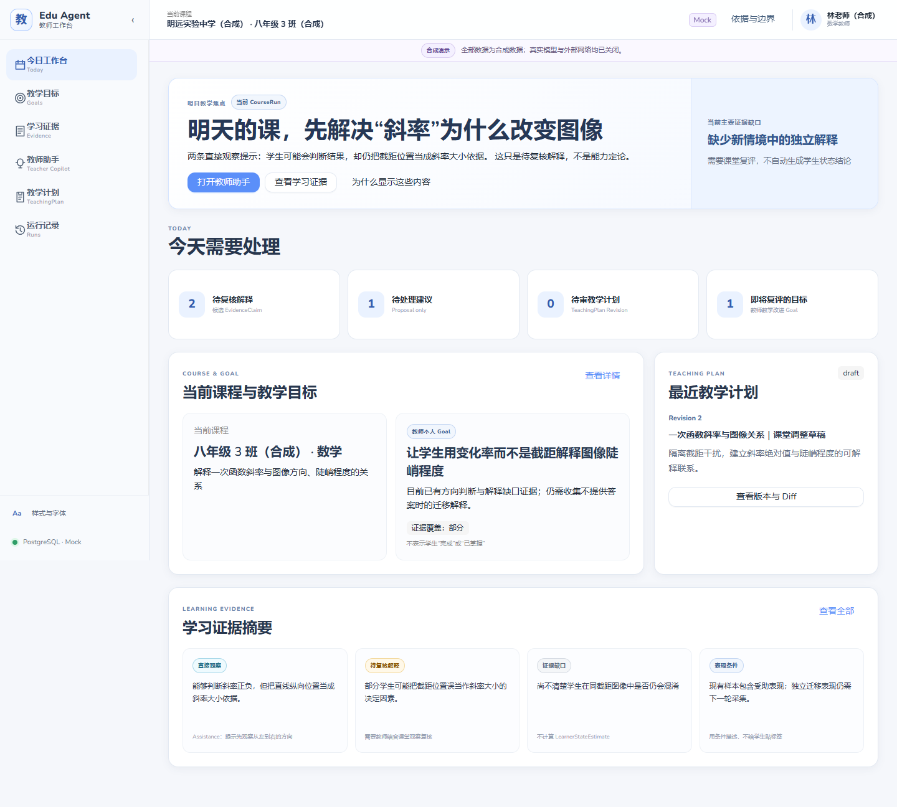

# Gate 2 教师工作台界面重构

## 设计裁决

本轮借鉴参考图的工作台信息架构和视觉节奏：轻量顶部栏、窄侧栏、白色内容画布、紧凑模块卡片、明亮蓝色主视觉、彩色功能入口以及清晰分区。它解决的是旧版“宽侧栏 + 巨大焦点卡片 + 技术标签堆叠”造成的后台感。

本轮没有复制参考产品的 Logo、名称、插画、文案、应用图标、品牌资源、精确间距或动画。所有图标均为项目内的简单线性 SVG；教学头条中的图像为一次函数主题的原创几何图形。

## 旧版问题

- 240px 侧栏长期占据内容宽度，主导航混有英文副标题。
- 首页大块低饱和蓝灰色区域过重，首屏任务密度不足。
- 课程、教师、班级和提示区重复标示示例数据。
- 教师默认界面直接暴露运行时、证据和版本控制的技术类型。
- 首页更像数据管理后台，常用能力、待办和最近活动缺少明确入口。

## 新版信息架构

```text
60px 顶部栏
├─ 工作台与当前班级
├─ 本地数据搜索
└─ 新建任务 / 帮助 / 演示环境 / 教师

84px 左侧导航（可展开为 204px）
├─ 工作台 / 教学目标 / 学习证据
├─ 教师助手 / 教学计划 / 运行记录
└─ 样式与字体 / 设置

工作台内容
├─ 问候与班级
├─ 明日教学重点
├─ 我的常用
├─ 今日待办
├─ 教学洞察
└─ 最近活动
```

首页在 1440×900 首屏内显示教学头条、我的常用、今日待办和教学洞察首行。内容最大宽度为 1440px，在 1920×1080 及以上屏幕不无限拉伸。

## 颜色令牌

| 用途 | 值 |
| --- | --- |
| 品牌蓝 | `#3370FF` |
| 悬停蓝 | `#2859D9` |
| 按下蓝 | `#1F49B6` |
| 浅蓝背景 | `#EAF2FF` |
| 选中背景 | `#E7F0FF` |
| 页面背景 | `#F5F6F8` |
| 内容与卡片 | `#FFFFFF` |
| 侧栏 | `#F7F8FA` |
| 主文字 | `#1F2329` |
| 次级文字 | `#646A73` |
| 边框 | `#E5E6EB` |
| 警告 | `#F5A623` |
| 危险 | `#F54A45` |
| 成功 | `#34C759` |

令牌由 `apps/web/src/design-tokens.ts` 统一提供给 Ant Design 与 CSS Variables。页面组件不维护独立品牌色表。

## 字体策略

- 英文、数字和拉丁标点：自托管 Nunito Variable WOFF2。
- 简体中文正文：`Microsoft YaHei UI`、`PingFang SC`、`Microsoft YaHei`。
- 昭源環方：只用于明确可覆盖的品牌/繁体展示字和样式指南。
- 不使用远程字体 CDN，不把字体放入 JavaScript。
- 浏览器实测中，样式指南的简体样例没有使用 Chiron，全部回退到系统简体中文字体；因此不宣称 Chiron 完整支持简化字。

字体版本、许可证与来源保存在 `apps/web/public/fonts/ATTRIBUTION.md` 及对应 `OFL.txt`。

## 中文化映射

| 技术或旧文案 | 教师默认文案 |
| --- | --- |
| Today | 今日工作台 |
| Goals / Goal | 教学目标 |
| Evidence | 学习证据或依据 |
| Teacher Copilot | 教师助手 |
| TeachingPlan | 教学计划 |
| Runs | 运行记录 |
| CourseRun | 当前课程 |
| Mock | 演示助手 |
| Revision | 版本 |
| draft | 草稿 |
| in_review | 待审核 |
| Proposal | 建议草稿 |
| EvidenceObservation | 直接观察 |
| EvidenceClaim | 待复核解释 |
| Assistance | 辅助情况 |
| ContextManifest | 使用的数据 |
| AuthorizationDecision | 权限检查 |
| PromptBundle | 助手配置 |
| RunManifest | 运行信息 |

原始技术类型只允许出现在默认折叠的开发者/审计详情中。

## 示例数据标记

学校、教师、班级和学生名称不再追加“合成”。顶部只保留一个低干扰的“演示环境”状态；悬浮说明当前使用示例数据且未连接真实学校系统。产品画布不再显示横幅、紫色提示条或重复免责声明。

## 前后对比

| 旧版 | 新版 |
| --- | --- |
|  |  |

## 已知问题

- 全局搜索当前只覆盖本地示例课程、教学目标、学习证据和教学计划，不支持拼音或模糊分词。
- 84px 导航适合桌面演示；更窄的移动端仅保证可用，不是本 Gate 的核心产品形态。
- Windows 可验证 Microsoft YaHei UI 回退；macOS 的 PingFang SC 仍需在真实设备上做视觉复核。
- 教师助手的两种策略文本较长，完整比较仍需要纵向滚动；没有为了首屏密度截断教学依据。
