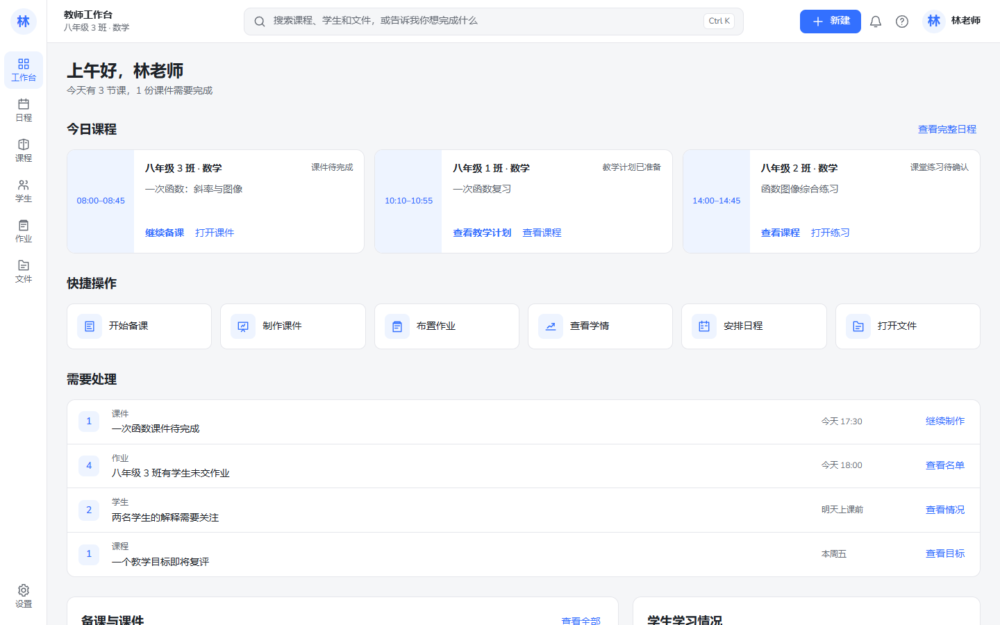

# Gate 2 教师工作台 UI 重构 v2

## 为什么 v1 被拒绝

v1 已经完成浅蓝主题、中文化和技术词隐藏，但信息架构仍以“教学目标、学习证据、教师助手、教学计划、运行记录”等系统对象为主。首页的大焦点横幅、重复入口和统计卡让产品更像管理后台，而不是教师每天打开的工作空间。

v2 不再修补旧首页，而是按教师一天的工作重新组织：先看今天上什么课，再处理备课、课件、作业、学生情况和日程。Agent 被改为全局能力，不再占据一级导航。

## 教师任务模型

教师默认工作模型是：

1. 看今天的课程与时间；
2. 继续备课或打开课件；
3. 处理未交作业、待完成材料和需要关注的学生；
4. 查看最近教学材料；
5. 在需要时调用全局助手完成跨页面任务；
6. 按需展开分析依据与系统记录。

“目标、证据、建议、版本、运行记录”仍然存在，但分别进入课程详情、学生学习情况、任务结果、教学计划和设置，不再与教师日常任务争夺一级入口。

## 新首页信息架构

首页固定按以下顺序展示：

1. 问候与当日负荷；
2. 今日课程；
3. 快捷操作；
4. 需要处理；
5. 备课与课件；
6. 学生学习情况；
7. 今日日程与待办；
8. 最近文件。

首页没有横贯内容区的 Hero、Banner、状态条或演示提示。今日课程使用三个独立白色课程卡，只有时间区域使用窄浅蓝底。

## 导航调整

固定侧栏宽度为 `68px`，不能展开。顶部使用“林老师”头像，不再显示无意义的“教”字标识。

一级导航只有：

- 工作台；
- 日程；
- 课程；
- 学生；
- 作业；
- 文件；
- 底部设置。

归属调整：

- 教学目标 → 课程详情；
- 学习证据 → 学生或课程中的“查看分析依据”；
- 教师助手 → 顶部全局任务入口与任务结果页；
- 教学计划 → 课程详情和文件；
- 运行记录 → 设置中的系统记录；
- 样式与字体 → 开发辅助路由。

## Agent 入口调整

顶部输入框同时支持搜索、命令和 Agent 任务，文案为：

> 搜索课程、学生和文件，或告诉我你想完成什么

点击输入框、“新建”或按 `Ctrl K` 会打开任务面板。面板展示当前班级、建议课程、最近文件和六个快捷任务。输入“准备明天的课”会带着原始目标进入现有本地教师助手流程。

本轮没有改变任务、建议、教师处置、教学计划版本或审计语义。助手仍只能创建建议草稿；接受建议不代表已实施，不创建教学决定，也不会自动发布教学计划。

## 视觉删减清单

已删除或停止使用：

- 大面积蓝色横幅和 Hero；
- 可展开侧栏；
- 侧栏中的教师助手、证据、目标和运行记录；
- 多彩功能图标；
- 大型统计卡；
- 重复的演示和示例数据提示；
- 默认页面中的技术对象名；
- 装饰图形、渐变和多层阴影；
- 卡片套卡片；
- 英文全大写小标题；
- 无操作价值的状态标签与说明。

列表只在确实需要逐项区分时保留单条分隔线，其余区域优先使用留白。

## 颜色规范

| 用途 | Token |
| --- | --- |
| 品牌蓝 | `#3370FF` |
| 悬停蓝 | `#2859D9` |
| 浅蓝 | `#EEF4FF` |
| 页面白 | `#FFFFFF` |
| 页面灰 | `#F5F6F8` |
| 主文字 | `#1F2329` |
| 次文字 | `#646A73` |
| 边框 | `#E5E6EB` |
| 警告 | `#F5A623` |
| 错误 | `#F54A45` |

除警告和错误外，页面只使用蓝、白、灰。所有常用操作图标使用同一套线性图标和同一蓝色。

## 字号与字体规范

教师界面只使用以下字号和字重：

- 页面标题：`24px / 600`；
- 模块标题：`18px / 600`；
- 正文、按钮、列表：`14px / 400`；
- 时间、状态、来源：`12px / 400`。

当前课程名、待办数量和立即处理事项可使用 `600`，说明、证据摘要和操作描述使用 `400`。

英文与数字使用本地 Nunito。简体中文正文使用 `Microsoft YaHei UI / PingFang SC / Microsoft YaHei`。Chiron GoRound TC 文件与许可证继续保留，但不主动用于简体正文。

## Before / After

### Before：v1 系统概念工作台

### After：v2 教师日常任务工作台

参考图只用于工作台空间关系、信息密度和蓝白节奏；未复制其 Logo、名称、品牌图形、插画、图标、文案或业务内容。

## 当前仍未实现的真实业务

以下内容仍是合成读模型、只读页面或明确标记的演示功能：

- 日程勾选只在当前页面临时保留；
- 学生个人详情尚未实现；
- 作业创建尚未实现；
- 文件预览与编辑器尚未接入；
- 通知没有真实消息源；
- 顶部搜索只覆盖当前示例数据；
- 课件、作业和课程页面未连接真实学校系统；
- 教师助手仍使用本地 Mock Provider。

禁用操作都有“演示功能”说明，不通过无响应点击伪装成已实现能力。

## 性能

生产构建保持按路由懒加载。v2 初始静态 JavaScript 图为 `633.5 KiB raw / 207.3 KiB gzip`，低于 v1 的约 `210.3 KiB gzip`。新增教师任务页面均为独立小块；字体继续作为静态资源输出，没有进入 JavaScript。

## Gate 2.5 工作流建议

Gate 2.5 不应继续增加首页模块，应验证一条真实而短的教师工作流：

1. 教师从“今日课程”进入备课；
2. 系统自动带入课程、班级、目标、最近作业和允许使用的学习情况；
3. 教师确认任务范围后生成两个可比较的建议；
4. 教师选择、修改或拒绝建议；
5. 系统创建可编辑的课件或教案草稿；
6. 教师审阅变更并保存待审核版本；
7. 工作台回写“课件待完成/已准备”状态；
8. 系统记录可解释过程，但不把建议当作已实施教学事实。

这条工作流应首先使用本地 Mock 和合成数据验证任务连续性、编辑成本和教师控制感；在用户验收通过前，不接真实模型和云部署。
