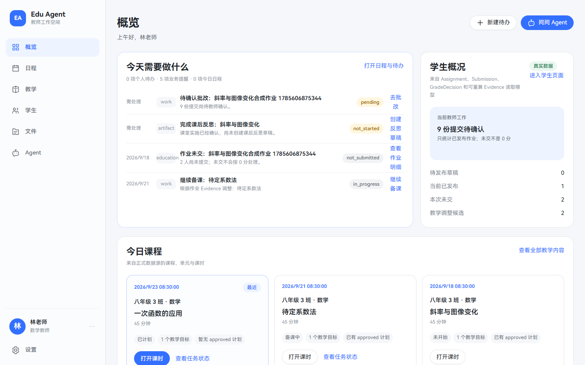

# 普通教师端 UI v1

## 1. 设计范围

本版本只重构普通任课教师端的信息架构、视觉系统和本地高保真交互。它复用 Gate 1A、Gate 1B 和 Gate 2 已验证的 API 路由、Mock Provider、领域对象、Artifact Revision、Evidence 与 SuggestionDisposition 语义，没有新增后端业务系统，也没有调用真实模型或云服务。

参考图用于理解模块化工作台的空间关系与清晰节奏，以及固定宽侧栏底部的用户入口。没有复制参考产品的品牌、代码、图标、文案或业务内容。

## 2. 普通教师任务模型

教师端按一天中的真实任务组织，而不是按平台内部对象组织：

1. 先确认今天的课程、会议与必须完成的事项；
2. 进入课程章节，继续准备教案、课件、练习或作业；
3. 查看作业和测试中的班级共性情况；
4. 找到需要复核或跟进的学生，但不形成固定能力标签；
5. 管理教学文件与版本；
6. 在需要时把课程、学生、文件或待办明确加入 Agent 上下文；
7. 在个人设置中检查记忆、个人方法、自动化授权和数据边界。

Evidence、教学目标和运行记录仍然保留，但分别作为学生/课程的解释层、课程内容和设置中的技术详情，不占用一级导航。

## 3. 页面信息架构

固定一级导航为：

- `/overview`：概览；
- `/schedule`：日程；
- `/teaching`：教学；
- `/students`：学生；
- `/files`：文件；
- `/agent`：Agent；
- `/settings`：设置。

开发辅助路由 `/style-guide` 不出现在教师一级导航。旧路由继续兼容：

- `/courses` → 教学的课程视图；
- `/assignments` → 教学的作业视图；
- `/goals`、`/evidence`、`/copilot`、`/teaching-plan`、`/runs` 保留 Gate 2 验证页面；
- `/` 和未知前端路径安全回到 `/overview`。

### 页面间主要跳转

```text
概览
├─ 今日课程 ─────────────→ 教学 / 课程
├─ 学生概况 ─────────────→ 学生
├─ 最近文件 ─────────────→ 文件
└─ 问问 Agent ───────────→ Agent

日程 / 待办 ──“交给 Agent”→ Agent + 明确加入待办上下文
教学 / 作业 / 测试 ──────→ Agent，或 Gate 2 建议详情
学生 / 教学建议 ─────────→ Agent，分析依据按需展开
设置 / 系统信息 ─────────→ 运行记录技术详情
```

## 4. 固定侧边栏

侧边栏桌面宽度为 `260px`，在 1366px 宽度下降为 `248px`，始终固定且不提供收起动画。顶部只显示 Edu Agent 自有品牌；中部只显示六个教师任务入口；底部固定显示林老师、数学教师和设置入口。

用户菜单提供个人信息、账号和身份、角色与工作空间、外观和字体、通知设置、上下文和记忆、个人方法和 Skill、自动化授权、隐私与数据、系统信息和退出演示。退出演示不会伪造真实账号登出。

## 5. 每个页面的职责

### 概览

- “今天需要做什么”：课程、课件、批改、学生沟通、教研与目标复评；
- “今日课程”：三节课程及备课、课件、作业状态；
- “学生概况”：只显示班级趋势、上交情况、需跟进数量和共性问题；
- “备课组动态”：共享课件、集体备课与教研提醒；
- “学校动态”：通知、会议、活动和截止事项；
- “最近文件”：最近使用的 5–8 个教学材料。

### 日程

- 日、周、月三种视图；
- 正式课程、会议、教研等有明确时间的日程；
- 可移动的个人待办独立管理；
- 完成、优先级切换、转成日程草稿、交给 Agent；
- 新建日程明确标记为界面预览，不写入正式日历。

### 教学

顶部只在页面内部切换课程、作业和测试。

- 课程：六个单元、多个章节、教学目标、准备进度、文件列表和本地预览；
- 作业：三次作业、提交/完成/正确率/用时、题目与知识点分布、学生明细；
- 测试：两次测试、分数分布、知识点表现、学生明细；只有存在年级数据时才显示年级比较；
- 未提交作业显示“未交”，不会以 0 分冒充作答成绩。

### 学生

- 左侧 12 名演示学生，可搜索和筛选；
- 未选择学生时显示班级整体情况、证据覆盖和需要跟进的事实；
- 选择学生后显示最近作业、测试、当前需要留意和教学建议草稿；
- 使用“解释仍需复核”“独立解释证据不足”等中性、时效性语言；
- 技术 Evidence 名称只在用户主动打开分析依据后出现。

### 文件

- 10 个本地演示文件；
- 按用途、文件类型和时间筛选；
- 名称、时间、大小和类型排序；
- 网格/列表切换、搜索、预览、详情与版本；
- 无法真实执行的上传、下载、分享和删除操作会给出清楚的演示反馈，不会静默无响应。

### Agent

- 左侧为按时间分组的对话历史；
- 中央为空状态、快捷任务、消息、来源、执行步骤和输入框；
- 右侧为当前课程、班级、文件、目标和待办上下文；
- 教师可以查看、添加、移除或清空上下文，并查看使用原因；
- 小于 1180px 时右侧上下文改为 Drawer；
- 当前只使用本地 `MockModelProvider`，不请求真实模型，也不展示隐藏思维链。

### 设置

包括个人信息、账号和身份、角色与工作空间、外观和字体、通知、上下文和记忆、个人方法、自动化授权、隐私与数据和系统信息。候选记忆不会自动生效；记忆可确认、修改和删除；自动化展示动作、范围和有效期。

## 6. 组件体系

本轮新增并复用：

- `TeacherSidebar`、`TeacherProfileMenu`、`PageHeader`；
- `ModuleCard`、`QuickAction`、`MetricCard`、`ChartCard`；
- `CalendarView`、`TodoPanel`；
- `CourseTree`、`CourseFileList`、`FilePreview`；
- `HomeworkList`、`HomeworkDashboard`、`ExamList`、`ExamDashboard`；
- `StudentPriorityList`、`ClassOverview`、`StudentDetail`；
- `FileManager`；
- `AgentConversationList`、`AgentChat`、`AgentContextPanel`；
- `SettingsSection`、`SettingsRow`。

图表使用同一组轻量 SVG/CSS 组件，没有引入第二套图表库。页面按路由懒加载。

生产构建的初始 JavaScript 为 617.5 KiB raw / 205.5 KiB gzip；最大按需路由共享块为表格组件 61.8 KiB gzip。HarmonyOS Sans 作为独立静态字体资源，不计入 JavaScript。

## 7. 字体来源与授权

教师简体中文界面统一使用 HarmonyOS Sans SC，英文和数字也由同一家族覆盖，避免中英文割裂。

- 来源：[华为开发者联盟 HarmonyOS 设计资源](https://developer.huawei.com/consumer/cn/design/resource/?catalogVersion=V1)；
- 官方资源页包日期：2026-06-12；
- 字体内部版本：2.040；
- 文件：`apps/web/public/fonts/harmonyos-sans-sc/HarmonyOS_Sans_SC.ttf`；
- 许可证：`apps/web/public/fonts/licenses/HarmonyOS-Sans-License.txt`；
- 归属说明：`apps/web/public/fonts/ATTRIBUTION.md`。

官方协议允许把未修改字体随软件嵌入和再分发，但禁止修改字体。因此本项目保留官方原始可变 TTF，不做 WOFF2 转换或子集化；一个文件覆盖 400、500、600、700 字重。字体作为独立静态资源输出，不进入 JavaScript，也没有运行时 CDN 请求。20.6MB 的静态字体体积是已知性能问题；若未来要转换或子集化，必须先获得允许修改字体的授权。

回退栈为：

```css
"HarmonyOS Sans SC",
"HarmonyOS Sans",
"Microsoft YaHei UI",
"PingFang SC",
"Microsoft YaHei",
sans-serif
```

## 8. 图标、颜色与排版

图标由仓库内统一的 `WorkspaceIcon` 线性 SVG 组件提供，使用一致的 24px 视口、线宽和圆角，不混用其他图标库。

核心颜色：

| 用途 | 值 |
| --- | --- |
| 品牌蓝 | `#3370FF` |
| 悬停蓝 | `#2859D9` |
| 浅蓝 | `#EEF4FF` |
| 页面背景 | `#F5F7FA` |
| 卡片 | `#FFFFFF` |
| 主文字 | `#1F2329` |
| 次级文字 | `#646A73` |
| 弱文字 | `#8F959E` |
| 边框 | `#E5E6EB` |

警告、错误和成功只用于状态语义。卡片圆角 16–20px，按钮圆角 18–24px，优先用留白而非多重分割线。

排版：

- 页面大标题：28px / 700；
- 主要模块标题：22px / 700；
- 卡片标题：17px / 600；
- 正文：14px / 400；
- 辅助信息：12px / 400；
- 重要数字：24–32px / 700。

## 9. Mock 数据范围

- 今日 3 节课；
- 8 条日程、6 条待办；
- 6 个课程单元，每单元多个章节；
- 10 个教学文件；
- 3 次作业、2 次测试；
- 12 名匿名演示学生；
- 5 条 Agent 对话、可编辑上下文和待办；
- 个人记忆、候选方法与自动化授权样例。

Mock 数据只使用学生编号，不含真实个人信息。页面只在需要澄清边界的位置说明“本地演示”或“仅供界面预览”，不会在每个对象后重复标记。

## 10. 当前未实现的真实业务

- 文件上传、下载、分享、删除与云端预览；
- 对学校真实日历的写入、拖拽排程与冲突求解；
- 作业、测试和学生数据的真实同步；
- 对话跨设备持久化与项目管理；
- 真实模型调用、长期 Agent 和多 Agent；
- 个人方法的真实离线回放、发布与回滚执行；
- 自动化授权的正式写入；
- 班主任、科组长、家长和学生端。

这些交互会返回演示反馈或只读结果，不会伪装成生产能力。

## 11. 后续角色扩展点

班主任和科组长不应通过给普通教师侧边栏继续加菜单实现。后续应在角色与工作空间解析后加载角色专属页面组合：

- 班主任：班级事务、家校沟通和长期学生支持 Case；
- 科组长：教研目标、共享材料治理和组内任务；
- 共同复用文件、日程、Agent、权限与上下文组件；
- 普通任课教师默认入口与权限不因新增角色而膨胀。

## 12. 截图目录

最终截图位于：

`output/playwright/teacher-portal-ui-v1/final/`

包含：

1. `01-overview-1440x900.png`
2. `02-overview-1920x1080.png`
3. `03-schedule-day.png`
4. `04-schedule-week.png`
5. `05-schedule-month.png`
6. `06-teaching-course-tree.png`
7. `07-course-file-preview.png`
8. `08-homework-analysis.png`
9. `09-exam-analysis.png`
10. `10-students-class-overview.png`
11. `11-student-detail.png`
12. `12-file-manager.png`
13. `13-agent-empty.png`
14. `14-agent-conversation.png`
15. `15-agent-context.png`
16. `16-settings-memory.png`
17. `17-style-guide.png`
18. `18-gate2-copilot-and-diff.png`

概览文档图：


