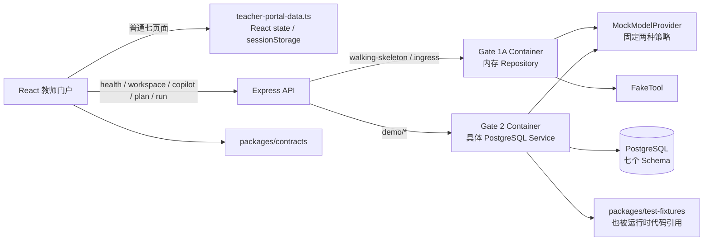

# 教育智能体平台：当前真实状态与下一步候选方案

> 调查基线：`feat/teacher-portal-ui-v1` / `43c8e03a8e0e7060989d886442de283ae6f43fc5`
> 调查日期：2026-07-30
> Gate 2.7 实施复核：2026-08-01。第 21 节是当前权威状态；前述调查和候选方案保留为决策历史。
> 状态词：已实现并验证 / 已实现但未充分验证 / 只有 Mock / 只有接口或 Schema / 只存在于文档 / 尚未开始。

## 1. 执行结论

当前项目不是“只有页面”，也不是“已经基本可用的教师平台”。

它仍由窄真实链路和宽 Mock 门户叠加而成，但窄链路已经从 Gate 2.4 的 Copilot 正确性扩展到 Gate 2.5 的最小可恢复备课闭环：

1. 一条可恢复且状态语义明确的真实链路：CourseRun → CurriculumUnit → Lesson → `lesson_preparation` Task → TaskWorkingSet → 每次运行重新授权 → Mock Teacher Copilot → Proposal 恢复 → 四种教师处置 → active `in_review` → 单独批准为 current `approved` → `ready_for_use` → 教师显式完成 → Audit / 应用 Outbox Worker；
2. 一套覆盖普通教师七个模块的高保真前端原型：概览、日程、教学、学生、文件、Agent、设置。

第一部分的课程、课时、任务、请求、上下文、Proposal、Evidence、Disposition、TeachingPlan 和 Run 可在刷新与服务重启后恢复；输出仍是固定 Mock，课程内容仍是单一合成的一次函数切片。第二部分视觉和交互完整度较高，但日程、作业、考试、学生、文件、通用 Agent 和设置仍来自前端数组或 React state。

因此项目目前最准确的阶段描述是：

> **Gate 1B 基础设施和 Gate 2.4 Copilot 正确性已验证；Gate 2.5 的最小课程—备课 Task—Proposal—TeachingPlan—显式完成闭环已实现并验证；普通教师端其余宽业务面仍是高保真原型。**

## 2. 调查基线依赖关系（Gate 2.4 前，保留用于对比）

重要边界：

- `createGate1AContainer` 始终创建内存 Governance、Work、Runtime、Capability、Artifact Repository；相关 HTTP 数据在进程重启后丢失。
- `createGate2Container` 使用一个 app-role PostgreSQL pool，并直接组合具体 PG Service/Repository。
- Gate 1B 的 PG Adapter 大多由测试直接构造；它们没有全部替换 Gate 1A Port，也没有统一进入当前 HTTP Composition Root。
- ordinary teacher portal 页面只有应用启动、教师名和旧 Gate 2 子路由依赖 workspace API；其日常业务数据仍在前端。
- API 运行时依赖 `packages/test-fixtures` 提供 Demo seed 和 Mock 策略内容，说明 Gate 2 仍是合成演示。

## 3. 七模块当前状态

| 模块 | 真实状态所有者 | 当前实现 | 主要缺口 |
|---|---|---|---|
| Identity / Governance / Audit | `governance` | AuthorizationDecision、AuditRecord、IdempotencyRecord；PG 事务和并发测试；Demo 注入 Audit | 无真实登录、会话、组织/成员、策略引擎；显式 Header / local bypass 只用于演示 |
| Work / Assistant / Durable Execution | `work` | typed Task request、Run、Contract、Case、Goal、Result、Disposition、Outbox；应用 Worker | 无真实教师 Todo/Calendar；部分引用只由应用保证 |
| Agent Runtime / Context | `runtime` | AgentRun、RunManifest、含 request summary 的 ContextManifest、Outbox | 没有真实会话、长期记忆或通用上下文绑定；普通 Agent 页面不调用它 |
| Capability / Integration | `capability` | ModelExecution、ToolExecution、Outbox；ModelProvider Port | 只有 Mock provider/FakeTool；无 DeepSeek、模型评测、外部系统连接 |
| Artifact / Collaboration | `artifact` | Artifact、不可变 ArtifactRevision、Outbox；TeachingPlan/Suggestion；current approved/in-review 指针 | 无 published 路径、协作、ObjectStore、二进制文件 |
| Education Domain | `education` | CourseRun、Objective、Profile、Attempt、Evidence、Claim、Alignment、Outbox | 无课程树、作业、考试、学生名册、教学活动完整模型 |
| Personalization | `personalization` | 仅 Migration 基础设施 | 无业务表、Repository 或 API |

## 4. 数据库现状

每个 Schema 都另有一张 `schema_migration`。以下只列业务对象。

### 4.1 Schema 与表

| Schema | 业务表 / View |
|---|---|
| `governance` | `authorization_decision`、`audit_record`、`idempotency_record` |
| `work` | `task`、`task_run`、`query_run`、`idempotency_record`（早期表）、`outbox_record`、`resolved_learning_interaction_contract`、`outbox_consumer_effect`、`case_record`、`goal_record`、`task_result`、`suggestion_disposition` |
| `runtime` | `agent_run`、`run_manifest`、`context_manifest`、`outbox_record` |
| `capability` | `tool_execution`、`model_execution`、`outbox_record` |
| `artifact` | `artifact`、`artifact_revision`、`outbox_record` |
| `education` | `course_run`、`learning_objective`、`learning_interaction_profile`、`attempt`、`evidence_observation`、`evidence_claim`、`evidence_claim_observation`、`teaching_plan_alignment`、`outbox_record`；View：`learning_evidence_view` |
| `personalization` | 无业务表 |

### 4.2 Repository 与存储介质

真实 PostgreSQL：

- Gate 2 workspace seed/read；
- Teacher Copilot 的 Task、TaskRun、Contract、ModelExecution、AgentRun、Manifest、Artifact Revision、Disposition、Audit、Outbox；
- Gate 1B 的 Governance、Work、Runtime、Capability、Artifact、Education Repository（目前主要由测试使用）。

仍为内存：

- Gate 1A walking-skeleton command/query/ingress；
- Gate 1A 的五个模块 Repository；
- 普通教师门户的 Todo、日程、课程树、学生、文件、Agent 对话、设置不经过 Repository，直接存在前端数组或组件 state。

不存在：

- ObjectStore Port 或 Adapter；
- LocalObjectStore；
- 文件 blob/byte 持久化；
- 学生名册、作业、考试、教师 Todo、CalendarEvent、课程 Unit/Chapter、Agent 对话、Context Binding 的数据库表。

### 4.3 数据库角色

- 非登录 owner：每个 Schema 一个 owner；
- 登录角色：`edu_migrator`、`edu_app`、`edu_runtime`、`edu_worker`；
- `edu_runtime` 只写 runtime，并只读所需 governance authorization 和 education 数据；
- `edu_worker` 只可读取各业务模块 Outbox、更新受限处理列，并写 `work.outbox_consumer_effect`；
- `edu_app` 对当前业务 Schema 有较宽 CRUD 权限；
- 真实 PostgreSQL 角色测试证明了关键隔离边界。

跨 Schema 不建 FK 是明确的 ownership 设计，但部分同 Schema 引用也没有 FK，完整性依赖应用代码和测试。

### 4.4 已验证的一致性语义

- 事务成功时业务记录、Outbox 和 Audit/Result 同时提交；
- 异常时共同回滚；
- 幂等键可处理并发预留、相同请求重放和不同 payload 冲突；
- 两个 worker 可并发领取 Outbox，租约过期可恢复，消费者副作用可去重；
- Artifact Revision 可并发追加且版本号唯一；
- Artifact Revision 有更新/删除拒绝 Trigger；
- Profile 可演进，已经封存到 Run 的 Resolved Contract 不被回写；
- SuggestionDisposition 不会自动把建议标为已经实施。

### 4.5 Gate 2.4 后仍存在的一致性缺口

1. Mock 模型调用仍位于数据库事务内部；接入网络模型前必须改造成可恢复的事务外执行。
2. `current_in_review_revision_ref` 是单指针；多 Proposal 并行形成多个 in-review 时，需要明确产品选择规则。
3. 实际 Migration/Repository 使用手写 SQL，而 Drizzle Schema 只覆盖部分列与约束，存在双重事实源漂移。
4. 跨 Schema 引用继续依赖应用检查和测试，没有数据库 FK。
5. 本地 Worker 没有生产级 dead-letter、指标、告警和多实例运维方案。

## 5. Runtime、Artifact 与 Agent

### 5.1 当前真实 Teacher Copilot 数据流

1. Web 发送真实 request text、目标和 Evidence，调用 `POST /api/v1/demo/teacher-copilot/tasks`；
2. 服务要求显式身份（或已审计的 local/demo bypass），校验 actor/purpose，预留 governance idempotency；
3. 从 education/work/artifact 读取固定课程、证据、Profile、Goal、TeachingPlan；
4. MockModelProvider 返回固定的两种策略；
5. 单事务写入 Authorization、Task、TaskRun、Work Outbox、Resolved Contract、ModelExecution、Capability Outbox、AgentRun、RunManifest、ContextManifest、Runtime Outbox、PedagogicalSuggestion Revision、TeachingPlan draft、TaskResult、Audit；
6. 教师可通过 list/detail API 或直接 URL 恢复同一 Proposal，不重新执行模型；
7. 教师调用 disposition API；接受/修改时写 `in_review`，拒绝/稍后不改变 current approved；
8. 教师单独批准时创建新的 immutable `approved` Revision 并更新 current approved pointer；
9. Run 页面读取请求、合同、上下文、Evidence、授权、模型执行、Outbox 和 Audit；应用 Worker 持续消费 Gate 2.4 事件。

### 5.2 真正持久化的 Artifact

- Gate 1B 测试中的通用 `ContentArtifact` / published revision；
- Gate 2 的 `PedagogicalSuggestion`；
- Gate 2 的 `TeachingPlan` draft、`in_review` 和 `approved` revision。

它们持久化的是 text/JSON 结构化内容、parent revision、状态、hash、evidence ref 和 teacher selection。门户“文件”页中的 Word/PPT/PDF/图片只是元数据数组，没有真实文件字节。

### 5.3 Agent 的真实程度

- 普通 `/agent` 页面：`responseFor(message)` 按“PPT/作业/日程”等关键词返回硬编码文本；上下文、步骤、对话、收藏和重命名都是前端 state。
- 旧 `/copilot` 页面：调用真实 API 和 PG，但后端仍使用确定性 MockModelProvider 和测试 fixture；不是大模型推理。
- `/copilot` 的任务说明进入 typed Task request、Contract、ContextManifest 和 Mock provider input，并可在 Proposal/Run 中恢复。
- 普通 Agent 只有“创建教学任务”导航到旧 Copilot；它不会把当前消息和上下文交给后端。

## 6. 当前 API Route Contract

当前共享 Product Contract 包含：

- `GET /api/health`
- `GET /api/v1/demo/workspace`
- `POST /api/v1/demo/teacher-copilot/tasks`
- `GET /api/v1/demo/teacher-copilot/proposals`
- `GET /api/v1/demo/teacher-copilot/proposals/:proposalRevisionRef`
- `POST /api/v1/demo/suggestions/:proposalRevisionRef/dispositions`
- `GET /api/v1/demo/runs/:taskRef`
- `GET /api/v1/demo/teaching-plan/revisions/:revisionRef`
- `POST /api/v1/demo/teaching-plan/revisions/:revisionRef/approve`
- `GET /api/v1/demo/teaching-plan/current-approved`
- `GET /api/v1/demo/teaching-plan/current-in-review`
- `GET /api/v1/demo/teaching-plan/drafts`
- `GET /api/v1/demo/teaching-plan/history`
- Gate 1A walking-skeleton command/query/ingress routes

不存在日程、Todo、课程树、学生、作业、考试、文件、设置和通用 Agent chat API。

产品进程始终使用 PostgreSQL Product Container；Gate 1A 路由只在测试显式开启 internal routes 时存在。应用没有正式认证/CORS 部署设计，因此仍不能视为可公开部署。

## 7. 教师端逐页功能矩阵

说明：

- REAL：真实 API 和 PostgreSQL；
- MOCK：前端数组、局部 state、演示 toast 或固定响应；
- READ_ONLY：能读取真实或演示数据，但不能形成写业务；
- DISABLED：产品明确不允许/没有路径；
- DEAD：控件存在但输入不影响结果、数据不随导航变化，或代码已不再路由。

| 页面 / 功能 | REAL | MOCK | READ_ONLY | DISABLED | DEAD |
|---|---|---|---|---|---|
| 应用启动 / 教师身份 | health、PG workspace bootstrap、默认 401、local/demo bypass Audit | 固定合成 tenant/actor 和 fixture 教师 | 教师名与本地演示说明 | 无真实登录/SSO | 无 |
| 概览 | 无日常业务写入；仅应用 bootstrap 依赖 PG | 今日安排、待办、课程、学生、动态、文件均来自数组；快捷操作为跳转/toast | 统计卡与动态 | — | 传入的 `workspace` 业务数据未被页面使用 |
| 日程视图 | 无 | 固定日历事件；日/周/月切换只改变展示；新建日程只关弹窗 | 固定事件 | 空标题等正常表单禁用 | 上/下一周期只改标题，不更换事件数据 |
| 待办 | 无 | 完成、优先级为组件 state；“转为日程”只确认；“交给 Agent”只写 sessionStorage | 固定待办 | 已完成项的部分操作 | 刷新/重新进入路由恢复原值 |
| 教学 / 课程树 | “生成新版本”和“调整下一课”进入真实 Copilot | 单元/章节、文件、作业、考试、学生仍为数组 | 搜索、筛选、展开、图表 | — | 课程树本身不持久化 |
| 作业 / 考试操作 | 无 | 新建、编辑、下载、催交等为 toast/演示跳转 | 固定统计 | — | 无后端副作用 |
| 学生列表 / 详情 | 无 | 12 名学生、趋势、证据、Agent 建议均为数组/固定文本 | 搜索、筛选、详情抽屉 | — | “修改建议/创建待办/生成指导”提示成功但不创建对象 |
| 文件 | 无 ObjectStore/文件 API | 10 条文件元数据；筛选、视图、排序为前端；上传/新建/编辑/下载/分享/复制/删除/对比为 toast | 固定摘要 | — | 文件大小排序用 `parseFloat`，未统一 KB/MB |
| 普通 Agent | 无；只有跳转旧 Copilot | 关键词固定回复、固定 steps/source、对话/context/收藏/重命名/删除均为 state | 静态上下文 | — | 声称读取课程/文件但未读取；刷新全部丢失 |
| 设置 | 无 | 账户、通知、偏好、记忆、API/连接状态均为静态或局部 state | 固定状态 | 无发布/真实连接 | 输入看似可编辑但无保存，部分为 uncontrolled |
| 目标 `/goals` | PG workspace | 固定 Seed | 真实 PG 只读 | 无编辑 | — |
| 学习证据 `/evidence` | PG workspace | 固定 Seed | 真实 PG 只读 | 无采集/编辑 | — |
| Copilot `/copilot` | typed request、Task/Run/Artifact、Proposal list/detail/恢复、四种 Disposition、Audit/Outbox | 两种策略内容固定 | 可查看固定 Evidence 和请求 | 已处置 Proposal 不可再次处置；无实施确认 | 无 API fallback |
| Teaching Plan `/teaching-plan` | current approved/in-review/drafts/history、独立 approve | 内容来自合成 Seed/Mock | 历史 Revision 只读 | approved 原地修改被拒绝；无 published | — |
| Runs `/runs` | PG Request/Run/Manifest/Contract/Evidence/Auth/Model/Outbox/Audit read | 模型执行为 Mock | 真实 PG 只读 | 无隐藏思维链、重放/运维 | — |
| Style Guide | 无业务 | 组件和字体示例 | 开发只读 | — | 非产品路由 |
| 旧 Portal 页面文件 | 无 | — | — | — | 多个旧页面和 `demo-read-model.ts` 已不再 import/route |

### 7.1 刷新后保留

PostgreSQL 中会保留：

- CourseRun、Objective、Profile、Evidence、Case、Goal、Seed TeachingPlan；
- 生成的 Task、TaskRun、Resolved Contract、AgentRun、Run/Context Manifest；
- ModelExecution、PedagogicalSuggestion、TeachingPlan draft；
- SuggestionDisposition、接受/修改后的 `in_review` Revision；
- approved Revision、current approved / current in-review pointers；
- Teacher request、Proposal detail 与直接 URL 恢复上下文；
- Authorization、Audit、各模块 Outbox。

### 7.2 刷新或重新导航后丢失

- 普通门户的 Todo 状态、优先级和新建日程草稿；
- Agent 对话、消息、收藏、重命名和用户选择上下文；
- 设置、记忆、通知开关；
- 普通页面的临时筛选/选择；
- Copilot 尚未保存但未提交的文本框/Modal 临时编辑。

已提交的 Proposal、策略、diff、Evidence、Disposition 和请求可由 GET API 恢复；通用 Agent 对话仍不可恢复。

## 8. 测试和运行基线

### 8.1 实际执行结果

| 命令 | 结果 | 真正证明的内容 |
|---|---|---|
| `pnpm test:static` | 通过，658 条静态断言 | 文件/字符串/结构约束；不是运行时业务验证 |
| `pnpm typecheck` | 通过 | TypeScript 项目类型一致性 |
| `pnpm test` | 通过，11 files / 51 tests | Contract、内存 HTTP、架构约束、数据库生命周期、PGlite 基础 Migration、启动 URL 等 |
| `pnpm test:architecture` | 通过，4 files / 26 tests | 七模块、Product/Test Root、typed request、TeachingPlan 指针和 Worker 静态边界 |
| `pnpm test:node-smoke` | 通过，5 tests | 构建后 Node 模块和入口可加载 |
| `pnpm test:migrations` | 通过，1 test | PGlite 可应用 Migration；只抽查关键表，不等于完整 PG 语义 |
| `pnpm test:postgres` | 通过，8 files / 44 tests | 真实 PG 请求持久化、Proposal 恢复、四种处置、并发/幂等、审批、不可变 Revision、Worker 恢复、角色与 HTTP |
| `pnpm test:playwright` | 通过，10 tests | 普通 Mock 页回归 + 一条真实 Gate 2.4 刷新恢复、修改接受、独立批准、拒绝不改 current、Run/Outbox 链 |
| `pnpm build` | 通过 | API/Web/Packages production build |
| `pnpm analyze:bundle` | 通过 | 初始 JS 约 621.2 KiB raw / 206.2 KiB gzip；最大 table chunk 约 206.3 KiB raw / 61.8 KiB gzip |
| `pnpm demo:doctor` | 通过 | Node/pnpm/Docker/Compose/端口/Secret 配置可启动 |
| tracked-file secret scan | 通过，257 files | 未发现 private key、provider key、非空 DeepSeek key 或非示例 PostgreSQL credential URL；仓库仍无专用 secret-scan 命令 |

没有测试报告 skip。

### 8.2 测试没有证明的内容

- 普通教师七页面的数据持久化；
- 普通门户 Mock 工作项的刷新恢复（Gate 2.4 Proposal/Plan 已证明）；
- 真实模型质量、超时、限流、成本或安全；
- Outbox 的生产级监控、dead-letter 与多实例运维（本地应用持续消费已证明）；
- 文件上传、下载、版本、权限和清理；
- 真实登录、多租户隔离和学校角色权限；
- 远程部署、CORS、云数据库和云存储；
- 完整代码覆盖率。

### 8.3 Gate 2.4 对本地数据事故的修复

原 Playwright 链会间接调用 `db:clean`，这是 Gate 2.4 的首要修复项。现在 PostgreSQL/Playwright 测试每次使用独立 `edu-agent-e2e-<run-id>` Project/Volume；结束后清理并核验开发 Volume identity、ignored env 和上传目录未变化。长期开发 Volume 的删除还要求 `ALLOW_DESTRUCTIVE_DB_RESET=1`，未设置时在 Docker 调用前拒绝。

## 9. 调查基线的五层判断（Gate 2.4 前；当前状态见第 16 节）

### 9.1 架构和基础设施

**已实现并验证：**

- pnpm 模块化单体；
- 七模块目录与 Schema ownership；
- Migration runner、Docker PostgreSQL、角色隔离；
- 核心事务、Outbox、Idempotency、Audit、Artifact Revision；
- 本地可重复 Demo、production build、主要自动化测试。

**已实现但未充分验证：**

- Gate 2 Composition Root 与旧 Gate 1A Container 并存；
- Route-level bundle 和视觉回归；
- 手写 SQL 与 Drizzle Schema 并行。

**尚未开始：**

- 远程部署基础设施、可观测性、真实身份系统、备份/灾备。

### 9.2 数据库和一致性

**已实现并验证：**

- Gate 1B 的事务、并发幂等、角色、Outbox 领取、Artifact 并发 Revision；
- Gate 2 生成/处置链的真实 PG 写入。

**已实现但存在语义缺陷：**

- TeachingPlan latest/published；
- proposal 重复处置错误映射；
- Run 与 Task 的引用完整性；
- Outbox 的实际运行消费。

**只有 Schema：**

- Personalization 只有迁移登记，无领域表；
- 若干早期通用表没有当前产品入口。

### 9.3 普通教师端页面

**已实现并验证：**

- 七页面信息架构、响应式视觉、路由、主要 Mock 交互和 Playwright 截图。

**只有 Mock：**

- 概览、日程、教学、学生、文件、普通 Agent、设置的绝大部分业务内容。

**真实只读或窄写入：**

- 旧 Goals/Evidence/TeachingPlan/Runs 是 PG 只读；
- 旧 Copilot 是 PG 写入。

### 9.4 真实教师业务闭环

**已实现但未充分验证：**

- 合成 evidence → 固定建议 → 教师处置 → TeachingPlan revision。

**仍未闭环：**

- 用户输入不影响生成；
- proposal 刷新后不可恢复；
- 没有发布、实施、回写课程进度；
- 普通教学页和 Agent 页没有把真实上下文传入；
- 拒绝/稍后处理会与“最新草稿”语义冲突。

### 9.5 Agent 智能能力

**只有 Mock：**

- 后端 MockModelProvider 的固定两策略；
- 前端 `responseFor` 的关键词固定回答。

**只有接口：**

- ModelProvider Port、ModelExecution、Run/Context Manifest。

**尚未开始：**

- 真实 DeepSeek、工具调用编排、检索、上下文选择策略、记忆、评测门禁和安全策略。

## 10. 距离三个可用目标还缺什么

### 10.1 本地基本可用教师工作台

最低缺口：

- 至少一条真实、可刷新恢复的教师任务闭环；
- 真实课程/章节或明确的备课上下文；
- 用户任务文本真正进入后端并被 Run 封存；
- proposal 列表/详情/恢复 API；
- 正确的 TeachingPlan latest/review/publish 语义；
- 普通教学/Agent 页面接入真实链路；
- 创建、失败、重试、重复提交的清晰 UI；
- 不清库的日常启动和验收方式。

### 10.2 可远程演示

在本地闭环之外还需要：

- 明确的同域反向代理或 CORS 方案；
- production Gate 2 配置、托管 PostgreSQL、受控 Migration/Seed；
- 基础登录/access code 和租户边界；
- Secret 管理、错误日志、健康检查、演示数据重置策略；
- 远程浏览器 E2E；
- 20.6 MB 字体和静态资源优化；
- 不依赖用户本机 Docker Volume 的演示环境。

### 10.3 学校生产交付

还需要：

- 学校组织、教师/学生/家长/管理者身份和细粒度权限；
- 真实 SIS/LMS/日历/文件系统集成；
- 数据分级、同意、最小化、保留、导出、删除和审计运营；
- 真实模型供应商治理、内容安全、评测、人工复核、成本与降级；
- Backup/DR、监控告警、SLO、容量与高可用；
- 无障碍、兼容性、安全测试、渗透和供应链治理；
- 完整业务对象、支持流程和学校上线运营。

## 11. 技术债与架构风险

按严重程度排序：

1. **高：普通门户的宽业务面仍是 Mock。** 概览、日程、学生、文件、作业/测试和通用 Agent 的视觉完整度会让演示者高估业务完成度。
2. **高：未来真实模型会在长事务内执行。** 当前 Mock 调用在事务内；网络延迟/失败会占用连接并扩大锁和回滚成本。
3. **中高：测试 fixture 仍进入产品运行时。** Demo refs 和固定策略来自 `packages/test-fixtures`，真实配置/内容边界尚未形成。
4. **中高：手写 SQL 与 Drizzle Schema 双源。** Trigger、check 和 JSON 语义容易漂移。
5. **中高：current in-review 是单指针。** 多 Proposal 并行产生多个 in-review 时需要明确选择规则。
6. **中：跨/同 Schema 引用大量依赖应用完整性。** 错误路径仍可能形成逻辑孤儿。
7. **中：本地 Worker 不是生产消息系统。** 缺少 dead-letter 管理、指标、告警和多实例运维语义。
8. **中：远程运行缺少正式认证、CORS/反向代理和生产 Seed 策略。**
9. **中：`edu_app` 对多个业务 Schema 权限较宽。** Product Root 统一不等于模块写权限已经最小化。
10. **低至中：旧页面和旧 read model 仍有死代码；HarmonyOS 字体约 20.6 MB。**
11. **低至中：无 lint、覆盖率和专用 secret scan 命令。**

## 12. 下一阶段三个候选方案

### A. 最小业务闭环：Gate 2.4「Copilot 正确性与可恢复性」（已完成）

**解决的问题**

把现有 Teacher Copilot 从“一次性演示”修到可恢复、语义正确的最小业务闭环。

**涉及页面**

- 旧 Copilot；
- Teaching Plan；
- Runs；
- 教学页只增加一个真实入口，不产品化整棵课程树。

**新增/调整领域对象**

- 不强制新增大对象；
- 给 Task 明确保存 `teacherRequest` / intent；
- 为 proposal 增加可读取的审阅详情和状态；
- 明确 Artifact current-review / published 指针语义。

**Schema**

- 主要修改 `work` 与 `artifact`；
- 可能只需补字段、索引和状态约束；
- 不新增 education 大模型、文件或 calendar 表。

**API**

- 创建任务时接收教师任务文本；
- proposal 列表/详情/恢复；
- 稳定的 disposition 冲突响应；
- 明确获取 current approved / current in-review TeachingPlan。

**文件存储**

- 不涉及；继续使用结构化 Artifact Revision。

**Agent Context**

- 只把当前已有 ContextManifest 与教师请求封存，不建立通用 AgentContextBinding。

**风险 / 复杂度**

- 风险低至中；
- 复杂度小；
- 主要风险是修正 latest 语义时需要迁移既有 Demo 数据。

**验收**

- 不同任务文本被 API/Run 持久化；
- 生成后刷新，可重新打开两种策略并继续处置；
- reject/defer 不改变 current approved plan；
- accept/modify 生成正确 parent revision；
- 重放和不同幂等键重复处置都有确定结果；
- UI、HTTP、真实 PG 并发测试覆盖。

**明确推迟**

- Todo、日程、课程树、普通 Agent 会话、文件、ObjectStore、真实模型。

### B. 平衡推进：Gate 2.5「可恢复的教师备课闭环」（推荐）

**解决的问题**

在先修复 A 的基础上，让教师能从真实教学上下文发起备课任务，经 Agent 建议和人工修改，得到可恢复的 TeachingPlan，并把结果回写到教师工作队列。

**涉及页面**

- 概览：只接入“我的备课任务/状态”，不整体产品化；
- 教学：接入最小课程 → 单元 → 章节上下文和“准备本课”；
- Agent：普通入口接入真实 task/run，不做开放聊天；
- Copilot/Teaching Plan/Runs：整合为可恢复审阅详情；
- 日程、学生、文件、设置保持明确 Mock/只读标识。

**新增/调整领域对象**

- `TeacherWorkItem`：教师工作队列/待办，拥有状态、截止时间、来源和结果引用；
- 最小 `CourseUnit` / `CourseChapter`，或等价的窄 `LessonPreparationContext`；
- `TaskContextBinding`：记录教师明确选择的课程、章节、班级、Evidence、Artifact 引用；
- 沿用现有 Task、Run、PedagogicalSuggestion、TeachingPlan，不一次新增四种教学 Artifact。

**Schema**

- `work`：TeacherWorkItem、Task 请求、状态/结果关联；
- `education`：最小课程层级或备课上下文；
- `runtime`：若现有 ContextManifest 无法表达输入绑定，再加入窄 binding；优先复用 manifest；
- `artifact`：修正 current/review/published pointer 和 revision 状态。

**API**

- 列出/创建/更新教师工作项；
- 读取最小课程/章节；
- 从工作项或章节创建 Agent task；
- proposal 列表/详情/恢复/处置；
- TeachingPlan current/review/published；
- 任务完成后回写 work item 状态。

**文件存储**

- 不引入 LocalObjectStore；
- TeachingPlan 和 Suggestion 继续作为 PostgreSQL 结构化 Artifact；
- “文件”页仍是明确推迟功能。

**Agent Context**

- 有，但范围严格限定为 task-scoped、用户明确选择、不可变快照；
- 不做全局记忆、隐式检索或开放聊天历史。

**风险 / 复杂度**

- 风险中；
- 复杂度中；
- 主要风险是 Work/Education/Runtime/Artifact 四个状态所有者之间的引用和事务边界，需要先写 ADR/Contract 测试。

**验收**

- 教师从真实章节创建备课工作项；
- 刷新后工作项、上下文、两种策略和修改状态都可恢复；
- 教师任务文本和选择上下文出现在 sealed Run/Manifest；
- 接受/修改产生正确 TeachingPlan revision，拒绝/稍后不污染 current；
- 工作项状态从待处理 → Agent 处理中 → 待审阅 → 已形成教案；
- 所有写入具备 authorization、idempotency、audit、outbox；
- 普通教学页/Agent 页完成真实 Playwright + PostgreSQL E2E；
- 不清库启动后仍能继续上一任务。

**明确推迟**

- 通用日历、Todo 转日程；
- ObjectStore、二进制文件、文件版本；
- PPT/讲义/练习/答案四类 Artifact；
- 学生/作业/考试产品化；
- DeepSeek、云部署、多角色。

### C. 较完整教师工作流：Gate 2.5 Full「教师日常工作台」

**解决的问题**

把旧 Gate 2.5A 的主要设想一次性落地：Todo、日程、课程树、Agent Context、文件/ObjectStore、多个教学 Artifact 和跨页面闭环。

**涉及页面**

- 概览、日程、教学、文件、Agent；
- 学生页至少提供 context/evidence 来源；
- 旧 Copilot/Plan/Runs 被整合为审阅/追溯页面。

**新增领域对象**

- TeacherTodo / WorkItem、CalendarEvent；
- CourseUnit、CourseChapter、Lesson；
- TaskContextBinding；
- FileAsset、FileVersion、ObjectBlob/locator；
- LessonPlan、SlideDeck、Worksheet、AnswerKey 等教学 Artifact；
- Artifact 与文件、任务、课程的关联对象。

**Schema**

- 修改 `work`、`education`、`runtime`、`artifact`、`capability`；
- 需要决定 Calendar 的状态所有者以及文件元数据与 Artifact 的边界；
- `personalization` 仍可不启用。

**API**

- Todo CRUD、Todo → Calendar；
- Course tree CRUD/read；
- Agent task/context；
- 多 Artifact 生成/编辑/版本/发布；
- 文件上传/下载/版本/删除；
- Todo → Agent → Artifact/File、Course → LessonPlan 两条完整链。

**文件存储**

- 需要 ObjectStore Port 和 LocalObjectStore Adapter；
- 需要路径穿越防护、hash、MIME/大小限制、原子写、孤儿清理、备份和下载授权。

**Agent Context**

- 需要完整的用户选择、课程、学生证据、文件版本绑定和追溯。

**风险 / 复杂度**

- 风险高；
- 复杂度大；
- 最大风险不是代码量，而是同时定义 Work、Calendar、Education、Artifact、File 和 Agent Context 的状态所有权，容易在未验证语义时固化错误模型。

**验收**

- 三条真实闭环：Todo → Agent → Artifact/File、Course → LessonPlan、Todo → Calendar；
- 所有页面刷新恢复；
- 文件版本、Artifact revision 和上下文引用可追溯；
- 失败注入、并发、幂等、权限、路径安全、磁盘故障和 orphan cleanup 测试；
- 真实 PG + 本地 ObjectStore + Playwright 全链。

**明确推迟**

- 真实 DeepSeek、云存储/CloudBase、Netlify、学生/家长/管理端、学校生产集成。

## 13. 对旧 Gate 2.5A 设想的重新判断

| 旧设想 | 判断 | 理由 |
|---|---|---|
| 日程与待办持久化 | **拆分** | TeacherWorkItem 对闭环有价值，建议进 B；CalendarEvent 需要来源、冲突、重复规则和权限，推迟 |
| 课程树持久化 | **缩小后保留** | 现有 CourseRun 太薄，备课需要章节上下文；只做最小 unit/chapter，不一次产品化完整教务课程模型 |
| LocalObjectStore | **推迟** | 当前结构化 TeachingPlan 不依赖文件；先引入会带来路径安全、清理和备份风险 |
| 文件版本 | **区分后推迟** | 结构化内容继续使用现有 ArtifactRevision；通用二进制 FileVersion 留到 C |
| AgentContextBinding | **缩小并保留** | 必须证明 Agent 用了教师明确选择的上下文；应做 task-scoped immutable binding，优先复用 ContextManifest，不做全局记忆 |
| 四种教学 Artifact | **拒绝作为下一 Gate 范围** | 当前只有 TeachingPlan/Suggestion 真正持久化；同时引入四类编辑器和文件语义会稀释闭环 |
| 待办 → Agent → 文件 | **拆分** | B 做 WorkItem → Agent → TeachingPlan；“文件”是 Artifact 展示还是二进制资产需先定边界 |
| 课程 → 教案 | **优先** | 与现有 CourseRun、Evidence、Teacher Copilot、TeachingPlan 的真实资产最接近，新增模型最少 |
| 待办 → 日程 | **推迟** | 只有在 WorkItem 和 CalendarEvent 各自语义稳定后才应做转换 |

## 14. 推荐方案

推荐下一 Gate 名称：

> **Gate 2.5 — 可恢复的教师备课闭环**

推荐它而不是直接恢复旧 Gate 2.5A 的原因：

- Gate 2.4 已修复真实链路恢复、任务输入和 TeachingPlan current 语义，下一缺口是缺少持久化备课工作项与真实课次入口；
- 课程 → 备课 → Agent → TeachingPlan 与已有代码距离最近，能复用已经验证的事务、Audit、Idempotency、Run 和 Revision；
- 加入一个最小 TeacherWorkItem 能让概览和日常工作状态第一次有真实意义；
- 文件/ObjectStore、通用日历和四种 Artifact 会把下一阶段扩成多个尚未定义状态所有权的子系统。

建议顺序：

1. 决定最小上下文使用 Lesson/课次还是 Unit/Chapter；
2. 定义窄 TeacherPreparationWorkItem 及其状态机；
3. 复用 Gate 2.4 ContextManifest 封存教师显式选择，不新增通用 binding；
4. 打通教学页/概览 → WorkItem → Agent Task → Proposal review；
5. approved TeachingPlan 后回写 WorkItem 状态；
6. 补真实 PG、HTTP、Playwright、刷新/进程重启和失败恢复测试；
7. 继续推迟真实模型、文件和日历。

## 15. 需要产品所有者决定的问题

1. 下一 Gate 的首个真实用户结果，是“形成可审阅教案”还是“生成可下载课件/文件”？推荐前者。
2. Gate 2.4 已确定 `draft → in_review → approved`；何时引入 `published` 及谁有发布权限仍需后续决定。
3. 最小课程层级是“课程 → 单元 → 章节”，还是还必须包含班级/学期/课次？这会决定 education Schema 的最小模型。
4. TeacherWorkItem 是否可以作为待办的统一领域对象，并把 CalendarEvent 留到后续？推荐可以。
5. 下一 Gate 是否接受继续使用确定性 MockModelProvider，以先验证业务闭环？推荐接受，真实模型应有独立 eval/safety gate。

## 16. Gate 2.4 完成后的当前状态（权威更新）

本节覆盖本文前面关于“缺省身份、两套产品执行路径、请求未保存、Proposal 不可恢复、latest 含混、Worker 未接入”的旧判断。

### 16.1 已实现并验证

| 能力 | 当前状态 |
|---|---|
| 数据库测试安全 | 开发 Volume 固定为 `edu-agent-dev-postgres-data`；PG/Playwright 每次用独立 `edu-agent-e2e-<run-id>-postgres-data`，清理后核验开发 Volume identity、ignored env 和上传目录未变化 |
| Demo identity | 默认缺失 Header 为 401；错误 actor/tenant 为 403；local/demo 显式 bypass 才能注入，production 禁止，注入写 Audit |
| Composition Root | 产品进程只创建 PostgreSQL Product Container；Gate 1A 内存实现只在 Test Container / internal test routes |
| Teacher request | `requestText`、actor、purpose、CourseRun、Objective、Evidence、时间和版本进入 Task、Resolved Contract、ContextManifest、Mock input 与 Run explanation |
| Proposal 恢复 | pending list、tenant-scoped detail、关联 Task/Run/Contract/Evidence/Disposition/candidate Revision；直接 URL 刷新恢复且不新建 ModelExecution |
| TeachingPlan | 明确 `draft → in_review → approved`；接受不改变 current，单独批准创建新 immutable approved Revision |
| 读取语义 | current approved、current in-review、drafts、history 四套 API；产品不再用一个 `latest` 表示正式计划 |
| Disposition | 四种处置、Proposal 行锁、expected version、语义 fingerprint、并发唯一结果、相同请求重放、不同 payload 结构化 409 |
| 实施事实边界 | 所有处置保持 `implementationObserved=false`、`instructionalDecisionCreated=false`；无 ObservedPedagogicalMove / InstructionalDecision 表 |
| Outbox | Demo 应用 Worker 消费 Gate 2.4 的 Work/Runtime/Capability/Artifact 事件；租约、retry、幂等 effect 和崩溃恢复已测 |
| UI 闭环 | 真实任务文本 → Proposal → 刷新恢复 → 修改后接受 → in-review → 单独批准 → 第二 Proposal 拒绝不改 current → Runs 查看请求/Evidence/权限/Outbox |

数据库新增的是字段、指针与约束，不是新业务聚合：

- `work.task.request_payload` / `request_version`；
- `work.suggestion_disposition.request_fingerprint`；
- `runtime.context_manifest.task_ref` / `request_summary` / `request_version`；
- `artifact.artifact.current_approved_revision_ref` / `current_in_review_revision_ref`；
- `approved` Revision state、不可变 Trigger 和 lifecycle index。

### 16.2 仍只有 Mock 或尚未开始

- `/agent` 的通用对话、回复和上下文仍是前端固定逻辑；真实链路是 Copilot 详情，不是开放聊天；
- 概览待办、日程、课程树、作业、考试、学生、文件和设置仍是前端数组/state；
- MockModelProvider 虽收到真实 request text，但两种策略内容仍是固定合成模板；
- 没有正式登录/SSO、真实模型、ObjectStore、文件字节、TeacherWorkItem、CalendarEvent、完整课程/课次模型、学生长期模型或云部署。

### 16.3 当前主要技术债与风险

1. **宽 UI / 窄后端落差仍大。** 七个一级页面容易让演示观看者误判完成度，必须持续维护功能矩阵和 Mock 标签。
2. **测试 fixture 仍进入运行时。** Gate 2.4 的合成策略与 demo refs 仍来自 `packages/test-fixtures`；真实产品配置边界尚未形成。
3. **Mock 模型仍在数据库事务内调用。** 当前确定性本地调用风险可控；真实网络模型接入前必须拆成长事务外执行/恢复设计。
4. **手写 SQL 与 Drizzle Schema 双重事实源。** Gate 2.4 同步更新了声明，但 Trigger、约束和部分 JSON 语义仍只存在于 SQL migration。
5. **current in-review 为单指针。** 当前只支持一个“当前待审核”版本；多提案并行审阅时，新 in-review 会替换指针，历史仍保留。下一 Gate 需要决定这是否符合产品规则。
6. **应用 Worker 是本地轮询器。** 适合本地 Gate，不是多实例生产运维方案；没有 dead-letter 管理、监控告警或跨服务消息基础设施。
7. **数据库 app role 权限仍较宽。** 七模块 owner 已隔离 migration，但产品 app pool 对多个业务 Schema 具有 CRUD。

### 16.4 Gate 2.5 已采用范围（2026-07-31 裁决）

已进入：

> **Gate 2.5 — 最小可恢复备课闭环**

核心目标是让教师从真实 CourseRun → CurriculumUnit → Lesson 创建 `lesson_preparation` Task，进入 Gate 2.4 Copilot 链路，并在计划批准后进入 `ready_for_use`，最后由教师显式完成。

已裁决：

- 不创建 `TeacherWorkItem` / `TeacherPreparationWorkItem`；复用现有 `work.task`，以 `task_kind = lesson_preparation` 和 Work-owned 一对一扩展表达；
- 最小课程层级固定为 CourseRun → CurriculumUnit → Lesson，不新增平行 Course、Chapter、Section 或 Topic；
- 不创建通用 AgentContextBinding；使用 TaskWorkingSet → Resolved Contract → AuthorizedContextPlan → ContextManifest；
- 概览/教学页接入真实 Task 列表、课时状态与“开始/继续备课”入口；
- Task → TaskRun/Proposal → in-review → approved → ready-for-use → completed 的关联和恢复 API；
- PostgreSQL、HTTP、Playwright 的刷新/重启恢复与失败回写测试。

继续推迟：

- 通用 Todo/Calendar 与待办转日程；
- LocalObjectStore、文件上传、二进制版本；
- 四种教学 Artifact、PPT/Word/Excel；
- 通用 AgentContextBinding 和开放 Agent 对话；
- 完整课程树、作业/考试、学生闭环；
- DeepSeek、云部署、多 Agent。

### 16.5 Gate 2.5 已关闭的产品问题

1. 最小备课上下文采用 CourseRun → CurriculumUnit → Lesson。
2. 同一 Lesson 同时最多一个 active in-review；新版本使旧 active 关系进入 superseded 历史，Revision 本体不删除。
3. approved 与完成备课分开：批准后 Task 为 `ready_for_use`，教师另行执行 complete。
4. Gate 2.5 继续使用确定性 MockModelProvider；真实 Provider 进入独立后续 Gate。

完整语义见 `docs/product/GATE_2_5_RECOVERABLE_LESSON_PREPARATION.md`。

## 17. Gate 2.5 完成后的当前状态（权威更新）

### 17.1 已实现并验证

| 能力 | 当前事实 |
|---|---|
| 最小课程层级 | Education-owned `CourseRun → CurriculumUnit → Lesson`，通过正式 PostgreSQL Repository 和类型化 API 读取；本地 Seed 为八年级 3 班数学、一次函数和五个课时 |
| 备课任务 | 复用 `work.task`，`task_kind = lesson_preparation`；一对一 details 只扩展类型字段，Task 的 status/version 是唯一真值 |
| 状态机 | `planned → in_progress → awaiting_plan_review → ready_for_use → completed`，另有 cancel/reopen；批准不等于完成，无 approved plan 不能 complete |
| 上下文 | Work-owned TaskWorkingSet 可版本化选择 Evidence；每个 TaskRun 重新生成 immutable AuthorizedContextPlan，并由 ContextManifest 封存 |
| 请求与运行 | 真实 request text、Lesson/Task refs、目标、Evidence、baseline plan 和 Working Set version 进入 TaskRun、Resolved Contract、ContextManifest 和 MockModelProvider |
| Proposal 恢复 | 同一 Task 可有多个 TaskRun/Proposal；列表、详情、直接 URL、刷新和进程重启均从 PostgreSQL 恢复，不重新生成 |
| TeachingPlan | Lesson/Task-scoped draft、active in-review、superseded、current approved、historical approved；Revision immutable，scope lifecycle 保存可变指针语义 |
| 唯一性 | PostgreSQL 部分唯一索引保证同一 Lesson 最多一个 active in-review 和一个 current approved；并发批准一个成功、另一个结构化 `409` |
| 页面闭环 | 概览、教学课程区、Task-scoped Agent、Teaching Plan 和 Runs 读取真实状态；创建、继续、审阅、批准、完成及拒绝流程均无 Mock fallback |
| Worker | Gate 2.5 Work 事件进入现有租约/重试/幂等 Worker；业务事实同步提交，Worker 重启恢复只补消费记录 |

### 17.2 数据库增量

- Education：`curriculum_unit`、`lesson`、`lesson_learning_objective_link`、`lesson_evidence_link`、`lesson_teaching_plan_binding`；
- Work：`lesson_preparation_task_details`、`task_working_set`、immutable `task_working_set_revision`、`preparation_status_history`，并将 TaskResult 明确绑定 TaskRun；
- Runtime：immutable `authorized_context_plan`，ContextManifest 引用当次授权计划；
- Artifact：`teaching_plan_scope_lifecycle`、`teaching_plan_scope_event`，以及 active in-review/current approved 部分唯一索引；
- Migration 总数为 25，仍由七 Schema owner、checksum 和非超级用户应用角色约束。

### 17.3 页面和产品边界

Gate 2.5 真实范围：

- 概览的备课 Task、待审核/已准备统计和最近课时；
- 教学页的课程、单元、课时、目标、计划和 Task 入口；
- `/agent/tasks/:taskRef` 的 Working Set、真实请求和 Proposal；
- Teaching Plan 的 scoped lifecycle、批准和显式完成；
- Runs 的请求、上下文、权限、Plan/Work、Audit 和 Outbox 解释。

仍是 Mock/只读/未实现：

- 日程、通用 Todo、作业、考试、学生长期模型；
- 文件字节、上传下载、ObjectStore 和文件版本；
- 通用 `/agent` 对话、长期会话和记忆；
- 正式登录/SSO、真实模型、云部署和多角色。

详细逐交互状态见 `docs/product/TEACHER_PORTAL_FUNCTION_MATRIX.md`；Gate 2.5 闭环内 `DEAD = 0`。

### 17.4 当前主要风险

1. **真实模型前的长事务风险。** 当前 MockModelProvider 是本地确定性调用，仍位于业务事务链内；任何网络 Provider 接入前必须拆分可恢复的执行阶段，并设计 timeout、retry、取消、费用和重复调用语义。
2. **合成 fixture 仍进入运行时。** 课程 Seed、演示 refs 和策略模板用于 local/demo，不是学校配置或真实课程导入。
3. **应用角色权限仍较宽。** 模块 Repository 维持 owner 边界，但单体 Product app role 可访问多个业务 Schema；学校生产前需收紧写权限或引入更强模块服务边界。
4. **Worker 仍是单机轮询器。** 它验证恢复机制，但没有 dead-letter 管理、监控告警、多实例运维或生产消息基础设施。
5. **Lesson 状态是同步投影。** Work Task 是真值，Education Lesson 便于查询；后续若拆服务，必须以幂等事件投影替代当前同库协调。
6. **宽门户仍会造成完成度错觉。** 日程、学生、文件等高保真页面必须继续保持 Mock/只读标记。

### 17.5 下一阶段判断

在 `Gate 2.5B — 文件和教学成果` 与 `Gate 2.6 — 真实 DeepSeek Provider` 之间，当前更合理的顺序是先讨论 **Gate 2.6**，但它必须被定义为“可恢复的真实 Provider 执行与评测 Gate”，不能只把 Mock 调用替换为 HTTP 请求。

理由：

- Gate 2.5 已能用结构化 TeachingPlan 完成教师结果闭环，当前并不依赖二进制文件；
- 最大产品真实性缺口已从“工作流不存在”变为“智能输出仍是固定模板”；
- 文件/ObjectStore 会新增路径安全、MIME、容量、孤儿清理和备份问题，却不会提高建议质量；
- 真实 Provider 前必须先解决事务外执行、Run 恢复、幂等重试、超时/取消、内容安全、脱敏、成本上限和确定性评测。

若产品所有者下一目标是“下载并带走课件/讲义”，则应改选 Gate 2.5B；否则推荐 Gate 2.6。两者不得并行推进。

## 18. Gate 2.6A 完成后的当前状态（权威更新）

本节覆盖 17.4 中“真实模型前长事务风险”和 17.5 的 Provider 选择问题。

### 18.1 已实现

| 能力 | 当前事实 |
|---|---|
| 单一生产 Provider | `VolcengineArkProvider`；OpenAI-compatible Node SDK 只在 API Integration Adapter，模型 ID 服务端配置 |
| 默认与测试 | local/test/CI 默认 Mock；普通测试无网络；Fake Ark 独立验证协议与故障路径 |
| 事务边界 | HTTP 事务只提交 TaskRun、授权 Context、ModelDataManifest、queued ModelExecution 和 Outbox；Worker 在事务外调用 |
| lifecycle | queued/running/validating/succeeded，加 timeout、retryable/permanent/validation/budget/cancel 状态和 timeline |
| Prompt/output | versioned PromptBundle；1–3 条结构化建议；JSON、Zod、Evidence、Lesson/Objective/CourseRun 和 Policy 校验 |
| 修复与 retry | 临时网络/429/5xx 有限 retry；首次输出错误最多一次同模型、同权限修复；人工 retry 保留旧执行 |
| 取消/恢复 | queued 取消、running cancel_requested + AbortController；刷新/重启/租约过期恢复；成功 Proposal 只创建一次 |
| 幂等 | 同键同 payload 重放；同键不同 payload 结构化 409；Worker 重放不重复业务结果 |
| 数据治理 | ModelDataManifest 只允许 demo tenant/actor 和 synthetic data；Secret/连接信息/个人标识在排队前阻止 |
| 预算/usage | 调用前 Token/费用/日预算/教师预算/并发/排队检查；attempt usage、延迟和费用累计 |
| 可观测性 | Runs 显示安全 Provider 摘要；不显示 Key、Base URL、Prompt、原始响应、错误体或隐藏思维链 |
| Capability | 可重复 live probe；安全 hash/boolean snapshot；图片/stream/function 只探测不产品化 |
| 评测 | 32 条合成固定集；Mock/Ark 共用核心 Contract；Fake Server 覆盖成功、429、5xx、timeout、disconnect、非 JSON、修复与取消 |

### 18.2 数据库增量

- Capability：扩展既有 `model_execution`，新增 lifecycle event、budget decision、provider capability snapshot；
- Governance：immutable `model_data_manifest`；
- Work / Runtime：TaskRun 与 AgentRun lifecycle 时间；
- 总 Migration 29；不保存 API Key，不新建万能 model-run 表。

### 18.3 尚未被仓库预先证明

真实火山方舟 Live Test 默认关闭。当前实现与 Fake Contract Test 可以证明 Adapter、Worker、校验和恢复逻辑，但不能预先证明用户账户的鉴权、余额、配额、当前模型授权，以及真实模型的图片/JSON Schema/Function Calling/streaming 布尔结果。只有用户在本地显式运行 safe capability probe / live test 后，才能记录这些真实结果。

### 18.4 仍未实现

- 图片、文件、ObjectStore、OCR、PPT/DOCX/PDF；
- streaming 或 Function Calling 产品流程；
- Provider 长期会话；
- 第二模型、多供应商、ModelRouter、自动回退或教师模型选择；
- 正式身份/SSO、真实学校数据、云部署、生产 Worker 运维；
- 日程、作业考试、学生长期模型、多 Agent 和 v0.4。

### 18.5 下一阶段建议

推荐优先讨论 **Gate 2.5B — 文件和教学成果**，而不是立即进入 Gate 2.6B。

理由：

- 纯文本真实 Provider 的执行、恢复、校验和治理边界已经建立；
- Gate 2.6B 的主要候选是图片/多模态产品化，但当前没有 ObjectStore、文件权限、MIME/容量/病毒扫描、保留与删除语义；
- 先建立受控文件/教学成果边界，才能让后续图片理解或文档生成有可靠资产来源；
- 继续扩模型能力而没有文件真值会形成新的演示孤岛。

Gate 2.5B 应保持窄范围：TeachingPlan 导出/教学成果的文件真值、LocalObjectStore、版本/校验和/权限/孤儿清理；不同时实现多模态、OCR、第二模型或云存储。Gate 2.6B 之后再基于已授权文件资产决定图片输入是否产品化。

## 19. Gate 2.5B 实施后的当前状态（权威更新）

### 19.1 已实现

| 能力 | 当前事实 |
|---|---|
| 文件业务真值 | Artifact-owned FileAsset、immutable FileVersion、ArtifactFileBinding、文件命令幂等和 TeachingPlan export record |
| 字节存储 | Capability `ObjectStore` Port + `LocalObjectStore`；随机内部 key、流式写读、SHA-256、fsync/atomic rename、大小与路径保护 |
| 安全校验 | PDF、图片、Markdown/TXT、DOCX/PPTX/XLSX allowlist；文件名、扩展名、MIME、magic prefix、空文件与 25 MiB 默认上限 fail closed |
| 文件操作 | 类型化 API 和真实文件页支持上传、列表、搜索、分类、排序、详情、下载、新版本、版本历史、软删除/恢复和 Lesson 关联 |
| 教学成果 | 只有明确 current approved TeachingPlan Revision 可导出 `teacher-approved-lesson-plan-docx@1`；创建正式 FileAsset/FileVersion，并绑定 Lesson、Task、TeachingPlan Artifact/Revision |
| 版本语义 | FileVersion 不可原地更新/删除；相同 Revision 重复导出复用结果；新 approved Revision 导出在同一教案 FileAsset 形成新版本 |
| 页面联动 | 概览最近文件、Lesson 关联文件、TeachingPlan 导出/下载和文件页历史均读取 PostgreSQL + LocalObjectStore |
| 补偿与清理 | object-first/database-second；事务失败删除未引用对象，补偿失败写安全 orphan marker；cleanup 只删除无数据库引用且过宽限期对象 |
| 权限与审计 | tenant/actor 校验；写入和下载均记录 AuthorizationDecision/Audit；正式成果删除被拒绝；相同幂等键异 payload 返回 409 |
| 测试隔离 | PostgreSQL 和 Playwright 使用独立 E2E Volume；Playwright 文件写入 `.demo/e2e/<run-id>/uploads` 并精确清理，不触碰开发文件目录 |

Gate 2.5B 的默认 Playwright 还会在同一隔离数据库与 ObjectStore 上真实停止并重启 API/Worker，再恢复同一 DOCX FileAsset、v2 和四类正式 bindings。测试控制器只监听 `127.0.0.1`、要求当前 `E2E_RUN_ID`，且没有进入产品 API Composition Root。

### 19.2 数据库与 Migration

Artifact Migration `0006_gate2_5b_file_artifacts.sql` 新增：

- `artifact.file_asset`；
- `artifact.file_version`；
- `artifact.artifact_file_binding`；
- `artifact.file_operation_idempotency`；
- `artifact.teaching_plan_file_export`；
- FileVersion immutable Trigger、tenant/list/history/target/export indexes。

Artifact 前向修复 `0007_gate2_5b_shared_object_keys.sql` 移除 `file_version.object_key` 的唯一约束并建立普通索引，使同一 tenant 的相同 SHA-256/大小内容可以被多个不可变 FileVersion 安全复用；不改写已登记的 0006。

总 Migration 为 32。Migration 从空 Volume 按七 Schema owner 执行，带 checksum；不改写 Gate 2.6A 既有数据，不保存 API Key 或绝对物理路径。

### 19.3 仍未实现

- 上传图片/PDF/Office 内容进入 Volcengine Ark；
- OCR、图片理解、多模态 ContextManifest；
- 病毒扫描、内容净化和学校级保留策略；
- 云 ObjectStore、备份恢复、分享、多人协作和外链；
- 浏览器完整渲染 Office、在线编辑、完整 PPT 视觉生成；
- 正式身份/SSO、真实学校数据、云部署；
- 日程、通用 Todo、作业/考试和学生长期模型。

### 19.4 下一阶段判断

完成 Gate 2.5B 人工验收后，可以讨论 **Gate 2.6B — 多模态文件理解**，但建议仍保持单一 Provider、单一合成图片/PDF 试点和明确授权的 FileVersion 输入。进入前必须先产品裁决：允许发送的 MIME/数据类别、内容净化与恶意文档边界、保留策略、费用上限，以及教师是否必须逐次选择文件。若这些裁决尚未完成，应先做文件安全加固而不是扩大模型输入面。

## 20. Gate 2.5C 教师产品稳定性收口（权威更新）

### 20.1 编号与基线

仓库中不存在已实现的 Gate 2.6B：没有对应分支、PR、Tag、实现提交或产品文档。Gate 2.6B 只作为“文件多模态理解”的未来候选出现。实际最新 verified 基线是 `gate-2-5b-verified` / `main@b3787fa`，因此教师端稳定性阶段采用 **Gate 2.5C**。

### 20.2 已收口

- Task 的 `ready_for_use` 与 `completed` 不再使用同一文案；课时主操作严格映射 planned/in-progress/awaiting/ready/completed/cancelled；
- active in-review 不再被误标为历史版本；批准和显式完成继续保持两个命令；
- active ModelExecution 阻止重复提交；completed Task 的补充建议只能拒绝/延后，接受修改前必须显式 reopen 或新建一轮；
- Proposal scope 变化先清空 React 缓存；Disposition、ModelExecution、WorkingSet、TeachingPlan 与 File 的 409 会重读服务端真值；
- Lesson/FileAsset 通过 `/files?lesson=…&asset=…` 保持上下文，刷新和跨页返回不再默认绑定第一课时；
- 正式 TeachingPlan 导出文件的版本、Revision/Lesson/Task bindings 只允许导出服务维护；通用 File API fail closed；
- 文件软删除自动进入可恢复视图，mutation 期间统一禁用，deleted history 不能下载；
- Runs 对 active execution 轮询到 terminal；概览的前端数组均明确标为 Mock/READ_ONLY，未实现写操作禁用，不再产生假成功。

完整问题分级、根因、后端真值和回归证据见 `docs/product/TEACHER_PRODUCT_STABILIZATION_MATRIX.md`。核心业务状态继续来自 PostgreSQL；React state 只承担筛选、选择、loading/error 与已加载 DTO 缓存。

### 20.3 下一阶段建议：Gate 2.7 作业—学情—学生最小闭环

稳定基线之后，建议优先建设一个窄范围的 **Gate 2.7**，而不是立即把任意上传文件发送给模型：

1. 只支持当前一次函数 CourseRun 的一个 Assignment 和少量合成 StudentSubmission；
2. 教师从 approved TeachingPlan 创建作业草稿，单独批准/发布到演示班级；
3. 提交、评分/反馈、Evidence 生成和班级/学生本次学习快照具有明确状态所有者、幂等与审计；
4. 教学页、作业页和学生页读取同一 PostgreSQL 投影，教师可从共性错误回到 Lesson 创建新的备课 Task；
5. Agent 只能基于教师明确选择并重新授权的 Assignment/Submission Evidence 生成建议，不自动修改成绩、学生事实或 TeachingPlan。

Gate 2.7 明确推迟：长期学生画像、自动个性化发布、题库/考试完整系统、家长/学生端、通用日程、真实学校数据、图片/PDF 多模态、云部署与第二供应商。开始前仍需产品所有者决定评分是否只支持教师录入、是否需要学生提交入口，以及首轮 Evidence 的最小可见范围。

## 21. Gate 2.7 作业、学习 Evidence 与教学调整（权威更新）

### 21.1 当前真实完成度

Gate 2.7 采用教师端、匿名合成数据的窄闭环，没有建立学生端或长期 learner 状态：

| 能力 | 当前事实 |
|---|---|
| 课程名单 | Education-owned `CourseRunEnrollment`；当前演示 CourseRun 有 12 名匿名 synthetic learner |
| 作业 | `Assignment` 是生命周期真值；`draft → published → closed → archived`；draft 每次保存创建 immutable AssignmentVersion/Item，发布后不能原地覆盖 |
| 提交 | `Submission` 关联 learner 与 Assignment；复用既有 `education.attempt`，登记为 SubmissionAttempt 后基础 Attempt、`SubmissionAttemptDetails` 和 `ItemResponse` 均受数据库不可变约束；未交是 absence，不是 0 分 |
| 批改 | TeacherGradeDecision 区分 draft/confirmed/superseded；保存草稿不产生 Evidence，教师确认后才产生；reopen 与修订保留历史 |
| Evidence | 每条 current observation 可追溯 AssignmentVersion、Item、Attempt、Response 和 confirmed GradeDecision；修订生成新观察并 supersede 旧观察 |
| 统计 | 已交/未交、平均/中位数、逐题/Objective 表现和共性错误从事实实时重算，不新建 Dashboard 真值或 LearnerStateEstimate |
| 页面 | 作业、学生、教学 Lesson 和概览读取同一 PostgreSQL 真值；旧 homework/student 数组不再进入正式产品路由 |
| 调整下一课 | 教师选择 current confirmed Evidence 后复用 `work.task` 创建下一 Lesson 的 lesson_preparation；TaskWorkingSet 保存来源 Assignment/Item 和 selected Evidence |
| Agent 边界 | 每次 Run 重新创建 AuthorizedContextPlan/ContextManifest；未选择 Evidence 不进入上下文；模型只能生成 Proposal，不能发布作业、确认成绩或批准计划 |
| 文件 | Artifact binding 增加 Assignment 和明确 AssignmentVersion；文件内容不会自动进入模型 |

### 21.2 数据库增量

- Education `0005_gate2_7_assignment_learning_evidence.sql`：Enrollment、Assignment/version/item/objective link、Submission extension、ItemResponse、GradeDecision/item grade、Evidence source、唯一索引与 immutable triggers；
- Work `0007_gate2_7_assignment_work_context.sql`：Assignment grading Task details，以及 TaskWorkingSet current/revision 的 source Lesson/Assignment/Item refs；
- Artifact `0008_gate2_7_assignment_file_bindings.sql`：扩展既有 binding 类型，不创建新文件聚合；
- 总 Migration 为 35；全部仍按七 Schema owner、checksum 和前向执行，不重写历史 Migration。

### 21.3 已验证语义

- 相同幂等键同 payload 重放、异 payload fail closed；Assignment 与 GradeDecision expected-version 冲突返回结构化 409；
- 并发保存同一批改草稿只能一个成功；同一 Attempt 同时最多一个 draft、一个 current confirmed；
- 批改二次确认会 supersede 同一 Attempt 的旧 confirmed，而不是依赖直接父链；Evidence 历史继续可追溯；
- 12 名 enrollment、10 份 synthetic submission、2 个未交；未交 `score = null`；
- selected Evidence 创建 Task 后，TaskWorkingSet、AuthorizedContextPlan 与 ContextManifest 只含本次选择；服务重启后仍从 PostgreSQL 恢复；
- Playwright 完成创建、发布、刷新、导入、批改草稿、确认、学生 Evidence、共性错误、调整 Task、Proposal 恢复、in-review 和独立批准。

### 21.4 仍未实现

- 学生自行提交、学生端/家长端、正式名单和 SSO；
- 已发布 Assignment 的内容修订发布流程（当前严格禁止原地修改；可新建作业）；
- 完整题库、考试、随机组卷、附件内容理解、OCR 与图片作业；
- 自动发布评分/反馈、长期 LearnerStateEstimate、跨作业长期能力标签；
- 通知、日程、通用 Todo、云部署与生产消息运维。

### 21.5 下一阶段建议：Gate 2.8 教师工作台

建议 Gate 2.8 只建立 Work-owned 的教师日程/待办最小闭环：`TeacherTodo`/`CalendarEvent` 或在既有 Task 上增加明确工作投影，支持作业截止、批改任务、备课 Task 与人工事件的统一读取、状态驱动提醒和待办转日程。不要把 Assignment、PreparationTask 或文件复制成第二套真值，也不要同时建设学生端、考试或自动化 Agent。开始前需要产品所有者裁决：哪些系统事实自动投影到工作台、哪些由教师手工创建，以及关闭/延期是否回写源业务对象。
