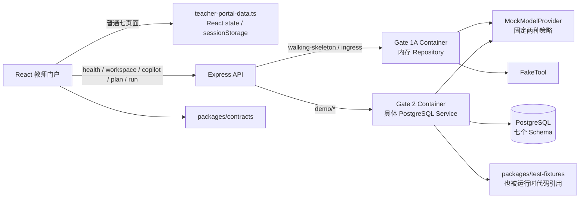

# 教育智能体平台：当前真实状态与下一步候选方案

> 调查基线：`feat/teacher-portal-ui-v1` / `43c8e03a8e0e7060989d886442de283ae6f43fc5`
> 调查日期：2026-07-30
> 状态词：已实现并验证 / 已实现但未充分验证 / 只有 Mock / 只有接口或 Schema / 只存在于文档 / 尚未开始。

## 1. 执行结论

当前项目不是“只有页面”，也不是“已经基本可用的教师平台”。

它由两部分叠加而成：

1. 一条窄但工程语义较扎实的真实链路：固定演示身份和数据 → PostgreSQL → Mock Teacher Copilot → 两个策略 → 教师处置 → Artifact Revision / Audit / Outbox / Run；
2. 一套覆盖普通教师七个模块的高保真前端原型：概览、日程、教学、学生、文件、Agent、设置。

第一部分真实持久化，但输出固定、业务输入不完整、刷新后不能恢复策略审阅上下文。第二部分视觉和交互完整度较高，但数据几乎全部来自前端数组和 React state。

因此项目目前最准确的阶段描述是：

> **Gate 1B 基础设施已验证；Gate 2 的合成 Teacher Copilot 切片已实现但尚未形成可恢复业务闭环；普通教师端 UI v1 已完成高保真原型。**

## 2. 当前真实依赖关系

重要边界：

- `createGate1AContainer` 始终创建内存 Governance、Work、Runtime、Capability、Artifact Repository；相关 HTTP 数据在进程重启后丢失。
- `createGate2Container` 使用一个 app-role PostgreSQL pool，并直接组合具体 PG Service/Repository。
- Gate 1B 的 PG Adapter 大多由测试直接构造；它们没有全部替换 Gate 1A Port，也没有统一进入当前 HTTP Composition Root。
- ordinary teacher portal 页面只有应用启动、教师名和旧 Gate 2 子路由依赖 workspace API；其日常业务数据仍在前端。
- API 运行时依赖 `packages/test-fixtures` 提供 Demo seed 和 Mock 策略内容，说明 Gate 2 仍是合成演示。

## 3. 七模块当前状态

| 模块 | 真实状态所有者 | 当前实现 | 主要缺口 |
|---|---|---|---|
| Identity / Governance / Audit | `governance` | AuthorizationDecision、AuditRecord、IdempotencyRecord；PG 事务和并发测试 | 无真实登录、会话、组织/成员、策略引擎；固定 demo actor 可缺省 |
| Work / Assistant / Durable Execution | `work` | Task、Run、Contract、Case、Goal、Result、Disposition、Outbox；部分 worker 语义 | 无真实教师 Todo/Calendar；Outbox worker 未接入应用；部分引用只由应用保证 |
| Agent Runtime / Context | `runtime` | AgentRun、RunManifest、ContextManifest、Outbox | 没有真实会话、长期记忆或用户选择上下文的持久绑定；普通 Agent 页面不调用它 |
| Capability / Integration | `capability` | ModelExecution、ToolExecution、Outbox；ModelProvider Port | 只有 Mock provider/FakeTool；无 DeepSeek、模型评测、外部系统连接 |
| Artifact / Collaboration | `artifact` | Artifact、不可变 ArtifactRevision、Outbox；TeachingPlan 和 Suggestion 结构化内容 | latest 指针语义不完整；无发布路径、协作、ObjectStore、二进制文件 |
| Education Domain | `education` | CourseRun、Objective、Profile、Attempt、Evidence、Claim、Alignment、Outbox | 无课程树、作业、考试、学生名册、教学活动完整模型 |
| Personalization | `personalization` | 仅 Migration 基础设施 | 无业务表、Repository 或 API |

## 4. 数据库现状

每个 Schema 都另有一张 `schema_migration`。以下只列业务对象。

### 4.1 Schema 与表

| Schema | 业务表 / View |
|---|---|
| `governance` | `authorization_decision`、`audit_record`、`idempotency_record` |
| `work` | `task`、`task_run`、`query_run`、`idempotency_record`（早期表）、`outbox_record`、`resolved_learning_interaction_contract`、`outbox_consumer_effect`、`case_record`、`goal_record`、`task_result`、`suggestion_disposition` |
| `runtime` | `agent_run`、`run_manifest`、`context_manifest`、`outbox_record` |
| `capability` | `tool_execution`、`model_execution`、`outbox_record` |
| `artifact` | `artifact`、`artifact_revision`、`outbox_record` |
| `education` | `course_run`、`learning_objective`、`learning_interaction_profile`、`attempt`、`evidence_observation`、`evidence_claim`、`evidence_claim_observation`、`teaching_plan_alignment`、`outbox_record`；View：`learning_evidence_view` |
| `personalization` | 无业务表 |

### 4.2 Repository 与存储介质

真实 PostgreSQL：

- Gate 2 workspace seed/read；
- Teacher Copilot 的 Task、TaskRun、Contract、ModelExecution、AgentRun、Manifest、Artifact Revision、Disposition、Audit、Outbox；
- Gate 1B 的 Governance、Work、Runtime、Capability、Artifact、Education Repository（目前主要由测试使用）。

仍为内存：

- Gate 1A walking-skeleton command/query/ingress；
- Gate 1A 的五个模块 Repository；
- 普通教师门户的 Todo、日程、课程树、学生、文件、Agent 对话、设置不经过 Repository，直接存在前端数组或组件 state。

不存在：

- ObjectStore Port 或 Adapter；
- LocalObjectStore；
- 文件 blob/byte 持久化；
- 学生名册、作业、考试、教师 Todo、CalendarEvent、课程 Unit/Chapter、Agent 对话、Context Binding 的数据库表。

### 4.3 数据库角色

- 非登录 owner：每个 Schema 一个 owner；
- 登录角色：`edu_migrator`、`edu_app`、`edu_runtime`、`edu_worker`；
- `edu_runtime` 只写 runtime，并只读所需 governance authorization 和 education 数据；
- `edu_worker` 只可读取/更新受限的 Work Outbox 列，并写 consumer effect；
- `edu_app` 对当前业务 Schema 有较宽 CRUD 权限；
- 真实 PostgreSQL 角色测试证明了关键隔离边界。

跨 Schema 不建 FK 是明确的 ownership 设计，但部分同 Schema 引用也没有 FK，完整性依赖应用代码和测试。

### 4.4 已验证的一致性语义

- 事务成功时业务记录、Outbox 和 Audit/Result 同时提交；
- 异常时共同回滚；
- 幂等键可处理并发预留、相同请求重放和不同 payload 冲突；
- 两个 worker 可并发领取 Outbox，租约过期可恢复，消费者副作用可去重；
- Artifact Revision 可并发追加且版本号唯一；
- Artifact Revision 有更新/删除拒绝 Trigger；
- Profile 可演进，已经封存到 Run 的 Resolved Contract 不被回写；
- SuggestionDisposition 不会自动把建议标为已经实施。

### 4.5 当前一致性缺口

1. `getLatestTeachingPlan` 直接按 `revision_number DESC` 读取，而不是遵循 `latest_revision_ref` / `latest_published_revision_ref`。
2. 每次生成策略都会写一个新的 TeachingPlan draft；即使教师拒绝或稍后处理，该 draft 仍可能成为“最新教案”。
3. 后续 revision 写入没有同步维护 Artifact 的 latest 指针。
4. 使用不同幂等键重复处置同一个 proposal，可能由唯一约束变成 500，而不是稳定的领域冲突。
5. Mock 模型调用位于数据库事务内部；接入网络模型后会形成长事务风险。
6. 除 Work 外的 Outbox 没有消费者；Work worker 也没有接入 API 运行进程。
7. 实际 Migration/Repository 使用手写 SQL，而 Drizzle Schema 只覆盖部分列与约束，存在双重事实源漂移。

## 5. Runtime、Artifact 与 Agent

### 5.1 当前真实 Teacher Copilot 数据流

1. Web 调用 `POST /api/v1/demo/teacher-copilot/tasks`；
2. 服务校验固定 actor/purpose，预留 governance idempotency；
3. 从 education/work/artifact 读取固定课程、证据、Profile、Goal、TeachingPlan；
4. MockModelProvider 返回固定的两种策略；
5. 单事务写入 Authorization、Task、TaskRun、Work Outbox、Resolved Contract、ModelExecution、Capability Outbox、AgentRun、RunManifest、ContextManifest、Runtime Outbox、PedagogicalSuggestion Revision、TeachingPlan draft、TaskResult、Audit；
6. 教师调用 disposition API；接受/修改时再写 `in_review` TeachingPlan Revision，拒绝/稍后处理只写 disposition/audit/outbox；
7. Run 页面可读取合同、上下文、授权、模型执行、Outbox 和 Audit。

### 5.2 真正持久化的 Artifact

- Gate 1B 测试中的通用 `ContentArtifact` / published revision；
- Gate 2 的 `PedagogicalSuggestion`；
- Gate 2 的 `TeachingPlan` draft 和 `in_review` revision。

它们持久化的是 text/JSON 结构化内容、parent revision、状态、hash、evidence ref 和 teacher selection。门户“文件”页中的 Word/PPT/PDF/图片只是元数据数组，没有真实文件字节。

### 5.3 Agent 的真实程度

- 普通 `/agent` 页面：`responseFor(message)` 按“PPT/作业/日程”等关键词返回硬编码文本；上下文、步骤、对话、收藏和重命名都是前端 state。
- 旧 `/copilot` 页面：调用真实 API 和 PG，但后端仍使用确定性 MockModelProvider 和测试 fixture；不是大模型推理。
- `/copilot` 的“任务说明”只控制按钮是否可点击，当前 API 请求不发送该文本，因此教师修改提示词不会改变后端任务。
- 普通 Agent 只有“创建教学任务”导航到旧 Copilot；它不会把当前消息和上下文交给后端。

## 6. 当前 API Route Contract

当前共享 Contract 只有：

- `GET /api/health`
- `GET /api/v1/demo/workspace`
- `POST /api/v1/demo/teacher-copilot/tasks`
- `POST /api/v1/demo/suggestions/:proposalRevisionRef/dispositions`
- `GET /api/v1/demo/runs/:taskRef`
- `GET /api/v1/demo/teaching-plan/revisions/:revisionRef`
- Gate 1A walking-skeleton command/query/ingress routes

不存在日程、Todo、课程树、学生、作业、考试、文件、设置和通用 Agent chat API。

本地开发会自动启用 Gate 2；production 只有在 `GATE2_DEMO_ENABLED=true` 时启用。应用没有 CORS middleware，因此当前代码也不支持直接把 Web/API 分域部署后正常调用。

## 7. 教师端逐页功能矩阵

说明：

- REAL：真实 API 和 PostgreSQL；
- MOCK：前端数组、局部 state、演示 toast 或固定响应；
- READ_ONLY：能读取真实或演示数据，但不能形成写业务；
- DISABLED：产品明确不允许/没有路径；
- DEAD：控件存在但输入不影响结果、数据不随导航变化，或代码已不再路由。

| 页面 / 功能 | REAL | MOCK | READ_ONLY | DISABLED | DEAD |
|---|---|---|---|---|---|
| 应用启动 / 教师身份 | health、PG workspace bootstrap | 固定 tenant/actor 和 fixture 教师 | 教师名 | 无真实登录 | 缺少 headers 仍默认授权 |
| 概览 | 无日常业务写入；仅应用 bootstrap 依赖 PG | 今日安排、待办、课程、学生、动态、文件均来自数组；快捷操作为跳转/toast | 统计卡与动态 | — | 传入的 `workspace` 业务数据未被页面使用 |
| 日程视图 | 无 | 固定日历事件；日/周/月切换只改变展示；新建日程只关弹窗 | 固定事件 | 空标题等正常表单禁用 | 上/下一周期只改标题，不更换事件数据 |
| 待办 | 无 | 完成、优先级为组件 state；“转为日程”只确认；“交给 Agent”只写 sessionStorage | 固定待办 | 已完成项的部分操作 | 刷新/重新进入路由恢复原值 |
| 教学 / 课程树 | 无 | 6 个单元/章节、10 个文件、3 个作业、2 个考试、12 名学生均为数组 | 搜索、筛选、展开、图表 | — | “生成新版本”只跳到旧 Copilot；没有课程上下文传递 |
| 作业 / 考试操作 | 无 | 新建、编辑、下载、催交等为 toast/演示跳转 | 固定统计 | — | 无后端副作用 |
| 学生列表 / 详情 | 无 | 12 名学生、趋势、证据、Agent 建议均为数组/固定文本 | 搜索、筛选、详情抽屉 | — | “修改建议/创建待办/生成指导”提示成功但不创建对象 |
| 文件 | 无 ObjectStore/文件 API | 10 条文件元数据；筛选、视图、排序为前端；上传/新建/编辑/下载/分享/复制/删除/对比为 toast | 固定摘要 | — | 文件大小排序用 `parseFloat`，未统一 KB/MB |
| 普通 Agent | 无；只有跳转旧 Copilot | 关键词固定回复、固定 steps/source、对话/context/收藏/重命名/删除均为 state | 静态上下文 | — | 声称读取课程/文件但未读取；刷新全部丢失 |
| 设置 | 无 | 账户、通知、偏好、记忆、API/连接状态均为静态或局部 state | 固定状态 | 无发布/真实连接 | 输入看似可编辑但无保存，部分为 uncontrolled |
| 目标 `/goals` | PG workspace | 固定 Seed | 真实 PG 只读 | 无编辑 | — |
| 学习证据 `/evidence` | PG workspace | 固定 Seed | 真实 PG 只读 | 无采集/编辑 | — |
| Copilot `/copilot` | 创建 Task/Run/Artifact/Disposition/Audit/Outbox；修改计划写 PG | 两种策略和模型内容固定 | 可看当前返回 | 无发布/实施确认 | 任务说明不进请求；刷新后不能重新打开 proposal 策略 |
| Teaching Plan `/teaching-plan` | PG revision read | 内容来自合成 Seed/Mock | 真实 PG 只读 | 无发布 | latest 选择语义有缺陷 |
| Runs `/runs` | PG Run/Manifest/Contract/Auth/Model/Outbox/Audit read | 模型执行为 Mock | 真实 PG 只读 | 无重放/运维 | — |
| Style Guide | 无业务 | 组件和字体示例 | 开发只读 | — | 非产品路由 |
| 旧 Portal 页面文件 | 无 | — | — | — | 多个旧页面和 `demo-read-model.ts` 已不再 import/route |

### 7.1 刷新后保留

PostgreSQL 中会保留：

- CourseRun、Objective、Profile、Evidence、Case、Goal、Seed TeachingPlan；
- 生成的 Task、TaskRun、Resolved Contract、AgentRun、Run/Context Manifest；
- ModelExecution、PedagogicalSuggestion、TeachingPlan draft；
- SuggestionDisposition、接受/修改后的 `in_review` Revision；
- Authorization、Audit、各模块 Outbox。

### 7.2 刷新或重新导航后丢失

- 普通门户的 Todo 状态、优先级和新建日程草稿；
- Agent 对话、消息、收藏、重命名和用户选择上下文；
- 设置、记忆、通知开关；
- 普通页面的临时筛选/选择；
- Copilot 当前 proposal 的两个策略和编辑状态。

PG 中的 proposal revision 仍在，但当前没有 GET API 重新取得完整策略和 diff，因此“数据存在”不等于“工作可恢复”。

## 8. 测试和运行基线

### 8.1 实际执行结果

| 命令 | 结果 | 真正证明的内容 |
|---|---|---|
| `pnpm test:static` | 通过，637 条静态断言 | 文件/字符串/结构约束；不是运行时业务验证，部分角色文件检查已过时 |
| `pnpm typecheck` | 通过 | TypeScript 项目类型一致性 |
| `pnpm test` | 通过，9 files / 40 tests | Contract、内存 HTTP、架构约束、PGlite 基础 Migration、启动 URL 等 |
| `pnpm test:node-smoke` | 通过，5 tests | 构建后 Node 模块和入口可加载 |
| `pnpm test:migrations` | 通过，1 test | PGlite 可应用 Migration；只抽查关键表，不等于完整 PG 语义 |
| `pnpm test:postgres` | 通过，8 files / 35 tests | 真实 PG 事务、并发幂等、Outbox、租约、角色、Education、Artifact、Gate 2 service/HTTP |
| `pnpm test:playwright` | 通过，10 tests | 多数验证 Mock 页面的固定状态/交互；其中一条浏览器链真实创建并处置 Gate 2 proposal |
| `pnpm build` | 通过 | API/Web/Packages production build |
| `pnpm analyze:bundle` | 通过 | 初始 JS 约 617.5 KiB raw / 205.5 KiB gzip；最大 table chunk 约 206.3 KiB raw / 61.8 KiB gzip |
| `pnpm demo:doctor` | 通过 | Node/pnpm/Docker/Compose/端口/Secret 配置可启动 |
| 手工 tracked-file secret scan | 未发现真实 Secret | 两处 credential URL 都是 `change-me` 示例；仓库无专用 secret-scan 命令 |

没有测试报告 skip。

### 8.2 测试没有证明的内容

- 普通教师七页面的数据持久化；
- 页面刷新后的工作恢复；
- 真实模型质量、超时、限流、成本或安全；
- Outbox 在运行应用中的持续消费；
- 文件上传、下载、版本、权限和清理；
- 真实登录、多租户隔离和学校角色权限；
- 远程部署、CORS、云数据库和云存储；
- 完整代码覆盖率。

### 8.3 本次基线执行中的本地数据事故

`pnpm test:playwright` 的 `webServer` 间接调用 `demo:test-server` → `run-demo-fresh` → `db:clean`。该脚本删除并重建了 Docker volume `edu-agent-gate1b-postgres-data`，然后用合成 Seed 重建数据库。

Git 仓库、远程和 `.env.local` 未受影响，测试最终通过，Volume 当前也存在；但测试前 Volume 中可能存在的额外本地数据无法由 Git 恢复。本次调查在发现后停止了所有可能重置数据库的命令。

## 9. 五个层面的完成判断

### 9.1 架构和基础设施

**已实现并验证：**

- pnpm 模块化单体；
- 七模块目录与 Schema ownership；
- Migration runner、Docker PostgreSQL、角色隔离；
- 核心事务、Outbox、Idempotency、Audit、Artifact Revision；
- 本地可重复 Demo、production build、主要自动化测试。

**已实现但未充分验证：**

- Gate 2 Composition Root 与旧 Gate 1A Container 并存；
- Route-level bundle 和视觉回归；
- 手写 SQL 与 Drizzle Schema 并行。

**尚未开始：**

- 远程部署基础设施、可观测性、真实身份系统、备份/灾备。

### 9.2 数据库和一致性

**已实现并验证：**

- Gate 1B 的事务、并发幂等、角色、Outbox 领取、Artifact 并发 Revision；
- Gate 2 生成/处置链的真实 PG 写入。

**已实现但存在语义缺陷：**

- TeachingPlan latest/published；
- proposal 重复处置错误映射；
- Run 与 Task 的引用完整性；
- Outbox 的实际运行消费。

**只有 Schema：**

- Personalization 只有迁移登记，无领域表；
- 若干早期通用表没有当前产品入口。

### 9.3 普通教师端页面

**已实现并验证：**

- 七页面信息架构、响应式视觉、路由、主要 Mock 交互和 Playwright 截图。

**只有 Mock：**

- 概览、日程、教学、学生、文件、普通 Agent、设置的绝大部分业务内容。

**真实只读或窄写入：**

- 旧 Goals/Evidence/TeachingPlan/Runs 是 PG 只读；
- 旧 Copilot 是 PG 写入。

### 9.4 真实教师业务闭环

**已实现但未充分验证：**

- 合成 evidence → 固定建议 → 教师处置 → TeachingPlan revision。

**仍未闭环：**

- 用户输入不影响生成；
- proposal 刷新后不可恢复；
- 没有发布、实施、回写课程进度；
- 普通教学页和 Agent 页没有把真实上下文传入；
- 拒绝/稍后处理会与“最新草稿”语义冲突。

### 9.5 Agent 智能能力

**只有 Mock：**

- 后端 MockModelProvider 的固定两策略；
- 前端 `responseFor` 的关键词固定回答。

**只有接口：**

- ModelProvider Port、ModelExecution、Run/Context Manifest。

**尚未开始：**

- 真实 DeepSeek、工具调用编排、检索、上下文选择策略、记忆、评测门禁和安全策略。

## 10. 距离三个可用目标还缺什么

### 10.1 本地基本可用教师工作台

最低缺口：

- 至少一条真实、可刷新恢复的教师任务闭环；
- 真实课程/章节或明确的备课上下文；
- 用户任务文本真正进入后端并被 Run 封存；
- proposal 列表/详情/恢复 API；
- 正确的 TeachingPlan latest/review/publish 语义；
- 普通教学/Agent 页面接入真实链路；
- 创建、失败、重试、重复提交的清晰 UI；
- 不清库的日常启动和验收方式。

### 10.2 可远程演示

在本地闭环之外还需要：

- 明确的同域反向代理或 CORS 方案；
- production Gate 2 配置、托管 PostgreSQL、受控 Migration/Seed；
- 基础登录/access code 和租户边界；
- Secret 管理、错误日志、健康检查、演示数据重置策略；
- 远程浏览器 E2E；
- 20.6 MB 字体和静态资源优化；
- 不依赖用户本机 Docker Volume 的演示环境。

### 10.3 学校生产交付

还需要：

- 学校组织、教师/学生/家长/管理者身份和细粒度权限；
- 真实 SIS/LMS/日历/文件系统集成；
- 数据分级、同意、最小化、保留、导出、删除和审计运营；
- 真实模型供应商治理、内容安全、评测、人工复核、成本与降级；
- Backup/DR、监控告警、SLO、容量与高可用；
- 无障碍、兼容性、安全测试、渗透和供应链治理；
- 完整业务对象、支持流程和学校上线运营。

## 11. 技术债与架构风险

按严重程度排序：

1. **严重：TeachingPlan latest 语义可能越过教师决策。** 生成即写 draft，拒绝/稍后处理也可能改变“最新教案”。
2. **严重：Demo 身份是 fail-open 默认值。** 如果误用于远程部署，缺少 headers 仍获得固定教师身份。
3. **高：真实工作不可恢复。** proposal 已入库，但没有完整读取/列表 API；刷新后无法继续审阅。
4. **高：任务文本是语义死输入。** UI 允许编辑，但请求不携带，容易造成错误信任。
5. **高：Outbox 只被测试证明，没有应用级消费者。** 各 Schema Outbox 会长期 pending。
6. **高：普通门户以“成功 toast”模拟写入。** 产品视觉会让演示者高估业务完成度。
7. **中高：Repository Port 与 PG Adapter 分叉。** Gate 1A 走 Port/内存，Gate 2 直接依赖具体 PG Repository，替换和测试边界不一致。
8. **中高：手写 SQL 与 Drizzle Schema 双源。** Trigger、FK、check 和后续列容易漂移。
9. **中：跨/同 Schema 引用大量依赖应用完整性。** 错误路径可能留下逻辑孤儿。
10. **中：未来真实模型会在长事务内执行。** 网络延迟/失败会占用连接并扩大锁和回滚成本。
11. **中：远程运行缺少 CORS/反向代理、认证和生产 Seed 策略。**
12. **中：静态测试和 README 有过时断言。** 测试绿灯并不总能代表当前角色/Migration。
13. **低至中：旧页面和旧 read model 是死代码；HarmonyOS 字体约 20.6 MB。**
14. **低至中：无 lint、覆盖率和专用 secret scan 命令。**

## 12. 下一阶段三个候选方案

### A. 最小业务闭环：Gate 2.4「Copilot 正确性与可恢复性」

**解决的问题**

把现有 Teacher Copilot 从“一次性演示”修到可恢复、语义正确的最小业务闭环。

**涉及页面**

- 旧 Copilot；
- Teaching Plan；
- Runs；
- 教学页只增加一个真实入口，不产品化整棵课程树。

**新增/调整领域对象**

- 不强制新增大对象；
- 给 Task 明确保存 `teacherRequest` / intent；
- 为 proposal 增加可读取的审阅详情和状态；
- 明确 Artifact current-review / published 指针语义。

**Schema**

- 主要修改 `work` 与 `artifact`；
- 可能只需补字段、索引和状态约束；
- 不新增 education 大模型、文件或 calendar 表。

**API**

- 创建任务时接收教师任务文本；
- proposal 列表/详情/恢复；
- 稳定的 disposition 冲突响应；
- 明确获取 current/published TeachingPlan。

**文件存储**

- 不涉及；继续使用结构化 Artifact Revision。

**Agent Context**

- 只把当前已有 ContextManifest 与教师请求封存，不建立通用 AgentContextBinding。

**风险 / 复杂度**

- 风险低至中；
- 复杂度小；
- 主要风险是修正 latest 语义时需要迁移既有 Demo 数据。

**验收**

- 不同任务文本被 API/Run 持久化；
- 生成后刷新，可重新打开两种策略并继续处置；
- reject/defer 不改变 current/published plan；
- accept/modify 生成正确 parent revision；
- 重放和不同幂等键重复处置都有确定结果；
- UI、HTTP、真实 PG 并发测试覆盖。

**明确推迟**

- Todo、日程、课程树、普通 Agent 会话、文件、ObjectStore、真实模型。

### B. 平衡推进：Gate 2.5「可恢复的教师备课闭环」（推荐）

**解决的问题**

在先修复 A 的基础上，让教师能从真实教学上下文发起备课任务，经 Agent 建议和人工修改，得到可恢复的 TeachingPlan，并把结果回写到教师工作队列。

**涉及页面**

- 概览：只接入“我的备课任务/状态”，不整体产品化；
- 教学：接入最小课程 → 单元 → 章节上下文和“准备本课”；
- Agent：普通入口接入真实 task/run，不做开放聊天；
- Copilot/Teaching Plan/Runs：整合为可恢复审阅详情；
- 日程、学生、文件、设置保持明确 Mock/只读标识。

**新增/调整领域对象**

- `TeacherWorkItem`：教师工作队列/待办，拥有状态、截止时间、来源和结果引用；
- 最小 `CourseUnit` / `CourseChapter`，或等价的窄 `LessonPreparationContext`；
- `TaskContextBinding`：记录教师明确选择的课程、章节、班级、Evidence、Artifact 引用；
- 沿用现有 Task、Run、PedagogicalSuggestion、TeachingPlan，不一次新增四种教学 Artifact。

**Schema**

- `work`：TeacherWorkItem、Task 请求、状态/结果关联；
- `education`：最小课程层级或备课上下文；
- `runtime`：若现有 ContextManifest 无法表达输入绑定，再加入窄 binding；优先复用 manifest；
- `artifact`：修正 current/review/published pointer 和 revision 状态。

**API**

- 列出/创建/更新教师工作项；
- 读取最小课程/章节；
- 从工作项或章节创建 Agent task；
- proposal 列表/详情/恢复/处置；
- TeachingPlan current/review/published；
- 任务完成后回写 work item 状态。

**文件存储**

- 不引入 LocalObjectStore；
- TeachingPlan 和 Suggestion 继续作为 PostgreSQL 结构化 Artifact；
- “文件”页仍是明确推迟功能。

**Agent Context**

- 有，但范围严格限定为 task-scoped、用户明确选择、不可变快照；
- 不做全局记忆、隐式检索或开放聊天历史。

**风险 / 复杂度**

- 风险中；
- 复杂度中；
- 主要风险是 Work/Education/Runtime/Artifact 四个状态所有者之间的引用和事务边界，需要先写 ADR/Contract 测试。

**验收**

- 教师从真实章节创建备课工作项；
- 刷新后工作项、上下文、两种策略和修改状态都可恢复；
- 教师任务文本和选择上下文出现在 sealed Run/Manifest；
- 接受/修改产生正确 TeachingPlan revision，拒绝/稍后不污染 current；
- 工作项状态从待处理 → Agent 处理中 → 待审阅 → 已形成教案；
- 所有写入具备 authorization、idempotency、audit、outbox；
- 普通教学页/Agent 页完成真实 Playwright + PostgreSQL E2E；
- 不清库启动后仍能继续上一任务。

**明确推迟**

- 通用日历、Todo 转日程；
- ObjectStore、二进制文件、文件版本；
- PPT/讲义/练习/答案四类 Artifact；
- 学生/作业/考试产品化；
- DeepSeek、云部署、多角色。

### C. 较完整教师工作流：Gate 2.5 Full「教师日常工作台」

**解决的问题**

把旧 Gate 2.5A 的主要设想一次性落地：Todo、日程、课程树、Agent Context、文件/ObjectStore、多个教学 Artifact 和跨页面闭环。

**涉及页面**

- 概览、日程、教学、文件、Agent；
- 学生页至少提供 context/evidence 来源；
- 旧 Copilot/Plan/Runs 被整合为审阅/追溯页面。

**新增领域对象**

- TeacherTodo / WorkItem、CalendarEvent；
- CourseUnit、CourseChapter、Lesson；
- TaskContextBinding；
- FileAsset、FileVersion、ObjectBlob/locator；
- LessonPlan、SlideDeck、Worksheet、AnswerKey 等教学 Artifact；
- Artifact 与文件、任务、课程的关联对象。

**Schema**

- 修改 `work`、`education`、`runtime`、`artifact`、`capability`；
- 需要决定 Calendar 的状态所有者以及文件元数据与 Artifact 的边界；
- `personalization` 仍可不启用。

**API**

- Todo CRUD、Todo → Calendar；
- Course tree CRUD/read；
- Agent task/context；
- 多 Artifact 生成/编辑/版本/发布；
- 文件上传/下载/版本/删除；
- Todo → Agent → Artifact/File、Course → LessonPlan 两条完整链。

**文件存储**

- 需要 ObjectStore Port 和 LocalObjectStore Adapter；
- 需要路径穿越防护、hash、MIME/大小限制、原子写、孤儿清理、备份和下载授权。

**Agent Context**

- 需要完整的用户选择、课程、学生证据、文件版本绑定和追溯。

**风险 / 复杂度**

- 风险高；
- 复杂度大；
- 最大风险不是代码量，而是同时定义 Work、Calendar、Education、Artifact、File 和 Agent Context 的状态所有权，容易在未验证语义时固化错误模型。

**验收**

- 三条真实闭环：Todo → Agent → Artifact/File、Course → LessonPlan、Todo → Calendar；
- 所有页面刷新恢复；
- 文件版本、Artifact revision 和上下文引用可追溯；
- 失败注入、并发、幂等、权限、路径安全、磁盘故障和 orphan cleanup 测试；
- 真实 PG + 本地 ObjectStore + Playwright 全链。

**明确推迟**

- 真实 DeepSeek、云存储/CloudBase、Netlify、学生/家长/管理端、学校生产集成。

## 13. 对旧 Gate 2.5A 设想的重新判断

| 旧设想 | 判断 | 理由 |
|---|---|---|
| 日程与待办持久化 | **拆分** | TeacherWorkItem 对闭环有价值，建议进 B；CalendarEvent 需要来源、冲突、重复规则和权限，推迟 |
| 课程树持久化 | **缩小后保留** | 现有 CourseRun 太薄，备课需要章节上下文；只做最小 unit/chapter，不一次产品化完整教务课程模型 |
| LocalObjectStore | **推迟** | 当前结构化 TeachingPlan 不依赖文件；先引入会带来路径安全、清理和备份风险 |
| 文件版本 | **区分后推迟** | 结构化内容继续使用现有 ArtifactRevision；通用二进制 FileVersion 留到 C |
| AgentContextBinding | **缩小并保留** | 必须证明 Agent 用了教师明确选择的上下文；应做 task-scoped immutable binding，优先复用 ContextManifest，不做全局记忆 |
| 四种教学 Artifact | **拒绝作为下一 Gate 范围** | 当前只有 TeachingPlan/Suggestion 真正持久化；同时引入四类编辑器和文件语义会稀释闭环 |
| 待办 → Agent → 文件 | **拆分** | B 做 WorkItem → Agent → TeachingPlan；“文件”是 Artifact 展示还是二进制资产需先定边界 |
| 课程 → 教案 | **优先** | 与现有 CourseRun、Evidence、Teacher Copilot、TeachingPlan 的真实资产最接近，新增模型最少 |
| 待办 → 日程 | **推迟** | 只有在 WorkItem 和 CalendarEvent 各自语义稳定后才应做转换 |

## 14. 推荐方案

推荐下一 Gate 名称：

> **Gate 2.5 — 可恢复的教师备课闭环**

推荐它而不是直接恢复旧 Gate 2.5A 的原因：

- 最大缺口不是页面数量，而是真实链路不能恢复、任务输入无效、Artifact latest 语义不正确；
- 课程 → 备课 → Agent → TeachingPlan 与已有代码距离最近，能复用已经验证的事务、Audit、Idempotency、Run 和 Revision；
- 加入一个最小 TeacherWorkItem 能让概览和日常工作状态第一次有真实意义；
- 文件/ObjectStore、通用日历和四种 Artifact 会把下一阶段扩成多个尚未定义状态所有权的子系统。

建议顺序：

1. 先修 existing Gate 2 correctness：task input、proposal restore、latest/review/published、重复处置；
2. 定义最小 CourseUnit/Chapter 和 TeacherWorkItem；
3. 定义 task-scoped context binding 与 Contract；
4. 打通教学页/概览 → Agent task → proposal review；
5. 回写 TeachingPlan revision 和 WorkItem 状态；
6. 补真实 PG、HTTP、Playwright、刷新恢复和故障测试；
7. 最后再讨论真实模型、文件和日历。

## 15. 需要产品所有者决定的问题

1. 下一 Gate 的首个真实用户结果，是“形成可审阅教案”还是“生成可下载课件/文件”？推荐前者。
2. TeachingPlan 的业务状态是否需要 `draft → in_review → approved/published`，谁有发布权限？当前只有 draft/in_review 演示语义。
3. 最小课程层级是“课程 → 单元 → 章节”，还是还必须包含班级/学期/课次？这会决定 education Schema 的最小模型。
4. TeacherWorkItem 是否可以作为待办的统一领域对象，并把 CalendarEvent 留到后续？推荐可以。
5. 下一 Gate 是否接受继续使用确定性 MockModelProvider，以先验证业务闭环？推荐接受，真实模型应有独立 eval/safety gate。
